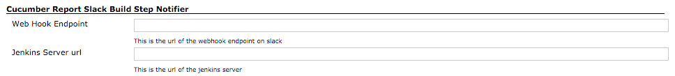
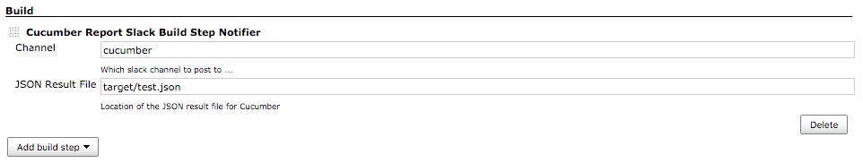

[.conf-macro .output-inline]# #

[.aui-icon .aui-icon-small .aui-iconfont-warning .confluence-information-macro-icon]##

*This plugin is up for adoption.* Want to help improve this plugin?
https://wiki.jenkins-ci.org/display/JENKINS/Adopt+a+Plugin[Click here to
learn more]!

A plugin to send a summarised cucumber report to a slack channel.

[[CucumberSlackNotifierPlugin-JenkinsPipelineUsage]]
== Jenkins Pipeline Usage

Use within a node block as the example below shows:

[source,syntaxhighlighter-pre]
----
node {
    stage 'Cucumber Reports'
 
    // process cucumber reports
    step([$class: 'CucumberReportPublisher', jsonReportDirectory: 'target/', fileIncludePattern: '*.json'])

    // send report to slack
    cucumberSendSlack: channel: 'test-results-channel', json: 'target/test-results.json' 
}
----

[[CucumberSlackNotifierPlugin-InstallationInstructions]]
== Installation Instructions

[[CucumberSlackNotifierPlugin-GlobalConfiguration]]
=== Global Configuration

[.confluence-embedded-file-wrapper]##

[[CucumberSlackNotifierPlugin-JobConfiguration]]
=== Job Configuration

[.confluence-embedded-file-wrapper]##

[[CucumberSlackNotifierPlugin-ChangeLog]]
== Change Log

[[CucumberSlackNotifierPlugin-Version0.8.2(4thJuly2016)]]
=== Version 0.8.2 (4th July 2016)

* Added ability to add custom text a message

[[CucumberSlackNotifierPlugin-Version0.8.1(4thJuly2016)]]
=== Version 0.8.1 (4th July 2016)

* Fixed issue with link generation in slack message

[[CucumberSlackNotifierPlugin-Version0.8(3thJuly2016)]]
=== Version 0.8 (3th July 2016)

* Added Jenkins Pipeline Support

[[CucumberSlackNotifierPlugin-Version0.7(17thDec2015)]]
=== Version 0.7 (17th Dec 2015)

* Added Build Step & Post Build Notifiers
* Added Global Config Validation
* Implemented common service for sending notifications

[[CucumberSlackNotifierPlugin-Version0.6.1(17thDec2015)]]
=== Version 0.6.1 (17th Dec 2015)

* Fixed invalid check for configuration

[[CucumberSlackNotifierPlugin-Version0.6(16thDec2015)]]
=== Version 0.6 (16th Dec 2015)

* Correctly reading json report file from the workspace directory

[[CucumberSlackNotifierPlugin-Version0.4(15thDec2015)]]
=== Version 0.4 (15th Dec 2015)

* Initial Release
