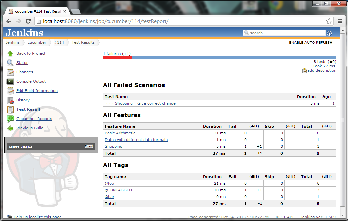
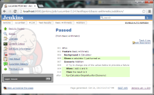
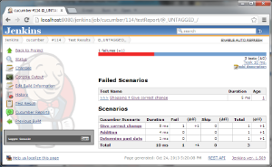
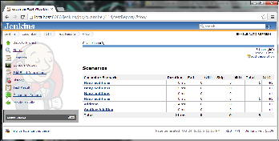

[.conf-macro .output-inline]##

[cols="",options="header",]
|===
|Plugin Information
|View Cucumber json test reporting
https://plugins.jenkins.io/cucumber-testresult-plugin[on the plugin
site] for more information.
|===

[.aui-icon .aui-icon-small .aui-iconfont-warning .confluence-information-macro-icon]##

*This plugin is up for adoption.* Want to help improve this plugin?
https://wiki.jenkins-ci.org/display/JENKINS/Adopt+a+Plugin[Click here to
learn more]!

[.conf-macro .output-inline]#This plugin allows you to show the results
of http://cukes.info/[Cucumber tests] within Jenkins.#

[[CucumberTestResultPlugin-ProjectConfiguration]]
== Project Configuration

To enable the plugin add the "Publish Cucumber test result report" post
build action for classic Jobs.

To record the results in Pipeline use the following syntax:

[source,syntaxhighlighter-pre]
----
cucumber 'glob'
----

where `+glob+` is a glob syntax - e.g. `+feature.json+` or
`+results/*.json+` or `+**/target/*.json+`

At the end of the build the cucumber json files will be parsed and
displayed as standard test results.

[[CucumberTestResultPlugin-ExampleScreenshots]]
== Example Screenshots

[.confluence-embedded-file-wrapper]##
[.confluence-embedded-file-wrapper]##
[.confluence-embedded-file-wrapper]##
[.confluence-embedded-file-wrapper]##

[[CucumberTestResultPlugin-FAQ]]
== FAQ

[[CucumberTestResultPlugin-Whydidyouwriteanewcucumberreporter?]]
=== Why did you write a new cucumber reporter?

There where limitations in the way that the existing support for
Cucumber was handled that was suboptimal.

There is nothing wrong with the
https://github.com/masterthought/jenkins-cucumber-jvm-reports-plugin-java[cucumber
jvm reports plugin] and they can be used in tandem - however that plugin
doesn't offer the normal jenkins testresult interfaces. Namely there is
no trend reports or test history. There is also no API that you can
integrate with.

Likewise you could output junit xml style reports from cucumber - but
this also has limitations. Namely the output is less than stellar, you
have no view of tags or the nice goodness that the previous mentioned
plugin provides.

This plugin solves both of these issues so you only need one place to
look. We also have some grand plans to integrate this with the
https://github.com/samsta/quarantine[quarantine] and
https://wiki.jenkins-ci.org/display/JENKINS/Test+stability+plugin[test
stability] plugins.

[[CucumberTestResultPlugin-CanIstillusetheothercucumberplugin.]]
=== Can I still use the other cucumber plugin.

Yes both can work side by side - but why?

[[CucumberTestResultPlugin-HelpandSupport]]
== Help and Support

For Help and support please use the
https://groups.google.com/group/jenkinsci-users[Jenkins Users] mailing
list. +
To report a bug please
http://issues.jenkins-ci.org/secure/IssueNavigator.jspa?mode=hide&reset=true&jqlQuery=project+%3D+JENKINS+AND+status+in+(Open,+%22In+Progress%22,+Reopened)+AND+component+%3D+cucumber-testresulthttp://issues.jenkins-ci.org/secure/IssueNavigator.jspa?mode=hide&reset=true&jqlQuery=project+%3D+JENKINS+AND+status+in+(Open,+%22In+Progress%22,+Reopened)+AND+component+%3D+cucumber-testresulthttp://issues.jenkins-ci.org/secure/IssueNavigator.jspa?mode=hide&reset=true&jqlQuery=project+%3D+JENKINS+AND+status+in+(Open,+%22In+Progress%22,+Reopened)+AND+component+%3D+cucumber-testresult-plugin[check
the bug tracker] to see if the issue has been reported before
http://issues.jenkins-ci.org/secure/IssueNavigator.jspa?mode=show&createNew=true[creating
a new issue].

[[CucumberTestResultPlugin-VersionHistory]]
== Version History

[[CucumberTestResultPlugin-0.11(notyetreleased)]]
=== 0.11 (not yet released)

build
from https://wiki.jenkins-ci.org/display/JENKINS/Source+code[source] or
download
from https://jenkins.ci.cloudbees.com/job/plugins/job/cucumber-testresult-plugin/lastStableBuild/org.jenkins-ci.plugins$cucumber-testresult-plugin/[here] if
interested

[[CucumberTestResultPlugin-0.10.1(31Jan2018)]]
=== 0.10.1 (31 Jan 2018)

* Additional
Fix https://issues.jenkins-ci.org/browse/JENKINS-49101[JENKINS-49101] -
Cucumber plugin not compatible with JEP-200 in Jenkins 2.102

[[CucumberTestResultPlugin-0.10(25Jan2018)]]
=== 0.10 (25 Jan 2018)

* Fix https://issues.jenkins-ci.org/browse/JENKINS-38286[JENKINS-38286]
- `+NullPointerException+` in pipeline snippet generator.
* Prevent the action link appearing twice in builds.
* add symbol support so you can now just use `+cucumber '*/.json'+` in
your pipeline
* Fix https://issues.jenkins-ci.org/browse/JENKINS-49101[JENKINS-49101]
- Cucumber plugin not compatible with JEP-200 in Jenkins 2.102

[[CucumberTestResultPlugin-0.9.7(15Sept2016)]]
=== 0.9.7 (15 Sept 2016)

* Implement
https://issues.jenkins-ci.org/browse/JENKINS-26340[JENKINS-26340] -
Pipeline support. Thanks to https://github.com/helloeve[Haoyu Wang] for
pushing this over the finishing line.

[[CucumberTestResultPlugin-0.8.2(27May2015)]]
=== 0.8.2 (27 May 2015)

* Fix https://issues.jenkins-ci.org/browse/JENKINS-28588[JENKINS-28588]
Plugin failed in a master/slave environment.

[[CucumberTestResultPlugin-0.8.1(21May2015)]]
=== 0.8.1 (21 May 2015)

* No changes - 0.8 release failed.

[[CucumberTestResultPlugin-0.8(21May2015)]]
=== 0.8 (21 May 2015)

* Add support for
http://cukes.info/reports.html#embedding-screenshots[embedded items] in
the report (e.g. images)

[[CucumberTestResultPlugin-0.8-beta2(30Oct2014)]]
=== 0.8-beta2 (30 Oct 2014)

* Fix incorrect logging statements

[[CucumberTestResultPlugin-0.8-beta1(30Oct2014)]]
=== 0.8-beta1 (30 Oct 2014)

*Note:* this plugin now requires Jenkins 1.580 or higher

* Workaround
https://issues.jenkins-ci.org/browse/JENKINS-21835[JENKINS-21835] plugin
fails on malformed json produced by some buggy cucumber implementation
(enable "Ignore Bad Steps" option).
(https://github.com/jenkinsci/cucumber-testresult-plugin/pull/2[pull #2]
thanks to https://github.com/KostyaSha[Kanstantsin Shautsou])
* Fix https://issues.jenkins-ci.org/browse/JENKINS-25280[JENKINS-25280]
test failures where not expanded correctly.

[[CucumberTestResultPlugin-0.7.0(23Oct2014)]]
=== 0.7.0 (23 Oct 2014)

* Fix https://issues.jenkins-ci.org/browse/JENKINS-25021[JENKINS-25021]
background failure was not always causing tests to be marked as failed.
* Workaround
https://issues.jenkins-ci.org/browse/JENKINS-25280[JENKINS-25280] test
failures where not expanded correctly.
* individual test results are now exported from the build api.

[[CucumberTestResultPlugin-0.6.0(6Oct2014)]]
=== 0.6.0 (6 Oct 2014)

* Fix https://issues.jenkins-ci.org/browse/JENKINS-24061[JENKINS-24061]
pending steps are not handled correctly.
* Fix https://issues.jenkins-ci.org/browse/JENKINS-24435[JENKINS-24435]
Test results are not joined properly when used with standard junit test
result publisher
(https://github.com/jenkinsci/cucumber-testresult-plugin/pull/1[pull #1]
thanks to https://github.com/bubenkoff[Anatoly Bubenkov])

[[CucumberTestResultPlugin-0.5.2(22July2014)]]
=== 0.5.2 (22 July 2014)

* fixed release

[[CucumberTestResultPlugin-0.5.1(22July2014)-botchedrelease]]
=== 0.5.1 (22 July 2014) - botched release

* fix release

[[CucumberTestResultPlugin-0.5(3rdJuly2014)-botchedrelease]]
=== 0.5 (3rd July 2014) - botched release

* Test result age would sometimes show "1" rather than the true age of
the failure.

[[CucumberTestResultPlugin-0.4(24thDecember2013)]]
=== 0.4 (24th December 2013)

* If a scenario is undefined the test should be marked as failed - and
the html overview should show the undefined step.

[[CucumberTestResultPlugin-0.3(24thDecember2013)]]
=== 0.3 (24th December 2013)

* upgrade to released version of gherkin so we no loner have to maintain
a fork now that our changes are upstream.
* If a scenario failed due to a background failure the error details
where empty in the overview page.

[[CucumberTestResultPlugin-0.2(24thDecember2013)]]
=== 0.2 (24th December 2013)

*Note* requires a custom Gherkin build to build from source.

* Background results where not tallyed prior to being propagated to the
scenario

[[CucumberTestResultPlugin-0.1-beta(3rdNovember2013)]]
=== 0.1-beta (3rd November 2013)

Initial release.

*Note* requires a custom Gherkin build to build from source.

*The comment list below is not monitored.*
