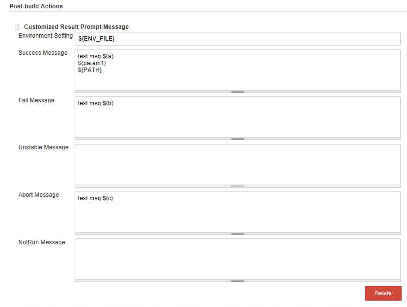
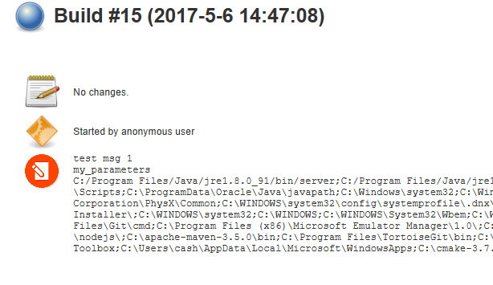

 

 

[[CustomizedBuildMessagePlugin-#Screenshots]]
=== # Screenshots

 +

[[CustomizedBuildMessagePlugin-##Jobconfiguration]]
==== *## Job configuration*

 +

**Support the environemnt variable files, input parameters, and default
environment variables.**

 +

[.confluence-embedded-file-wrapper .confluence-embedded-manual-size]##

 +

**Environment variable customizations, both local & remote (slaves) file
path are supported.**

 +

[.confluence-embedded-file-wrapper]#image:docs/images/txt.png[image]#

 +

**Start to build**

 +

[.confluence-embedded-file-wrapper]##

 +

[[CustomizedBuildMessagePlugin-##Result]]
==== *## Result*

 +

- build job badge

 +

[.confluence-embedded-file-wrapper .confluence-embedded-manual-size]##

 +

- build job summary

 +

[.confluence-embedded-file-wrapper .confluence-embedded-manual-size]##

[[CustomizedBuildMessagePlugin-ReleaseNote]]
== Release Note

 

* {blank}
+
[[CustomizedBuildMessagePlugin-v1.1]]
=== v1.1
** Support build description as a job property
** Use icon for the result message badge
* {blank}
+
[[CustomizedBuildMessagePlugin-v1.0]]
=== v1.0
** Support customized post build prompt message
