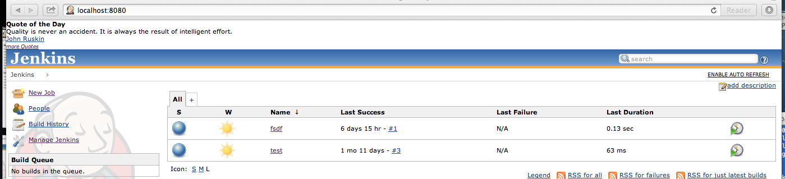
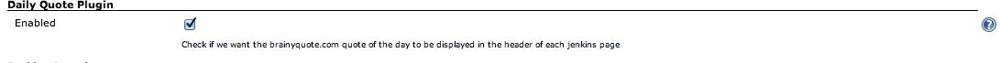

This plugin displays the www.brainyquote.com quote of the day on each
Jenkins Page when plugin is enabled 

[[DailyQuotePlugin-Features]]
== Features

This plugin will display the brainy quote.com "Quote of the day" in each
page header.
[.confluence-embedded-file-wrapper]##

[[DailyQuotePlugin-Configuration]]
== Configuration

To enable, click "Enabled" in the 'Daily Quote Plugin' section located
under Manage Jenkins->Configure System :
[.confluence-embedded-file-wrapper]##

[[DailyQuotePlugin-History]]
== History

[[DailyQuotePlugin-Version1.0(Nov30,2013)]]
=== Version 1.0 (Nov 30, 2013)

* First release
