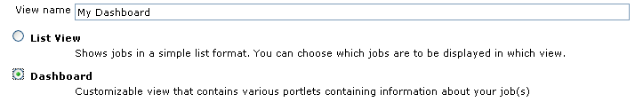
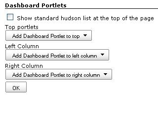
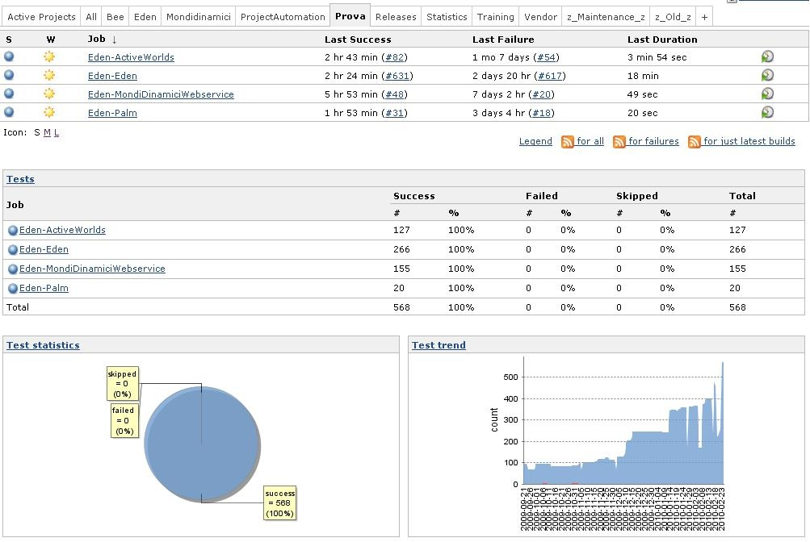
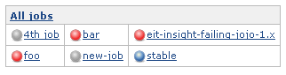
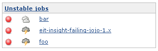
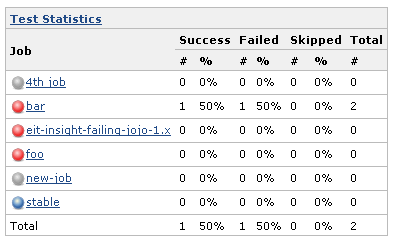
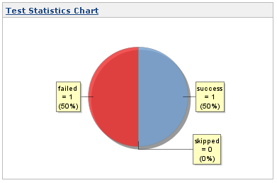
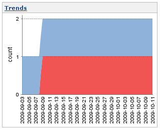
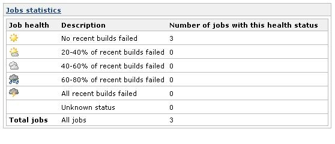
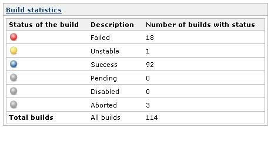

[.conf-macro .output-inline]##

[cols="",options="header",]
|===
|Plugin Information
|View Dashboard View https://plugins.jenkins.io/dashboard-view[on the
plugin site] for more information.
|===

[.aui-icon .aui-icon-small .aui-iconfont-info .confluence-information-macro-icon]##

Older versions of this plugin may not be safe to use. Please review the
following warnings before using an older version:

* https://jenkins.io/security/advisory/2019-09-12/#SECURITY-1489[Stored
XSS vulnerability]

This plugin contributes a new view implementation that provides a
dashboard / portal-like view for your Jenkins instance.

[[DashboardView-Addnewview]]
== Add new view

On the Jenkins main page, click the + tab to start the new view wizard
(If you do not see a +, it is likely you do not have permission to
create a new view).  On the create new view page, give your view a name
and select the Dashboard type and click ok.  
[.confluence-embedded-file-wrapper]##

[[DashboardView-Configuredashboardview]]
== Configure dashboard view

The configuration is done in 2 parts, selecting the Jenkins jobs to
include in the view, and selecting which dashboard portlets to have
included in the view.  The jobs that you select are used for all the
portlets to draw their information from.
[.confluence-embedded-file-wrapper]##

[[DashboardView-Selectjobs]]
=== Select jobs

Select the list of jobs to include in the dashboard. This is exactly the
same process as the standard list view that comes with Jenkins.

Also a regular expression can be used to specify the jobs to include in
the view.

[[DashboardView-Options]]
=== Options

* Show standard Jenkins list at the top of the page: shows uses standard
Jenkins jobs list as it would be when using Jenkins' built-in  'List
View' type.

[[DashboardView-Selectportlets]]
=== Select portlets

Configure which portlets you want to see on the top and on the left and
the right column.  Each portlet may have its own configuration but at a
minimum it requires a name to be given to it. +
Click ok and the dashboard configuration will be saved and you will be
brought to the dashboard view itself.

[[DashboardView-Viewlayout]]
== View layout

The dashboard view supports a layout with rows spanning the entire view
with 2 columns.

Top portlet 1

Left portlet 1

Right portlet 1

Left portlet 2

Right portlet 2

Bottom portlet 1

[[DashboardView-Coreportlets]]
== Core portlets

The dashboard view comes with a number of portlets that you can
configure your view with (New portlets can be contributed to Jenkins via
other plugins, even your own).

[[DashboardView-StandardJenkinsjobslist]]
=== Standard Jenkins jobs list

This portlet shows a row for each job showing the standard columns
configured in Jenkins. All the configured portlets are displayed below
this list. +
[.confluence-embedded-file-wrapper]##

[[DashboardView-JobsGrid]]
=== Jobs Grid

The jobs grid portlet displays a 3 column table with the current status
and a clickable link to the job.  This offers a more compressed
presentation of your jobs than the standard 1 row per job view, albeit
at the cost of some job information.
[.confluence-embedded-file-wrapper]##

[[DashboardView-UnstableJobs]]
=== Unstable Jobs

This portlet lists the unstable jobs within the view.  Note, this does
not necessarily list all of Jenkins' unstable jobs, but only looks at
jobs configured for this view.
[.confluence-embedded-file-wrapper]##

[[DashboardView-TestStatisticsGrid]]
=== Test Statistics Grid

The test statistics grid shows detailed test data for the configured
jobs.  This is useful to get an aggregated count of tests across the
jobs in your view.   If desired, jobs with zero tests can be hidden.
[.confluence-embedded-file-wrapper]##

[[DashboardView-TestStatisticsChart]]
=== Test Statistics Chart

This is a pie chart of the tests in the configured jobs.  It shows the
passing, failing, and skipped jobs with the total # and percentages.

[.confluence-embedded-file-wrapper]##

[[DashboardView-TestTrendChart]]
=== Test Trend Chart

This is a chart that shows your tests over time in aggregate.  The logic
is that for every day since the first job in the view was built, it
shows the total number of passing, skipped and failing tests in
aggregate across the build.  It assumes that if a build did not occur on
a given day, that the previous day's build results (or the
previous-previous day, etc.) will be used.
[.confluence-embedded-file-wrapper]##

[[DashboardView-Jobsstatistics]]
=== Jobs statistics

Shows statistics based on jobs health.

[.confluence-embedded-file-wrapper]##

[[DashboardView-Buildstatistics]]
=== Build statistics

Shows statistics based on build status.

[.confluence-embedded-file-wrapper]##

[[DashboardView-ExtendingtheDashboardViewplugin]]
== Extending the Dashboard View plugin

Much of the benefit of this plugin will be realized when other plugins
that enhance Jenkins offer support for it.

Add support in your plugin:

* Extend the DashboardPortlet class and provide a descriptor that
extends the Descriptor<DashboardPortlet>
* Create a jelly view called portlet.jelly
* Optionally create a jelly view called main.jelly to be used when the
portlet is in maximized mode (otherwise the same portlet.jelly view will
be used)

It is possible to define custom parameters for the DashboardPortlet. The
displayName is always required. To add new parameters:

* create a jelly file called config.jelly to be used when the portlet is
configured (added to the view in 'Edit View' config page);
* modify constructor (with @DataBoundConstructor) to receive the new
parameters.

Looking at the source code of this plugin will show a number of examples
of doing this. The core portlets do the same thing that your plugin
would do.

On your plugin Wiki page, add the label supports-dashboard-view so that
it will show up in the list below.

Sample files:

*MyPortlet.java*

[source,syntaxhighlighter-pre]
----
import hudson.plugins.view.dashboard.DashboardPortlet;

class MyPortlet extends DashboardPortlet {

    @DataBoundConstructor
    public MyPortlet(String name) {
        super(name);
    }

// do whatever you want

    @Extension
    public static class DescriptorImpl extends Descriptor<DashboardPortlet> {
        @Override
        public String getDisplayName() {
            return "MyPortlet";
        }
    }
};
----

*portlet.jelly*

[source,syntaxhighlighter-pre]
----
<j:jelly xmlns:j="jelly:core" xmlns:st="jelly:stapler" xmlns:d="jelly:define" xmlns:dp="/hudson/plugins/view/dashboard" xmlns:l="/lib/layout" xmlns:t="/lib/hudson" xmlns:f="/lib/form">

  <dp:decorate portlet="${it}"> <!-- This is to say that this is a dashboard view portlet -->
    <tr><td> <!-- This is needed because everything is formatted as a table - ugly, I know -->

      <!-- you can include a separate file with the logic to display your data or you can write here directly -->
      

        <st:include page="myportlet.jelly"/>
       

     </td></tr>
  </dp:decorate>
</j:jelly>
----

[[DashboardView-OtherpluginsthatsupporttheDashboardView]]
== Other plugins that support the Dashboard View

* {blank}
+
[.icon .aui-icon .content-type-page]#Page:#
+
https://wiki.jenkins.io/display/JENKINS/Cppcheck+Plugin[Cppcheck Plugin]
[.smalltext]#— This plugin generates the trend report for
http://cppcheck.wiki.sourceforge.net/[CppCheck], a tool for static C/C++
code analysis.#
* {blank}
+
[.icon .aui-icon .content-type-page]#Page:#
+
https://wiki.jenkins.io/display/JENKINS/Cadence+vManager+Plugin[Cadence
vManager Plugin] [.smalltext]#— This plugin adds an ability to perform
REST over HTTP calls to Cadence vManager as a step in your build.#
* {blank}
+
[.icon .aui-icon .content-type-page]#Page:#
+
https://wiki.jenkins.io/display/JENKINS/M2+Release+Plugin[M2 Release
Plugin] [.smalltext]#— This plugin allows you to perform a release build
using the
http://maven.apache.org/plugins/maven-release-plugin/[maven-release-plugin]
from within Jenkins.#
* {blank}
+
[.icon .aui-icon .content-type-page]#Page:#
+
https://wiki.jenkins.io/display/JENKINS/Questa+VRM+Plugin[Questa VRM
Plugin] [.smalltext]#— Adds the ability for Jenkins to publish results
from Mentor Graphics Questa Verification Run Manager (VRM).#
* {blank}
+
[.icon .aui-icon .content-type-page]#Page:#
+
https://wiki.jenkins.io/display/JENKINS/Parasoft+Findings+Plugin[Parasoft
Findings Plugin]
* {blank}
+
[.icon .aui-icon .content-type-page]#Page:#
+
https://wiki.jenkins.io/display/JENKINS/Rich+Text+Publisher+Plugin[Rich
Text Publisher Plugin] [.smalltext]#— This plugin puts custom rich text
message to the Build pages and Job main page (for last build). Atlassian
Confluence, WikiText and HTML notations are supported.#
* {blank}
+
[.icon .aui-icon .content-type-page]#Page:#
+
https://wiki.jenkins.io/display/JENKINS/OWASP+Dependency-Check+Plugin[OWASP
Dependency-Check Plugin] [.smalltext]#— This plugin can analyze
dependencies and generate trend reports for
https://www.owasp.org/index.php/OWASP_Dependency_Check[Dependency-Check],
an open source utility that detects known vulnerabilities in project
dependencies.#
* {blank}
+
[.icon .aui-icon .content-type-page]#Page:#
+
https://wiki.jenkins.io/display/JENKINS/Static+Code+Analysis+Plug-ins[Static
Code Analysis Plug-ins]
* {blank}
+
[.icon .aui-icon .content-type-page]#Page:#
+
https://wiki.jenkins.io/display/JENKINS/DRY+Plugin[DRY Plugin]
[.smalltext]#— This plugin generates the trend report for duplicate code
checkers like http://pmd.sourceforge.net/cpd.html[CPD] or
http://www.harukizaemon.com/simian/[Simian].#
* {blank}
+
[.icon .aui-icon .content-type-page]#Page:#
+
https://wiki.jenkins.io/display/JENKINS/SLOCCount+Plugin[SLOCCount
Plugin] [.smalltext]#— This plug-in generates trend report for
http://www.dwheeler.com/sloccount/[SLOCCount] and
http://cloc.sourceforge.net/[cloc] open source tools, that count number
of code lines written in many programming languages.#
* {blank}
+
[.icon .aui-icon .content-type-page]#Page:#
+
https://wiki.jenkins.io/display/JENKINS/Analysis+Collector+Plugin[Analysis
Collector Plugin] [.smalltext]#— This plug-in is an add-on for the
plug-ins
https://wiki.jenkins.io/display/JENKINS/Checkstyle+Plugin[Checkstyle],
https://wiki.jenkins.io/display/JENKINS/DRY+Plugin[Dry],
https://wiki.jenkins.io/display/JENKINS/FindBugs+Plugin[FindBugs],
https://wiki.jenkins.io/display/JENKINS/PMD+Plugin[PMD],
https://wiki.jenkins.io/display/JENKINS/Android+Lint+Plugin[Android
Lint], https://wiki.jenkins.io/display/JENKINS/Task+Scanner+Plugin[Task
Scanner], and
https://wiki.jenkins.io/display/JENKINS/Warnings+Plugin[Warnings]: the
plug-in collects the different analysis results and shows the results in
a combined trend graph. Additionally, the plug-in provides health
reporting and build stability based on these combined results.#
* {blank}
+
[.icon .aui-icon .content-type-page]#Page:#
+
https://wiki.jenkins.io/display/JENKINS/Project+Statistics+Plugin[Project
Statistics Plugin] [.smalltext]#— #

This plugin provides new dashboard-view portlets and new columns for
displaying project statistics for your Jenkins instance.
* {blank}
+
[.icon .aui-icon .content-type-page]#Page:#
+
https://wiki.jenkins.io/display/JENKINS/Android+Lint+Plugin[Android Lint
Plugin] [.smalltext]#— Parses output from the Android lint tool and
displays the results for analysis.#
* {blank}
+
[.icon .aui-icon .content-type-page]#Page:#
+
https://wiki.jenkins.io/display/JENKINS/Custom+Job+Icon+Plugin[Custom
Job Icon Plugin] [.smalltext]#— This plugin allows to configure a custom
icon for each job in order to improve the job visibility on the
dashboard.#
* {blank}
+
[.icon .aui-icon .content-type-page]#Page:#
+
https://wiki.jenkins.io/display/JENKINS/Warnings+Next+Generation+Plugin[Warnings
Next Generation Plugin] [.smalltext]#— This plugin collects compiler
warnings or issues reported by static analysis tools and visualizes the
results.#
* {blank}
+
[.icon .aui-icon .content-type-page]#Page:#
+
https://wiki.jenkins.io/display/JENKINS/PMD+Plugin[PMD Plugin]
[.smalltext]#— This plugin generates the trend report for
http://pmd.sourceforge.net/[PMD], an open source static code analysis
program. #
* {blank}
+
[.icon .aui-icon .content-type-page]#Page:#
+
https://wiki.jenkins.io/display/JENKINS/Task+Scanner+Plugin[Task Scanner
Plugin] [.smalltext]#— This plugin scans the workspace files for open
tasks and generates a trend report.#
* {blank}
+
[.icon .aui-icon .content-type-page]#Page:#
+
https://wiki.jenkins.io/display/JENKINS/CCM+Plugin[CCM Plugin]
[.smalltext]#— This plug-in generates reports on cyclomatic complexity
for .NET code.#
* {blank}
+
[.icon .aui-icon .content-type-page]#Page:#
+
https://wiki.jenkins.io/display/JENKINS/FindBugs+Plugin[FindBugs Plugin]
[.smalltext]#— This plugin generates the trend report for
http://findbugs.sourceforge.net/[FindBugs], an open source program which
uses static analysis to look for bugs in Java code. #
* {blank}
+
[.icon .aui-icon .content-type-page]#Page:#
+
https://wiki.jenkins.io/display/JENKINS/Checkstyle+Plugin[Checkstyle
Plugin] [.smalltext]#— This plugin generates the trend report for
http://checkstyle.sourceforge.net/[Checkstyle], an open source static
code analysis program. #
* {blank}
+
[.icon .aui-icon .content-type-page]#Page:#
+
https://wiki.jenkins.io/display/JENKINS/Release+Plugin[Release Plugin]
[.smalltext]#— This plugin adds the ability to wrap your job with pre-
and post- build steps which are only executed when a manual release
build is triggered.#
* {blank}
+
[.icon .aui-icon .content-type-page]#Page:#
+
https://wiki.jenkins.io/display/JENKINS/Warnings+Plugin[Warnings Plugin]
[.smalltext]#— This plugin generates the trend report for compiler
warnings in the console log or in log files.#

[[DashboardView-TODO]]
== TODO

* Use 'div' instead of 'table' to place portlets in the page.
* update this wiki page with more updated screenshots.

[[DashboardView-VersionHistory]]
== Version History

[[DashboardView-Version2.11andnewer]]
=== Version 2.11 and newer

See GitHub releases

[[DashboardView-Version2.10(2018/11/11)]]
=== Version 2.10 (2018/11/11)

(Needs Jenkins 1.625.3 and Java 7)

* Modernizes dependencies, update joda-time to latest version
* Don't depend on maven-plugin anymore
* Fix fullscreen view on newer Jenkins versions (Thanks to
[.link-gray .no-underline .ml-1]#eva-mueller-coremedia#,
[.author .text-inherit .css-truncate-target]#NeverOddOrEven and
[.author .text-inherit .css-truncate-target]#szhem for providing
pull-requests fixing this issue, fixes
https://issues.jenkins-ci.org/browse/JENKINS-39941[JENKINS-39941], )##
* [.author .text-inherit .css-truncate-target]#[.author .text-inherit .css-truncate-target]#Fix
health percentage cutoff (Thanks to zizizach for noticing this)##
* [.author .text-inherit .css-truncate-target]#[.author .text-inherit .css-truncate-target]#Alternate
percentages when near 0/100% (Provided by Arnaud TAMAILLON)##
* [.author .text-inherit .css-truncate-target]#[.author .text-inherit .css-truncate-target]#Apply
full screen style to maximized portlets##
* [.author .text-inherit .css-truncate-target]#[.author .text-inherit .css-truncate-target]#Based
on https://issues.jenkins-ci.org/browse/JENKINS-13687[JENKINS-13687]:
Add config button to full screen (fixes
http://jenkins-52170/[JENKINS-52170], thanks to
[.view-issue-field]#[.user-hover]# jjasper for the inspiration)####
* [.author .text-inherit .css-truncate-target]#[.author .text-inherit .css-truncate-target]#https://issues.jenkins-ci.org/browse/JENKINS-49745[JENKINS-49745]:
Better JavaScript error handling in "Agent statistics" portlet +
##

[[DashboardView-Version2.9.11(2017/06/07)]]
=== Version 2.9.11 (2017/06/07)

(Needs Jenkins 1.580.1)

* https://issues.jenkins-ci.org/browse/JENKINS-43863[JENKINS-43863]:
Bump Jenkins version and include needed dependencies.

[[DashboardView-Version2.9.10(2016/06/01)]]
=== Version 2.9.10 (2016/06/01)

* Bugfix: Ensure that $\{jobs} is really a Collection<Job>
* Minor cleanups
* https://issues.jenkins-ci.org/browse/JENKINS-35266[JENKINS-35266]: Fix
reset of Hide projects with no tests in the test portlet

[[DashboardView-Version2.9.9(2015/05/17)]]
=== Version 2.9.9 (2015/05/17)

* Hide inactive matrix configurations from the Test Statistics Grid
(JENKINS-34804)
* Add option to Test Statistics Portlet to allow jobs with 0 tests to be
hidden. (JENKINS-33952)

[[DashboardView-Version2.9.7(2015/12/19)]]
=== Version 2.9.7 (2015/12/19)

* Fixed icons missing in build statistics portlet
(https://issues.jenkins-ci.org/browse/JENKINS-29690[JENKINS-29690])
* Fixed test result trend not displayed in matrix project configuration
top page
(https://issues.jenkins-ci.org/browse/JENKINS-12205[JENKINS-12205])
* Optimized job statistics portlet
(https://issues.jenkins-ci.org/browse/JENKINS-26879[JENKINS-26879])
* Add an option to show in full screen

[[DashboardView-Version2.9.6(2015/07/13)]]
=== Version 2.9.6 (2015/07/13)

* Do not rely on relative links
(https://issues.jenkins-ci.org/browse/JENKINS-28860[JENKINS-28860])

[[DashboardView-Version2.9.5(2015/06/18)]]
=== Version 2.9.5 (2015/06/18)

* Use request based URLs
* Fixed "Starting jobs returns error 'Form post required'"
(https://issues.jenkins-ci.org/browse/JENKINS-20025[JENKINS-20025])

[[DashboardView-Version2.9.4(2014/07/29)]]
=== Version 2.9.4 (2014/07/29)

* Fix CCE which causes the Unstable jobs portlet to blank out if you
have any Maven Job type projects.
* Fix duplicate entries when using the Unstable jobs portlet with
recursion enabled for the view
* Fix the build link on the Jobs Grid

[[DashboardView-Version2.9.3(2014/07/14)]]
=== Version 2.9.3 (2014/07/14)

* Release fails with recent git client
* Fixed issue where dashboard view would not work inside a folder. If a
view was created inside a folder, the jobLink would fail to properly
provide the correct url
(https://github.com/jenkinsci/dashboard-view-plugin/pull/24[pull/24]).
* Ensure that $\{jobs} is really a Collection<Job>, with no Folder for
example
(https://issues.jenkins-ci.org/browse/JENKINS-21578[JENKINS-21578],
https://github.com/jenkinsci/dashboard-view-plugin/pull/23[pull/23]).
* Fixed unstable job portlet to properly display failing or unstable
jobs inside folders
(https://github.com/jenkinsci/dashboard-view-plugin/pull/22[pull/22]).
* TestStatisticsPortlet config.jelly: the reference to the instance of
the portlet was using the wrong syntax
(https://github.com/jenkinsci/dashboard-view-plugin/pull/21[pull/21]).

[[DashboardView-Version2.9.2(2013/10/27)]]
=== Version 2.9.2 (2013/10/27)

* No changes (!?)

[[DashboardView-Version2.9.1(2013/8/16)]]
=== Version 2.9.1 (2013/8/16)

* Upgrading to dashboard-view 2.9 causes Jobs Grid information to not be
displayed
(https://issues.jenkins-ci.org/browse/JENKINS-19219[JENKINS-19219]).

[[DashboardView-Version2.9(2013/8/13)]]
=== Version 2.9 (2013/8/13)

* Added configuration to JobsPortlet: Number of column and job filling
direction.
* Added Timeshift-Option for Test-Trend-Chart
(https://issues.jenkins-ci.org/browse/JENKINS-15814[JENKINS-15814]).
* Build statistics does not display result with regex .* filter
(https://issues.jenkins-ci.org/browse/JENKINS-18880[JENKINS-18880]).
* Added Number of columns and Fill column first parameters
(https://github.com/jenkinsci/dashboard-view-plugin/pull/10[pull/10]).
* Awful performance from Latest Builds portlet
(https://issues.jenkins-ci.org/browse/JENKINS-18861[JENKINS-18861]).

[[DashboardView-Version2.8(2013/7/9)]]
=== Version 2.8 (2013/7/9)

* Avoid loading too many build records for display jobs
(https://issues.jenkins-ci.org/browse/JENKINS-15858[JENKINS-15858]).
* Fix test trend chart for TestNG test results.
* Sort list of available dashboards alphabetically
(https://issues.jenkins-ci.org/browse/JENKINS-6289[JENKINS-6289]).

[[DashboardView-Version2.7(2013/6/27)]]
=== Version 2.7 (2013/6/27)

* Dashboard View plugin v2.6 broke URL path to build stability
images(https://issues.jenkins-ci.org/browse/JENKINS-18049[JENKINS-18049]).

[[DashboardView-Version2.6(2012/05/19)]]
=== Version 2.6 (2012/05/19)

TBC

[[DashboardView-Version2.5(2012/03/23)]]
=== Version 2.5 (2012/03/23)

* Added possibility to sort the test statistics grid portlet results
https://issues.jenkins-ci.org/browse/JENKINS-16943[JENKINS-16943]
* Added iframe portlet
* Removed configure link from dashboard

[[DashboardView-Version2.4(2012/11/12)]]
=== Version 2.4 (2012/11/12)

* Fixed null pointer exception in TestTrendChart portlet
https://issues.jenkins-ci.org/browse/JENKINS-14522[JENKINS-14522]
* Showing Jenkins pop-up menu when hovering on the job link
https://issues.jenkins-ci.org/browse/JENKINS-15294[JENKINS-15294]
* Added optional colours to TestStatisticChart (improvement provided by
user https://github.com/jake-stacktrace[jake-stacktrace])
* Added support for folders in view (provided by user
https://github.com/ndeloof[ndeloof])

[[DashboardView-Version2.3(2012/07/17)]]
=== Version 2.3 (2012/07/17)

* Added image portlet: allows to display an image given the URL
* Modified "Test Trend Chart" portlet: allow to select what type of
tests to display (All tests, Only successful, Only failed, Only skipped)
https://issues.jenkins-ci.org/browse/JENKINS-12126[JENKINS-12126]
* Modified "Test Trend Chart" portlet: modified x-axis label of test
trend to use only day-month

[[DashboardView-Version2.2(2012/01/11)]]
=== Version 2.2 (2012/01/11)

* Compatibility with
https://wiki.jenkins.io/display/JENKINS/Extension+Point+for+Project+Views+Navigation[Extension
Point for Project Navigation]

[[DashboardView-Version2.1(2011/10/08)]]
=== Version 2.1 (2011/10/08)

* Added patch provided by Matt
https://issues.jenkins-ci.org/browse/JENKINS-9559[JENKINS-9559]
* Added timestamp sorting in LatestBuilds view
https://issues.jenkins-ci.org/browse/JENKINS-9606[JENKINS-9606]
* TestTrendChart was reporting tests contribution in the past; modified
to contribute to the future
https://issues.jenkins-ci.org/browse/JENKINS-10529[JENKINS-10529]
* Fixed visualization when a date range is provided
https://issues.jenkins-ci.org/browse/JENKINS-10529[JENKINS-10529]
* Fixed issue with test trend chart is empty with maven2 projects
https://issues.jenkins-ci.org/browse/JENKINS-7099[JENKINS-7099] (fix
provided by user https://github.com/larrys[larrys])
* Add new statistics portlet "Slaves statistics" which displays count of
slaves, offline slaves, online slaves, disconected slaves, tasks in a
queue and running jobs (provided by user
https://github.com/lvotypko[lvotypko])

[[DashboardView-Version2.0.2]]
=== Version 2.0.2

* Renamed hudson to jenkins.

[[DashboardView-Version2.0.1(2011/03/07)]]
=== Version 2.0.1 (2011/03/07)

* Supported near 100 and near 0 percents in test statistics grid
https://issues.jenkins-ci.org/browse/JENKINS-7913[JENKINS-7913]
* Modified relative to absolute URL image for portlet collapse/expand
icons https://issues.jenkins-ci.org/browse/JENKINS-8956[JENKINS-8956]
* Improved the usability of show/hide portlet; using new icons from
jenkins theme
https://issues.jenkins-ci.org/browse/JENKINS-8624[JENKINS-8624]]
* Added build button to Unstable and Grid Jobs portlets
https://issues.jenkins-ci.org/browse/JENKINS-7569[JENKINS-7569]

[[DashboardView-Version2.0(2011/02/11)]]
=== Version 2.0 (2011/02/11)

* Modified for github and Jenkins.
* Allow to hide/show portlets directly from the dashboard (without
having to go to the configuration page); see
https://issues.jenkins-ci.org/browse/JENKINS-7465[JENKINS-7465] and
https://issues.jenkins-ci.org/browse/JENKINS-8623[JENKINS-8623] (fix
provided by https://github.com/Godin[Godin])
* Allow to specify a range of dates for TestTrendGraph portlet (use 0 to
auto-adjust the range)
https://issues.jenkins-ci.org/browse/JENKINS-7596[JENKINS-7596]
* Supported near 100 and near 0 percent in test statistics grid
http://issues.jenkins-ci.org/browse/JENKINS-7913[issue #7913] (missing
in this version)
* Fixed bug
https://issues.jenkins-ci.org/browse/JENKINS-7595[JENKINS-7595]

[[DashboardView-Version1.8.2(01/20/2011)]]
=== Version 1.8.2 (01/20/2011)

* Added Japanese translation.

[[DashboardView-Version1.8.1(09/16/2010)]]
=== Version 1.8.1 (09/16/2010)

* Allow to configure standard view parameters for Dashboard View
https://issues.jenkins-ci.org/browse/JENKINS-6618[JENKINS-6618]

[[DashboardView-Version1.8(09/15/2010)]]
=== Version 1.8 (09/15/2010)

* Added some italian translations
* The configuration page has been re-organized
* Allow to specify width of left and right columns in dashboard view
(percentage or fixed width)
https://issues.jenkins-ci.org/browse/JENKINS-7429[JENKINS-7429]

[[DashboardView-Version1.7(08/12/2010)]]
=== Version 1.7 (08/12/2010)

* Show job description tooltip and build description tooltip
https://issues.jenkins-ci.org/browse/JENKINS-7107[JENKINS-7107]
* Allow parametrization of graph width and height for 'Test Trend Graph'
Portlet https://issues.jenkins-ci.org/browse/JENKINS-6811[JENKINS-6811]
* Allow parametrization of number of builds used for 'Latest Builds'
portlet https://issues.jenkins-ci.org/browse/JENKINS-7090[JENKINS-7090]
* Keep 'standard' order for jobLink: build status - health status - job
name https://issues.jenkins-ci.org/browse/JENKINS-6611[JENKINS-6611]
* Added i18n to some parts of the plugin

[[DashboardView-Version1.6(05/20/2010)]]
=== Version 1.6 (05/20/2010)

* Added health icon in custom jobLink
* Added 'title' attribute to img tags
* Added default name on portlet add
https://issues.jenkins-ci.org/browse/JENKINS-5952[JENKINS-5952]
* Added unique id to each portlet (within the same dashboard/view)
https://issues.jenkins-ci.org/browse/JENKINS-6118[JENKINS-6118]

[[DashboardView-Version1.5(04/02/2010)]]
=== Version 1.5 (04/02/2010)

* Fixed 'Last 10 builds' showing always bullet from last build
https://issues.jenkins-ci.org/browse/JENKINS-6091[JENKINS-6091]
* Fixed 'Last 10 builds' doesn't filter jobs
https://issues.jenkins-ci.org/browse/JENKINS-6106[JENKINS-6106]
* Allowing to hide disabled jobs when not using regexp

[[DashboardView-Version1.4(03/25/2010)]]
=== Version 1.4 (03/25/2010)

* Fixed standard Jenkins list view visualization problem

[[DashboardView-Version1.3(03/05/2010)]]
=== Version 1.3 (03/05/2010)

WARNING: if upgrading from a previous release, all the dashboard views
must be edited and saved (also without modifying anything) to correctly
work with this version.

* Layout: added top portlets (portlets that spawn the entire page width)
and are shown above the left and right portlets
https://issues.jenkins-ci.org/browse/JENKINS-5759[JENKINS-5759]
* New portlets:
** standard Jenkins jobs list
https://issues.jenkins-ci.org/browse/JENKINS-5691[JENKINS-5691]
** Jobs statistics
** Build statistics
* Added option to show standard Jenkins jobs list before displaying all
the portlets
https://issues.jenkins-ci.org/browse/JENKINS-5814[JENKINS-5814]

[[DashboardView-Version1.1(11/15/2009)]]
=== Version 1.1 (11/15/2009)

* Fixed issue with Unstable Jobs portlet where content was empty if
builds were being actively run
* New option on regular expression job inclusion to prevent disabled
jobs from appearing
* Supports single column view if only portlets are only specified for
left or right column

[[DashboardView-Version1.0(10/11/2009)]]
=== Version 1.0 (10/11/2009)

* Initial release
