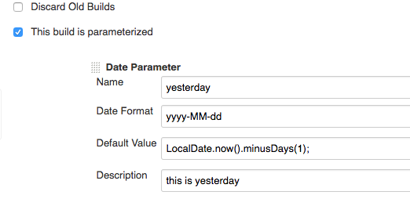
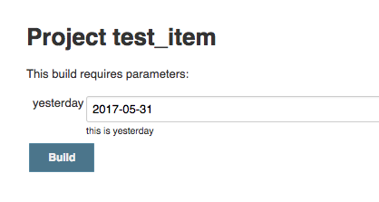
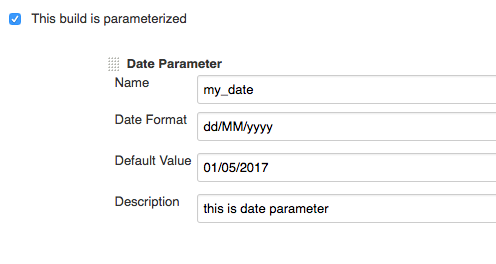
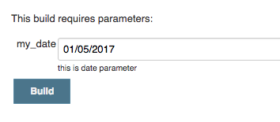

[[DateParameterPlugin-Summary]]
== Summary

'''''

This plug-in provides Date parameters in two forms.

 +

[[DateParameterPlugin-Requirements]]
== Requirements

'''''

Jenkins version 1.614 or newer is required. (jdk >= 7.0)

 +

[[DateParameterPlugin-Configuration]]
== Configuration

'''''

[[DateParameterPlugin-DateFormat]]
=== Date Format

This is Java style date format.

* example1) yyyyMMdd
* example2) yyyy-MM-dd

[[DateParameterPlugin-DefaultValue]]
=== Default Value

You can use two types value

 +

[[DateParameterPlugin-Javacodingstyle]]
==== Java coding style

This value support LocalDate, LocalDateTime. but allows only contains
plusXXX, minusXXX methods. this value will apply '[.underline]#*Date
Format'*# when you build.

Semicolon is not mandatory.

 +

* {blank}
** example1) LocalDate.now();
** example2) LocalDateTime.now()
** example3) LocalDate.now().plusDays(5).minusMonths(1);

[[DateParameterPlugin-Stringstyle]]
==== String style

In this case. plugin will validate this value to [.underline]#*'Date
Format'*#

* {blank}
** example1) 2018-05-01
** example2) 01/05/2018

[[DateParameterPlugin-Screenshot]]
== Screenshot

'''''

 +

 +

[[DateParameterPlugin-LocalDatestyle.]]
=== LocalDate style.

 +

[.confluence-embedded-file-wrapper .confluence-embedded-manual-size]##

[.confluence-embedded-file-wrapper .confluence-embedded-manual-size]##

[[DateParameterPlugin-Stringstyle.]]
=== *String style.*

[.confluence-embedded-file-wrapper .confluence-embedded-manual-size]##

[.confluence-embedded-file-wrapper .confluence-embedded-manual-size]##

[[DateParameterPlugin-History]]
== History

'''''

 +

[[DateParameterPlugin-Version0.0.4(Oct23,2018)]]
=== Version 0.0.4 (Oct 23, 2018)

* fixed bug (parameter is lost upon restart). thanks to @PierreBtz
(https://github.com/jenkinsci/date-parameter-plugin/pull/5[#PR-5])

[[DateParameterPlugin-Version0.0.3(Jan22,2018)]]
=== Version 0.0.3 (Jan 22, 2018)

* support LocalDateTime. thanks to @etraikov
(https://github.com/jenkinsci/date-parameter-plugin/pull/2[#PR-2])

[[DateParameterPlugin-Version0.0.2(Jun29,2017)]]
=== Version 0.0.2 (Jun 29, 2017)

* fixed bug (scheduled build problem)

[[DateParameterPlugin-Version0.0.1(June2,2017)]]
=== Version 0.0.1 (June 2, 2017)

* initial release
