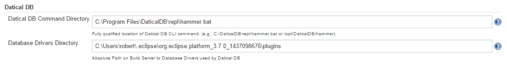
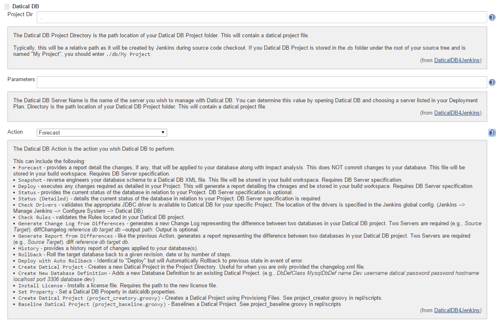
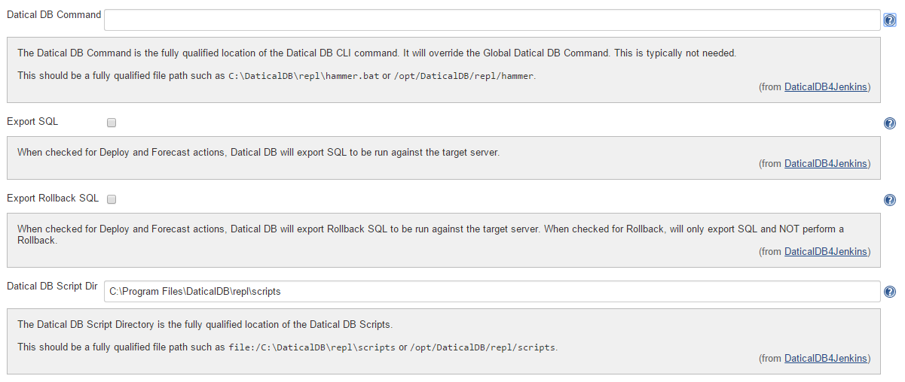

[.conf-macro .output-inline]#This plugin adds
http://www.datical.com/[Datical DB] support to Jenkins and requires
Datical DB to be installed.#

[[DaticalDB4Jenkins-Screenshot]]
== Screenshot

Global Configuration:

[.confluence-embedded-file-wrapper]## +
Project Configuration

[.confluence-embedded-file-wrapper]##

Advanced Project Configuration

[.confluence-embedded-file-wrapper]##

[[DaticalDB4Jenkins-ChangeLog]]
== Change Log

[[DaticalDB4Jenkins-Version1.0.38(May18,2015)]]
=== Version 1.0.38 (May 18, 2015)

* Added support for Convert SQL Groovy script.

[[DaticalDB4Jenkins-Version1.0.35(March30,2015)]]
=== Version 1.0.35 (March 30, 2015)

* Added support for Groovy scripts.

[[DaticalDB4Jenkins-Version1.0.23(October6,2014)]]
=== Version 1.0.23 (October 6, 2014)

* Added support for Check Rules.

[[DaticalDB4Jenkins-Version1.0.22(June26,2014)]]
=== Version 1.0.22 (June 26, 2014)

* Added support for Export SQL for Rollback. Previously, this was only
available for Forecast and Deploy.

[[DaticalDB4Jenkins-Version1.0.21(June19,2014)]]
=== Version 1.0.21 (June 19, 2014)

* Added support for Export SQL and Export Rollback SQL

[[DaticalDB4Jenkins-Version1.0.20(Apr28,2014)]]
=== Version 1.0.20 (Apr 28, 2014)

* Added support for installing a License Key

[[DaticalDB4Jenkins-Version1.0.19(Apr21,2014)]]
=== Version 1.0.19 (Apr 21, 2014)

* Added support for newProject and newDBDef commands. Used for when you
want to create a Datical DB project dynamically.

[[DaticalDB4Jenkins-Version1.0.18(Feb17,2014)]]
=== Version 1.0.18 (Feb 17, 2014)

* Added ability to set Project specific Datical DB Command and override
Global setting. Useful for Master-Node installs.

[[DaticalDB4Jenkins-Version1.0.16(Feb14,2014)]]
=== *Version 1.0.16 (Feb 14, 2014)*

* Added support for Status Details action.

[[DaticalDB4Jenkins-Version1.0.15(Feb7,2014)]]
=== *Version 1.0.15 (Feb 7, 2014)*

* Added support for Rollback and Auto Rollback actions.

[[DaticalDB4Jenkins-Version1.0.14(Nov12,2013)]]
=== Version 1.0.14 (Nov 12, 2013)

* Replaced Radio Buttons with Select list.
* Added support for Diff and History actions.

[[DaticalDB4Jenkins-Version1.0.13(Nov8,2013)]]
=== Version 1.0.13 (Nov 8, 2013)

* Fixed diffChangelog issue on Linux.

[[DaticalDB4Jenkins-Version1.0.12(Nov2,2013)]]
=== Version 1.0.12 (Nov 2, 2013)

* Added support for new diffChanglog functionality.

[[DaticalDB4Jenkins-Version1.0.6(Sep24,2013)]]
=== Version 1.0.6 (Sep 24, 2013)

* JENKINS-19667 - Fixed path issue on non-Windows platforms.

[[DaticalDB4Jenkins-Version1.0.4(Jun17,2013)]]
=== Version 1.0.4 (Jun 17, 2013)

* Initial Release
