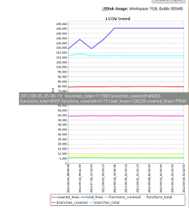

Add charts based on JDBC database data series. +

[.confluence-embedded-file-wrapper]##

http://piotr.tabor.waw.pl/2009/09/07/dbcharts-hudson-plugin-to-plot-a-db-charts

[[dbChartsPlugin-ChangeLog]]
== Change Log

[[dbChartsPlugin-Version0.5.2(Jun29,2013)]]
=== Version 0.5.2 (Jun 29, 2013)

* Added Sqlite support for string data

[[dbChartsPlugin-Version0.4(Feb17,2011)]]
=== Version 0.4 (Feb 17, 2011)

* Avoid exception at first startup.

[[dbChartsPlugin-Version0.3(Mar15,2010)]]
=== Version 0.3 (Mar 15, 2010)

* Avoid error if global config is saved with no JDBC connections.
(https://issues.jenkins-ci.org/browse/JENKINS-5916[JENKINS-5916])

[[dbChartsPlugin-Version0.2.1(Sep20,2009)]]
=== Version 0.2.1 (Sep 20, 2009)
