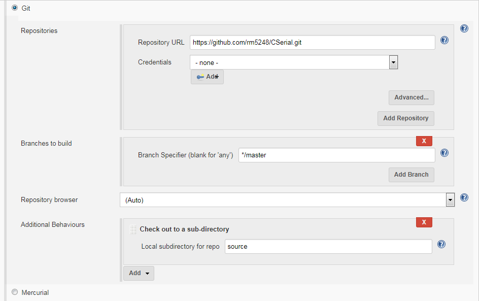
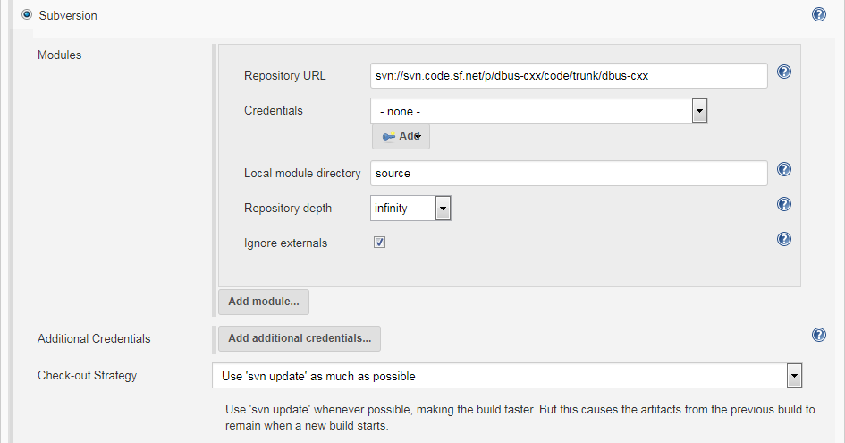
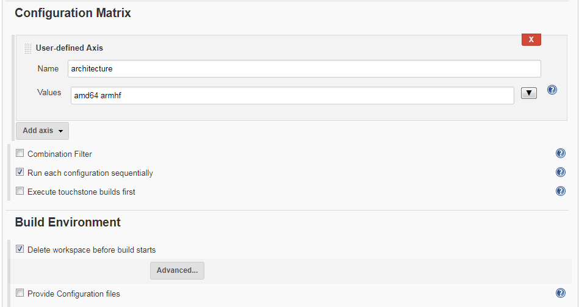
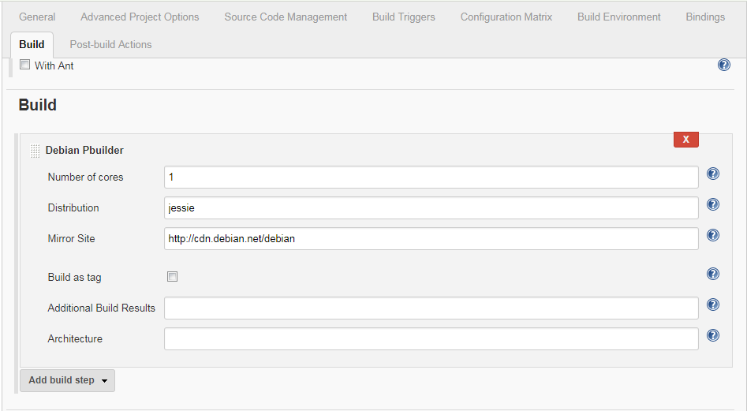

This plugin lets you build Debian packages in a pbuilder environment,
keeping a clean filesystem for builds. +

Build Debian packages in Jenkins!

This plugin is based largely off
of https://jenkins-debian-glue.org/[jenkins-debian-glue], however with
support for builder packages in a proper Jenkins way.

https://ci.jenkins.io/job/Plugins/job/debian-pbuilder-plugin/[ci.jenkins.io]: https://ci.jenkins.io/job/Plugins/job/debian-pbuilder-plugin/job/master/[[.confluence-embedded-file-wrapper]#image:https://ci.jenkins.io/buildStatus/icon?job=Plugins/debian-pbuilder-plugin/master[image]#]

https://jenkins.rm5248.com/job/debian-pbuilder/[jenkins.rm5248.com]: http://jenkins.rm5248.com/job/debian-pbuilder/[[.confluence-embedded-file-wrapper]#image:http://jenkins.rm5248.com/buildStatus/icon?job=debian-pbuilder[image]#]

[[DebianPbuilderPlugin-SystemSetup]]
== System Setup

Before you can successfully run the plugin, there are certain
requirements that must be met on the node(s) that you wish to run on.  

. Install needed dependencies:
+
[source,syntaxhighlighter-pre]
----
apt-get install qemu-user-static devscripts cowbuilder dpkg-dev
----
. If building Debian packages on Ubuntu, make sure that the package
debian-archive-keyring is installed 
. Like jenkins-debian-glue, make sure that sudo is configured properly.
As taken from the jenkins-debian-glue webpage, add the following to
either /etc/sudoers, or create a new file(e.g. /etc/sudoers.d/jenkins): 
+
[source,syntaxhighlighter-pre]
----
jenkins ALL=NOPASSWD: /usr/sbin/cowbuilder, /usr/sbin/chroot 
Defaults env_keep+="DEB_* DIST ARCH"
----
+
 +
(this assumes that Jenkins is running under the Jenkins user)

[[DebianPbuilderPlugin-UsingthePlugin]]
== Using the Plugin

[[DebianPbuilderPlugin-ConfigurationOptions]]
=== Configuration Options

There are several global configuration options.  These options may be
found by going to "Manage Jenkins" → "Configure System".  

* Email address - this is the email that is set in the changelog entry
for the build.  It need not be an actual email address
* Version format - Determines how the package will be versioned if not a
tag build
* Debian directory - determines where the debian/ folder is, by default
the project should be checked out to a directory called 'source'

[[DebianPbuilderPlugin-ProjectSetup(Traditional)]]
=== Project Setup(Traditional)

This plugin may be configured as both a traditional Jenkins build, or as
a Pipeline project.

. Create a new project.  If you want to build for multiple
architectures, select "Multi-configuration project"
. Checkout source code.  When you checkout the source code for the
project, it *should* be in a subdirectory called 'source'(this value can
be changed on either a per-build configuration or globally).  This can
be done as either an SVN repository, or a git repository.  To checkout
to the proper directory using git, go to "Additional Behaviors" and
select "Check out to a sub-directory", and put "source" as the value. 
To checkout to the proper directory using SVN, under "Local module
directory" put "source" as the value. +
[.confluence-embedded-file-wrapper .confluence-embedded-manual-size]####[.confluence-embedded-file-wrapper .confluence-embedded-manual-size]####
. Under 'Build Environment', select 'Delete workspace before build
starts'
. If you have a matrix configuration project, add a new variable called
"architecture".  Put in the proper architectures to build for in this
section; this must map to a valid architecture that exists in the
distribution repos.
+
[.confluence-embedded-file-wrapper .confluence-embedded-manual-size]##
. Under the 'Build' section, add 'Debian Pbuilder'. Most of these
settings may be left at their default values, however it is highly
recommended to fill in the "Distribution" and "Mirror Site" variables in
order to ensure that you get a consistent build.  Otherwise, pbuilder
will use the defaults for whatever distribution you are currently
running. +
[.confluence-embedded-file-wrapper .confluence-embedded-manual-size]##
. If you have custom pbuilder hook files that you want to install,
install
the https://wiki.jenkins-ci.org/display/JENKINS/Config+File+Provider+Plugin[Config
File Provider] to add in config files. Set the 'target' option to be
`hookdir/<file-name>`.

[[DebianPbuilderPlugin-ProjectSetup(Pipeline)]]
=== Project Setup(Pipeline)

If using pipeline, you may setup a job similar to the following:

*Pipeline Setup - single arch*

[source,syntaxhighlighter-pre]
----
node(){
        ws{
            stage( "clean" ){
                cleanWs()
            }
            stage( "checkout" ){
                checkout([$class: 'GitSCM', branches: 
                         [[name: '*/jenkinsfile-updates']], 
                         doGenerateSubmoduleConfigurations: false, 
                         extensions: [[$class: 'RelativeTargetDirectory', relativeTargetDir: 'source']], 
                         submoduleCfg: [], 
                         userRemoteConfigs: [[credentialsId: '78de5c66-5dfb-4c95-8ad9-ec34e8dee4ec', url: 'git@github.com:rm5248/CSerial.git']]])
            }

            stage("build"){
                //Actually build the package.
                //Note that you can go to the 'Pipeline Syntax' page on your Jenkins instance to generate this automatically
                debianPbuilder additionalBuildResults: '', architecture: '', distribution: 'jessie', keyring: '', mirrorSite: 'http://ftp.us.debian.org'
            }
        }

}
----

The following example shows how to build for multiple architectures:

*Pipeline Setup - Multiple arch*

[source,syntaxhighlighter-pre]
----
def axisArchitecture = ["amd64", "armhf"]
def axisNode = ["master"]
def tasks = [:]

for( int i = 0; i < axisArchitecture.size(); i++ ){
    def arch = axisArchitecture[i];
    tasks["${axisNode[0]}/${axisArchitecture[i]}"] = {
        node(axisNode[0]){
            ws{
                stage( "clean" ){
                    cleanWs()
                }
                stage( "checkout" ){
                    checkout([$class: 'GitSCM', branches: 
                             [[name: '*/jenkinsfile-updates']], 
                             doGenerateSubmoduleConfigurations: false, 
                             extensions: [[$class: 'RelativeTargetDirectory', relativeTargetDir: 'source']], 
                             submoduleCfg: [], 
                             userRemoteConfigs: [[credentialsId: '78de5c66-5dfb-4c95-8ad9-ec34e8dee4ec', url: 'git@github.com:rm5248/CSerial.git']]])
                } 
                stage("build-${arch}"){
                    debianPbuilder architecture:"${arch}"
                }
            }
        }
    }
}

stage('build'){
    parallel tasks
}
----

 +

[[DebianPbuilderPlugin-PackageVersioning]]
=== Package Versioning

By default the plugin will increment the current version number by
reading 'debian/changelog'.  The algorithm follows the standard Debian
practice of packages having a ~ being a pre-release version, and
packages with a + denoting a version greater than what is default.  Note
that this only happens if the the distribution set in 'debian/changelog'
is UNRELEASED, or a tag is being built.  Tags are automatically scanned;
if using SVN or git, the environment variables SVN_URL_1 and GIT_BRANCH
are scanned for the substring "tags/"; if the substring is found, the
package will be built as a tag.  Otherwise, you can also select the
"Build as tag" to force the package to not increment the version number,
or alternatively set the environment variable DEB_PBUILDER_BUILDING_TAG
if you are building a tag.

[[DebianPbuilderPlugin-Artifacts]]
=== Artifacts

All generated files are automatically added to the build artifacts for
easy retrieval.  This includes the deb files, as well as the dsc and tar
files used to build the package in the pbuilder environment.

[[DebianPbuilderPlugin-Output]]
=== Output

All output can be found in the build output of the project when it is
built.  If for some reason the build fails, this is a good first place
to look.  If there is a configuration problem, a (hopefully) useful
error message will be printed out when the build fails.  

[[DebianPbuilderPlugin-Buildingpackageswith'quilt'format]]
=== Building packages with 'quilt' format

When building a package with format "3.0 (quilt)", you must provide the
orig.tar.gz file for the builder to work properly.  This can be done one
of two ways: either you can provide the orig.tar.gz through a pre-build
step of some kind, or under the 'advanced' section there is a field for
you to fill in the name of the package to checkout using the
'pristine-tar' command.

[[DebianPbuilderPlugin-IssueTracking]]
== Issue Tracking

Please file any bugs that you may find on the Jenkins JIRA, using the
debian-pbuilder-plugin component. 
https://issues.jenkins-ci.org/issues/?filter=18140[Click here] for all
open issues.

[[DebianPbuilderPlugin-Releases]]
== Releases

[[DebianPbuilderPlugin-Version1.7(2019-10-12)]]
=== Version 1.7(2019-10-12)

* Fixed a few minor issues with building from
pipeline[https://github.com/jenkinsci/debian-pbuilder-plugin/pull/3[PR
#3]]

[[DebianPbuilderPlugin-Version1.6(2019-04-21)]]
=== Version 1.6(2019-04-21)

* Removed file lock when building packages; pbuilder should take care of
this automatically and it probably doesn't work with multiple slaves
anyway
* Catch correct exception if trying to create multiple chroots at the
same time
* Added an option to change the pbuilder dependency resolver.  Changing
the dependency resolver fixes problems with apt segfaulting on an armhf
chroot.
* Made the global configuration actually save and load correctly.
* Print out a more useful error message when the debian/source/format
file doesn't exist or is bad.

[[DebianPbuilderPlugin-Version1.5(2019-01-27)]]
=== Version 1.5(2019-01-27)

* Added ability to use pristine-tar to get orig.tar.gz
file(JENKINS-52645)
* Added ability to set components when creating pbuilder base.  This is
mostly useful for building Ubuntu packages.

[[DebianPbuilderPlugin-Version1.4(2018-05-12)]]
=== Version 1.4(2018-05-12)

* Added a setting for the keyring.  
** Auto-detection for building Debian packages on Ubuntu should still
work, but this is useful for overriding it
** Thanks to jayjlawrence with
https://github.com/jenkinsci/debian-pbuilder-plugin/pull/1[PR #1] for
prompting this change

[[DebianPbuilderPlugin-Version1.3(2018-01-13)]]
=== Version 1.3(2018-01-13)

* Plugin does not depend on pipeline
* Fixed JENKINS-48921

[[DebianPbuilderPlugin-Version1.2(2017-12-23)]]
=== Version 1.2(2017-12-23)

* First official release on Jenkins.io
* No changes to code since version 1.1, only documentation/POM updates

[[DebianPbuilderPlugin-Version1.1]]
=== Version 1.1

* Support for Pipeline jobs. 
* Added configuration options for versioning

[[DebianPbuilderPlugin-Version1.0]]
=== Version 1.0

* Initial Release of software.  Can build projects of multiple types.
