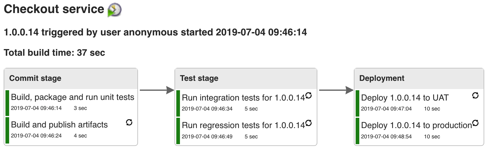
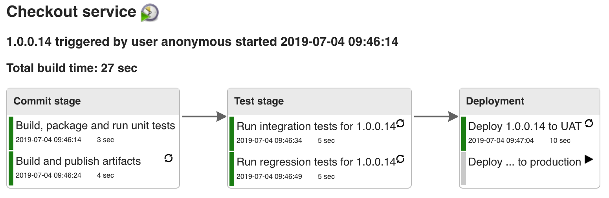
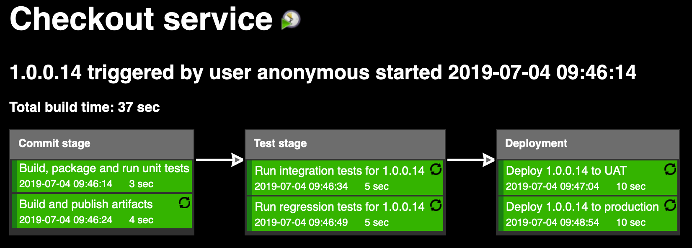
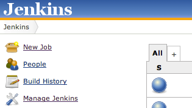
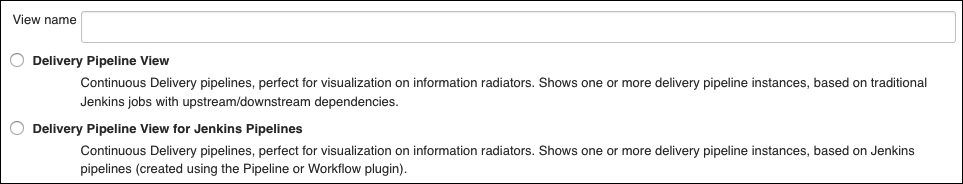
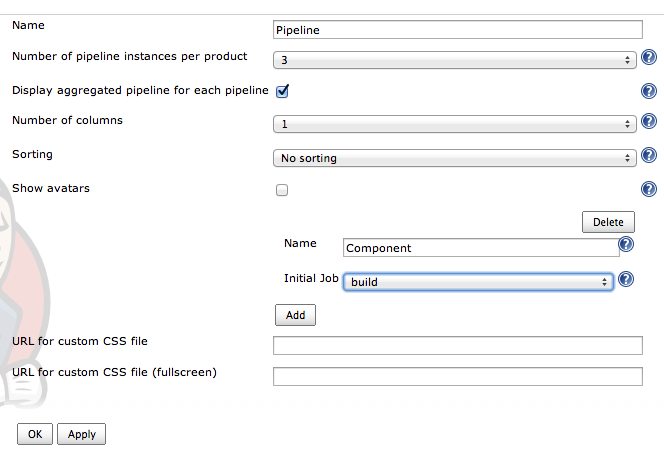
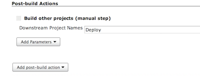

[.conf-macro .output-inline]##

[cols="",options="header",]
|===
|Plugin Information
|View Delivery Pipeline
https://plugins.jenkins.io/delivery-pipeline-plugin[on the plugin site]
for more information.
|===

[.aui-icon .aui-icon-small .aui-iconfont-info .confluence-information-macro-icon]##

Older versions of this plugin may not be safe to use. Please review the
following warnings before using an older version:

* https://jenkins.io/security/advisory/2017-11-16/[Reflected cross-site
scripting vulnerability]

[[DeliveryPipelinePlugin-Summary]]
== Summary

Visualisation of Continuous Delivery pipelines. Renders pipelines based
on upstream/downstream jobs or Jenkins pipelines. Provides a full screen
view for information radiators. +
In Continuous Delivery, feedback and visualisation of the delivery
process is one of the most important aspects. When using Jenkins as a
build/CI/CD server, it is with the Delivery Pipeline plugin possible to
visualise one or more delivery pipelines in the same view, even in full
screen.

 +

[.confluence-embedded-file-wrapper .confluence-embedded-manual-size]##

Jenkins jobs are tagged with a stage and a task name. In the screenshot
above, the pipeline consists of three stages called Commit stage, Test
stage and Deployment. The first stage consists of two tasks called
"Build, package and run unit tests" and "Build and publish artifacts".
Each task corresponds to a traditional Jenkins job.

The plugin requires your pipelines to be built using traditional Jenkins
jobs with downstream/upstream relationships or using Jenkins pipelines.
For downstream/upstream jobs, automatic promotion steps use the
Parameterized Trigger Plugin while manual steps are provided using the
Build Pipeline plugin manual trigger (see example with manual trigger
below). Aggregated view shows the latest version for each stage.

 +

[.confluence-embedded-file-wrapper .confluence-embedded-manual-size]##

[[DeliveryPipelinePlugin-Fullscreenview]]
== Full screen view

Example screenshot when using the Delivery Pipeline plugin in full
screen view (suitable for information radiators):

[.confluence-embedded-file-wrapper .confluence-embedded-manual-size]##

[[DeliveryPipelinePlugin-Configuration]]
== Configuration

[[DeliveryPipelinePlugin-UsingtraditionalJenkinsjobs]]
=== Using traditional Jenkins jobs

* Create jobs with downstream/upstream relationships.
* Tag your Jenkins jobs with which stage it belongs to and the task name
in the "Delivery Pipeline configuration" section.

[[DeliveryPipelinePlugin-Jenkinspipelines]]
=== Jenkins pipelines

* Create a Jenkins pipeline. No additional configuration is needed as
the stage nodes are used for rendering the pipeline view. Tasks can be
defined using the
https://jenkins.io/doc/pipeline/steps/delivery-pipeline-plugin/#task-task[task
pipeline step]. Multi-branch pipelines are also supported.
* The following blog post shows how to use task's inside pipeline stages
for a more fine-grained visualization of pipelines using the Delivery
Pipeline
plugin: http://www.google.com/url?q=http%3A%2F%2Fblog.diabol.se%2F%3Fp%3D1021&sa=D&sntz=1&usg=AFQjCNGLdtvrktwnuefm_fz18B1LiCbndw[http://blog.diabol.se/?p=1021]

[[DeliveryPipelinePlugin-View]]
=== View

* Create a view by clicking the + +
[.confluence-embedded-file-wrapper]##
* Choose "Delivery Pipeline View" for traditional jobs with
upstream/downstream dependencies, or "Delivery Pipeline View for Jenkins
pipelines" when using Jenkins pipelines. Give the view a name. +
[.confluence-embedded-file-wrapper]##
* Configure the view by choosing the number of pipeline instances,
component name and choose the first Jenkins job for each pipeline
(applicable for traditional Jenkins jobs). +
[.confluence-embedded-file-wrapper]##

[[DeliveryPipelinePlugin-ManualTriggers]]
=== Manual Triggers

* Make sure that the Build Pipeline plugin is installed and enabled.
* Create or edit a job and add a Postbuild action +
[.confluence-embedded-file-wrapper]##

[[DeliveryPipelinePlugin-Knownissues]]
=== Known issues

JUnit plugin needs to be installed and enabled. +
If arrows are missing between the stages, please take look at
https://issues.jenkins-ci.org/browse/JENKINS-28055[JENKINS-28055]

[[DeliveryPipelinePlugin-Needhelp]]
== Need help

Join our Google Group
https://groups.google.com/forum/#\!forum/delivery-pipeline-plugin\|https://groups.google.com/forum/#\!forum/delivery-pipeline-plugin
(https://groups.google.com/forum/#\!forum/delivery-pipeline-plugin)

[[DeliveryPipelinePlugin-OpenTickets(bugsandfeaturerequests)]]
== Open Tickets (bugs and feature requests)

[[refresh-module-653712370]]
[[refresh-653712370]][[jira-issues-653712370]]
T

Key

Summary

Assignee

Reporter

P

Status

Resolution

Created

Updated

Due

[.refresh-action-group]# #

[[refresh-issues-loading-653712370]]
[.aui-icon .aui-icon-wait]#Loading...#

[#refresh-issues-button-653712370]##
[#refresh-issues-link-653712370]#Refresh#
[#error-message-653712370 .error-message .hidden]# #

[[DeliveryPipelinePlugin-Changelog]]
== Changelog

[.aui-icon .aui-icon-small .aui-iconfont-info .confluence-information-macro-icon]#
#

Starting from version 0.10.1, the Delivery Pipeline Plugin is released
completely automatically and the generated release notes can be found on
GitHub:

https://github.com/Diabol/delivery-pipeline-plugin/releases/

[[DeliveryPipelinePlugin-0.10.0(Nov162016)]]
=== 0.10.0 (Nov 16 2016)

https://github.com/Diabol/delivery-pipeline-plugin/releases/tag/delivery-pipeline-plugin-0.10.0

[[DeliveryPipelinePlugin-0.9.12(Jun82016)]]
=== 0.9.12 (Jun 8 2016)

https://github.com/Diabol/delivery-pipeline-plugin/releases/tag/delivery-pipeline-plugin-0.9.12

[[DeliveryPipelinePlugin-0.9.11(May242016)]]
=== 0.9.11 (May 24 2016)

* image:docs/images/error.svg[(error)]
  Added missing icons from contrast
theme https://issues.jenkins-ci.org/browse/JENKINS-35086[JENKINS-35086] https://github.com/Diabol/delivery-pipeline-plugin/pull/184[PR]

[[DeliveryPipelinePlugin-0.9.10(May202016)]]
=== 0.9.10 (May 20 2016)

* image:docs/images/error.svg[(error)]
  Subprojects should be resolved first
https://issues.jenkins-ci.org/browse/JENKINS-30043[JENKINS-30043] https://github.com/Diabol/delivery-pipeline-plugin/pull/168[PR]
* image:docs/images/error.svg[(error)]
  Fixed test result
 https://issues.jenkins-ci.org/browse/JENKINS-33965[JENKINS-33965 ]https://github.com/Diabol/delivery-pipeline-plugin/pull/173[PR]
* image:docs/images/error.svg[(error)]
  CSS fix for Firefox and IE
https://issues.jenkins-ci.org/browse/JENKINS-33175[JENKINS-33175] https://github.com/Diabol/delivery-pipeline-plugin/pull/176[PR]
* image:docs/images/add.svg[(plus)]
  Added Paging option to Delivery Pipeline
https://issues.jenkins-ci.org/browse/JENKINS-28918[JENKINS-28918] https://github.com/Diabol/delivery-pipeline-plugin/pull/174[PR]
* image:docs/images/information.svg[(info)]
  Added Themes for DPP and ability to select from different
options https://issues.jenkins-ci.org/browse/JENKINS-34041[JENKINS-34041] https://github.com/Diabol/delivery-pipeline-plugin/pull/178[PR] https://github.com/Diabol/delivery-pipeline-plugin/pull/180[PR]

[[DeliveryPipelinePlugin-0.9.9(Mar282016)]]
=== 0.9.9 (Mar 28 2016)

* image:docs/images/error.svg[(error)]
Rebuilding broken in Jenkins ver. 1.653
https://issues.jenkins-ci.org/browse/JENKINS-33594[JENKINS-33594]
https://github.com/Diabol/delivery-pipeline-plugin/pull/170[PR]
* image:docs/images/information.svg[(info)]
Fix stage header high with new jenkins base
https://issues.jenkins-ci.org/browse/JENKINS-31996[JENKINS-31996]
https://github.com/Diabol/delivery-pipeline-plugin/pull/166[PR]

[[DeliveryPipelinePlugin-0.9.8(Dec122015)]]
=== 0.9.8 (Dec 12 2015)

* image:docs/images/information.svg[(info)]
Use annotated commit message
https://issues.jenkins-ci.org/browse/JENKINS-31577[JENKINS-31577]
https://github.com/Diabol/delivery-pipeline-plugin/pull/164[PR]
* image:docs/images/information.svg[(info)]
Unknown cause when Git hook triggered build
https://issues.jenkins-ci.org/browse/JENKINS-30209[JENKINS-30209]
https://github.com/Diabol/delivery-pipeline-plugin/pull/155[PR]
* image:docs/images/error.svg[(error)]
Pipeline view should show multiple stages per row
https://issues.jenkins-ci.org/browse/JENKINS-31317[JENKINS-31317]
https://github.com/Diabol/delivery-pipeline-plugin/pull/163[PR]

[[DeliveryPipelinePlugin-0.9.7(Aug272015)]]
=== 0.9.7 (Aug 27 2015)

* image:docs/images/error.svg[(error)]
Delivery pipeline sometimes uses job name instead of taskname
https://issues.jenkins-ci.org/browse/JENKINS-30170[JENKINS-30170]
https://github.com/Diabol/delivery-pipeline-plugin/pull/153[PR]
https://github.com/Diabol/delivery-pipeline-plugin/pull/154[PR]

[[DeliveryPipelinePlugin-0.9.6(Aug262015)]]
=== 0.9.6 (Aug 26 2015)

* image:docs/images/error.svg[(error)]
Erratic PIPELINE_VERSION behavior with other Parameters
https://issues.jenkins-ci.org/browse/JENKINS-28848[JENKINS-28848]
https://github.com/Diabol/delivery-pipeline-plugin/pull/120[PR]
* image:docs/images/add.svg[(plus)]
TokenMacro for getting a version value stored in environment variable
https://issues.jenkins-ci.org/browse/JENKINS-23485[JENKINS-23485]
https://github.com/Diabol/delivery-pipeline-plugin/pull/128[PR]
* image:docs/images/add.svg[(plus)]
Ability to provide description for the task
https://issues.jenkins-ci.org/browse/JENKINS-29637[JENKINS-29637]
https://issues.jenkins-ci.org/browse/JENKINS-20608[JENKINS-20608]
https://github.com/Diabol/delivery-pipeline-plugin/pull/138[PR]
* image:docs/images/information.svg[(info)]
Show commit id in changes
https://issues.jenkins-ci.org/browse/JENKINS-29580[JENKINS-29580]
https://github.com/Diabol/delivery-pipeline-plugin/pull/145[PR]
* image:docs/images/error.svg[(error)]
/search/suggest and /search throw Caused by:
java.lang.NullPointerException
https://issues.jenkins-ci.org/browse/JENKINS-29521[JENKINS-29521]
https://github.com/Diabol/delivery-pipeline-plugin/pull/146[PR]
* image:docs/images/add.svg[(plus)]
Ability to split sequence of jobs for multiple pipelines
https://issues.jenkins-ci.org/browse/JENKINS-29806[JENKINS-29806]
https://github.com/Diabol/delivery-pipeline-plugin/pull/144[PR]
* image:docs/images/information.svg[(info)]
Extend description with more build results
https://issues.jenkins-ci.org/browse/JENKINS-30051[JENKINS-30051]
https://github.com/Diabol/delivery-pipeline-plugin/pull/148[PR]

[[DeliveryPipelinePlugin-Release0.9.5(Jul282015)]]
=== Release 0.9.5 (Jul 28 2015)

* image:docs/images/error.svg[(error)]
Manual trigger for the downstream job is shown even if the build failed
https://issues.jenkins-ci.org/browse/JENKINS-28937[JENKINS-28937]
https://github.com/Diabol/delivery-pipeline-plugin/pull/121[PR]
* image:docs/images/error.svg[(error)]
Rebuild not respecting permissions
https://issues.jenkins-ci.org/browse/JENKINS-28845[JENKINS-28845]
https://github.com/Diabol/delivery-pipeline-plugin/pull/122[PR]
* image:docs/images/add.svg[(plus)]
Show promotions and description on the pipeline
https://github.com/Diabol/delivery-pipeline-plugin/pull/113[PR]
https://github.com/Diabol/delivery-pipeline-plugin/pull/124[PR]
https://github.com/Diabol/delivery-pipeline-plugin/pull/141[PR]
* image:docs/images/information.svg[(info)]
Fixed deprecations and small fixes
https://github.com/Diabol/delivery-pipeline-plugin/pull/131[PR]
https://github.com/Diabol/delivery-pipeline-plugin/pull/134[PR]
* image:docs/images/error.svg[(error)]
Successful build should not show solid green background color
https://issues.jenkins-ci.org/browse/JENKINS-28837[JENKINS-28837]
https://github.com/Diabol/delivery-pipeline-plugin/pull/129[PR]
* image:docs/images/error.svg[(error)]
Better description of columns property
https://issues.jenkins-ci.org/browse/JENKINS-29324[JENKINS-29324]
https://github.com/Diabol/delivery-pipeline-plugin/pull/132[PR]
* image:docs/images/error.svg[(error)]
Correct verbiage in some of the help text
https://github.com/Diabol/delivery-pipeline-plugin/pull/136[PR]
* image:docs/images/error.svg[(error)]
'Enable start of new pipeline build' does not work with parameterized
trigger
https://issues.jenkins-ci.org/browse/JENKINS-29133[JENKINS-29133]
https://github.com/Diabol/delivery-pipeline-plugin/pull/137[PR]
* image:docs/images/information.svg[(info)]
Better help text for TokenMacro:s
https://github.com/Diabol/delivery-pipeline-plugin/pull/141[PR]

[[DeliveryPipelinePlugin-Release0.9.4(09Jun2015)]]
=== Release 0.9.4 (09 Jun 2015)

* image:docs/images/information.svg[(info)]
Pointer cursor for rebuild and manual task
https://github.com/Diabol/delivery-pipeline-plugin/pull/117[PR]
* image:docs/images/information.svg[(info)]
Add simple title to triggers
https://github.com/Diabol/delivery-pipeline-plugin/pull/118[PR]
* image:docs/images/add.svg[(plus)]
Show total build time
https://issues.jenkins-ci.org/browse/JENKINS-22482[JENKINS-22482]
https://github.com/Diabol/delivery-pipeline-plugin/pull/103[PR]

[[DeliveryPipelinePlugin-Release0.9.3(02May2015)]]
=== Release 0.9.3 (02 May 2015)

* image:docs/images/error.svg[(error)]
MethodNotAllowed error when start new build
https://issues.jenkins-ci.org/browse/JENKINS-28582[JENKINS-28582]
https://github.com/Diabol/delivery-pipeline-plugin/pull/116[PR]

[[DeliveryPipelinePlugin-Release0.9.2(01May2015)]]
=== Release 0.9.2 (01 May 2015)

* image:docs/images/error.svg[(error)]
Catch case where too many capture groups defined
https://github.com/Diabol/delivery-pipeline-plugin/pull/111[PR]
* image:docs/images/error.svg[(error)]
Join Plugin & Delivery Pipeline Plugin: View logs warnings about
existing downstream projects
https://issues.jenkins-ci.org/browse/JENKINS-28619[JENKINS-28619]
https://github.com/Diabol/delivery-pipeline-plugin/pull/114[PR]

[[DeliveryPipelinePlugin-Release0.9.1(17May2015)]]
=== Release 0.9.1 (17 May 2015)

* image:docs/images/error.svg[(error)]
Hardcoded url for image
https://issues.jenkins-ci.org/browse/JENKINS-22921[JENKINS-22921]
* image:docs/images/error.svg[(error)]
Double slash // in url for triggering new pipelines
https://issues.jenkins-ci.org/browse/JENKINS-22921[JENKINS-22921]
* image:docs/images/error.svg[(error)]
Doesn't detect promotion "Trigger/call builds on other projects"
https://issues.jenkins-ci.org/browse/JENKINS-28347[JENKINS-28347]

[[DeliveryPipelinePlugin-Release0.9.0(15May2015)]]
=== Release 0.9.0 (15 May 2015)

* image:docs/images/add.svg[(plus)]
Rebuild
https://issues.jenkins-ci.org/browse/JENKINS-25298[JENKINS-25298]
* image:docs/images/information.svg[(info)]
If first job in pipeline is queued, no new pipeline instance is shown in
view https://issues.jenkins-ci.org/browse/JENKINS-22947[JENKINS-22947]
* image:docs/images/information.svg[(info)]
Now it is possible to show 50 pipeline instances
https://issues.jenkins-ci.org/browse/JENKINS-27667[JENKINS-27667]
* image:docs/images/error.svg[(error)]
NPE when upstream build has been deleted
https://issues.jenkins-ci.org/browse/JENKINS-27584[JENKINS-27584]
* image:docs/images/add.svg[(plus)]
Build Now menu to trigger the pipeline manually
https://issues.jenkins-ci.org/browse/JENKINS-22921[JENKINS-22921]

[[DeliveryPipelinePlugin-Release0.8.11(23March2015)]]
=== Release 0.8.11 (23 March 2015)

* image:docs/images/error.svg[(error)]
Support jobs organized under folders (RegExp)
https://issues.jenkins-ci.org/browse/JENKINS-27270[JENKINS-27270]
* image:docs/images/error.svg[(error)]
NPE when using jobs with the same name in different folders
https://issues.jenkins-ci.org/browse/JENKINS-27539[JENKINS-27539]

[[DeliveryPipelinePlugin-Release0.8.10(17March2015)]]
=== Release 0.8.10 (17 March 2015)

* image:docs/images/information.svg[(info)]
Speed improvements for view
* image:docs/images/error.svg[(error)]
Prevent a stack overflow if a project eventually cycles back to itself
https://issues.jenkins-ci.org/browse/JENKINS-27298[JENKINS-27298]

[[DeliveryPipelinePlugin-Release0.8.9(04February2015)]]
=== Release 0.8.9 (04 February 2015)

* image:docs/images/error.svg[(error)]
Very slow when there are many folders and projects.
https://issues.jenkins-ci.org/browse/JENKINS-26746[JENKINS-26746]
* image:docs/images/error.svg[(error)]
Can't handle two manual triggers triggers same downstream job
https://issues.jenkins-ci.org/browse/JENKINS-26282[JENKINS-26282]

[[DeliveryPipelinePlugin-Release0.8.8(10December2014)]]
=== Release 0.8.8 (10 December 2014)

* image:docs/images/error.svg[(error)]
Server error when viewing pipeline with NOT_BUILT result job
https://issues.jenkins-ci.org/browse/JENKINS-25457[JENKINS-25457]
* image:docs/images/information.svg[(info)]
Switch job property to use an optionalBlock
https://issues.jenkins-ci.org/browse/JENKINS-25744[JENKINS-25744]
* image:docs/images/information.svg[(info)]
load animation
https://issues.jenkins-ci.org/browse/JENKINS-21291[JENKINS-21291]

[[DeliveryPipelinePlugin-Release0.8.7(16November2014)]]
=== Release 0.8.7 (16 November 2014)

* image:docs/images/information.svg[(info)]
Dropped dependency to jQuery-UI
https://issues.jenkins-ci.org/browse/JENKINS-24296[JENKINS-24296]
* image:docs/images/error.svg[(error)]
NPE when View is configured with a non existing firstJob
https://issues.jenkins-ci.org/browse/JENKINS-24644[JENKINS-24644]
* image:docs/images/error.svg[(error)]
MalformedUrlException fills up logs
https://issues.jenkins-ci.org/browse/JENKINS-25256[JENKINS-25256]
* image:docs/images/error.svg[(error)]
Loading animation has old size
https://issues.jenkins-ci.org/browse/JENKINS-25279[JENKINS-25279]
* image:docs/images/information.svg[(info)]
Manual triggered reexecuting jobs which has failed dont show up as
status queued
https://issues.jenkins-ci.org/browse/JENKINS-25361[JENKINS-25361]
* image:docs/images/error.svg[(error)]
Unable to trigger manual jobs when build-pipeline-plugin 1.4.4 is
installed
https://issues.jenkins-ci.org/browse/JENKINS-25607[JENKINS-25607]

[[DeliveryPipelinePlugin-Release0.8.6(26August2014)]]
=== Release 0.8.6 (26 August 2014)

* image:docs/images/add.svg[(plus)]
Support for Promoted Builds Plugin
https://issues.jenkins-ci.org/browse/JENKINS-22876[JENKINS-22876]
* image:docs/images/error.svg[(error)]
Manual Build Trigger invoke job on different folder level
https://issues.jenkins-ci.org/browse/JENKINS-24392[JENKINS-24392]

[[DeliveryPipelinePlugin-Release0.8.5(17August2014)]]
=== Release 0.8.5 (17 August 2014)

* image:docs/images/information.svg[(info)]
Show Views TabBar in pipeline default view
https://issues.jenkins-ci.org/browse/JENKINS-24173[JENKINS-24173]
* image:docs/images/error.svg[(error)]
Multi-configuration projects display with wrong Delivery Pipeline Stage
Name https://issues.jenkins-ci.org/browse/JENKINS-22654[JENKINS-22654]
* image:docs/images/error.svg[(error)]
Absolute URLs in delivery pipeline break reverse proxy
setupshttps://issues.jenkins-ci.org/browse/JENKINS-24019[JENKINS-24019]

[[DeliveryPipelinePlugin-Release0.8.4(07August2014)]]
=== Release 0.8.4 (07 August 2014)

* image:docs/images/error.svg[(error)]
Stage connector arrows missing in version 0.8.2
https://issues.jenkins-ci.org/browse/JENKINS-23824[JENKINS-23824]

[[DeliveryPipelinePlugin-Release0.8.3(03August2014)]]
=== Release 0.8.3 (03 August 2014)

* image:docs/images/error.svg[(error)]
Use getRootUrl instead of getRootUrlFromRequest
https://issues.jenkins-ci.org/browse/JENKINS-24019[JENKINS-24019]

[[DeliveryPipelinePlugin-Release0.8.2(02July2014)]]
=== Release 0.8.2 (02 July 2014)

* image:docs/images/error.svg[(error)]
Trigger button is not rendered correctly on Firefox
https://issues.jenkins-ci.org/browse/JENKINS-23537[JENKINS-23537]
* image:docs/images/information.svg[(info)]
Do not display 'Aggregated view' if no pipeline instances
https://issues.jenkins-ci.org/browse/JENKINS-23536[JENKINS-23536]
* image:docs/images/information.svg[(info)]
Suggest removing folder prefix if present when failing to trigger manual
step https://issues.jenkins-ci.org/browse/JENKINS-23532[JENKINS-23532]
* image:docs/images/error.svg[(error)]
Send crumb if "Prevent Cross Site Request Forgery exploits" if enabled
https://issues.jenkins-ci.org/browse/JENKINS-23589[JENKINS-23589]

[[DeliveryPipelinePlugin-Release0.8.1(16June2014)]]
=== Release 0.8.1 (16 June 2014)

* image:docs/images/add.svg[(plus)]
Macro for PIPELINE_VERSION
https://issues.jenkins-ci.org/browse/JENKINS-21123[JENKINS-21123]
* image:docs/images/error.svg[(error)]
Delivery Pipeline view renders a blank page when set as the default
system view in Jenkins
https://issues.jenkins-ci.org/browse/JENKINS-23282[JENKINS-23282]
https://issues.jenkins-ci.org/browse/JENKINS-23353[JENKINS-23353]
* image:docs/images/error.svg[(error)]
Stack trace on rename or delete
https://issues.jenkins-ci.org/browse/JENKINS-23373[JENKINS-23373]
* image:docs/images/error.svg[(error)]
Plugin is incompatible with Build Pipeline Plugin
https://issues.jenkins-ci.org/browse/JENKINS-23372[JENKINS-23372]

[[DeliveryPipelinePlugin-Release0.8.0(14May2014)]]
=== Release 0.8.0 (14 May 2014)

* image:docs/images/add.svg[(plus)]
Allow manual trigger
https://issues.jenkins-ci.org/browse/JENKINS-21009[JENKINS-21009]

[[DeliveryPipelinePlugin-Release0.7.5(03May2014)]]
=== Release 0.7.5 (03 May 2014)

* image:docs/images/error.svg[(error)]
Committer names not shown in pipeline heading
https://issues.jenkins-ci.org/browse/JENKINS-22635[JENKINS-22635]
* image:docs/images/error.svg[(error)]
Triggered by SCM multiple times
https://issues.jenkins-ci.org/browse/JENKINS-22611[JENKINS-22611]
* image:docs/images/error.svg[(error)]
Status QUEUED are wrong in some cases
https://issues.jenkins-ci.org/browse/JENKINS-22751[JENKINS-22751]
* image:docs/images/error.svg[(error)]
View bug in some parallel stage pipelines
https://issues.jenkins-ci.org/browse/JENKINS-22787[JENKINS-22787]
* image:docs/images/error.svg[(error)]
Internal server error (Cyclic Stage problem)
https://issues.jenkins-ci.org/browse/JENKINS-22658[JENKINS-22658]
* image:docs/images/error.svg[(error)]
Support long task names
https://issues.jenkins-ci.org/browse/JENKINS-22733[JENKINS-22733]

[[DeliveryPipelinePlugin-Release0.7.4(14April2014)]]
=== Release 0.7.4 (14 April 2014)

* image:docs/images/information.svg[(info)]
Progressbar when building
https://issues.jenkins-ci.org/browse/JENKINS-22099[JENKINS-22099]
* image:docs/images/error.svg[(error)]
Handle longer stage names
https://issues.jenkins-ci.org/browse/JENKINS-22327[JENKINS-22327]

[[DeliveryPipelinePlugin-Release0.7.3(03April2014)]]
=== Release 0.7.3 (03 April 2014)

* image:docs/images/error.svg[(error)]
Pipelines are mixed up when same stage/step names are used
https://issues.jenkins-ci.org/browse/JENKINS-22423[JENKINS-22423]

[[DeliveryPipelinePlugin-Release0.7.2(17March2014)]]
=== Release 0.7.2 (17 March 2014)

* image:docs/images/error.svg[(error)]
Parallel stages display distorted
https://issues.jenkins-ci.org/browse/JENKINS-22211[JENKINS-22211]

[[DeliveryPipelinePlugin-Release0.7.1(15March2014)]]
=== Release 0.7.1 (15 March 2014)

* image:docs/images/error.svg[(error)]
Delivery Pipeline View only shows first component
https://issues.jenkins-ci.org/browse/JENKINS-22189[JENKINS-22189]

[[DeliveryPipelinePlugin-Release0.7.0(10March2014)]]
=== Release 0.7.0 (10 March 2014)

* image:docs/images/add.svg[(plus)]
Support for visualisation of parallel stages
https://issues.jenkins-ci.org/browse/JENKINS-21010[JENKINS-21010]
* image:docs/images/error.svg[(error)]
Change log messages are not html encoded
https://issues.jenkins-ci.org/browse/JENKINS-22100[JENKINS-22100]

[[DeliveryPipelinePlugin-Release0.6.10(30January2014)]]
=== Release 0.6.10 (30 January 2014)

* image:docs/images/information.svg[(info)]
CSS fixes for stage
https://issues.jenkins-ci.org/browse/JENKINS-21435[JENKINS-21435]
* image:docs/images/error.svg[(error)]
Can not resolve status for downstream jobs in folders
https://issues.jenkins-ci.org/browse/JENKINS-21549[JENKINS-21549]
* image:docs/images/error.svg[(error)]
Links when using folders is wrong
https://issues.jenkins-ci.org/browse/JENKINS-21533[JENKINS-21533]

[[DeliveryPipelinePlugin-Release0.6.9(20January2014)]]
=== Release 0.6.9 (20 January 2014)

* image:docs/images/add.svg[(plus)]
Add pipelines dynamically with regular expressions
https://issues.jenkins-ci.org/browse/JENKINS-20717[JENKINS-20717]

[[DeliveryPipelinePlugin-Release0.6.8(07January2014)]]
=== Release 0.6.8 (07 January 2014)

* image:docs/images/error.svg[(error)]
Folders plugin support
https://issues.jenkins-ci.org/browse/JENKINS-20756[JENKINS-20756]
* image:docs/images/error.svg[(error)]
Triggered by always include anonymous user
https://issues.jenkins-ci.org/browse/JENKINS-20807[JENKINS-20807]
* image:docs/images/add.svg[(plus)]
Pipeline start cause
https://issues.jenkins-ci.org/browse/JENKINS-20822[JENKINS-20822]
* image:docs/images/error.svg[(error)]
Severe performance degradation when loading view
https://issues.jenkins-ci.org/browse/JENKINS-21008[JENKINS-21008]
* image:docs/images/error.svg[(error)]
Better error logging for macro errors for pipeline version
https://issues.jenkins-ci.org/browse/JENKINS-21070[JENKINS-21070]

[[DeliveryPipelinePlugin-Release0.6.7(22November2013)]]
=== Release 0.6.7 (22 November 2013)

* image:docs/images/error.svg[(error)]
Triggered by includes culprits
https://issues.jenkins-ci.org/browse/JENKINS-20721[JENKINS-20721]

[[DeliveryPipelinePlugin-Release0.6.6(20November2013)]]
=== Release 0.6.6 (20 November 2013)

* image:docs/images/add.svg[(plus)]
Consider "Trigger/call builds on other projects"
https://issues.jenkins-ci.org/browse/JENKINS-20588[JENKINS-20588]

[[DeliveryPipelinePlugin-Release0.6.5(14November2013)]]
=== Release 0.6.5 (14 November 2013)

* image:docs/images/error.svg[(error)]
various pipelines have no color (Bug when first job in pipeline has an
upstream job)
https://issues.jenkins-ci.org/browse/JENKINS-20539[JENKINS-20539]
* image:docs/images/add.svg[(plus)]
Show SCM changes in pipeline view
https://issues.jenkins-ci.org/browse/JENKINS-20517[JENKINS-20517]

[[DeliveryPipelinePlugin-Release0.6.4(06November2013)]]
=== Release 0.6.4 (06 November 2013)

* image:docs/images/error.svg[(error)]
Backport code to run on Java 1.6
https://issues.jenkins-ci.org/browse/JENKINS-20441[JENKINS-20441]

[[DeliveryPipelinePlugin-Release0.6.3(04November2013):]]
=== Release 0.6.3 (04 November 2013):

* image:docs/images/error.svg[(error)]
Configurable update interval
https://issues.jenkins-ci.org/browse/JENKINS-20388[JENKINS-20388]

[[DeliveryPipelinePlugin-Release0.6.2(18October2013):]]
=== Release 0.6.2 (18 October 2013):

* image:docs/images/error.svg[(error)]
Update helptexts
https://issues.jenkins-ci.org/browse/JENKINS-19972[JENKINS-19972]
* image:docs/images/information.svg[(info)]
Placeholder for logo
https://issues.jenkins-ci.org/browse/JENKINS-20015[JENKINS-20015]
* image:docs/images/error.svg[(error)]
Cant use SVN_REVISION as pipeline version
https://issues.jenkins-ci.org/browse/JENKINS-20099[JENKINS-20099]
* image:docs/images/information.svg[(info)]
Updated style for fullscreen
* image:docs/images/error.svg[(error)]
Removed guava dependency since it is already in Jenkins to reduce
artefact size
* image:docs/images/add.svg[(plus)]
Added a 20 second timeout if slow network

[[DeliveryPipelinePlugin-Release0.6.1(08October2013)]]
=== Release 0.6.1 (08 October 2013)

* First public release
