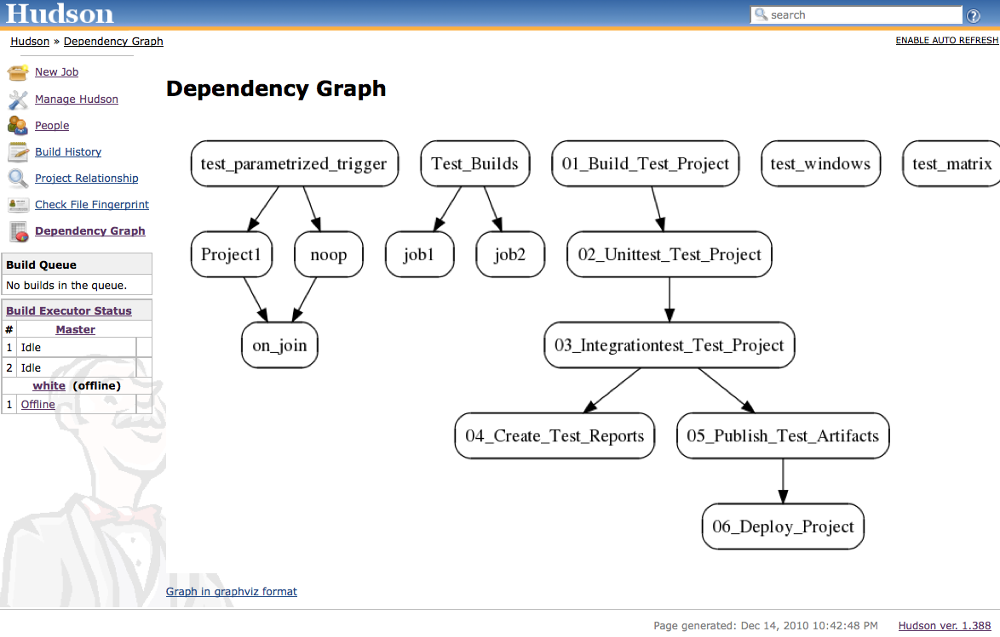

[.conf-macro .output-inline]##

[cols="",options="header",]
|===
|Plugin Information
|View Dependency Graph Viewer
https://plugins.jenkins.io/depgraph-view[on the plugin site] for more
information.
|===

[.aui-icon .aui-icon-small .aui-iconfont-error .confluence-information-macro-icon]##

The current version of this plugin may not be safe to use. Please review
the following warnings before use:

* https://jenkins.io/security/advisory/2019-07-11/#SECURITY-1177[Stored
XSS vulnerability]

[.aui-icon .aui-icon-small .aui-iconfont-info .confluence-information-macro-icon]##

Older versions of this plugin may not be safe to use. Please review the
following warnings before using an older version:

* https://jenkins.io/security/advisory/2017-10-23/[Missing permission
checks]

[.aui-icon .aui-icon-small .aui-iconfont-warning .confluence-information-macro-icon]##

*This plugin is up for adoption.* Want to help improve this plugin?
https://wiki.jenkins-ci.org/display/JENKINS/Adopt+a+Plugin[Click here to
learn more]!

Shows a dependency graph of the projects using graphviz. Requires a
graphviz installation on the server.

[[DependencyGraphViewPlugin-Features]]
== Features

* Show the dependency graph via graphviz
** restricted to projects in a view
** restricted to one project
* Respects access permissions
* Show the graphviz source file

[[DependencyGraphViewPlugin-Screen]]
== Screen

[.confluence-embedded-file-wrapper .image-center-wrapper]##

[[DependencyGraphViewPlugin-Changelog]]
== Changelog

[[DependencyGraphViewPlugin-Version0.13(Oct23,2017)]]
=== Version 0.13 (Oct 23, 2017)

* https://jenkins.io/security/advisory/2017-10-23/[Fix security
vulnerability]

[[DependencyGraphViewPlugin-Version0.12(Oct16,2017)]]
=== Version 0.12 (Oct 16, 2017)

* Update version of jsPlumb

[[DependencyGraphViewPlugin-Version0.11(Mar22,2013)]]
=== Version 0.11 (Mar 22, 2013)

* Fix invalid ajax calls for `+sidepanel.jelly.+`
* Show right dependency when the project name for copy artifact is
relative

[[DependencyGraphViewPlugin-Version0.10(Dec1,2012)]]
=== Version 0.10 (Dec 1, 2012)

* Switch editing of Dependency Graph off by default
* Editing of Dependency Graph is configurable globally
* Disable wrapping of job names

[[DependencyGraphViewPlugin-Version0.9(Nov22,2012)]]
=== Version 0.9 (Nov 22, 2012)

* Make jQuery-UI a mandatory dependency
(https://issues.jenkins-ci.org/browse/JENKINS-15891[JENKINS-15891])
* Improve Layout algorithm

[[DependencyGraphViewPlugin-Version0.8(Nov19,2012)]]
=== Version 0.8 (Nov 19, 2012)

* Use jQuery and jQuery-UI Plugin
* Fix problem with Javascript-Ids from job-names
https://issues.jenkins-ci.org/browse/JENKINS-15850[JENKINS-15850]

[[DependencyGraphViewPlugin-Version0.7(Nov16,2012)]]
=== Version 0.7 (Nov 16, 2012)

* Add ability to switch off graphviz rendering on configuration page

[[DependencyGraphViewPlugin-Version0.6(Nov14,2012)]]
=== Version 0.6 (Nov 14, 2012)

* Bugfix for jsPlumb display

[[DependencyGraphViewPlugin-Version0.5(Nov13,2012)]]
=== Version 0.5 (Nov 13, 2012)

* ExtensionPoints for Edges and Subprojects of the Graph
* Experimental visualisation via jsPlumb
* Fixed links when jenkins is behind reverse proxy
(https://issues.jenkins-ci.org/browse/JENKINS-13446[JENKINS-13446],
https://issues.jenkins-ci.org/browse/JENKINS-12112[JENKINS-12112])
* Fixed invalid image when graphviz outputs warnings
(https://issues.jenkins-ci.org/browse/JENKINS-11875[JENKINS-11875])

[[DependencyGraphViewPlugin-Version0.4(Sep27,2012)]]
=== Version 0.4 (Sep 27, 2012)

* Legend now in separate image

[[DependencyGraphViewPlugin-Version0.3(Sep25,2012)]]
=== Version 0.3 (Sep 25, 2012)

* Subprojects from the
https://wiki.jenkins-ci.org/display/JENKINS/Parameterized+Trigger+Plugin[Parameterized
Trigger Plugin] are now shown
* Do not rely on default encoding when executing dot

[[DependencyGraphViewPlugin-Version0.2(Aug5,2011)]]
=== Version 0.2 (Aug 5, 2011)

* Use getFullDisplayName instead of getName for project names

[[DependencyGraphViewPlugin-Version0.1(Dec14,2010)]]
=== Version 0.1 (Dec 14, 2010)

* Initial version
