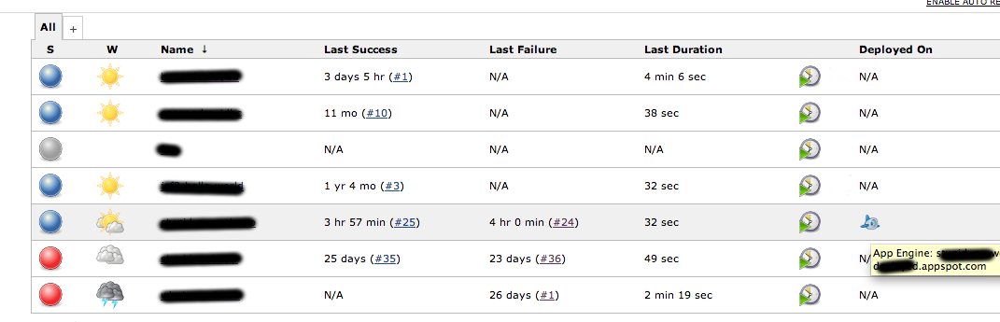

[.conf-macro .output-inline]##

[cols="",options="header",]
|===
|Plugin Information
|View Deployed On Column
https://plugins.jenkins.io/deployed-on-column[on the plugin site] for
more information.
|===

[.aui-icon .aui-icon-small .aui-iconfont-warning .confluence-information-macro-icon]##

*This plugin is up for adoption.* Want to help improve this plugin?
https://wiki.jenkins-ci.org/display/JENKINS/Adopt+a+Plugin[Click here to
learn more]!

[[DeployedonColumnPlugin-DeployedonColumnPlugin]]
== Deployed on Column Plugin

This plugin provides a column that acts as a container for build actions
that record deployment of build artifacts to remote servers, such as
deployment of web applications to servers, etc. The plugin also provides
an extension point for other plugins to contribute their build actions.

[[DeployedonColumnPlugin-Screenshots]]
=== Screenshots

A basic screenshot showing one build (the last blue ball) which had been
deployed to an App Engine hosting service provided by some search engine
company or other. Clicking on the icon will, in this case, bring you to
the deployed application. But implementations of the extension point are
free to decide the exact behaviour. +
[.confluence-embedded-file-wrapper]##

[[DeployedonColumnPlugin-ChangeLog]]
=== Change Log

[[DeployedonColumnPlugin-Version1.8(Jun2017)]]
==== Version 1.8 (Jun 2017)

* Do not show the column by default.
* Use 2.X parent POM.

[[DeployedonColumnPlugin-Version1.7(Feb2013)]]
==== Version 1.7 (Feb 2013)

* Deployments recorded against the Maven module set in a Maven project
type job were being ignored.

[[DeployedonColumnPlugin-Version1.6(Dec2012)]]
==== Version 1.6 (Dec 2012)

* Fix issue with icon URLs not using the static resource prefix
correctly.

[[DeployedonColumnPlugin-Version1.4(Dec2012)]]
==== Version 1.4 (Dec 2012)

* If DeployedOnAction.getUrlName() returns an absolute URL don't mess it
up

[[DeployedonColumnPlugin-Version1.3(Dec2012)]]
==== Version 1.3 (Dec 2012)

* Make DeployedOnAction Serializable
* Update plugin versions

[[DeployedonColumnPlugin-Version1.2(Oct2012)]]
==== Version 1.2 (Oct 2012)

* First version that actually works
image:docs/images/wink.svg[(wink)]

[[DeployedonColumnPlugin-Version1.1(Oct2012)]]
==== Version 1.1 (Oct 2012)

* Fixed a bug resulting from a copy and paste error in open sourcing
this plugin.

[[DeployedonColumnPlugin-Version1.0(Oct2012)]]
==== Version 1.0 (Oct 2012)

* Initial release.
