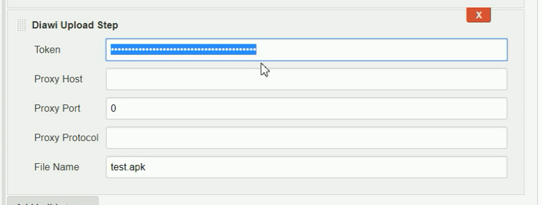

[.conf-macro .output-inline]##

[cols="",options="header",]
|===
|Plugin Information
|View Diawi Upload https://plugins.jenkins.io/diawi-upload[on the plugin
site] for more information.
|===

[.aui-icon .aui-icon-small .aui-iconfont-error .confluence-information-macro-icon]##

The current version of this plugin may not be safe to use. Please review
the following warnings before use:

* https://jenkins.io/security/advisory/2019-04-03/#SECURITY-947[Credentials
stored in plain text]

[[DiawiUploadPlugin-Features]]
== Features

* Uploading APK / IPA files to diawi.com
* Check for upload status.
* Log the upload link.

[[DiawiUploadPlugin-Requirements]]
== Requirements

[[DiawiUploadPlugin-Jenkins]]
=== Jenkins

Jenkins https://jenkins.io/changelog-stable#v1.642.3[version 1.642.3] or
newer is required.

[[DiawiUploadPlugin-Diawi.comaccount]]
=== Diawi.com account

* A diawi.com account is required to be used for uploading the artifact.
To create an account, Go to https://www.diawi.com/[diawi.com].
* Make sure you are logged in to http://diawi.com/[diawi.com] and then
use this link to create Diawi API access
token https://dashboard.diawi.com/profile/api. 
* Once the token is generated, it will be shown on the browser. Make
sure to save the token as it is only view-able at this time.

[[DiawiUploadPlugin-Pleasenote]]
=== Please note

Feel free to contact muhammed.adawi@gmail.com and ask them to fix this
bug!

[[DiawiUploadPlugin-Setup]]
== Setup

https://youtu.be/C22N7Mj01Lk[Check out this YouTube demo]

[[DiawiUploadPlugin-Installplugin]]
=== Install plugin

Install this plugin via the Jenkins plugin manager.

[[DiawiUploadPlugin-Configurebuildjob]]
=== Configure build job

* in the build section, click add build step and then choose Diawi
Upload Step.
* In the Token feild, insert the DIAWI api access token.
* In File Name, Insert the name of the apk/ipa file.
* If your jenkins host connects to the internet through a proxy server,
add the proxy details accordingly, otherwise, leave it blank as below.
* Proxy port and proxy protocol are used if and only if the proxy host
is defined. +
[.confluence-embedded-file-wrapper .confluence-embedded-manual-size]##
* if you use the Editable email notification plugin. you can use the
following syntax to include the diawi link +
$\{FILE,path="DIAWI_LINKS"}  ( for latest version 1.4,
use $\{FILE,path="filename.diawilink"} instead 

[[DiawiUploadPlugin-ResultsandLogs]]
=== Results and Logs

* Diawi Link to the uploaded artifact

[[DiawiUploadPlugin-Version1.1(July8,2017)]]
=== Version 1.1 (July 8, 2017)

* Initial release

[[DiawiUploadPlugin-Version1.2(July15,2017)]]
=== Version 1.2 (July 15, 2017)

* issues fixed:

* {blank}
** Stream closed issue.

* {blank}
** relative path.

* new functionalities:

* {blank}
** proxy settings

[[DiawiUploadPlugin-Version1.3(July17,2017)]]
===== Version 1.3(July 17, 2017)

* new functionalities:

* {blank}
** Save link to DIAWI_LINKS under the work space directory

[[DiawiUploadPlugin-Version1.4(Oct17,2017)]]
===== Version 1.4(Oct17, 2017)

Allowing uploading multiple files:

* {blank}
** File(s) instead of File name now takes multiple files separated by
comma.
** Save links to filename.diawilink under the work space directory.
