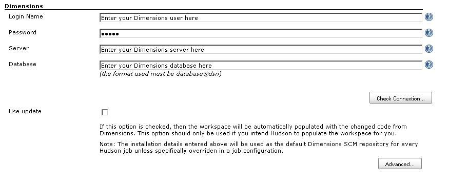
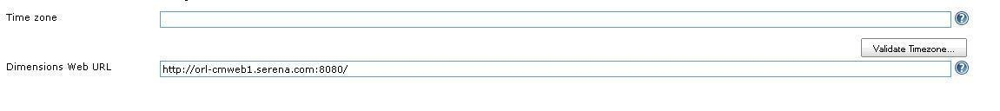
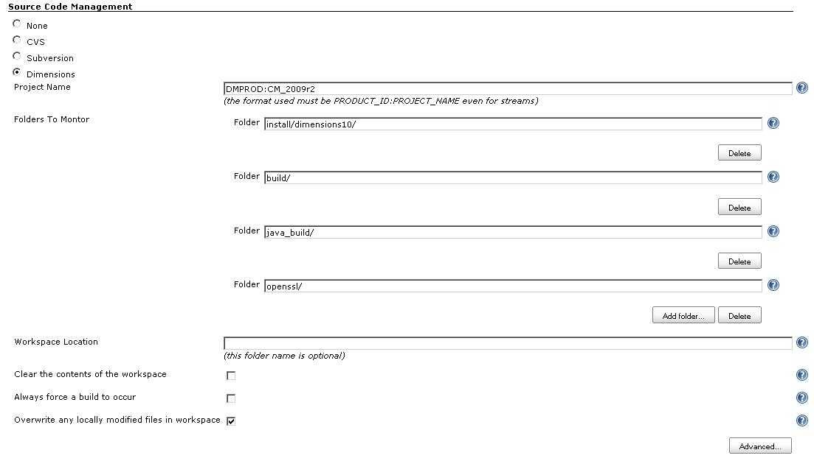

[[DimensionsPlugin-Overview]]
== Overview

[.conf-macro .output-inline]##This plugin integrates the
https://www.microfocus.com/products/dimensions-cm/[Dimensions CM] SCM
with Jenkins.##Questions can be asked in the comments section of this
wiki page or you can contact https://supportline.microfocus.com/[Micro
Focus Supportline].

[cols="",]
|===
a|
If you see
`+java.lang.IllegalArgumentException: Failed to instantiate class hudson.scm.SCM+`
with Jenkins 2.9 - 2.11, please upgrade to Jenkins 2.12 or later to
avoid _JENKINS-35906_.

It is recommended to upgrade to the Jenkins Dimensions Plugin 0.8.15 or
later, in order to avoid the issues
__SECURITY-1065__ and __SECURITY-1108__.

|===

The plugin allows a Jenkins job to be associated with a Dimensions CM
stream or project, automatically updating the Jenkins workspace with
file content from the Dimensions CM repository.

The plugin currently supports

* Polling
* Checkout
* Build change log reporting
* Tagging
* Artifact Upload
* Tag Deployment
* Launching Tagged Builds via Dimensions Builder

[.conf-macro .output-inline]##

[cols="",options="header",]
|===
|Plugin Information
|View Dimensions https://plugins.jenkins.io/dimensionsscm[on the plugin
site] for more information.
|===

[.aui-icon .aui-icon-small .aui-iconfont-info .confluence-information-macro-icon]##

Older versions of this plugin may not be safe to use. Please review the
following warnings before using an older version:

* https://jenkins.io/security/advisory/2018-09-25/#SECURITY-1108[CSRF
vulnerability and missing permission checks]
* https://jenkins.io/security/advisory/2018-09-25/#SECURITY-1065[Credentials
stored in plain text]

[[DimensionsPlugin-Pre-requisites]]
== Pre-requisites

New releases of the plugin are tested with the most recent major version
of Dimensions CM, version 14.x at the time of writing. The plugin should
also work fine with Dimensions CM version 12.x. If you need support for
an older version of Dimensions CM, then older versions of the Jenkins
Dimensions Plugin are available to download and install (for example,
version 0.8.15 should work with Dimensions CM 2009 R1 and 2009 R2). The
plugin uses the Dimensions CM Java client API to communicate with a
specified Dimensions CM server installation and so requires that the
Jenkins installation be updated with a number of JAR files from the
Dimensions CM installation as documented below.

[[DimensionsPlugin-Installation]]
== Installation

To add this plugin to a Jenkins installation, the following steps need
to be taken:

* The plugin needs to be installed and enabled using the Jenkins plugin
manager from the _Available_ tab in the usual manner. The name of the
Dimensions CM plugin to select and install is _Dimensions Plugin_.
* The following Dimensions Java client API JAR files need to be added to
the user class path for the Jenkins JVM, or dropped into the
__<JENKINS_HOME>__`+/plugins/dimensionsscm/WEB-INF/lib+` directory.
These JAR files can be copied from the __<DM_ROOT>__`+/java_api/lib/+`
or __<DM_ROOT>__`+/AdminConsole/lib/+` directory of your Dimensions
server or client installation respectively.
** `+darius.jar+`
** `+dmclient.jar+`
** `+dmfile.jar+`
** `+dmnet.jar+`
* Depending on the version of the Dimensions Java client API you are
using, there may be some additional JAR files needed (e.g.
`+commons-logging-api.jar+` for CM 12.2 or 14.1;
and `+slf4j-api.jar+` for CM 14.3). You should copy these too.

Failure to follow the above steps will mean the plugin will not operate
correctly.

[[DimensionsPlugin-ConfiguringthePlugin]]
== Configuring the Plugin

The plugin can be configured to work with Dimensions at both the System
level and at the individual job definition level.

[[DimensionsPlugin-SystemConfiguration]]
=== System Configuration

Configuring the plugin at the system level allows you to define a
default Dimensions installation which can be used as the default for
every job. This default installation can be configured by opening the
_Manage Jenkins->Configure system_ configuration page and looking for
the Dimensions configuration pane shown below.

[[DimensionsPlugin-DimensionsLoginDetails]]
==== Dimensions Login Details

The standard Dimensions login details need to be provided in the above
fields. This is the Dimensions login that will be used by Jenkins to
connect to the Dimensions repository and retrieve any updated files. A
_Check Connection..._ button is provided for your convenience to ensure
the connection details you have specified are correct and can be used by
Jenkins.

'''''

[.confluence-embedded-file-wrapper]##

'''''

Checking the _Use update_ toggle will get the plugin to automatically
populate your Jenkins workspace with content from Dimensions. If the
checkbox is not selected, then the plugin will not automatically
populate your workspace.

[[DimensionsPlugin-AdvancedOptions]]
==== Advanced Options

The _Advanced..._ tag shown below allows you to specify if the
Dimensions server installation is running in a different time zone than
the current Jenkins installation. This is useful if you are running in a
geographically distributed environment.

'''''

[.confluence-embedded-file-wrapper]##

'''''

The _Advanced..._ tag also allows you to specify an optional Dimensions
Web client installation that can be used to directly access files in
Dimensions to perform Dimensions operations on them via the Web client.

[[DimensionsPlugin-JobConfiguration]]
=== Job Configuration

When you create a new Jenkins job, you need to configure the Dimensions
stream or project that this job will be monitoring. This can be done
using the standard job _Configure_. page.

Using the _Source Code Management_ pane, select the Dimensions option
and fill in the details shown below with the Dimensions project that
this job will use.

'''''

[.confluence-embedded-file-wrapper]##

'''''

The _Project Name_ must refer to the Dimensions project or stream that
this job will monitor. This is a mandatory field.

The _Folder Name_ refers to a specific folder name in the Dimensions
project or stream that the job can monitor. This should be specified in
UNIX format and represent the high-level folder from which files will be
monitored. If you leave this field blank or specify '/', then all the
contents of the project/stream will be monitored. You can specify
multiple folders to monitor or just leave it blank to monitor
everything.

The _Workspace Location_ specifies a particular workspace location to
which Dimensions will put any updated files. If this field is left
blank, then the default Jenkins-provided workspace will be used.
(_Note:_ As of release 0.7.7, this option has been removed from the GUI
and is now ignored. You can configure a custom workspace location using
the Jenkins *Advanced Project Options*).

A number of options are provided that can be used to control the
behavior of the plugin. These are:

* Clear the contents of the workspace – checking this option will delete
the full contents of the workspace before using Dimensions to repopulate
it. The use of this option is not recommended for very large projects as
it can significantly increase the build time
* Always force a build to occur – checking this option will ignore any
errors or file conflicts reported by the plugin and always force the
build to be started. If this option is not selected, then any errors or
conflicts reported by the plugin will automatically abort the build.
* Overwrite any locally modified files in workspace – checking this
option will automatically overwrite any files that may have been
modified in the local workspace with files that come from Dimensions.
The use of this option is not recommended if you are using Jenkins to
build workspaces that have content that might conflict with that stored
in the Dimensions repository.

An _Advanced..._ tag allows you to override any of the default
Dimensions installation details specified in the system configuration.
The options provided are the same as document in the _System
Configuration_ section above. Options are also provided to control the
permissions on files that are checked out into the Jenkins workspace and
specify if item header substitution is to be used.

[[DimensionsPlugin-JobBuildOptions]]
==== Job Build Options

In version 0.6 onwards of the plugin, enhanced support has been added
for release builds that provide tighter control over the content that
goes into a Jenkins build. Options have been added that allow you to:

* Lock a project or stream while a build is in progress
* _Tag_ a successful build such that a baseline is automatically created
in the Dimensions repository on build completion
* Use a parameterized build to specify a baseline to build, rather than
a project
* Use a parameterized build to specify a list of requests to build,
rather than a project.

These options are described in the following sections below.

[[DimensionsPlugin-LockingaProjectwhileabuildisrunning]]
===== Locking a Project while a build is running

It is now possible to lock a Dimensions project or stream while a build
is being run, such that no changes maybe made to that project (or
stream) until the build has finished. This option is provided so that
long running builds can be assured that the state of the Dimensions
project that they are building does not change while the build is in
progress. This option should be set if the build process interacts with
Dimensions once the initial checkout is complete and the state of the
project needs to be consistent with the assets being built.

An example of this might be if the build process does a deployment or
release step from Dimensions as part of the build.

This option can be enabled or disabled via the _Lock Dimensions project
while the build is in progress_ flag under the *Build Environment*
options.

_(Note_ - This option must be set if you intend to tag a successful
build. Failure to do so will automatically fail that build).

[[DimensionsPlugin-TaggingaSuccessfulbuildinDimensions]]
===== Tagging a Successful build in Dimensions

It is now possible to _tag_ a successful build in Dimensions, such that
a baseline is automatically created to represent the state of the
project or stream that was just built. This option is provided so that
release or checkpoint builds can automatically be tagged in Dimensions
to have an asset that represents that build.

This option can be enabled or disabled via the _Tag successful builds in
Dimensions as a baseline_ flag under the *Post-build Actions* options.

An _Advanced..._ tag is present that allows you to change the type of
baseline that is created by the tagging process. By default, the tagging
process will create a project baseline, but support is also present for
creating template driven baselines as well. The options that are
currently supported are:

* Owning baseline part - This is the name of the Dimensions part that
will own the baseline
* Baseline template - This is the name of the baseline template which
will be used to create the baseline. Currently, only item templates are
supported. Other template types maybe added in a future release.
* Baseline Scope - This states the type of baseline to be created -
either a part scoped, project scoped or revised baseline. Currently, you
should only use baseline templates and owning parts with part scoped
baselines. Project driven baselines do not support templates or owning
parts and specifying these options will be ignored by the plugin.
Revised baselines will only work if you have setup your build to be
parameterized and provide _DM_BASELINE_ and _DM_TARGET_REQUEST_ as input
into the build. _DM_BASELINE_ will be used as the source baseline and
_DM_TARGET_REQUEST_ will be used as the list of requests that are used
to create the new revised baseline.
* Baseline Type - This is the name of the user defined baseline type
against which the baseline will be created. The default is baseline.

[[DimensionsPlugin-UsingParameterizedBuilds]]
===== Using Parameterized Builds

It is now possible to use a Jenkins build project to build both
baselines and requests using parameters that are provided to each build
when it is being run. This functionality has been added to allow a
common build configuration to be used for repeated release and patch
type builds if necessary, rather than using a named project which may
also contain other unwanted changes. This functionality can be enabled
by adding the following parameters to a Jenkins project using the _This
build is parameterized_ option:

* _DM_BASELINE_ - this string parameter will allow you to specify a
Dimensions baseline which will be used as the source for the build,
rather than the usual project. Specifying this option will override any
project sources that might have been defined, all other options however
will be honored as per usual. This option should be used if you intend
to perform a release build from a known baseline of code.

* _DM_REQUEST_ - this string parameter will allow you to specify a list
of Dimensions requests (comma separated) which will be used as the
source for the build, rather than the usual project. Specifying this
option will override any project or baseline sources that might have
been defined, all other options however - with the exception of folder
filters - will be honored as per usual. This option should be used if
you intend to apply a patch or list of patches to an existing area or
are building specific controlled features that have been controlled by
requests. Dependency relationships between requests will automatically
be processed and any child requests be included in the build. When using
this option, the Dimensions project specified in the job configuration
will be used to select those _in-response-to_ items that are relevant.
If a request has changed files related to it that are not in the
Dimensions project, then these changes will be ignored. *Note* - If you
are using this functionality against a Dimensions 10.1.3 server, then
the functionality that is offered by this parameter is limited to the
capabilities present in Dimensions 10.1.3. For example, refactoring
support is not offered, files will always be checked out as read-only
and if you specify multiple requests to process, then each request will
be checked out separately which might cause file versions to conflict
with each other. If you wish to use this functionality, it is strongly
suggested that you upgrade to Dimensions 2009 R1+.

* _DM_TARGET_REQUEST_ - this string parameter will allow you to specify
a list of Dimensions requests (comma separated) which will be used to
relate any assets against that get checked into Dimensions as a result
of a build. This refers primarily to build steps that use Dimensions
Builder and post build actions such as building a tagged baseline and
loading assets into Dimensions.

[[DimensionsPlugin-OtherJobBuildOptions]]
==== Other Job Build Options

This section lists other build options that are available in this
plugin.

[[DimensionsPlugin-DeployingTaggedBaselinesinDimensions]]
===== Deploying Tagged Baselines in Dimensions

It is now possible to automatically deploy a tagged baseline from the
plugin as the last stage of the Jenkins build process. This will
initiate a deployment of the contents of the baseline to all the
deployment nodes associated with a deployment stage and the running of
any deployment pre/post scripts. The plugin does this by running the
Deploy Baseline command (DPB) and returning any results that this
command generates.

This option can be enabled or disabled via the _Automatically deploy the
baseline_ flag under the *Post-build Actions* options. This option will
only be presented if the _Tag successful builds in Dimensions as a
baseline_ flag is checked. You will also be able to specify the stage
you want the baseline to be deployed to. If you do not specify a stage,
then the next one will be used automatically.

(Note - For the deployment to succeed the project being used as a source
for the build must be configured to allow baseline deployment).

[[DimensionsPlugin-ActioningTaggedBaselinesinDimensions]]
===== Actioning Tagged Baselines in Dimensions

It is now possible to automatically action a tagged baseline from the
plugin as the last stage of the Jenkins build process. This will action
the tagged baseline to a given lifecycle state in Dimensions. The plugin
does this by running the Action Baseline command (ABL) and returning any
results that this command generates.

This option can be enabled or disabled via the _Automatically action the
baseline_ flag under the *Post-build Actions* options. This option will
only be presented if the _Tag successful builds in Dimensions as a
baseline_ flag is checked. You will also be able to specify the
lifecycle state you want the baseline to be actioned to. If you do not
specify a state, then the next one will be used automatically.

[[DimensionsPlugin-LaunchingDimensionBuilderwithTaggedBaselines]]
===== Launching Dimension Builder with Tagged Baselines

It is now possible to automatically launch a build in Dimensions Builder
using the tagged baseline as part of the last stage of the Jenkins build
process. This will initiate a baseline build in Dimensions Builder using
build parameters setup in the Jenkins job configuration. The plugin does
this by running the Build Baseline command (BLDB) and returning any
results that this command generates.

This option can be enabled or disabled via the _Automatically build the
baseline_ flag under the *Post-build Actions* options. This option will
only be presented if the _Tag successful builds in Dimensions as a
baseline_ flag is checked. You are also able to specify:

* the Dimensions Build area you want to use
* the Dimensions Build configuration to use
* the Dimensions Build options
* the Dimensions Build targets
* if to run the build in background mode
* if to perform a clean build
* if to capture build outputs and build dependencies under Dimensions.

This option should be selected if you want to use Dimensions Builder
within your build process. For example, to perform multi-platform
release builds for the tagged baseline under strict Dimensions control.

[[DimensionsPlugin-SavingBuildArtifactsintoDimensions]]
===== Saving Build Artifacts into Dimensions

It is now possible to save assets that have been created as a result of
a build process into Dimensions. This option can be enabled or disabled
via the _Load any build artifacts into the Dimensions repository_ flag
under the *Post-build Actions* options.

Artifacts which have been identified for loading into Dimensions will
then be put into the project that the plugin is monitoring using DELIVER
or UPLOAD command as appropriate. If you specify files that are already
under control and have not changed, then these files will be ignored. If
you wish to specify a request to save these changes against, then you
should set a project default request using SCWS or use DM_TARGET_REQUEST
as commented on above.

In version 0.6.8 of the plugin onwards, you can specify the following
advanced options when checking in a file

* Force files to be checked onto the tip - This will force uncontrolled
files with the same name as existing Dimensions files to be loaded into
the repository and placed onto the tip even if they are completely
unrelated to files already present
* Force files to be recorded as merged - This will force files which
might contain revision conflicts to be loaded into the repository and
recorded as being merged even though no physical code merge has taken
place
* Owning part for files - this will put all new files under the
Dimensions part specified.

This setting can be configured in the *Advanced* tab of the job
configuration.

*Regular Expressions*

Activating this checkbox will give you the opportunity to enter a series
of Java style regular expression patterns that will be used to determine
which files in your workspace you want to consider for saving into
Dimensions. For example, patterns like

* _.*\.obj_ - will consider all `+.obj+` files in any subfolder below
the workspace
* _.*\.h_ - will consider all `+.h+` files in any subfolder below the
workspace
* _src/.*\.h_ - will consider all `+.h+` files in the `+src/+`
subdirectory below the workspace (this regular expression will only
match such files on UNIX machines)

All file and subdirectory patterns specified should be made relative to
the workspace root. For example, if your workspace root is
`+/usr/jenkins/project/build/+` and you want to save files from
`+/usr/jenkins/project/build/src/include+`, then specify a pattern like
_src/include/.*\.h_ (this regular expression will only match such files
on UNIX machines).

Regular expressions for uploading artifacts should use a directory
separator character appropriate for the operating system of the machine
where the workspace is located. If the workspace is on a Windows machine
then `+\+` is the directory separator character (not `+/+`), but _\_ is
also the escape character in regular expressions, so you will need to
double up the backslash in your regular expression (like _\\_) to match
a single `+\+` directory separator.

Alternatively you can use the sub-pattern _[/\\]_ to match either the
`+\+` or `+/+` directory separator character. For example,
_src[/\\]include[/\\].*\.h_ means all `+.h+` files under the
`+src\include\+` or `+src/include/+` directory in the workspace (so will
work on both UNIX and Windows machines); and
_(.+[/\\])?test[/\\]helloworld\.dat_ means the file `+helloworld.dat+`
in a subdirectory named `+test+` somewhere in the workspace (on either
UNIX or Windows). Regular expression matching is very powerful, but can
also be very complicated to use correctly, so do find some good
http://docs.oracle.com/javase/6/docs/api/java/util/regex/Pattern.html[documentation]
and maybe an online regular expression testing tool to check that they
actually match the files you expect them to.

*Ant-Style Pattern Matches*

In version 0.8.5 of the plugin onwards, you also have the option to use
Ant-style pattern matches for saving assets to Dimensions. As with the
Java style regular expressions, this option allows you to enter a number
of patterns based on Ant-style pattern matches. Ant-style patterns can
be considerably easier to use correctly than regular expressions (and
handle differences in directory separator characters on different
operating systems for you).

*Inclusion and Exclusion Patterns*

As of version 0.8.6 of the plugin onwards, you can now also specify file
exclusions as well as inclusions to apply to the files selected for
upload.

[[DimensionsPlugin-SpecifyingDimensionsRequeststoCaptureUploadedArtifactsorBuildAssets]]
===== Specifying Dimensions Requests to Capture Uploaded Artifacts or Build Assets

If you are loading build artifacts into Dimensions using the _Load any
build artifacts into the Dimensions repository_ or _Automatically build
the baseline_ options and want to specify Dimensions requests against
which to capture these changes, you can now do so by defining a Jenkins
build parameter called DM_TARGET_REQUEST. When you then start a build,
populate this parameter with the comma separated list of requests that
you wish to use and these will be passed on to the appropriate
Dimensions commands.

[[DimensionsPlugin-SpecifyingPermissionsofCheckedFiles]]
===== Specifying Permissions of Checked Files

In version 0.6.8 of the plugin onwards, it is possible to specify the
permissions of the files which are being checked out as part of the job
configuration. This includes

* Default permissions - the file's default permissions stored in
Dimensions
* Read-only - setting all the files to read only
* Writeable - setting all the files to writeable.

This setting can be configured in the *Advanced* tab of the job
configuration.

[[DimensionsPlugin-DistributedBuildSupport]]
== Distributed Build Support

In version 0.6.7 onwards of the plugin, support has been added for using
the distributed build facilities within Jenkins. There are two main
capabilities that the plugin provides which can potentially be run on a
remote node. These are

* Checking files out of the project/stream being monitored into a
workspace, and
* Checking files into the project/stream being monitored from the
workspace

To use these distributed capabilities, each remote Jenkins node must
have a Dimensions client installation available and in the path. The
remote Jenkins support is provided through _dmcli_, so that remote node
must be a platform against which Dimensions is natively supported. If
you wish to run Jenkins on an unsupported platform - such as Mac OS -
then you can only use that platform as a master node. The master node
support is Java based, so as long as that platform supports Java (and
Jenkins), it should work. However, running the plugin on an unsupported
platform in this way is purely at your own risk. No responsibility is
taken or implied about how the plugin will behave in these conditions.

[[DimensionsPlugin-Securitylimitations]]
=== Security limitations

If you run in a secure environment, then you need to be aware of one
current limitation which is present in the plugin for distributed
support. As the plugin is using _dmcli_ on the slave to run Dimensions
commands, the login details of the Dimensions user configured in the
build job are temporarily written to a parameter file on the slave which
is then used to run Dimensions commands. This parameter file is
persisted until the job finishes. The location of this parameter file is
displayed as the build progresses, so a knowledgeable individual with
access to the slave could access this file whilst the job is in progress
and obtain these login credentials. If this is a security concern, then
it is advised that either:-

* you make the slave machine user's default temporary-file directory
inaccessible to unauthorized users
* configure the Dimensions user referenced in the job to have a very
limited set of privileges, or
* run the build on the master only

This limitation is resolved in version 0.7.1 of the plugin.

[[DimensionsPlugin-Troubleshooting]]
== Troubleshooting

* The plugin should work against Dimensions 10 servers, but requires
Dimensions Java client API JAR files from a Dimensions 2009 R1 server
installation to work correctly. Otherwise you should use Dimensions Java
client API JAR files from the same version of Dimensions as your
Dimensions server installation.
* Upgrading between certain plugin versions may give an error like
_FATAL: Unable to run checkout callout - null_ when running a job. If
this happens, open the job configuration and save it again to resolve
the issue.
* Dimensions operations must be run by a user who has the necessary
privileges to do that operation. If a user does not have the necessary
privileges, then the Dimensions operation will fail as one would expect.
* Loading build artifacts into Dimensions will not process controlled
files which have been deleted, i.e. the deleted files will not be
removed from the repository.
* Upgrading to 0.8.5 of the plugin means you will _have to_ reconfigure
any plugin which uses the check-in functionality. *Failure to do so will
lead to the check-in feature either failing or being ignored.*
* Specifying a reg-ex pattern ".*" (the default) may not filter out all
the Dimensions metadata and .dm directories that it should. This is a
bug which has been around a for a while, but only seems to surface
occasionally. When using the regex option, it would be best to be very
specific in the artifacts that you wish to check in.
* To use Serena SSO to authenticate interactive users logging into
Jenkins, protect the Jenkins application in your deployment container
(e.g. Tomcat) and use Jenkins' _Delegate to servlet container_
authentication model. Polling and updating by the Dimensions Plugin will
still use the user account configured as the _Login Name_ and _Password_
in the _Advanced_ view of the *Source Code Management* section.
* Jenkins 2.9 - 2.11 are affected by _JENKINS-35906_ (causes
`+java.lang.IllegalArgumentException: Failed to instantiate class hudson.scm.SCM+`).
Workaround is to upgrade to Jenkins 2.12 or later.

[[DimensionsPlugin-Possiblefuturechanges]]
== Possible future changes

The following are a list of possible future changes to the plugin

* Documentation: Update the wiki with new screen dumps for improved
options and document best practices
* Enhancement: Code diff'ing from the change logs
* Enhancement: Timeout on job polling
* Bugfix: Change-set generation to handle HTTPS
* Enhancement: Upload artifacts to support requests

[[DimensionsPlugin-Changelog]]
== Changelog

[[DimensionsPlugin-Version0.8.16(Nov19,2018)]]
=== Version 0.8.16 (Nov 19, 2018)

* Bugfix: Baseline names generated using `+[CURRENT_DATE]+` were no
longer legal in Dimensions CM 14.4, so changed colon separators to
period characters. If you rely on the format of the baseline name
including these (now invalid) colon characters you can revert to the old
behavior by setting a system property (L3R08939)

[[DimensionsPlugin-Version0.8.15(Sep13,2018)]]
=== Version 0.8.15 (Sep 13, 2018)

* Bugfix: Passwords were stored in configuration files with a
straightforward reversible encoding - it is now encrypted with Jenkins'
own encryption (SECURITY-1065).
* Bugfix: The validation on the configuration form was vulnerable to
CSRF and didn't check Jenkins permissions appropriately (SECURITY-1108).
* Upgrading to this version of the plugin, in order to get both of these
security fixes, is recommended for all users.

[[DimensionsPlugin-Version0.8.14(May3,2018)]]
=== Version 0.8.14 (May 3, 2018)

* Enhancement: Implemented small number of more recent SCM methods to
improve compatibility with other Jenkins plugins (JENKINS-44583).
* Enhancement: Added MIT-licensed source for stub version of the Java
API, so Jenkins.io CI infrastructure can be used (also plugin code is
now licensed with simple standard MIT license)..
* Bugfix: Post-build baseline operations should change the build state
(JENKINS-32268).
* Bugfix: Minor UI changes to make default repository behavior more
understandable.
* Bugfix: Users without privilege to fetch request detailed descriptions
can run request-based builds (JENKINS-48645).

[[DimensionsPlugin-Version0.8.13(Jan26,2016)]]
=== Version 0.8.13 (Jan 26, 2016)

* Enhancement: Improved diagnostics for missing JARs and for various
error conditions involving slaves (IOExceptions or inability to locate
dmcli).

[[DimensionsPlugin-Version0.8.12(May14,2015)]]
=== Version 0.8.12 (May 14, 2015)

* Bugfix: _Check Connection_ button (in Configure pages) could fail to
connect with a `+NullPointerException+` in some environments.
* Enhancement: Reduced warnings in the System Log by not calling
deprecated Jenkins APIs and better diagnostic messages when things go
wrong.
* Enhancement: Improved handling of non-ASCII filenames in changelogs.

[[DimensionsPlugin-Version0.8.11(Mar25,2015)]]
=== Version 0.8.11 (Mar 25, 2015)

* Bugfix: Reconfiguring a job to use Ant patterns for the upload
artifacts post-build action failed in Jenkins 1.596 and later (no need
for this update unless you have this issue).

[[DimensionsPlugin-Version0.8.10(Mar23,2015)]]
=== Version 0.8.10 (Mar 23, 2015)

* Bugfix: Regular expression pattern-matching for upload of build
artifacts was no longer using the full workspace-relative path, but just
the filename component of the path; the full workspace-relative path is
now used again.
* Enhancement: The plugin now uses the Jenkins System log for
debug-logging, and the logging and build output should include better
detail about the reasons for any problem than in previous releases.

[[DimensionsPlugin-Version0.8.9(Dec10,2014)]]
=== Version 0.8.9 (Dec 10, 2014)

* Enhancement: Can exclude file path patterns from being monitored for
changes (for example, useful for built artifacts). Changes to excluded
file patterns won't trigger a build, but will still be shown and updated
when a build is eventually started by some subsequent change. The
patterns to exclude are Ant-style patterns using `+/+` as a separator
(even on Windows). For example, `+**/target/**+` would ignore changes in
any `+target+` directory in the repository, and `+**/*.class+` would
ignore changes to any `+.class+` files in the repository.

[[DimensionsPlugin-Version0.8.8(Oct29,2014)]]
=== Version 0.8.8 (Oct 29, 2014)

* Bugfix: Using check out and then check in on projects could lead to
missed modifications during polling in particular circumstances.
* Bugfix: It was possible for unwanted content to appear in config.xml;
this should no longer occur.

[[DimensionsPlugin-Version0.8.6(Jan31,2014)]]
=== Version 0.8.6 (Jan 31, 2014)

* Enhancement: Checking in artifacts now supports exclusion patterns as
well as inclusion patterns.

[[DimensionsPlugin-Version0.8.5(Dec25,2013)]]
=== Version 0.8.5 (Dec 25, 2013)

* Enhancement: Checking in artifacts now supports filtering by Ant-style
patterns as well as regular expressions.

_Warning: Upgrading to this version means you will have to reconfigure
any job which uses the check in artifact functionality._ +
_Failure to do so will end up with the checkin either failing or being
ignored._

[[DimensionsPlugin-Version0.8.3.1(Nov25,2013)]]
=== Version 0.8.3.1 (Nov 25, 2013)

* Bugfix: Minor bug fixes, Dimensions compatibility enhancements,
improved multithreading support.

[[DimensionsPlugin-Version0.8.1(Mar9,2011)]]
=== Version 0.8.1 (Mar 9, 2011)

* Bugfix: Incorporate fix for copying Dimensions plugin information
around between jobs.
* Enhancement: Support for NOTOUCH option.

[[DimensionsPlugin-Version0.7.11(Mar2,2011)]]
=== Version 0.7.11 (Mar 2, 2011)

* Bugfix: Compatibility issues with 1.391+.
* Enhancement: Support for Dimensions 12.1.x.

[[DimensionsPlugin-Version0.7.9(Dec28,2010)]]
=== Version 0.7.9 (Dec 28, 2010)

* Enhancement: Add _DM_BASELINE_ to the baseline identifier template
pattern.
* Enhancement: Incorporate EOL changes.
* Enhancement: Polling to support 1.345+.
* Enhancement: Upgrade Hudson architecture support to latest version.
* Bugfix/Enhancement: Allow slave processing to also be run on the
master.
* Bugfix: Correct command handling on Unix slaves for checkout/checkin
tasks, e.g. /TMP invalid qualifier error.

[[DimensionsPlugin-Version0.7.7(May22,2010)]]
=== Version 0.7.7 (May 22, 2010)

* Enhancement: Remove _Workspace location_ text box. It was not needed
and just confused issues. This option has been removed from the GUI and
is now ignored. You can configure a custom workspace location using the
Hudson *Advanced Project Options*.
* Enhancement: Using a template pattern to allow the customization of
the baseline identifier and type that gets created.

[[DimensionsPlugin-Version0.7.6(Apr30,2010)]]
=== Version 0.7.6 (Apr 30, 2010)

* Bugfix/Enhancement: Changes to polling support for monitoring
subdirectories.

[[DimensionsPlugin-Version0.7.5(Apr26,2010)]]
=== Version 0.7.5 (Apr 26, 2010)

* Enhancement: Enable no metadata as an option for checkout.

[[DimensionsPlugin-Version0.7.4(Apr20,2010)]]
=== Version 0.7.4 (Apr 20, 2010)

* Enhancement: Support for revised baselines using _DM_BASELINE_
(source) and _DM_TARGET_REQUEST_ (revised with)

[[DimensionsPlugin-Version0.7.3(Apr14,2010)]]
=== Version 0.7.3 (Apr 14, 2010)

* Enhancement: Enable IHS expansion as an option when checking out.

[[DimensionsPlugin-Version0.7.2(Apr8,2010)]]
=== Version 0.7.2 (Apr 8, 2010)

* Bugfix: Request based download did not work with Dimensions 10.x as
there was a command incompatibility. A different mechanism is now used
for Dimensions 10.x servers using the FCDI command.
* Enhancement: Add baseline type parameter for tagging.
* Bugfix: When create new job, set update to match what is in the global
config on _Save_.

[[DimensionsPlugin-Version0.7.1(Feb28,2010)]]
=== Version 0.7.1 (Feb 28, 2010)

* Bugfix: Remove project baseline references from some help/error tags
and refer to baseline instead.
* Enhancement: Mask command parameters where appropriate for DMCLI slave
node operations.
* Enhancement: If project baseline is specified, then ignore invalid
parameters when executing the command. Avoids unnecessary build
failures. Updated help to reflect this.

[[DimensionsPlugin-Version0.7.0(Feb25,2010)]]
=== Version 0.7.0 (Feb 25, 2010)

* Enhancement: When tagging a project, optionally specify a template,
part and scope that could be used.

[[DimensionsPlugin-Version0.6.9(Feb24,2010)]]
=== Version 0.6.9 (Feb 24, 2010)

* Bugfix: Request based checkouts with multiple directory filters does
multiple checkouts. It should not as request checkout ignores
directories.
* Bugfix: Correct issue with config cache when stream/project ID changed
* Bugfix: Artifact upload had a compatibility issue with Dimensions 10.x
that caused _FATAL: Unable to load build artifacts into Dimensions -
Invalid attribute: -AdmAttrNames.wset_is_stream_ message.
* Enhancement: Added support for artifact uploading in distributed build
environments.

[[DimensionsPlugin-Version0.6.8(Feb16,2010)]]
=== Version 0.6.8 (Feb 16, 2010)

* Enhancement: When checking out from a stream/project allow the
permissions on the file to be set to readonly, writable or default.
* Enhancement: When checking in from a workspace, allow the checkin to
be forced if file conflicts are detected.
* Enhancement: When checking in from a workspace, allow the owning part
to be specified rather than the defaults set up in the upload rules.

[[DimensionsPlugin-Versions0.6.7(Feb12,2010)]]
=== Versions 0.6.7 (Feb 12, 2010)

* Enhancement: Added Dimensions Builder as a valid build step.
* Enhancement: Be more verbose about what steps the plugin is currently
doing during checkout process.
* Enhancement: Add support for distributed build environments - checkout
operations only
* Bugfix: The order in the GUI of _Automatically build the baseline_ and
_Automatically deploy the baseline_ in the job configuration was swapped
around. The deploy is done before the build and the order in the GUI
implied the other order.
* Bugfix: Resolved a problem with the Dimensions connection getting set
to `+null+` when long jobs were running and polls on that same job were
performed in rapid succession resulting in strange exceptions being
fired.
* Enhancement: Generate a set of change logs even when the plugin is not
being used to update the Hudson workspace.
* Bugfix: Fixed a spelling mistake with _Files to Montor_ in main job
`+config.jelly+`.

[[DimensionsPlugin-Version0.6.6(Jan8,2010)]]
=== Version 0.6.6 (Jan 8, 2010)

* Enhancement: When Dimensions post-action fails, fail the build.

[[DimensionsPlugin-Version0.6.4(Jan8,2010)]]
=== Version 0.6.4 (Jan 8, 2010)

* Bugfix: Fix compatibility issue with Maven Integration Plugin.

[[DimensionsPlugin-Version0.6.3(Jan3,2010)]]
=== Version 0.6.3 (Jan 3, 2010)

* Enhancement: Add integration to Dimensions Build to allow the
launching of a Dimensions build on the tagged baseline.
* Enhancement: Actioning of baseline in Dimensions.

[[DimensionsPlugin-Version0.6.2(Jan1,2010)]]
=== Version 0.6.2 (Jan 1, 2010)

* Enhancement: Deployment of baseline in Dimensions.

[[DimensionsPlugin-Version0.6.1(Dec30,2009)]]
=== Version 0.6.1 (Dec 30, 2009)

* Bugfix: Don't overwrite change log for build if multiple project
directories are being used. Append them, so full change list is given
for all directories.
* Enhancement: Give the ability to upload build artifacts into
Dimensions stream/project based on 1:N regular expression patterns.
* Bugfix: If plugins attempted to use with non-Dimensions SCM engine,
then abort.

[[DimensionsPlugin-Version0.6.0(Dec28,2009)]]
=== Version 0.6.0 (Dec 28, 2009)

* Enhancement: Add the ability to checkout a given baseline or request
instead of a stream/project.
* Bugfix: Report no changes when no changes made in a build rather than
Failed to determine log.
* Enhancement: Add the ability to lock a stream/project during the build
process.
* Enhancement: Add the ability to tag a successful build.
* Enhancement: For a given build, enhance the change set processing to
list the requests that were used to create the new files that went into
a build.
* Enhancement: Make the change set reporting use drop down lists rather
than static lists. Easier to hide unwanted content.
* Bugfix: Correctly unregister connections from the Dimensions java
thread pool.
* Enhancement: Tag all messages from the plugin with the [DIMENSIONS]
prefix.
* Bugfix: Tidy up output of messages.
* Enhancement: When performing an initial build for the first time,
cleanup the target workspace so that only assets from the build are
present, not other uncontrolled files.
* Enhancement: Expand on what _Update_ means in the boilerplate.

(Acknowledgments - many thanks to Keith for all his contributions to the
above features. His help was much appreciated!)

[[DimensionsPlugin-Version0.5.8(Dec5,2009)]]
=== Version 0.5.8 (Dec 5, 2009)

* Enhancement: Add ability to monitor multiple directories in the
repository.

[[DimensionsPlugin-Version0.5.7(Nov30,2009)]]
=== Version 0.5.7 (Nov 30, 2009)

* Bugfix: Fixed broken URL link issue.
* Enhancement: Removed unnecessary exception stack printing on
Dimensions errors.

[[DimensionsPlugin-Version0.5.6(Nov29,2009)]]
=== Version 0.5.6 (Nov 29, 2009)

* Enhancement: Support added for Dimensions 10.x servers.

[[DimensionsPlugin-Version0.5.4(Nov25,2009)]]
=== Version 0.5.4 (Nov 25, 2009)

* Release of the initial version.
