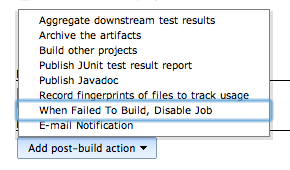

[[DisableFailedJobPlugin-Description]]
== Description

This Plugin disables a Job when a Build fails.

Please use this when you want to prevent the jobs that are regularly
performed, fail in a row.

 

ビルドが失敗した時に、ジョブを無効にするプラグインです。

定期実行されてるジョブが、続けて失敗することを防ぐ時などに利用して下さい。

[[DisableFailedJobPlugin-Usage]]
== Usage

[[DisableFailedJobPlugin-1.Select"WhenFailedToBuild,DisableJob"in"Addpost-buildaction".]]
=== 1. Select "When Failed To Build, Disable Job" in "Add post-build action".

[.confluence-embedded-file-wrapper]##

[[DisableFailedJobPlugin-2.SelectcaseyoudisableJob.]]
=== 2. Select case you disable Job.

[.confluence-embedded-file-wrapper]##

[.confluence-embedded-file-wrapper]##

[[DisableFailedJobPlugin-3.Whenitbecameselectedcases,Jobisdisabled.]]
=== 3. When it became selected cases, Job is disabled.

[.confluence-embedded-file-wrapper]##

[[DisableFailedJobPlugin-Advanced]]
== Advanced

[[DisableFailedJobPlugin-setoptiontomakedisablingofjobsconditional]]
=== set option to make disabling of jobs conditional

[[DisableFailedJobPlugin-1.Select"Advanced...".]]
==== 1. Select "Advanced...".

[.confluence-embedded-file-wrapper]##

[[DisableFailedJobPlugin-2.Check"DisablejobifitthelastXbuildshavefailed"andwrite"NumberOfConsecutiveFailures"]]
==== 2. Check "Disable job if it the last X builds have failed" and write "Number Of Consecutive Failures"

[.confluence-embedded-file-wrapper]##

[[DisableFailedJobPlugin-Versionhistory]]
== Version history

[width="100%",cols="34%,33%,33%",options="header",]
|===
|version |information |date
|1.15 |Add global configuration
(https://github.com/jenkinsci/disable-failed-job-plugin/pull/1[PullRequest#1])
|2015/03/22

|1.11 |Add option to make disabling of jobs
conditional(https://issues.jenkins-ci.org/browse/JENKINS-20372[JENKINS-20372]) +
Bug FIx + |2014/05/16

|1.5 |Bug Fix |2013/10/12

|1.3 |Initial release |2013/10/09
|===
