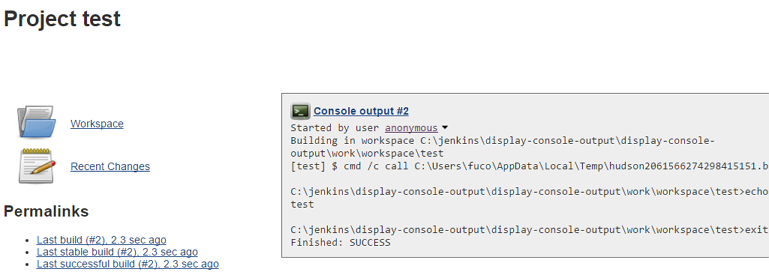

 

 

This plugin a[.conf-macro .output-inline]##dds console output of the
last build to the project page.##

 +

Check https://issues.jenkins-ci.org/issues/?jql=component%20%3D%20display-console-output-plugin[issue
tracker] for current open bugs with this plugin.

[[refresh-module--1783318853]]
[[refresh--1783318853]][[jira-issues--1783318853]]
Key

Summary

T

Created

Updated

Due

P

Status

Resolution

[.refresh-action-group]# #

[[refresh-issues-loading--1783318853]]
[.aui-icon .aui-icon-wait]#Loading...#

[#refresh-issues-button--1783318853]##
[#refresh-issues-link--1783318853]#Refresh#
[#error-message--1783318853 .error-message .hidden]# #

[.confluence-embedded-file-wrapper]##
