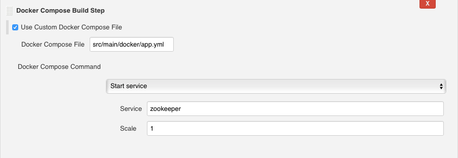
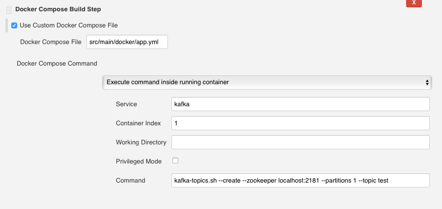
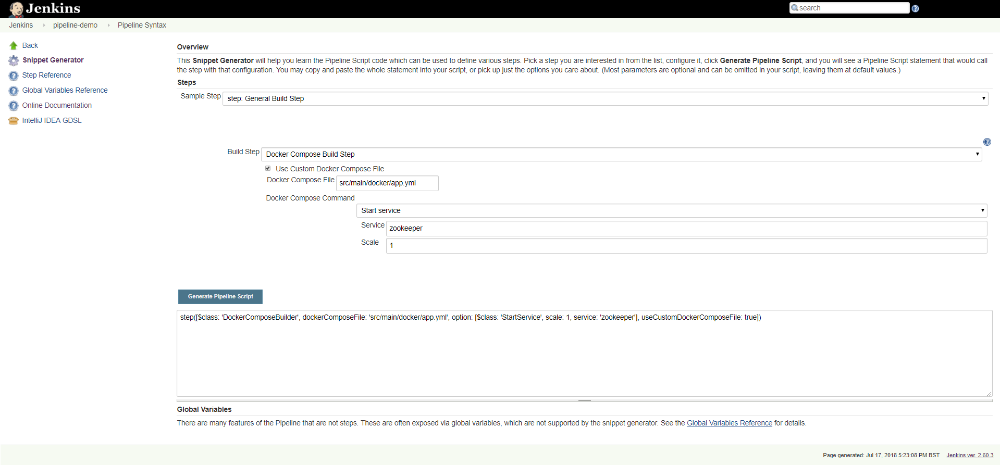

[.confluence-embedded-file-wrapper .confluence-embedded-manual-size]##

The Docker Compose Build Step plugin allows the user to run
docker-compose commands as build steps.

For more information about Docker Compose, please check the
https://docs.docker.com/compose/[Docker Documentation].

 +

[[DockerComposeBuildStepPlugin-Changelog]]
== Changelog

[[DockerComposeBuildStepPlugin-Version1.0(July122018)]]
==== Version 1.0 (July 12 2018)

* Initial version - freestyle job support

[[DockerComposeBuildStepPlugin-Features]]
=== Features

[[DockerComposeBuildStepPlugin-UseCustomDockerComposeFile]]
== *Use Custom Docker Compose File*

The *Use Custom Docker Compose File* option is available on all Docker
Compose build steps and is used to select a compose file other than the
default ($WORKSPACE/docker-compose.yml). This option supports both
absolute and relative paths.

[[DockerComposeBuildStepPlugin-Start/StopServices]]
== Start/Stop Services

In the case of the *Start service* step, use the *Scale* option to spin
up more than one running instance of a service.

[.confluence-embedded-file-wrapper .confluence-embedded-manual-size]##

[[DockerComposeBuildStepPlugin-ExecuteCommandInsideRunningContainer]]
== Execute Command Inside Running Container

Use the *Container Index* option to select the instance where you want
to run the command.

If the *Working Directory* is left empty, the plugin will use the
default one for the container.

[.confluence-embedded-file-wrapper .confluence-embedded-manual-size]##

[[DockerComposeBuildStepPlugin-PipelineSupport]]
== Pipeline Support

Use the
https://jenkins.io/doc/book/pipeline/getting-started/#snippet-generator[Snippet
Generator] to generate a Docker Compose Build step "metastep" for a
scripted pipeline.

[.confluence-embedded-file-wrapper .confluence-embedded-manual-size]##

 
