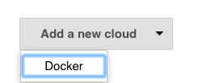
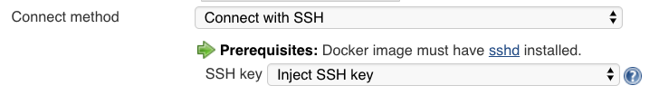

[.conf-macro .output-inline]##

[cols="",options="header",]
|===
|Plugin Information
|View Docker https://plugins.jenkins.io/docker-plugin[on the plugin
site] for more information.
|===

[.aui-icon .aui-icon-small .aui-iconfont-info .confluence-information-macro-icon]##

Older versions of this plugin may not be safe to use. Please review the
following warnings before using an older version:

* https://jenkins.io/security/advisory/2019-07-11/#SECURITY-1400[Users
with Overall/Read access could enumerate credential IDs]
* https://jenkins.io/security/advisory/2019-07-11/#SECURITY-1010[CSRF
vulnerability and missing permission check allowed capturing
credentials]

[.conf-macro .output-inline]#This plugin allows slaves to be dynamically
provisioned using http://www.docker.io/[Docker].#

[[DockerPlugin-Background]]
== Background

Docker plugin allows to use a docker host to dynamically provision build
agents, run a single build, then tear-down agent.

Optionally, the container can be committed, so that (for example) manual
QA could be performed by the container being imported into a local
docker provider, and run from there.

[[DockerPlugin-Setup]]
== Setup

A quick setup is :

- get a docker environment running

- follow the instructions for creating a docker image that can be used
as a Jenkins Agent

[[DockerPlugin-DockerEnvironment]]
=== Docker Environment

Follow the installation steps on docker.io.

If your host needs to allow connections from a jenkins instance hosted
on a different machine, you will need to open up the TCP port. This can
be achieved by editing the docker config file and setting (for example)

[source,syntaxhighlighter-pre]
----
DOCKER_OPTS="-H tcp://0.0.0.0:2376 -H unix:///var/run/docker.sock"
----

The docker configuration file location will depend your system, but it
is likely to be /etc/init/docker.conf, /etc/default/docker
or /etc/default/docker.io)

[[DockerPlugin-MultipleDockerHosts]]
=== Multiple Docker Hosts

If you want to use more than just a physical node to run containers, you
can rely on https://github.com/docker/swarm[Docker Swarm Standalone] -
docker engine swarm mode isn't yet supported.

Follow docker swarm standalone instruction and configure docker swarm
API endpoint in Jenkins.

 +

[[DockerPlugin-JenkinsConfiguration]]
=== Jenkins Configuration

Docker plugin is a "Cloud" implementation. You'll need to edit Jenkins
system configuration (Jenkins > Manage > System configuraiton) and add a
new Cloud of type "Docker".

[.confluence-embedded-file-wrapper]##

 +

Configure Docker (or Swarm standalone) API URL with required
credentials. A test button let you connection with API is well set.

Then configure Agent templates, assigning them labels you can use for
your jobs to select the adequate template, and docker container to run

[[DockerPlugin-Creatingadockerimage]]
=== Creating a docker image

You need a docker image that can be used to run Jenkins agent runtime.
Depending on the launch method you select, there's some prerequisites
for the Docker image to be used :

[[DockerPlugin-LaunchviaSSH]]
==== Launch via SSH

* https://linux.die.net/man/8/sshd[sshd] server and a JDK installed. You
can just
use https://hub.docker.com/r/jenkins/ssh-slave/[jenkins/ssh-slave] as a
basis for a custom image.
* a SSH key (based on unique Jenkins master instance identity) can be
injected in container on startup, you don't need any credential set as
long as you use standard openssl sshd.  +
[.confluence-embedded-file-wrapper]## +
For backward compatibility _or_ non-standard sshd packaged in your
docker image, you also have option to provide manually configured ssh
credentials

[[DockerPlugin-LaunchviaJNLP]]
==== Launch via JNLP

* a JDK installed. You can just
use https://hub.docker.com/r/jenkins/jnlp-slave/[jenkins/jnlp-slave] as
a basis for a custom image.
* Jenkins master URL has to be reachable from container.
* container will be configured automatically with agent's name and
secret, so you don't need any special configuration of the container

[[DockerPlugin-Launchattached]]
==== Launch attached

* a JDK installed. You can just
use https://hub.docker.com/r/jenkins/slave/[jenkins/slave] as a basis
for a custom image. 
* Please note this mode is *experimental* at time writing.

 +

To create a custom image and bundle your favorite tools, just create a
Dockerfile with FROM to point to one of the jenkins/*-slave reference
image, and install everything needed for your own usage

....
 
....

*Dockerfile*

[source,syntaxhighlighter-pre]
----
FROM jenkins/ssh-slave
RUN apt-get update && apt-get install XXX
COPY your-favorite-tool-here
----

 +

[[DockerPlugin-NoteonENTRYPOINT]]
==== Note on ENTRYPOINT

Avoid overriding the docker command, as SSH Launcher relies on it.

You can use an Entrypoint to run some side service inside your build
agent container before the agent runtime starts and establish a
connexion. Just ensure your entrypoint eventually run the passed command
:

....
exec "$@"
....

[[DockerPlugin-ConfigurepluginviaGroovyscript]]
== Configure plugin via Groovy script

Either automatically
upon https://wiki.jenkins.io/display/JENKINS/Post-initialization+script[Jenkins
post-initialization] or
through https://wiki.jenkins.io/display/JENKINS/Jenkins+Script+Console[Jenkins
script console]. Example running locally, connecting to Docker service
through unix///var/run/docker.sock and launching attached:

[source,syntaxhighlighter-pre]
----
import com.nirima.jenkins.plugins.docker.DockerCloud
import com.nirima.jenkins.plugins.docker.DockerTemplate
import com.nirima.jenkins.plugins.docker.DockerTemplateBase
import com.nirima.jenkins.plugins.docker.launcher.AttachedDockerComputerLauncher
import io.jenkins.docker.connector.DockerComputerAttachConnector
import jenkins.model.Jenkins

// parameters
def dockerTemplateBaseParameters = [
  bindAllPorts:       false,
  bindPorts:          '',
  cpuShares:          null,
  dnsString:          '',
  dockerCommand:      '',
  environmentsString: '',
  extraHostsString:   '',
  hostname:           '',
  image:              'jenkinsci/slave:latest',
  macAddress:         '',
  memoryLimit:        null,
  memorySwap:         null,
  network:            '',
  privileged:         false,
  pullCredentialsId:  '',
  sharedMemorySize:   null,
  tty:                true,
  volumesFromString:  '',
  volumesString:      ''
]

def DockerTemplateParameters = [
  instanceCapStr: '4',
  labelString:    'docker.local.jenkins.slave',
  remoteFs:       ''
]

def dockerCloudParameters = [
  connectTimeout:   3,
  containerCapStr:  '4',
  credentialsId:    '',
  dockerHostname:   '',
  name:             'docker.local',
  readTimeout:      60,
  serverUrl:        'unix:///var/run/docker.sock',
  version:          ''
]

// https://github.com/jenkinsci/docker-plugin/blob/docker-plugin-1.1.2/src/main/java/com/nirima/jenkins/plugins/docker/DockerTemplateBase.java
DockerTemplateBase dockerTemplateBase = new DockerTemplateBase(
  dockerTemplateBaseParameters.image,
  dockerTemplateBaseParameters.pullCredentialsId,
  dockerTemplateBaseParameters.dnsString,
  dockerTemplateBaseParameters.network,
  dockerTemplateBaseParameters.dockerCommand,
  dockerTemplateBaseParameters.volumesString,
  dockerTemplateBaseParameters.volumesFromString,
  dockerTemplateBaseParameters.environmentsString,
  dockerTemplateBaseParameters.hostname,
  dockerTemplateBaseParameters.memoryLimit,
  dockerTemplateBaseParameters.memorySwap,
  dockerTemplateBaseParameters.cpuShares,
  dockerTemplateBaseParameters.sharedMemorySize,
  dockerTemplateBaseParameters.bindPorts,
  dockerTemplateBaseParameters.bindAllPorts,
  dockerTemplateBaseParameters.privileged,
  dockerTemplateBaseParameters.tty,
  dockerTemplateBaseParameters.macAddress,
  dockerTemplateBaseParameters.extraHostsString
)

// https://github.com/jenkinsci/docker-plugin/blob/docker-plugin-1.1.2/src/main/java/com/nirima/jenkins/plugins/docker/DockerTemplate.java
DockerTemplate dockerTemplate = new DockerTemplate(
  dockerTemplateBase,
  new DockerComputerAttachConnector(),
  DockerTemplateParameters.labelString,
  DockerTemplateParameters.remoteFs,
  DockerTemplateParameters.instanceCapStr
)

// https://github.com/jenkinsci/docker-plugin/blob/docker-plugin-1.1.2/src/main/java/com/nirima/jenkins/plugins/docker/DockerCloud.java
DockerCloud dockerCloud = new DockerCloud(
  dockerCloudParameters.name,
  [dockerTemplate],
  dockerCloudParameters.serverUrl,
  dockerCloudParameters.containerCapStr,
  dockerCloudParameters.connectTimeout,
  dockerCloudParameters.readTimeout,
  dockerCloudParameters.credentialsId,
  dockerCloudParameters.version,
  dockerCloudParameters.dockerHostname
)

// get Jenkins instance
Jenkins jenkins = Jenkins.getInstance()

// add cloud configuration to Jenkins
jenkins.clouds.add(dockerCloud)

// save current Jenkins state to disk
jenkins.save()
----

https://github.com/jenkinsci/docker-plugin/blob/master/CHANGELOG.md[Changelog]

See https://github.com/jenkinsci/docker-plugin/blob/master/CHANGELOG.md
