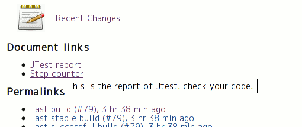

[[DocLinksPlugin-Whatdoesthisdo?]]
== What does this do?

This plugin allows you to publish your documents that are created in the
build steps as links on the project page.

[.confluence-embedded-file-wrapper]##

[[DocLinksPlugin-Configuration]]
== Configuration

[[DocLinksPlugin-Projectconfiguration]]
=== Project configuration

[[DocLinksPlugin-FreeStyleproject]]
==== FreeStyle project

[.confluence-embedded-file-wrapper]#image:docs/images/config.png[image]#

[[DocLinksPlugin-M2project]]
==== M2 project

If your project is M2 style, then you have to configure each modules.
You can see the links on the module pages, not project page.

[[DocLinksPlugin-History]]
== History

[[DocLinksPlugin-Version0.6.1(Mar5,2016)]]
=== Version 0.6.1 (Mar 5, 2016)

* FIXED: problems when disabling / uninstalling maven-plugin
(https://issues.jenkins-ci.org/browse/JENKINS-30766[JENKINS-30766])

[[DocLinksPlugin-Version0.6(Sep28,2013)]]
=== Version 0.6 (Sep 28, 2013)

* added a feature to publish artifacts as documents
(https://issues.jenkins-ci.org/browse/JENKINS-19456[JENKINS-19456])

[[DocLinksPlugin-Version0.5(Oct19,2011)]]
=== Version 0.5 (Oct 19, 2011)

* Added German I18N

[[DocLinksPlugin-Version0.4(Sat15,2011)]]
=== Version 0.4 (Sat 15, 2011)

* Added "archive recursively" option.
(https://issues.jenkins-ci.org/browse/JENKINS-8507[JENKINS-8507])

[[DocLinksPlugin-Version0.3(Feb15,2010)]]
=== Version 0.3 (Feb 15, 2010)

* Update code for more recent Hudson.

[[DocLinksPlugin-Version0.2.2(Jul25,2009)]]
=== Version 0.2.2 (Jul 25, 2009)

* Check if user has Job.CONFIGURE, not ADMINISTER when configuring
project.

[[DocLinksPlugin-Version0.2.1(Jul20,2009)]]
=== Version 0.2.1 (Jul 20, 2009)

* Replaced deprecated classes.
* Fixed a bit.

[[DocLinksPlugin-Version0.2(Jul19,2009)]]
=== Version 0.2 (Jul 19, 2009)

* Supported M2 project.

[[DocLinksPlugin-Version0.1(Jul11,2009)]]
=== Version 0.1 (Jul 11, 2009)

* First release.
