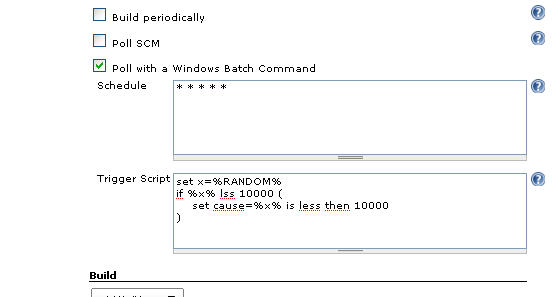

This plugin allows to trigger a build with a DOS script.

[[DOSTrigger-Description]]
== Description

The script will run according to the schedule you enter. +
When the script sets the *_cause_* variable to something other than the
empty string a build will be started (with the given 'cause').

*Caution*: This plugin always uses the default workspace, even if a
custom workspace was defined.

[[DOSTrigger-ScreenShot]]
== Screen Shot

[cols="",]
|===
|[.confluence-embedded-file-wrapper .image-left-wrapper]##
|===

~After making this example I discovered that the DOS %RANDOM% construct
is far from random, don't use it at home~
image:docs/images/wink.svg[(wink)]

[[DOSTrigger-ChangeLog]]
== Change Log

[[DOSTrigger-V1.23@08-20-2011]]
=== V1.23 @ 08-20-2011

* Fix help link
* Internal restructuring

[[DOSTrigger-V1.21@06-02-2011]]
=== V1.21 @ 06-02-2011

...

[[DOSTrigger-V1.0@08-01-2010]]
=== V1.0 @ 08-01-2010

* Initial release

[[DOSTrigger-Author]]
== Author

Tom Brus
