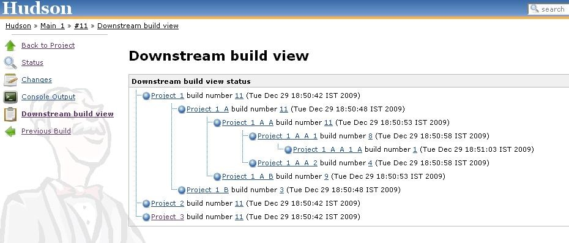

[.conf-macro .output-inline]# #

[.aui-icon .aui-icon-small .aui-iconfont-warning .confluence-information-macro-icon]##

*This plugin is up for adoption.* Want to help improve this plugin?
https://wiki.jenkins-ci.org/display/JENKINS/Adopt+a+Plugin[Click here to
learn more]!

This plugin allows you to view the full status all the downstream builds
so that we can graphically see that everything for this build has been
completed successfully.

[[Downstreambuildviewplugin-Screen]]
== *Screen*

[.confluence-embedded-file-wrapper .image-center-wrapper]##

[[Downstreambuildviewplugin-Changelog]]
== Changelog

[[Downstreambuildviewplugin-Version1.9(Dec172013)]]
=== Version 1.9 (Dec 17 2013)

* https://issues.jenkins-ci.org/browse/JENKINS-9263[JENKINS-9263] add
link to upstream build when downstream build is started instead of
completed
* NPE when launching a downstream build from a promotion action
* avoid serializing build references; can cause errors in newer versions
of Jenkins
* broken icon when using a context path
* https://issues.jenkins-ci.org/browse/JENKINS-17837[JENKINS-17837] fix
major performance issue for jobs with many builds
* hide link unless there are actually some downstream builds to display

[[Downstreambuildviewplugin-Version1.8(Aug022012)]]
=== *Version 1.8 (Aug 02 2012)*

* Compatibility with CloudBees folder plugin
(https://issues.jenkins-ci.org/browse/JENKINS-14669[JENKINS-14669])
* Excessive logging
(https://issues.jenkins-ci.org/browse/JENKINS-7782[JENKINS-7782])

[[Downstreambuildviewplugin-Version1.7(2ndApril2012)]]
=== *Version 1.7 (2nd April 2012)*

* Projects triggered by "Parameterized Build Plugin" do not show in view
with "Downstream-buildview"
(https://issues.jenkins-ci.org/browse/JENKINS-5761[JENKINS-5761])

[[Downstreambuildviewplugin-Version1.6]]
=== *Version 1.6*

* Prevent ConcurrentModificationException
(https://issues.jenkins-ci.org/browse/JENKINS-6644[JENKINS-6644])
* Downstream build view is empty
(https://issues.jenkins-ci.org/browse/JENKINS-7480[JENKINS-7480])

[[Downstreambuildviewplugin-Version1.5]]
=== *Version 1.5*

* Fixed an NPE
(https://issues.jenkins-ci.org/browse/JENKINS-7691[JENKINS-7691])

[[Downstreambuildviewplugin-Version1.4]]
=== *Version 1.4*

* Fixed irregularities with build numbers by persisting the build number
after the actual build starts

[[Downstreambuildviewplugin-Version1.3]]
=== *Version 1.3*

* Fixed broken image path .

[[Downstreambuildviewplugin-Version1.2]]
=== *Version 1.2*

* Added logic to persist information about the downstream builds.

[[Downstreambuildviewplugin-Version1.1]]
=== *Version 1.1*

* Added TransientProjectAction, so the plug-in will be available for all
the projects with out any configuration.

[[Downstreambuildviewplugin-Version1.0]]
=== *Version 1.0*

* Initial version
