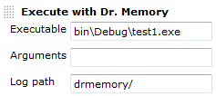

[[drmemoryplugin-Developedby]]
===== Developed by

[.confluence-embedded-file-wrapper]#image:docs/images/praqmalogo.png[image]#

[[drmemoryplugin-Sponsoredby]]
===== Sponsored by

[.confluence-embedded-file-wrapper]##

 This plugin can monitor memory related programming errors using the
http://www.drmemory.org/[Dr. Memory] application. 

[[drmemoryplugin-Setup]]
== Setup

This plugin is divided into two sections:

. A build step
. A post build step

[[drmemoryplugin-Buildstep]]
=== Build step

First a build step must be set up, providing information about the
executable to be executed with Dr. Memory. This path is relative to the
Jenkins workspace. This can, for example, be some output executable from
a previous build step.

[.confluence-embedded-file-wrapper]## +
Secondly, arguments of the executable can be provided. The log path is
where Dr. Memory puts its log files, needed by the post build step.

[[drmemoryplugin-Postbuildstep]]
=== Post build step

In the post build step, the processing of the Dr. Memory log files are
processed.

It is also possible to enable graphs, visualizing the progress.

Currently graphs visualizing

* Total leaks
* Possible leaks
* Bytes of leak
* Uninitialized accesses
* Invalid heap arguments
* Warnings
* Still reachable allocations
* Unaddressable accesses

are available.

[[drmemoryplugin-Issues]]
== Issues

type

key

summary

[.icon-in-pdf]# # Data cannot be retrieved due to an unexpected error.

http://issues.jenkins-ci.org/secure/IssueNavigator.jspa?reset=true&jqlQuery=project%20=%20JENKINS%20AND%20status%20in%20%28Open,%20%22In%20Progress%22,%20Reopened%29%20AND%20component%20=%20%27drmemory%27&src=confmacro[View
these issues in Jira]

[[drmemoryplugin-Changes]]
== Changes

[[drmemoryplugin-1.5(Jun,2018)]]
=== 1.5(Jun, 2018)

* Fixed JEP-200 compatibility issues

[[drmemoryplugin-1.4(Jul,2015)]]
=== 1.4(Jul, 2015)

* Added support for JobDSL

[[drmemoryplugin-1.3(Jul,2014)]]
=== 1.3(Jul, 2014)

* Changed maintainer.

[[drmemoryplugin-1.2(Jan7,2014)]]
=== 1.2(Jan 7, 2014)

* Fixed issue with invisible graph list
(https://issues.jenkins-ci.org/browse/JENKINS-17464[JENKINS-17464])
* Publisher would not work without Builder -> now you can specify a
result path in the publisher
* Multiple Builders could be added but not published
* Concatenating multiple result files to single result
* Fixed the platform specific separator fix
* Fixed one wrong reference to a help page
* Minor code cleanups

[[drmemoryplugin-1.1(Nov27,2013)]]
=== 1.1(Nov 27, 2013)

* Implemented option to allow dr-memory to continue even when dr-memory
returns a non-zero exit code
(https://issues.jenkins-ci.org/browse/JENKINS-20222[JENKINS-20222])

[[drmemoryplugin-1.0(Nov5,2013)]]
=== 1.0(Nov 5, 2013)

* Allowing for spaces in log directory
(https://issues.jenkins-ci.org/browse/JENKINS-20141[JENKINS-20141])

[[drmemoryplugin-0.1.1(Feb25,2012)]]
=== 0.1.1(Feb 25, 2012)

* Initial version
