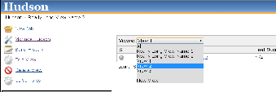

[[DropDownViewsTabBarPlugin-DropDownViewsTabBarPlugin]]
== DropDown ViewsTabBar Plugin

This plugin provides an alternate rendering of the Views bar which runs
along the top of all views. This plugin is useful for instances which
have a very large number of views and want a compact
rendering.[.confluence-embedded-file-wrapper]## +
[.confluence-embedded-file-wrapper]##

To use the DropDown ViewsTabBar go to *Manage Jenkins* > *Configure
System*, select it in the *Views Tab Bar* drop down box and save the
configuration.

[.aui-icon .aui-icon-small .aui-iconfont-error .confluence-information-macro-icon]#
#

Some users report performance problems with this plugin enabled under
the following conditions: Nested Views Plugin enabled, many Views
created, those Views use complex regex in order to filter jobs, and this
plugin configured to show job counts (configurable in System
Configuration page).

 +
 +

'''''

 

[[DropDownViewsTabBarPlugin-Changelog]]
=== Changelog

[[DropDownViewsTabBarPlugin-1.7(released2015-10-16)]]
==== 1.7 (released 2015-10-16)

* Added possibility to filter empty views in dropdown list
* Fixed job counts display
* Changed minimal Jenkins version to 1.546

[[DropDownViewsTabBarPlugin-1.6(released2012-07-22)]]
==== 1.6 (released 2012-07-22)

* Fixed
https://issues.jenkins-ci.org/browse/JENKINS-13114[JENKINS-13114] -
dropdown views taskbar: error when saving jenkins config page

[[DropDownViewsTabBarPlugin-1.5(released2012-04-27)]]
==== 1.5 (released 2012-04-27)

* Fixed
https://issues.jenkins-ci.org/browse/JENKINS-13048[JENKINS-13048]
dropdown-viewstabbar: cannot save checkbox 'Show Job Counts'

[[DropDownViewsTabBarPlugin-1.4(released2011-08-16)]]
==== 1.4 (released 2011-08-16)

* Fixed
http://issues.jenkins-ci.org/browse/JENKINS-10640[JENKINS-10640],
compatibility release for Jenkins 1.425 .. new code in that release
changed a lot of existing behavior, and we're still playing catch up.
There are some other problems with this Jenkins release that will be
addressed in future releases.

[[DropDownViewsTabBarPlugin-1.3(released2011-06-22)]]
==== 1.3 (released 2011-06-22)

* Fixed
http://issues.jenkins-ci.org/browse/JENKINS-10072[JENKINS-10072], Add
option for disabling the count in the dropdown tab name

[[DropDownViewsTabBarPlugin-1.2(released2011-06-15)]]
==== 1.2 (released 2011-06-15)

* Show total jobs in each view (thank you fredg02)
** e.g. View Name (18)

[[DropDownViewsTabBarPlugin-1.1(released2011-02-23)]]
==== 1.1 (released 2011-02-23)

* Fixed http://issues.jenkins-ci.org/browse/JENKINS-8861[JENKINS-8861]
* Reassigned
http://issues.jenkins-ci.org/browse/JENKINS-8860[JENKINS-8860]
* Closed http://issues.jenkins-ci.org/browse/JENKINS-8859[JENKINS-8859]

[[DropDownViewsTabBarPlugin-1.0(released2011-01-20)]]
==== 1.0 (released 2011-01-20)

* fully I18N
* initial implementation
