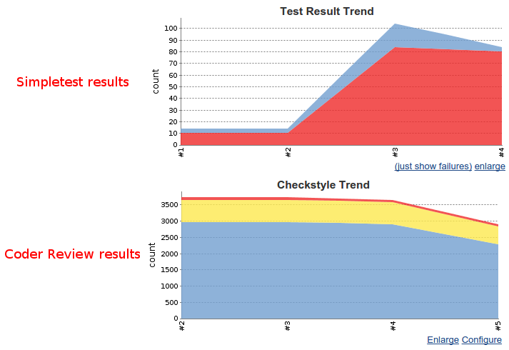
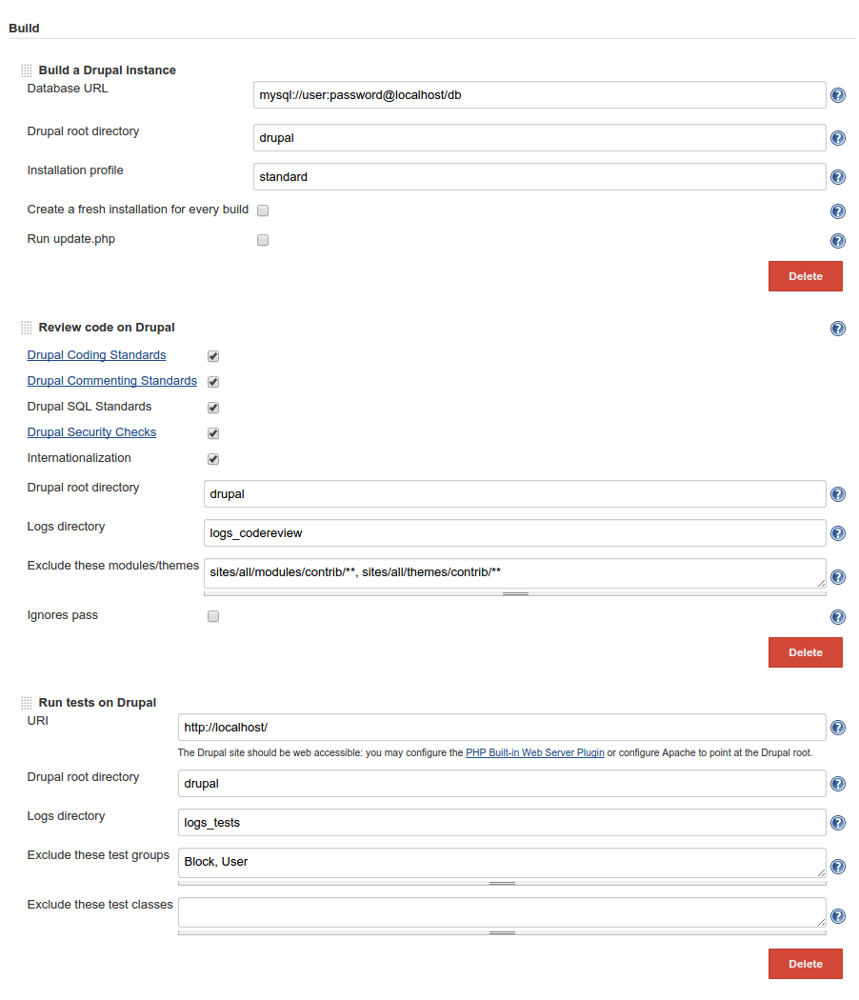

 +

A plugin to review code and run tests on Drupal.

[[DrupalDeveloperPlugin-Screenshots]]
== Screenshots

[[DrupalDeveloperPlugin-Plotingresults]]
=== Ploting results

[.confluence-embedded-file-wrapper]##

[[DrupalDeveloperPlugin-Administrationinterface]]
=== Administration interface

[.confluence-embedded-file-wrapper]##

[[DrupalDeveloperPlugin-Quickstart]]
== Quick start

* Install http://docs.drush.org/en/master/install/[drush 7+] globally or
configure the path to Drush on `+http://<jenkins-server>/configure+`
* Install
https://wiki.jenkins-ci.org/display/JENKINS/Checkstyle+Plugin[Checkstyle],
https://wiki.jenkins-ci.org/display/JENKINS/JUnit+Plugin[JUnit] and
https://wiki.jenkins-ci.org/display/JENKINS/PHP+Built-in+Web+Server+Plugin[PHP
Built-in Web Server]
* Create a local database: `+CREATE DATABASE db;+`
* Create a Freestyle project that looks like
https://github.com/jenkinsci/drupal-developer-plugin/blob/master/img/config.png[this],
or create a Drupal project
* Under 'Build a Drupal instance', update the database URL

[[DrupalDeveloperPlugin-Usage]]
== Usage

[[DrupalDeveloperPlugin-1.CreateLocalDatabase]]
=== 1. Create Local Database

* `+CREATE DATABASE db;+`

[[DrupalDeveloperPlugin-2.Installdrush7+]]
=== 2. Install drush 7+

* `+git clone+` `+https://github.com/drush-ops/drush.git+`
`+/var/lib/jenkins/tools/drush+`
* `+cd /var/lib/jenkins/tools/drush+`
* `+git checkout tags/7.0.0-rc2+`
* `+curl -sSL+` `+https://getcomposer.org/installer+` `+| php+`
* `+php composer.phar install+`
* Go to `+http://<jenkins-server>/configure+`
* Under 'Drush installations', set 'Path to Drush home' to
`+/var/lib/jenkins/tools/drush+`

[[DrupalDeveloperPlugin-3.Createproject]]
=== 3. Create project

Create a new 'Freestyle' project.

Alternatively you may create a 'Drupal' project which generates a
ready-to-use job to review code and run tests on a vanilla Drupal core.
If you use this option then you may skip most of the instrutions below:
just update the database URL and possibly set up a web server.

[[DrupalDeveloperPlugin-4.ConfigureSourceCodeManagement]]
=== 4. Configure Source Code Management

Configure the Source Code Management section to fetch a full Drupal code
base. Here are a few options:

. If you just want to run tests on a Drupal core, you may use
https://wiki.jenkins-ci.org/display/JENKINS/Git+Plugin[Git]:
* Repository: `+http://git.drupal.org/project/drupal.git+`
* Branch Specifier: `+tags/7.38+`
. If your own code repository includes a Drupal core, then just pull it
. If it does not, then you may combine your own repo with the drupal.org
repo using
https://wiki.jenkins-ci.org/display/JENKINS/Multiple+SCMs+Plugin[Multiple
SCMs]
. Alternatively you may use a Drush Makefile source

By default Jenkins pulls code into the workspace root but you might want
to put Drupal into a subdirectory to keep things clean (e.g.
`+$WORKSPACE/drupal+`):

* If using https://wiki.jenkins-ci.org/display/JENKINS/Git+Plugin[Git]:
set option 'Additional Behaviours / Check out to a sub-directory' to
`+drupal+`
* If using
https://wiki.jenkins-ci.org/display/JENKINS/Subversion+Plugin[Subversion]:
set option 'Local module directory' to `+drupal+`
* If using a Drush Makefile: set option 'Drupal root directory' to
`+drupal+`

Note that a Drush Makefile source will fetch the code every time a new
build runs. Using a regular source like Git or Subversion is probably
more efficient.

Also only Drupal 7 code is supported.

[[DrupalDeveloperPlugin-5.ConfigureLocalWebServer]]
=== 5. Configure Local Web Server

Some tests fail if Drupal does not run behind a web server. Here are a
couple of solutions:

* Either install
https://wiki.jenkins-ci.org/display/JENKINS/PHP+Built-in+Web+Server+Plugin[PHP
Built-in Web Server] (requires PHP >= 5.4.0) e.g.:
** Port: `+8000+`
** Host: `+localhost+`
** Document root: `+drupal+` (or leave empty if the Drupal root is the
workspace root)
* Or install Apache locally and make it point at the Drupal root (e.g.
`+/var/lib/jenkins/jobs/myproject/workspace/drupal+`)

[[DrupalDeveloperPlugin-6.ConfigureBuilds]]
=== 6. Configure Builds

Add build steps:

* 'Build a Drupal instance'
* 'Review code on Drupal'
* 'Run tests on Drupal'

The default values should work though you need to update a few things:

* Update the database URL in step 'Build a Drupal instance' to point at
your database
* If you have checked out Drupal into a subdirectory (e.g. `+drupal+`)
then update the Drupal root directory of every step accordingly ;
otherwise, just leave it empty
* The URI of step Run tests on Drupal should match what you have
configured on your webserver (e.g. `+http://localhost:8000+`)

Note that if your code base does not include a copy of the Coder module,
then step Review code on Drupal will automatically download it into
`+$DRUPAL/modules/+`.

[[DrupalDeveloperPlugin-7.Plotresults]]
=== 7. Plot results

Plot Code Review results using
https://wiki.jenkins-ci.org/display/JENKINS/Checkstyle+Plugin[Checkstyle]:

* Create a post-build action 'Publish Checkstyle analysis results'
* If the logs directory for the code review is `+logs_codereview+` then
set 'Checkstyle results' to `+logs_codereview/**+`
* You might want to set the unstable threshold to 0 normal warning, and
the failed threshold to 0 high warning

Plot Test results using
https://wiki.jenkins-ci.org/display/JENKINS/JUnit+Plugin[JUnit]:

* Create a post-build action 'Publish JUnit test result report'
* If the logs directory for the tests is `+logs_tests+` then set 'Test
report XMLs' to `+logs_tests/**+`

[[DrupalDeveloperPlugin-8.BuildtheProject]]
=== 8. Build the Project

* Click on 'Build Now': Jenkins should start reviewing and testing the
code base
* After a few builds complete, trend graphs should show up

[[DrupalDeveloperPlugin-Dependencies]]
== Dependencies

* http://www.drush.org/en/master/install/[drush 7+]
* https://wiki.jenkins-ci.org/display/JENKINS/SCM+API+Plugin[SCM API]
* https://wiki.jenkins-ci.org/display/JENKINS/Checkstyle+Plugin[Checkstyle],
https://wiki.jenkins-ci.org/display/JENKINS/JUnit+Plugin[JUnit] and
https://wiki.jenkins-ci.org/display/JENKINS/PHP+Built-in+Web+Server+Plugin[PHP
Built-in Web Server] (or Apache) are not required but are relevant

[[DrupalDeveloperPlugin-ChangeLog]]
== Change Log

[[DrupalDeveloperPlugin-0.8(release2016-08-12)]]
=== 0.8 (release 2016-08-12)

* JENKINS-35544 Fix NPE when module has no version.

[[DrupalDeveloperPlugin-0.6(release2015-09-05)]]
=== 0.6 (release 2015-09-05)

* Initial release
