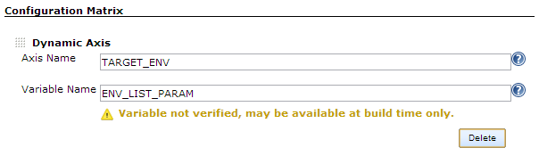

This plugin allows you to define a matrix build axis that is dynamically
populated from an environment variable:

 +
[.confluence-embedded-file-wrapper]##

[[DynamicAxisPlugin-Description]]
== Description

Environment variables can be contributed to a build from a number of
places, including:

* Build parameters
* Build node configuration
* Jenkins configuration
* System environment

When specifying a variable for an axis only the last category of
variables can be validated. This is because Jenkins contributes the
other types of variables only at actual build time, thus they are not
available at configuration time.

Configuring an axis is otherwise the same as for the User-defined axis
option: specify an axis name to be used in your build along with the
name of the environment variable to dynamically retrieve the axis values
from. The rules for the value of this variable are the same: one or more
values separated by a space.

[[DynamicAxisPlugin-Examples]]
== Examples

Some portable environment variable names include:

* AXES
* PARAM_LIST
* 4_BUILD_CONFIG

The following are all valid values for the contents of the environment
variable selected for an axis:

* dev tst sit
* jdk6 jdk7
* deploy_srv1 deploy_srv2 deploy_srv3

[[DynamicAxisPlugin-Acknowledgements]]
== Acknowledgements

Many thanks to Emanuele Zattin for leading the way with the Groovy
Axis plugin. And of course to Koshuke, for continuing to expand and
improve this excellent platform.

[[DynamicAxisPlugin-ChangeLog]]
== Change Log

[[DynamicAxisPlugin-Version1.0.3(7December2014)]]
=== Version 1.0.3 (7 December 2014)

* image:docs/images/error.svg[(error)]
Properly tokenize axis values when the input variable contains quotes
(https://issues.jenkins-ci.org/browse/JENKINS-25660[JENKINS-25660])
* image:docs/images/error.svg[(error)]
Prevent ConcurrentModificationException on massive matrix runs
(https://issues.jenkins-ci.org/browse/JENKINS-22652[JENKINS-22652])

[[DynamicAxisPlugin-Version1.0.2(29October2012)]]
=== Version 1.0.2 (29 October 2012)

* Added fix for synchronization issues, contributed by Nathan Grunzweig

[[DynamicAxisPlugin-Version1.0.1(13November2012)]]
=== Version 1.0.1 (13 November 2012)

* Initial release
