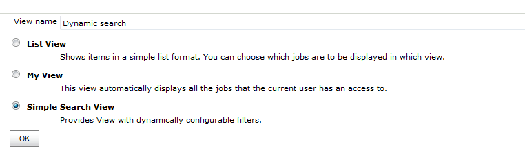
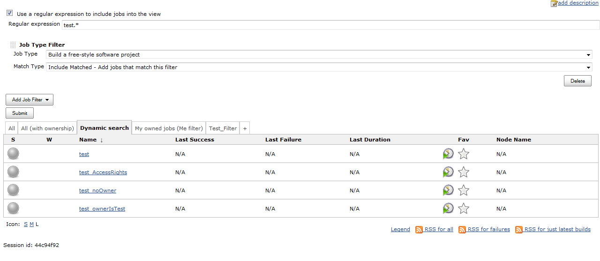

Adds a new list view, which allows to dynamically specify additional
filters.[.conf-macro .output-inline]##

[cols="",options="header",]
|===
|Plugin Information
|View Dynamic Search View
https://plugins.jenkins.io/dynamic-search-view[on the plugin site] for
more information.
|===

[.aui-icon .aui-icon-small .aui-iconfont-warning .confluence-information-macro-icon]##

*This plugin is up for adoption.* Want to help improve this plugin?
https://wiki.jenkins.io/display/JENKINS/Adopt+a+Plugin[Click here to
learn more]!

[[DynamicSearchViewPlugin-Aboutthisplugin]]
== About this plugin

Dynamic Search View allows setting of additional filters at the view’s
main page, which will be applied after clicking on the "Submit" button.
So, user is able to filter and search jobs without creation of new
Views.

Warning!

[.aui-icon .aui-icon-small .aui-iconfont-info .confluence-information-macro-icon]#
#

Current version of the plugin is a "proof of concept" and has several
significant issues (see below). They will be fixed in future versions.
Anyway, feel free to contribute...

[[DynamicSearchViewPlugin-Usage]]
== Usage

. Create a new view (version 0.1 - "SimpleSearchView")
. Configure the view as a typical ListView.
.. You can able to setup implicit filters and columns.
.. The plugin also supports standard JobFilter and ListViewColumn
extensions
.. If you want to filter all jobs, just set a regexp filter with ".*"
mask
. Use your view
.. You can set additional filters at the view's main page
.. Filters will be updated after clicking on "Submit" button

The New View creation page:

[.confluence-embedded-file-wrapper]##

View with additional filters:

[.confluence-embedded-file-wrapper]##

 

[[DynamicSearchViewPlugin-Versionhistory]]
== Version history

[[DynamicSearchViewPlugin-Version0.3.0(Feb27,2018)]]
=== Version 0.3.0 (Feb 27, 2018)

* image:docs/images/information.svg[(info)] Update
Jenkins core minimum requirement to 1.625.3
* image:docs/images/information.svg[(info)] Cleanup
minor issues reported by the recent Jenkins Test Harness

[[DynamicSearchViewPlugin-Version0.2.2(09/27/2015)]]
=== Version 0.2.2 (09/27/2015)

* image:docs/images/error.svg[(error)]
Jelly exception in Dynamic Search Views after the restart
(https://issues.jenkins-ci.org/browse/JENKINS-27613[JENKINS-27613])
* image:docs/images/error.svg[(error)]
Potential NPE in the plugin if the full view configuration is not saved
(https://issues.jenkins-ci.org/browse/JENKINS-30663[JENKINS-30663])
* image:docs/images/error.svg[(error)]
Potential concurrency issues during the parallel access to Views
(https://issues.jenkins-ci.org/browse/JENKINS-30662[JENKINS-30662])

[[DynamicSearchViewPlugin-Version0.2.1(06/28/2014)]]
=== Version 0.2.1 (06/28/2014)

* image:docs/images/error.svg[(error)]
Jenkins prints warning about
https://issues.jenkins-ci.org/browse/JENKINS-19588[JENKINS-19588] till
the version 1.557. Newer core versions provide a fix (see
https://issues.jenkins-ci.org/browse/JENKINS-21190[JENKINS-21190] and
https://issues.jenkins-ci.org/browse/JENKINS-21191[JENKINS-21191])

[[DynamicSearchViewPlugin-Version0.2(01/02/2014)]]
=== Version 0.2 (01/02/2014)

* image:docs/images/error.svg[(error)]
Major bugfix: All sessions use their own session IDs
(https://issues.jenkins-ci.org/browse/JENKINS-18975[JENKINS-18975])
* image:docs/images/add.svg[(plus)]
Support of default values for the view's form
(https://issues.jenkins-ci.org/browse/JENKINS-21192[JENKINS-21192])
* image:docs/images/information.svg[(info)]
Added a warning message for
https://issues.jenkins-ci.org/browse/JENKINS-19588[JENKINS-19588]. The
complete fix will be available after fix of
https://issues.jenkins-ci.org/browse/JENKINS-21191[JENKINS-21191] in
Jenkins core
* image:docs/images/information.svg[(info)]
A better layout of the search panel

[[DynamicSearchViewPlugin-Version0.1(07/07/2013)]]
=== Version 0.1 (07/07/2013)

* image:docs/images/add.svg[(plus)]
Implemented a List View with dynamically-configurable filters
