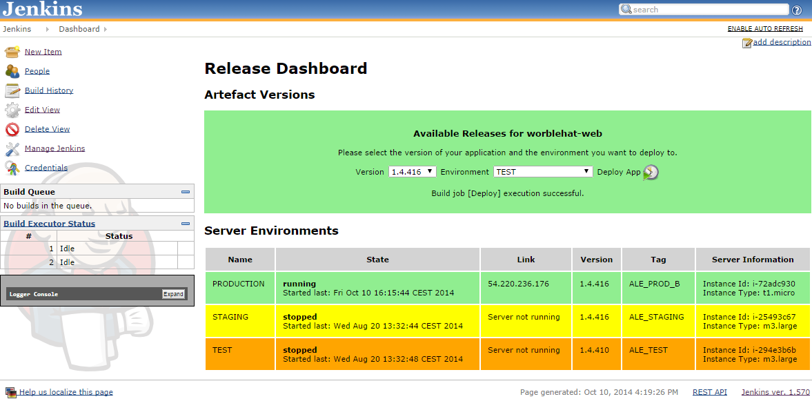

This plugin was developed to help managing the deployment of software
artifacts to different environments easily. You configure an artifact
repository (like Artifactory or Nexus) and your Amazon EC2 deployment
servers. The plugin manages the deployed versions of any artifact from
your repository to your server environments (i.e. DEV, TEST, PROD). The
plugin works with Amazon EC2 instances.

[[EC2DeploymentDashboardPlugin-Documentation]]
== Documentation

[[EC2DeploymentDashboardPlugin-Prerequisites]]
=== Prerequisites

You need the following setup to use the plugin:

* Amazon EC2 instances for your deployment servers
* Artifactory or Nexus for storing your software artifacts

[[EC2DeploymentDashboardPlugin-PluginUsage]]
=== Plugin Usage

[.aui-icon .aui-icon-small .aui-iconfont-info .confluence-information-macro-icon]#
#

https://github.com/jenkinsci/ec2-deployment-dashboard/blob/master/documentation/README.md[Here
you will find the project documentation]

[[EC2DeploymentDashboardPlugin-BlogArticle]]
=== Blog Article

* https://blog.codecentric.de/en/2015/02/jenkins-deployment-dashboard-ec2-environments/[Blog
article describing plugin usage]

[[EC2DeploymentDashboardPlugin-Screenshots]]
=== Screenshots

[[EC2DeploymentDashboardPlugin-DashboardView]]
==== Dashboard View

This Jenkins dashboard gives you an overview of all your EC2 instances
that you configured. It displays the current state, the deployed
artifact version, uptime, instance type and the current IP. It also gets
all artifact versions from your artifact repository. Currently we
support jFrog Artifactory and Sonatype Nexus.

[.confluence-embedded-file-wrapper]##

[[EC2DeploymentDashboardPlugin-ChangeLog]]
=== Change Log

[[EC2DeploymentDashboardPlugin-Version1.0.10(May14,2015)]]
==== Version 1.0.10 (May 14, 2015)

* Bugfix: use dashboard view configured type for displaying color in
dashboard table

[[EC2DeploymentDashboardPlugin-Version1.0.8(May12,2015)]]
==== Version 1.0.8 (May 12, 2015)

* Feature: display private IP address in case EC2 instance does not have
a public ip address, i.e. instance is on a subnet

[[EC2DeploymentDashboardPlugin-Version1.0.5(March30,2015)]]
==== Version 1.0.5 (March 30, 2015)

* Feature: added support for new eu-central-1 region

[[EC2DeploymentDashboardPlugin-Version1.0.4(Jan25,2015)]]
==== Version 1.0.4 (Jan 25, 2015)

* Bugfix: Fixed missing deploy icon

[[EC2DeploymentDashboardPlugin-Version1.0.3(Jan24,2015)]]
==== Version 1.0.3 (Jan 24, 2015)

* Bugfix: Fixed dropdown list
