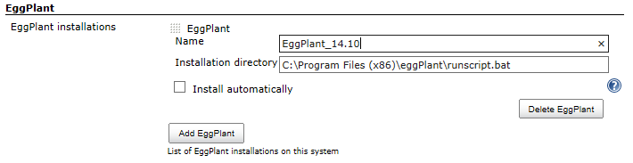
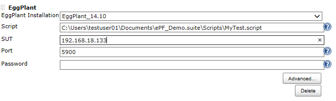
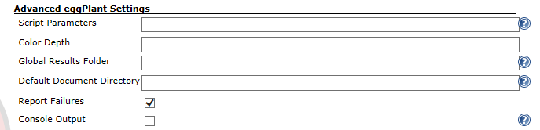
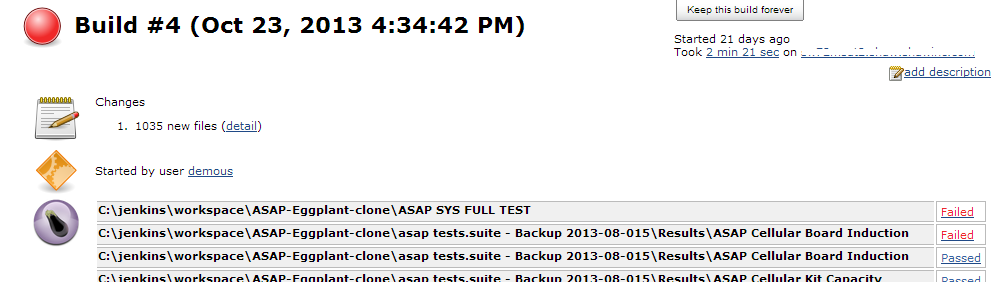
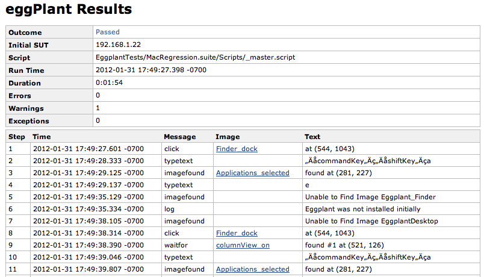

*NOTE:  *

This plug-in is deprecated.  

We encourage calling the Eggplant Command Line directly as described in
the on-line documentation:

http://docs.testplant.com/ePF/using/epf-runscript-command-options.htm

 

 [.conf-macro .output-inline]##

[cols="",options="header",]
|===
|Plugin Information
|View eggPlant https://plugins.jenkins.io/eggplant-plugin[on the plugin
site] for more information.
|===

[.aui-icon .aui-icon-small .aui-iconfont-error .confluence-information-macro-icon]##

The current version of this plugin may not be safe to use. Please review
the following warnings before use:

* https://jenkins.io/security/advisory/2019-08-07/#SECURITY-1430[Credentials
stored in plain text]

This plugin calls Eggplant scripts as a Jenkins Build Action and returns
the results to Jenkins for review or further processing.

[[Eggplant-plugin-Configuration]]
== Configuration

For detailed installation and configuration instructions see the
http://docs.testplant.com/?q=jenkins-integration[Eggplant Jenkins
Integration] documentation.

. Ensure that eggPlant is installed and accessible to the Jenkins user.
You can install the plugin from the Manage Plugins, Available page. +
You do not need to restart Jenkins after installation.
. On the Manage Jenkins, Configure System page, click the  button *Add
Eggplant* and fill in the Eggplant Functional version and the path to
the eggPlant runscript command. +
[.confluence-embedded-file-wrapper]## +
 
. On the configuration page for a build project, click the *Add build
step* button and select the Eggplant option.  Enter the script path and
System Under Test details. +
[.confluence-embedded-file-wrapper]##
. The *Advanced...* button give the following additional fields. +
[.confluence-embedded-file-wrapper]##

[[Eggplant-plugin-Results]]
== *Results*

* After executing a build, both job level results and the results of the
Eggplant Functional script can be viewed.
[.confluence-embedded-file-wrapper]## +
. +
[.confluence-embedded-file-wrapper]##

[[Eggplant-plugin-Changelog]]
=== Changelog

[[Eggplant-plugin-Version1.0]]
==== Version 1.0

* Initial Release

[[Eggplant-plugin-Version2]]
==== Version 2

* Support for Slave Nodes
* Fixed an issue saving configuration values
* Added Tool concept, so that the executables can be installed in
different locations on different machines.
* Added Job-Level Test Results Summary.
