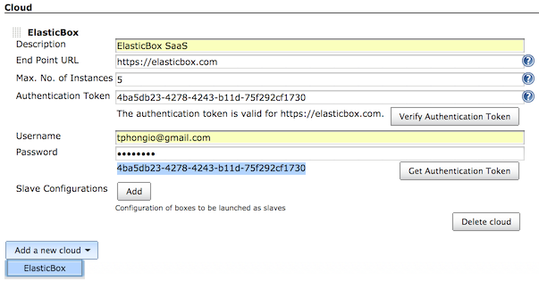
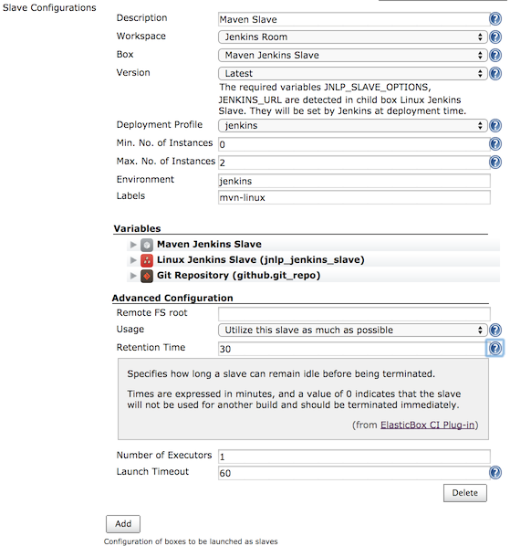
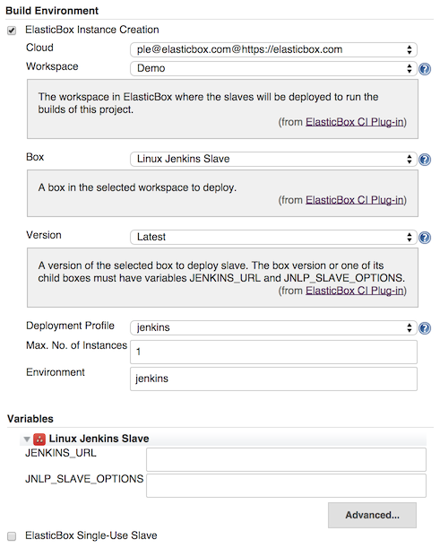
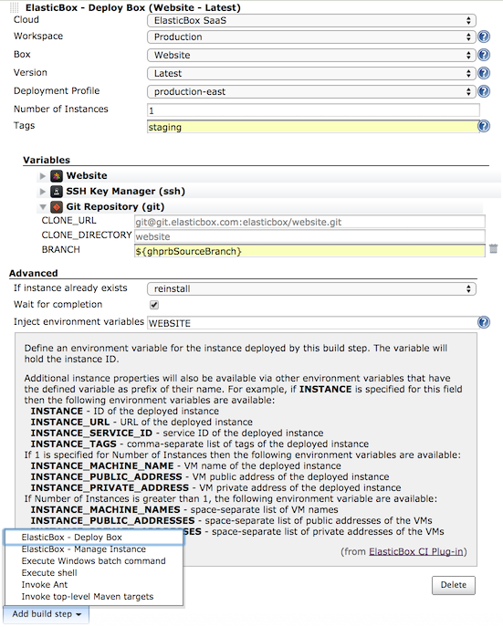
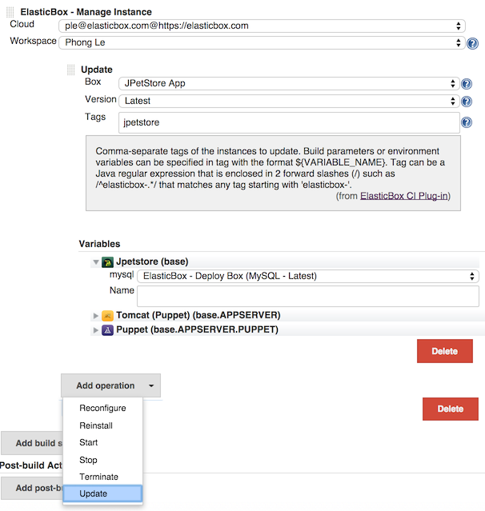
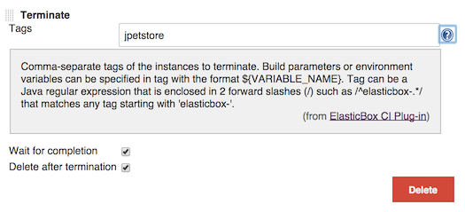

Provides full integration between Jenkins and ElasticBox
(http://elasticbox.com/[http://elasticbox.com]). With this plugin,
Jenkins can launch, provision, and manage Jenkins slaves on-demand in
different cloud providers via ElasticBox. It also provides build steps
to deploy and manage your applications, including complex, multi-tier
applications that are defined as boxes in ElasticBox.

 +

Version compatibility

[.aui-icon .aui-icon-small .aui-iconfont-info .confluence-information-macro-icon]#
#

The plugin is always compatible with the latest version of ElasticBox. +
If you're using a previous version of ElasticBox (<4.0), the latest
compatible version of the plugin is the 0.9.14

 +

[.conf-macro .output-inline]# #

[.aui-icon .aui-icon-small .aui-iconfont-error .confluence-information-macro-icon]##

The current version of this plugin may not be safe to use. Please review
the following warnings before use:

* https://jenkins.io/security/advisory/2019-10-16/#SECURITY-1434[Credentials
stored in plain text]

The latest documentation and tutorials can be found at
https://elasticbox.com/documentation/integrate-with-jenkins/ci-cd-overview/

[[ElasticBoxCI-Installation/Configuration]]
== Installation / Configuration

* Jenkins must be restarted after installation of this plugin for it to
work properly. You can trigger a hot restart of Jenkins by checking the
check box as shown below after your selection to install ElasticBox CI
plugin. +
[.confluence-embedded-file-wrapper]#image:docs/images/restart-jenkins.png[image]#

* If you are starting a JNLP Jenkins slave agent in your slave instance
and your Jenkins server is not wide-open at every port, configure a
fixed JNLP port for your Jenkins server under Manager Jenkins >
Configure Global Security.
* Set Jenkins URL in configuration page of your Jenkins server with a
host name or IP address that are accessible to the slaves.

[[ElasticBoxCI-HowToUse]]
== How To Use

* Add ElasticBox as a cloud in the configuration page of Jenkins. You
can add multiple ElasticBox clouds, one for each user at elasticbox.com
or your own ElasticBox appliance. An authentication token is required to
access ElasticBox. You can retrieve an authentication token from your
ElasticBox account or enter the username and password, click Get
Authentication Token button, then copy the returned token to the
Authentication Token field. Click Verify Authentication Token to make
sure that the specified token is correct. +
[.confluence-embedded-file-wrapper]##
* Create a Jenkins Slave box in ElasticBox (you can sign up at
http://elasticbox.com/[http://elasticbox.com] and use it right away if
you don't have an ElasticBox account yet). The box must have required
variables JENKINS_URL and JNLP_SLAVE_OPTIONS. ElasticBox CI plugin will
set the value of JENKINS_URL variable to the URL configured for this
Jenkins server, and fill the value of JNLP_SLAVE_OPTIONS automatically.
Those variable are needed to download the slave agent from Jenkins
server and start it from within the slave instance as shown in the
following scripts. +
 +
Install event script
* {blank}
+
[source,syntaxhighlighter-pre]
----
#!/bin/bash

# Download the slave agent from Jenkins server
wget $JENKINS_URL/jnlpJars/slave.jar -O slave.jar
----
+
 +
Start event script
* {blank}
+
[source,syntaxhighlighter-pre]
----
#!/bin/bash

# Execute the agent and save the PID
nohup java -jar slave.jar $JNLP_SLAVE_OPTIONS > /dev/null 2>&1 &
echo \$! > slave.pid
----
+
 +
You also need to add the following command in the stop event script of
the Jenkins Slave box to kill the slave agent process when the instance
is shutting down +
+
[source,syntaxhighlighter-pre]
----
#!/bin/bash

# Stop the agent
kill -9 $(cat slave.pid)
----

* Configure slave to be provisioned on demand by clicking on Add button
next to Slave Configurations in the ElasticBox cloud form. +
[.confluence-embedded-file-wrapper]## +
Specify labels for the slave that any job can use to tie with slaves
deployed with the configuration. The Environment is required and must be
unique among slave configurations of the same ElasticBox cloud.

* You also can configure your Jenkins project or job to be built on
ElasticBox-managed slaves as following. The slaves deployed with this
per-project configuration are used exclusively for the project.  +
[.confluence-embedded-file-wrapper]## +
Select ElasticBox Single-Use Slave if you want to create a new instance
for every execution of the job. After the job finished and the retention
time elapsed, the instance will be terminated.

* Add ElasticBox - Deploy Box to deploy an instance of a specified box +
[.confluence-embedded-file-wrapper]## +
You can specify build parameters or build environment variables as value
of the variables or environment of the box you select to deploy. In the
above picture, the GitHub Pull Request build parameter
`+ghprbSourceBranch+` is specified as value for the variable BRANCH to
receive the Git source branch to be used during deployment of the box.

* Add ElasticBox - Manage Instance build step to Update, Reconfigure,
Reinstall, Stop, or Terminate instances
** *Update* +
[.confluence-embedded-file-wrapper]## +
You can specify build parameters or build environment variables as value
of the variables or environment of the box you select to update. .
** *Reconfigure* +
Specify tags that are used to find the instances in the selected
workspace of ElasticBox - Manage Instance build step to reconfigure +
[.confluence-embedded-file-wrapper]#image:docs/images/reconfigure.png[image]#
** *Reinstall* +
Similarly to Reconfigure, specify tags used to find instances to
reinstall.
** *Start* +
Similarly to Reconfigure, specify tags used to find instances to start.
** *Stop* +
Similarly to Reconfigure, specify tags used to find instances to stop.
** *Terminate* +
Similarly to Reconfigure, specify tags used to find instances to
terminate. Additionally, you can select to delete the instance after its
termination. +
[.confluence-embedded-file-wrapper]##
