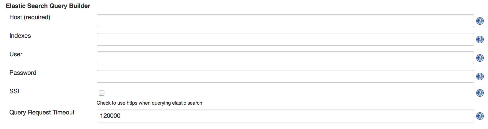
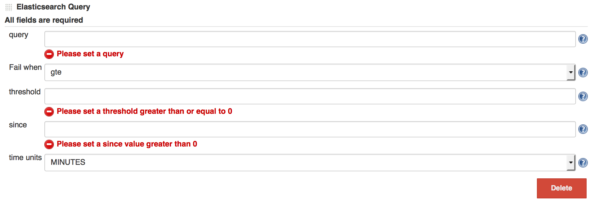

[.conf-macro .output-inline]#Fails a build based upon an
https://www.elastic.co/products/elasticsearch[elasticsearch] query#

[[ElasticsearchQueryPlugin-Aboutthisplugin]]
== About this plugin

This came from a need to alert based on data stored on in elastic
search; in particular logstash data. ELK users who also use Jenkins now
have FOSS capabilities similar to that of
https://www.elastic.co/products/watcher[watcher] or
http://www.splunk.com/[splunk].

[[ElasticsearchQueryPlugin-Configuration]]
== Configuration

Once elastic search query plugin is installed the configuration has two
parts.

Global:

[.confluence-embedded-file-wrapper .confluence-embedded-manual-size]##

Host is the only required field.

Job:

[.confluence-embedded-file-wrapper .confluence-embedded-manual-size]##

All fields are required.

[[ElasticsearchQueryPlugin-ChangeLog]]
== Change Log

[[ElasticsearchQueryPlugin-Version1.2(Dec13,2015)]]
=== Version 1.2 (Dec 13, 2015)

* updated messaging and improved validation stemming from writing wiki
page

[[ElasticsearchQueryPlugin-Version1.1(Dec13,2015)]]
=== Version 1.1 (Dec 13, 2015)

* Initial commit
