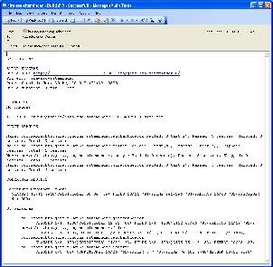

*Please do not email me directly (Jenkins/plugin developers excluded).
If you need help post on the mailing
lists https://jenkins.io/mailing-lists/, stack overflow or if you have
found a bug log an issue
at https://issues.jenkins-ci.org/[https://issues.jenkins-ci.org] (no
support tickets please)*

[.conf-macro .output-inline]# #

[.aui-icon .aui-icon-small .aui-iconfont-info .confluence-information-macro-icon]##

Older versions of this plugin may not be safe to use. Please review the
following warnings before using an older version:

* https://jenkins.io/security/advisory/2019-03-06/#SECURITY-1340[Script
security sandbox bypass]
* https://jenkins.io/security/advisory/2017-03-20/[Email notifications
could be sent to people who are not users of Jenkins]
* https://jenkins.io/security/advisory/2017-04-10/[Arbitrary code
execution vulnerability]
* https://jenkins.io/security/advisory/2018-04-16/#SECURITY-729[SMTP
password gets transmitted in unencrypted form]

This plugin allows you to configure every aspect of email notifications.
You can customize when an email is sent, who should receive it, and what
the email says.

[[Email-extplugin-BuildStatus]]
== Build Status

https://jenkins.ci.cloudbees.com/job/plugins/job/email-ext-plugin/[[.confluence-embedded-file-wrapper]#image:https://jenkins.ci.cloudbees.com/buildStatus/icon?job=plugins/email-ext-plugin[image]#]

[[Email-extplugin-Recipes]]
== Recipes

Additional recipes for email-ext can be found
https://wiki.jenkins-ci.org/display/JENKINS/Email-ext+Recipes[here].

[[Email-extplugin-General]]
== General

This plugin extends Jenkins built in email notification functionality by
giving you more control.  It provides customization of 3 areas.

* *Triggers* - Select the conditions that should cause an email
notification to be sent.
* *Content* - Specify the content of each triggered email's subject and
body.  
* *Recipients* - Specify who should receive an email when it is
triggered.

[[Email-extplugin-Configuration]]
== Configuration

[[Email-extplugin-Globalconfiguration]]
=== Global configuration

Before using email-ext on a project, you must configure some global
settings.  Go to Jenkins System configuration page.  Manage Jenkins ->
Configure System

The section titled Extended E-mail Notification is where you can
configure global email-ext properties.  The properties here should match
the settings for your smtp mail server.  This section is set up to
mirror Jenkins own email Publisher Reporter (It's different extension
point), however there are a few additions.  The inputs labeled Default
Subject and Default Content, allow you to configure the email content on
a global level.  The input labeled Default Recipients can be used to set
a default list of email addresses for all projects using plugin (it can
be overridden at the project level). This can be used to greatly
simplify the configuration you need to do for all projects.

[[Email-extplugin-Projectconfiguration]]
=== Project configuration

For a project to use the email-ext plugin, you need to enable it in the
project configuration page.  Select the checkbox labeled "Editable Email
Notification" in the  "Post-build Actions" section.

[[Email-extplugin-BasicConfiguration]]
==== Basic Configuration

There are three fields that you can edit when the plugin is enabled.

* *Global Recipient List* - This is a comma (or whitespace) separated
list of email recipients.  Allows you to specify a single recipient list
for each email that is sent.
* *Default Subject* - This allows you to configure a token (more about
tokens later), that can be used to easily configure all email subjects
for the project.
* *Default Content* - Same as Default Subject, but for the email body
instead of the subject.

[[Email-extplugin-Advancedconfiguration]]
==== Advanced configuration

To see the advanced configuration for the plugin, first click on
Override Global setting checkbox, then click the "Advanced" button. 
This section allows you to specify recipients for each type of email
trigger as well as a pre-send script that can be used to modify the
email just prior to sending. 

[[Email-extplugin-Pre-sendScript]]
===== Pre-send Script

The pre-send script is a feature which allows you to write a script that
can modify the
http://docs.oracle.com/javaee/1.4/api/javax/mail/internet/MimeMessage.html[MimeMessage] object
prior to sending. This would allow adding custom headers, modifying the
body, etc. Predefined variables include:

* msg - the MimeMessage object which can be modified
* logger - a PrintStream and will write to the job's log. 
* build - the build this message belongs to (only use with FreeStyle
jobs)
* run - the build this message belongs to (may be used with FreeStyle or
Pipeline jobs)
* cancel - a boolean, which when set to true will cancel the sending of
the email

[[Email-extplugin-Triggers]]
===== Triggers

By default, the only trigger configured is the "Failure" trigger.  To
add more triggers, select one from the dropdown, and it will be added to
the list.  Once you have added a trigger, you have several options.  If
you click "?" (question mark) next to a trigger, it will tell you what
conditions must be met for it to send an email.

* *Send to Recipient List* - Check this checkbox if you would like to
have the email sent to the "Global Recipient List" configured above.
* *Send to Developers * - Check this checkbox to send the email to
anyone who checked in code for the last build.  The plugin will generate
an email address based on the committer's id and an appended "default
email suffix" from Jenkins's global configuration page.  For instance,
if a change was committed by someone with an id "first.last", and the
default email suffix is "@somewhere.com", then an email will be sent to
"first.last@somewhere.com"
* *Send To Requester* - If this is checked, an email will be sent user
who triggers the build (if triggered by a user manually).
* *Include Culprits* - If this is checked AND Send To Developers is
checked, emails will include everyone who committed since the last
successful build.
* *More Configuration* - Configure properties at a per-trigger level.
** *Recipient List* - A comma (and whitespace) separated list of email
address that should receive this email if it is triggered.  This list is
appended to the "Global Recipient List" above.
** *Subject* - Specify the subject line of the selected email.
** *Content* - Specify the body of the selected email.
* *Remove* - Click the delete button next to an email trigger to remove
it from the configured triggers list.

You can use Trigger Scripts in groovy to define before of after the
build if the email must be send or not.

There are four objects added to the model for the script to use to
interact with the build.

* *build*: This is the current build, usually a child class of
AbstractBuild
* *project*: The project object that the current build was started from,
usually a child class of AbstractProject
* *rooturl*: The Jenkins instance root URL, useful for links.
* *out*: A PrintStream that can be used to log messages to the build
log.

The last line in the script should resolve to a boolean true or false

Examples:

* Before build scripts

[source,syntaxhighlighter-pre]
----
// this could be used to notify people that a new build is happening
build.previousBuild.result.toString().equals('FAILURE')
----

* After build scripts

[source,syntaxhighlighter-pre]
----
// only send am email if the build failed and 'mickeymouse' had a commit
build.result.toString().equals('FAILURE') && build.hasParticipant(User.get('mickeymouse'))
----

[source,syntaxhighlighter-pre]
----
// only send an email if the word {{ERROR}} is found in build logs
build.logFile.text.readLines().any { it =~ /.*ERROR.*/ }
----

[[Email-extplugin-Emailtokens]]
===== Email tokens

The email-ext plugin uses *_tokens_* to allow dynamic data to be
inserted into recipient list, email subject line or body.   A *_token_*
is a string that starts with a $ (dollar sign) and is terminated by
whitespace.  When an email is triggered, any tokens in the subject or
content fields will be replaced dynamically by the actual value that it
represents.  Also, the "value" of a token can contain other tokens, that
will themselves be replaced by actual content.  For instance, the
$DEFAULT_SUBJECT token is replaced by the text (and other tokens) that
is in the Default Subject field from the *global configuration page*. 
Similarly, the $PROJECT_DEFAULT_SUBJECT token will be replaced by the
value of the Default Subject field from the *project configuration
page*. 

The email-ext plugin sets the email content fields with default values
when you enable it for your project.  The Default Subject and Default
Content fields on the project config page default to $DEFAULT_SUBJECT
and $DEFAULT_CONTENT (respectively), so that it will automatically use
the global configuration.  Similarly, the per-trigger content fields
default to $PROJECT_DEFAULT_SUBJECT and $PROJECT_DEFAULT_CONTENT, so
that they will automatically use the project's configuration.  Since the
value of a token can contain other tokens, this provides different
points of configuration that can allow you to quickly make changes at
the broadest level (all projects), the narrowest level (individual
email), and in between (individual project).

To see a list of all available email tokens and what they display, you
can click the "?" (question mark) associated with the Content Token
Reference at the top bottom of the email-ext section on the project
configuration screen.

[[Email-extplugin-TokenMacroTokens]]
===== Token Macro Tokens

As of version 2.22, email-ext supports tokens provided by the
https://wiki.jenkins-ci.org/display/JENKINS/Token+Macro+Plugin[token-macro
plugin]. You can see the available token-macro token below the email-ext
tokens when you click the "?" (question mark) associated with the
Content Token Reference at the bottom of the email-ext section on the
project configuration screen.

[[Email-extplugin-Jellycontent]]
===== Jelly content

[.confluence-embedded-file-wrapper .image-right-wrapper .confluence-embedded-manual-size]##

[.confluence-embedded-file-wrapper .image-right-wrapper .confluence-embedded-manual-size]##

New to version 2.9 is the ability to use Jelly scripts. Jelly scripts
are powerful in that you can hook into the Jenkins API itself to get any
information you want or need. There are two Jelly scripts packaged with
the plugin and it is possible to write your own too.

There are two default Jelly scripts available out of the box; one is
designed for HTML emails and the other is design for text emails. See
the screenshots to the right for what these templates look like. You can
specify which script you want by using the _template_ argument. The
usage for each script is the following:

* Text only Jelly script: $\{JELLY_SCRIPT,template="text"}
* HTML Jelly script: $\{JELLY_SCRIPT,template="html"}

You can also write your own Jelly scripts. The Jelly scripts are
particularly powerful since they provide a hook into the Jenkins API
including
http://javadoc.jenkins-ci.org/hudson/model/AbstractBuild.html[hudson.model.AbstractBuild]
and
http://javadoc.jenkins-ci.org/hudson/model/AbstractProject.html[hudson.model.AbstractProject].
For example on how to do this, take a look at the existing
https://github.com/jenkinsci/email-ext-plugin/blob/master/src/main/resources/hudson/plugins/emailext/templates/html.jelly[html]
and
https://github.com/jenkinsci/email-ext-plugin/blob/master/src/main/resources/hudson/plugins/emailext/templates/text.jelly[text]
scripts.

Using custom Jelly scripts (those not packaged with email-ext) requires
the cooperation of your Hudson administrator. The steps are relatively
simple:

. Create the Jelly script. The name of the script should be
_<name>.jelly_. It is important the name ends in _.jelly_.
. Have your Jenkins administrator place the script inside
$JENKINS_HOME__email-templates__.
. Use the Jelly token with the template parameter equal to your script
filename without the .jelly extension. For example, if the script
filename is foobar.jelly, the email content would look like this
$\{JELLY_SCRIPT,template="foobar"}.

Jelly script tips:

* You get object of other plugin actions by querying build actions like:
$\{it.getAction('hudson.plugins.fitnesse.FitnesseResultsAction')}
* Then you need to know what all functions are allowed by this action
object and traverse through result.

[[Email-extplugin-Scriptcontent]]
===== Script content

New to version 2.15 is the ability to use Groovy scripts. Scripts are
powerful in that you can hook into the Jenkins API itself to get any
information you want or need. There are two scripts with corresponding
templates packaged with the plugin and it is possible to write your own
too.

There are two default scripts and templates available out of the box;
one is designed for HTML emails and the other is design for text emails.
You can specify which script you want by using the _script _argument,
you can also just leave the default script and specify a different
template file using the _template_ argument. Further, you can also
include an init script that does some initialization using the _init_
argument. The usage for each script is the following:

* Text only template: $\{SCRIPT, template="groovy-text.template"}
* HTML template: $\{SCRIPT, template="groovy-html.template"}

You can also write your own scripts and templates. The scripts are
particularly powerful since they provide a hook into the Jenkins API
including http://javadoc.jenkins-ci.org/hudson/model/AbstractBuild.html[hudson.model.AbstractBuild] and http://javadoc.jenkins-ci.org/hudson/model/AbstractProject.html[hudson.model.AbstractProject].
For example on how to do this, take a look at the
existing https://github.com/jenkinsci/email-ext-plugin/blob/master/src/main/resources/hudson/plugins/emailext/templates/groovy-html.template[html] and https://github.com/jenkinsci/email-ext-plugin/blob/master/src/main/resources/hudson/plugins/emailext/templates/groovy-text.template[text] scripts.

Using custom scripts (those not packaged with email-ext) requires the
cooperation of your Jenkins administrator. The steps are relatively
simple:

. Create the script/template. The name of the script end in the standard
extension for the language (.groovy). The template can be named anything
. Have your Jenkins administrator place the script inside
JENKINS__HOME\email-templates_.
. Use the script token with the template parameter equal to your
template filename, or in addition the script parameter equal to the
custom script name. For example, if the template filename is
foobar.template, the email content would look like this $\{SCRIPT,
template="foobar.template"}.

[[Email-extplugin-TemplateExamples]]
===== Template Examples

These are some useful examples for doing various things with the
email-ext groovy templates.

https://wiki.jenkins-ci.org/download/attachments/3604514/jenkins-matrix-email-html.template?version=1&modificationDate=1332562186000&api=v2[jenkins-matrix-email-html.template]

https://wiki.jenkins-ci.org/download/attachments/3604514/jenkins-generic-matrix-email-html.template?version=1&modificationDate=1495548067000&api=v2[jenkins-generic-matrix-email-html.template]

[[Email-extplugin-PipelineExamples]]
===== Pipeline Examples

See https://jenkins.io/doc/pipeline/steps/email-ext/[email-ext] for
command signatures

Notify Culprits and Requester via default EMail plugin

[source,syntaxhighlighter-pre]
----
step([$class: 'Mailer', notifyEveryUnstableBuild: true, recipients: emailextrecipients([[$class: 'CulpritsRecipientProvider'], [$class: 'RequesterRecipientProvider']])])
----

Send an email to abc plus any addresses returned by the providers

[source,syntaxhighlighter-pre]
----
emailext body: 'A Test EMail', recipientProviders: [[$class: 'DevelopersRecipientProvider'], [$class: 'RequesterRecipientProvider']], subject: 'Test', to: 'abc'
----

 +
Attachments

New to version 2.15 is the ability to add attachments using the Ant
pattern matching syntax used in many places in Jenkins. You can set a
maximum total attachment size in the global configuration page, or it
will be unlimited. 

[[Email-extplugin-JiveFormatter]]
==== Jive Formatter

https://wiki.jenkins-ci.org/download/attachments/3604514/jive-formatter.groovy?version=1&modificationDate=1386951702000&api=v2[jive-formatter.groovy]
contains methods for easy and convenient formatting of emails being sent
from Jenkins to Jive. It should be called from the Pre-send Script area.

Also, it doesn't seem like Jive supports text with multiple formats, so
only call one formatting method per block of text.

Either formatLine or formatText can and should be called on every line
of text that will be sent to the Jive system prior to calling formatting
methods like color or size. Please test on your own instances of Jive
and add functionality as you find it!

The following lines should be added to the Pre-send Script area prior to
attempting to invoke any functions.

*Pre-send Script*

[source,syntaxhighlighter-pre]
----
File sourceFile = new File("/your/preferred/path/jive-formatter.groovy");
Class groovyClass = new GroovyClassLoader(getClass().getClassLoader()).parseClass(sourceFile);
GroovyObject jiveFormatter = (GroovyObject) groovyClass.newInstance();
----

[[Email-extplugin-Plugins]]
==== Plugins

* {blank}
+
[.icon .aui-icon .content-type-page]#Page:#
+
https://wiki.jenkins-ci.org/display/JENKINS/Email+Ext+Recipients+Column+Plugin[Email
Ext Recipients Column Plugin] [.smalltext]#(Jenkins)#

** https://wiki.jenkins-ci.org/label/plugin-listview-column[plugin-listview-column]
** https://wiki.jenkins-ci.org/label/plugin-emailext[plugin-emailext]
* {blank}
+
[.icon .aui-icon .content-type-page]#Page:#
+
https://wiki.jenkins-ci.org/display/JENKINS/Job+Direct+Mail+Plugin[Job
Direct Mail Plugin] [.smalltext]#(Jenkins)#

** https://wiki.jenkins-ci.org/label/plugin-ui[plugin-ui]
** https://wiki.jenkins-ci.org/label/plugin-emailext[plugin-emailext]
* {blank}
+
[.icon .aui-icon .content-type-page]#Page:#
+
https://wiki.jenkins-ci.org/display/JENKINS/Pom2Config+Plugin[Pom2Config
Plugin] [.smalltext]#(Jenkins)#

** https://wiki.jenkins-ci.org/label/plugin-misc[plugin-misc]
** https://wiki.jenkins-ci.org/label/plugin-emailext[plugin-emailext]
* {blank}
+
[.icon .aui-icon .content-type-page]#Page:#
+
https://wiki.jenkins-ci.org/display/JENKINS/GitHub+Integration+Plugin[GitHub
Integration Plugin] [.smalltext]#(Jenkins)#

** https://wiki.jenkins-ci.org/label/plugin-emailext[plugin-emailext]
** https://wiki.jenkins-ci.org/label/plugin-trigger[plugin-trigger]
* {blank}
+
[.icon .aui-icon .content-type-page]#Page:#
+
https://wiki.jenkins-ci.org/display/JENKINS/Email-ext+Template+Plugin[Email-ext
Template Plugin] [.smalltext]#(Jenkins)#

** https://wiki.jenkins-ci.org/label/plugin-notifier[plugin-notifier]
** https://wiki.jenkins-ci.org/label/favourite[favourite]
** https://wiki.jenkins-ci.org/label/plugin-emailext[plugin-emailext]
* {blank}
+
[.icon .aui-icon .content-type-page]#Page:#
+
https://wiki.jenkins-ci.org/display/JENKINS/Configuration+Slicing+Plugin[Configuration
Slicing Plugin] [.smalltext]#(Jenkins)#

** https://wiki.jenkins-ci.org/label/plugin-misc[plugin-misc]
** https://wiki.jenkins-ci.org/label/maven[maven]
** https://wiki.jenkins-ci.org/label/plugin-builder[plugin-builder]
** https://wiki.jenkins-ci.org/label/plugin-emailext[plugin-emailext]
** https://wiki.jenkins-ci.org/label/adopt-this-plugin[adopt-this-plugin]
* {blank}
+
[.icon .aui-icon .content-type-page]#Page:#
+
https://wiki.jenkins-ci.org/display/JENKINS/View+Job+Filters[View Job
Filters] [.smalltext]#(Jenkins)#

** https://wiki.jenkins-ci.org/label/plugin-ui[plugin-ui]
** https://wiki.jenkins-ci.org/label/maven2[maven2]
** https://wiki.jenkins-ci.org/label/plugin-scm-related[plugin-scm-related]
** https://wiki.jenkins-ci.org/label/plugin-maven[plugin-maven]
** https://wiki.jenkins-ci.org/label/plugin-user[plugin-user]
** https://wiki.jenkins-ci.org/label/plugin-emailext[plugin-emailext]
* {blank}
+
[.icon .aui-icon .content-type-page]#Page:#
+
https://wiki.jenkins-ci.org/display/JENKINS/Run+Condition+Extras+Plugin[Run
Condition Extras Plugin] [.smalltext]#(Jenkins)#

** https://wiki.jenkins-ci.org/label/runcondition-consumer[runcondition-consumer]
** https://wiki.jenkins-ci.org/label/plugin-misc[plugin-misc]
** https://wiki.jenkins-ci.org/label/plugin[plugin]
** https://wiki.jenkins-ci.org/label/plugin-runcondition[plugin-runcondition]
** https://wiki.jenkins-ci.org/label/plugin-emailext[plugin-emailext]
** https://wiki.jenkins-ci.org/label/adopt-this-plugin[adopt-this-plugin]

[[Email-extplugin-ExtendEmail-ext]]
==== *Extend Email-ext*

 Make sure you have installed http://maven.apache.org/[Maven
3] (https://wiki.jenkins-ci.org/pages/viewpage.action?pageId=3309681[why?])
and JDK 6.0 or later. Make also sure you have properly configured your
`+~/.m2/settings.xml+` as explained in the
https://wiki.jenkins-ci.org/display/JENKINS/Plugin+tutorial[Plugin
Tutorial]. This is needed to build properly any Jenkins plugin.

[[Email-extplugin-Checkoutandbuild]]
===== Check out and build

How to check out the source and build:

* git clone git@github.com:jenkinsci/email-ext-plugin.git
* cd email-ext-plugin
* mvn clean install

[[Email-extplugin-VersionHistory]]
== Version History

[[Email-extplugin-2.66(March21,2019)]]
=== 2.66 (March 21, 2019)

* Fix some usages of "email" to "e-mail" to be consistent (thanks
https://github.com/VirtualTim[VirtualTim])
* Update plugin to build and test with JDK11
(thanks https://github.com/batmat[batmat])

[[Email-extplugin-2.65(March6,2019)]]
=== 2.65 (March 6, 2019)

* https://jenkins.io/security/advisory/2019-03-06/#SECURITY-1340[Fix]
https://jenkins.io/security/advisory/2019-03-06/#SECURITY-1340[security
issue]

[[Email-extplugin-2.63(August5,2018)]]
=== 2.63 (August 5, 2018)

* allow filtering email domains we send emails to
(https://github.com/jenkinsci/email-ext-plugin/pull/167[pull 167])
* Help markup
(https://github.com/jenkinsci/email-ext-plugin/pull/169[pull 169]) 
* Same recipient in CC or BCC removes it from TO 
[.jira-issue .conf-macro .output-block]#
https://issues.jenkins-ci.org/browse/JENKINS-52748[[.aui-icon .aui-icon-wait .issue-placeholder]##
##JENKINS-52748] - [.summary]#Getting issue details...#
[.aui-lozenge .aui-lozenge-subtle .aui-lozenge-default .issue-placeholder]#STATUS#
#

[[Email-extplugin-2.62(March23,2018)]]
=== 2.62 (March 23, 2018)

* Styling changes + change in test results table + code alignment
(https://github.com/jenkinsci/email-ext-plugin/pull/162[pull 162])
* Fix link for RFC-2919 in help
(https://github.com/jenkinsci/email-ext-plugin/pull/164[pull 164])
* Update some libraries for some feature additions.
(https://github.com/jenkinsci/email-ext-plugin/pull/165[pull 165])
* The email-ext-plugin Pipeline integration is not very ergonomic 
[.jira-issue .conf-macro .output-block]#
https://issues.jenkins-ci.org/browse/JENKINS-49733[[.aui-icon .aui-icon-wait .issue-placeholder]##
##JENKINS-49733] - [.summary]#Getting issue details...#
[.aui-lozenge .aui-lozenge-subtle .aui-lozenge-default .issue-placeholder]#STATUS#
#
* Check for attachment size does not consider compression 
[.jira-issue .conf-macro .output-block]#
https://issues.jenkins-ci.org/browse/JENKINS-49913[[.aui-icon .aui-icon-wait .issue-placeholder]##
##JENKINS-49913] - [.summary]#Getting issue details...#
[.aui-lozenge .aui-lozenge-subtle .aui-lozenge-default .issue-placeholder]#STATUS#
#
* Add additional accounts
(https://github.com/jenkinsci/email-ext-plugin/pull/166[pull 166])

[[Email-extplugin-2.61(October27,2017)]]
=== 2.61 (October 27, 2017)

* Add global checkbox to allow sending emails to unregistered users
(https://github.com/jenkinsci/email-ext-plugin/pull/161[pull 161])
* Switch to using RunWithSCM for getCulprits logic 
[.jira-issue .conf-macro .output-block]#
https://issues.jenkins-ci.org/browse/JENKINS-24141[[.aui-icon .aui-icon-wait .issue-placeholder]##
##JENKINS-24141] - [.summary]#Getting issue details...#
[.aui-lozenge .aui-lozenge-subtle .aui-lozenge-default .issue-placeholder]#STATUS#
#

[[Email-extplugin-2.60(September19,2017)]]
=== 2.60 (September 19, 2017)

* groovy-text.template: use of member changeSet instead of changeSets
(https://issues.jenkins-ci.org/browse/JENKINS-38968[JENKINS-38968])

[[Email-extplugin-2.59(September12,2017)]]
=== 2.59 (September 12, 2017)

* NullPointerException when calling addRecipients
(https://issues.jenkins-ci.org/browse/JENKINS-45529[JENKINS-45529])
* groovy-html.template: use of member changeSet instead of changeSets
(https://issues.jenkins-ci.org/browse/JENKINS-38968[JENKINS-38968])

[[Email-extplugin-2.58(Jun29,2017)]]
=== 2.58 (Jun 29, 2017)

* Make message clearer added in SECURITY-372
* Add presend and postsend script support in pipeline
(https://github.com/jenkinsci/email-ext-plugin/pull/157[#157])
* allRecipients could be null if presend script remove all of them
(https://github.com/jenkinsci/email-ext-plugin/pull/156[#156])

[[Email-extplugin-2.57.2(April10,2017)]]
=== 2.57.2 (April 10, 2017)

* SECURITY-257(https://jenkins.io/security/advisory/2017-04-10/[advisory])
 Run Groovy and Jelly scripts only if approved or in secure sandbox

[.aui-icon .aui-icon-small .aui-iconfont-info .confluence-information-macro-icon]#
#

Jenkins administrators may need to approve scripts used by this plugin.
Administrators can either proactively review all job configurations for
Groovy scripts or they can wait for the jobs to run and fail. Approval
is performed via the
https://wiki.jenkins-ci.org/display/JENKINS/Script+Security+Plugin[Script
Security Plugin].

 +

[[Email-extplugin-2.57.1(March20,2017)]]
=== 2.57.1 (March 20, 2017)

* SECURITY-372
(https://jenkins.io/security/advisory/2017-03-20/[advisory]) Emails were
sent to addresses not associated with actual users of Jenkins.

[.aui-icon .aui-icon-small .aui-iconfont-info .confluence-information-macro-icon]#
#

If the security fix is undesirable in a particular instance, it can be
disabled with either or both of the following two system properties:

* `+-Dhudson.tasks.MailSender.SEND_TO_UNKNOWN_USERS=true+`: send mail to
build culprits even if they do not seem to be associated with a valid
Jenkins login.
* `+-Dhudson.tasks.MailSender.SEND_TO_USERS_WITHOUT_READ=true+`: send
mail to build culprits associated with a valid Jenkins login even if
they would not otherwise have read access to the job.

[[Email-extplugin-2.57(February18,2017)]]
===  +
2.57 (February 18, 2017)

* Allow using 'emailext' step in pipeline without 'node'/workspace
context
(https://issues.jenkins-ci.org/browse/JENKINS-42140[JENKINS-42140])

[[Email-extplugin-2.56(February14,2017)]]
=== 2.56 (February 14, 2017)

* Take 2 on previous

[[Email-extplugin-2.55(February11,2017)]]
=== 2.55 (February 11, 2017)

* Bring back functions removed in JENKINS-40964 that are required for
upgrade of existing config

[[Email-extplugin-2.54(January22,2017)]]
=== 2.54 (January 22, 2017)

* update to latest config-file-provider
(https://issues.jenkins-ci.org/browse/JENKINS-40964[JENKINS-40964])

[[Email-extplugin-2.53(December23,2016)]]
=== 2.53 (December 23, 2016)

* CulpritsRecipientProvider does not work with pipeline
(https://issues.jenkins-ci.org/browse/JENKINS-40653[JENKINS-40653])

[[Email-extplugin-2.52(October23,2016)]]
=== 2.52 (October 23, 2016)

* enable setter for smtpHost in descriptor (PR-142)
* Fix getter value in UI
(https://issues.jenkins-ci.org/browse/JENKINS-37995[JENKINS-37995])
* Add API to programmatically configure global settings
(https://issues.jenkins-ci.org/browse/JENKINS-39147[JENKINS-39147])

[[Email-extplugin-2.51(September28,2016)]]
=== 2.51 (September 28, 2016)

* Pipeline Support - Failed
Tests (https://issues.jenkins-ci.org/browse/JENKINS-38519[JENKINS-38519])

[[Email-extplugin-2.50(September24,2016)]]
=== 2.50 (September 24, 2016)

* Template support in pipelines
(https://issues.jenkins-ci.org/browse/JENKINS-35367[JENKINS-35367])
* X failure trigger
(https://issues.jenkins-ci.org/browse/JENKINS-37995[JENKINS-37995])
* Don't use random for filename in Save to Workspace option
(https://issues.jenkins-ci.org/browse/JENKINS-37350[JENKINS-37350])

[[Email-extplugin-2.48&2.49Failedreleases]]
=== 2.48 & 2.49 Failed releases

[[Email-extplugin-2.47(August7,2016)]]
=== 2.47 (August 7, 2016)

* 2nd failure emails being sent even when build is successful with
job-dsl-plugin
(https://issues.jenkins-ci.org/browse/JENKINS-37188[JENKINS-37188])

[[Email-extplugin-2.46(August4,2016)]]
=== 2.46 (August 4, 2016)

* emailext Pipeline step sends mails to irrelevant people
(https://issues.jenkins-ci.org/browse/JENKINS-37163[JENKINS-37163])

[[Email-extplugin-2.45(July31,2016)]]
=== 2.45 (July 31, 2016)

* Non breaking spaces being double escaped - Thanks
https://issues.jenkins-ci.org/secure/ViewProfile.jspa?name=pgmillon[Pierre-Gildas
MILLON]
(https://issues.jenkins-ci.org/browse/JENKINS-35669[JENKINS-35669])
* NPE in email-ext FailingTestSuspectsRecipientProvider
(https://issues.jenkins-ci.org/browse/JENKINS-36402[JENKINS-36402])
* Fix of findbugs reported issues
* Upgrade to plugin pom 2.7

[[Email-extplugin-2.44(June13,2016)]]
=== 2.44 (June 13, 2016)

* Extended Pipeline support
(https://issues.jenkins-ci.org/browse/JENKINS-35365[JENKINS-35365])

[[Email-extplugin-2.43(June4,2016)]]
=== 2.43 (June 4, 2016)

* Fixed Content Token Reference throwing error if Config File Provider
plugin is not installed
(https://issues.jenkins-ci.org/browse/JENKINS-35289[issue 35289])
* Fixed NPE when watching a job
(https://issues.jenkins-ci.org/browse/JENKINS-33717[Issue 33717])
* Merged pull request
https://github.com/jenkinsci/email-ext-plugin/pull/130[130]
* Merged pull request
https://github.com/jenkinsci/email-ext-plugin/pull/133[133] Fix for
https://issues.jenkins-ci.org/browse/JENKINS-34785[issue 34785]
* Added ability to use a template from the workspace.

[[Email-extplugin-2.42(April17,2016)]]
=== 2.42 (April 17, 2016)

* Fixed issue with post-send script not saving
(https://issues.jenkins-ci.org/browse/JENKINS-33205[issue 33205] thanks
to https://github.com/weisslj[weisslj])
* Fixed issue with non-English characters in file names for attachments
(https://issues.jenkins-ci.org/browse/JENKINS-33574[issue 33574])
* Fixed NPE issue when using groovy script
(https://issues.jenkins-ci.org/browse/JENKINS-33690[issue 33690])
* Added a license file
* Moved to new parent pom version
* Fixed up some tests

[[Email-extplugin-2.41.3(Feb23,2016)]]
=== 2.41.3 (Feb 23, 2016)

* Fixed issue when workflow is not installed
(https://issues.jenkins-ci.org/browse/JENKINS-33035[issue 33035])

[[Email-extplugin-2.41.2(Feb18,2016)]]
=== 2.41.2 (Feb 18, 2016)

* Fixed issue with wrong class loader for templates
(https://issues.jenkins-ci.org/browse/JENKINS-32910[issue 32910])
* Allow semicolon for address separator
(https://issues.jenkins-ci.org/browse/JENKINS-32889[issue 32889])

[[Email-extplugin-2.41(Feb07,2016)]]
=== 2.41 (Feb 07, 2016)

* Cleaned up dependencies
* Removed several tokens that were moved to token-macro
* Fixed several items flagged by PMD (thanks Mohammed Ezzat*)*
* Added post-send script feature similar to pre-send script.
(Thanks https://github.com/weisslj[weisslj])
* Fixed issue with non-AbstractProject/Build items
(https://issues.jenkins-ci.org/browse/JENKINS-29970[issue
29970]https://issues.jenkins-ci.org/browse/JENKINS-29970)
* Fixed watching so it doesn't show recipient fields (issue 29449)

[[Email-extplugin-2.40.5(Jun08,2015)]]
=== 2.40.5 (Jun 08, 2015)

* Whitespace and import cleanup
* DefaultTriggers refactoring

[[Email-extplugin-2.40.4(May24,2015)]]
=== 2.40.4 (May 24, 2015)

* Fix issue where the wrong config provider would be cached if using
multiple types of managed templates.

[[Email-extplugin-2.40.3(May20,2015)]]
=== 2.40.3 (May 20, 2015)

* Fix issue with incorrect handling of cc and bcc recipients
(https://issues.jenkins-ci.org/browse/JENKINS-28444[issue #28444])
* Fix issue with readResolve including Mailer components
(https://issues.jenkins-ci.org/browse/JENKINS-28402[issue #28402])
* Fix issue where default extension was not added to template name if
there was something that looked like an extension in the name
(https://issues.jenkins-ci.org/browse/JENKINS-28357[issue #28357])

[[Email-extplugin-2.40.2(May13,2015)]]
=== 2.40.2 (May 13, 2015)

* Set the debug mode for JavaMail correctly when debug mode is enabled
in global configuration
* Fixed issue where the deserialization was not working correctly for
descriptors (https://issues.jenkins-ci.org/browse/JENKINS-28212[issue
#28212])

[[Email-extplugin-2.40.1(May4,2015)]]
=== 2.40.1 (May 4, 2015)

* Fixed issue with classpath entries that have environment variables
(https://issues.jenkins-ci.org/browse/JENKINS-28145[issue #28145])
* Fixed issue with check of the extension for templates on the file
system (https://issues.jenkins-ci.org/browse/JENKINS-28202[issue
#28202])

[[Email-extplugin-2.40(April28,2015)]]
=== 2.40 (April 28, 2015)

* Thanks to https://github.com/krwalker[K.R. Walker],
https://github.com/CedricLevasseur[Cédric Levasseur]
* Fixed issue with pre-send scripts not using 'cancel' correctly
(https://issues.jenkins-ci.org/browse/JENKINS-27448[issue #27448])
* Added ability to send email in HTML and plaintext with plaintext being
a stripped version of the HTML
(https://issues.jenkins-ci.org/browse/JENKINS-23126[issue #23126])
* Added ability to configure the set of triggers that is setup by
default when adding email-ext to a project
(https://issues.jenkins-ci.org/browse/JENKINS-27856[issue #27856])
* Moved away from using the Mailer plugin to create a session.
* Added new TEMPLATE token that can be used to pull normal content from
a file (https://issues.jenkins-ci.org/browse/JENKINS-26478[issue
#26478])
* Allow use of content tokens in the pre-send script
(https://issues.jenkins-ci.org/browse/JENKINS-26286[issue #26286])
* Allow sending console logs for all nodes in matrix build
(https://issues.jenkins-ci.org/browse/JENKINS-21861[issue #21861])
* Added ability for users to watch jobs
(https://issues.jenkins-ci.org/browse/JENKINS-18567[issue #18567])
* Removed admin email address since it should be set in the Jenkins
Location area (https://issues.jenkins-ci.org/browse/JENKINS-25926[issue
#25926])
* Fixed output from CSSInliner that was escaping entities
(https://issues.jenkins-ci.org/browse/JENKINS-25719[issue #25719])
* Added FirstFailingBuildSuspectsRecipientProvider

[[Email-extplugin-2.39.2(January30,2015)]]
=== 2.39.2 (January 30, 2015)

* Thanks to https://github.com/Everspace[Everspace]
* Add workaround for
https://issues.jenkins-ci.org/browse/JENKINS-25940[JENKINS-25940]
* Added new SCRIPT_CONTENT macro that can be used with pre-send scripts.
* Added uberClassLoader to JellyContext

[[Email-extplugin-2.39(November16,2014)]]
=== 2.39 (November 16, 2014)

* Thanks to https://github.com/christiangalsterer[Christian Galsterer],
https://github.com/alexouzounis[Alex Ouzounis],
https://github.com/gssiyankai[Gregory SSI-YAN-KAI],
https://github.com/jglick[Jesse Glick],
https://github.com/jeffmaury[Jeff Maury],
https://github.com/robin-knight[robin-knight],
https://github.com/krwalker[K.R. Walker]
* Updated to 1.554.1 as parent pom version
* Added a recipient provider for upstream committers
(https://issues.jenkins-ci.org/browse/JENKINS-17742[issue #17742])
* Fixed issue with template testing not supporting managed files
(https://issues.jenkins-ci.org/browse/JENKINS-23619[issue #23619])
* Fixed typo in help file for CHANGES_SINCE_LAST_BUILD
* Added support of regex to replace/change the messages in CHANGES token
(https://issues.jenkins-ci.org/browse/JENKINS-23691[issue #23691])
* Fixed issue that attached build log is not complete
(https://issues.jenkins-ci.org/browse/JENKINS-23660[issue #23660])
* Added disable at the project level
(https://issues.jenkins-ci.org/browse/JENKINS-22154[issue #22154])
* Added caching of the templates to improve performance
* Added parameter to CHANGES tokens to allow user to show a specific
message when there are no changes
(https://issues.jenkins-ci.org/browse/JENKINS-20324[issue #20324])
* Added classpath support for the pre-send script
(https://issues.jenkins-ci.org/browse/JENKINS-21672[issue #21672])
* Added SMTP timeout so that jobs won't hang indefinitely 
* Added retry for ConnectionExceptions
(https://issues.jenkins-ci.org/browse/JENKINS-16181[issue #16181])
* Added console output for template testing
(https://issues.jenkins-ci.org/browse/JENKINS-24063[issue #24063])
* Added check for test failure age in regression trigger
(https://issues.jenkins-ci.org/browse/JENKINS-22041[issue #22041])
* Added FailingTestSuspectsRecipientProvider

[[Email-extplugin-2.38.2(August26,2014)]]
=== 2.38.2 (August 26, 2014)

* Switch to using getAction instead of getTestResultAction to work with
newer versions of core.

[[Email-extplugin-2.38.1(June2,2014)]]
=== 2.38.1 (June 2, 2014)

* Fix for NPE when no recipient providers are selected in a trigger.

[[Email-extplugin-2.38(May24,2014)]]
=== 2.38 (May 24, 2014)

* Implemented new extension point for recipient providers
(RecipientProvider) this changes the way that recipient types are added 
** There are no longer checkboxes for "Requestor" "Recipients" etc, each
is provided by an implementation of a RecipientProvider
* Fixed log zipping to remove annotations
(https://issues.jenkins-ci.org/browse/JENKINS-21180[issue #21180])
* Added help information for TRIGGER_NAME token
(https://issues.jenkins-ci.org/browse/JENKINS-21912[issue #21912])
* Added support for managed files using the Config File Provider plugin,
prefix managed file name with "managed:"
* Removed dependency on the Maven plugin
* Added more help and updated help messages to be more clear
(https://issues.jenkins-ci.org/browse/JENKINS-20384[issue #20384])
* Added bcc support
(https://issues.jenkins-ci.org/browse/JENKINS-21730[issue #21730])
* Added showMessage parameter to FAILED_TESTS to allow turning off error
messages
* Cleaned up template to remove duplicate sections
(https://issues.jenkins-ci.org/browse/JENKINS-22592[issue #22592])
* Added %a and %d for pathFormat parameter of the CHANGES_SINCE* tokens
(https://issues.jenkins-ci.org/browse/JENKINS-20692[issue #20692])

[[Email-extplugin-2.37.2.2(March8,2014)]]
=== 2.37.2.2 (March 8, 2014)

* Added caching to the private macros to reduce time
(https://issues.jenkins-ci.org/browse/JENKINS-20078[issue #20078])

[[Email-extplugin-2.37.2(January26,2014)]]
=== 2.37.2 (January 26, 2014)

* Marked the Config subclass Extensions as optional, so the plugin
doesn't cause issues if the Config File Provider plugin is not
installed. (https://issues.jenkins-ci.org/browse/JENKINS-21326[issue
#21326])

[[Email-extplugin-2.37.1(January11,2014)]]
=== 2.37.1 (January 11, 2014)

* Fix issue with missing dependency on maven-plugin in  pom.xml

[[Email-extplugin-2.37(January8,2014)]]
=== 2.37 (January 8, 2014)

* Updated parent pom version to 1.532.1 LTS
* Allow use of managed scripts for Jelly or Groovy content. Use prefix
"managed:" before name of managed script
(https://issues.jenkins-ci.org/browse/JENKINS-18203[issue #18203])
* Added new "Status Changed" trigger (thanks francois_ritaly)
* Added fileNotFoundMessage to FILE token
(https://issues.jenkins-ci.org/browse/JENKINS-20325[issue #20325])
* Added inline help for triggers that was missing
(https://issues.jenkins-ci.org/browse/JENKINS-20170[issue #20170])
* Changed BuildStepMonitor.NONE to allow concurrent builds (thanks
jglick) (https://issues.jenkins-ci.org/browse/JENKINS-16376[issue
#16376])** You must take care when using content or triggers that look
at previous builds if you enable concurrent builds for your project
* Added TRIGGER_NAME token so users can determine what trigger caused
the email (https://issues.jenkins-ci.org/browse/JENKINS-20265[issue
#20265])
* Changed to Mutlimap so that you can add multiple triggers of the same
type and have them work correctly
(https://issues.jenkins-ci.org/browse/JENKINS-20524[issue #20524])
* Fixed issue where pre-send script would get expanded and remain
expanded (https://issues.jenkins-ci.org/browse/JENKINS-20770[issue
#20770])
* Added First Unstable trigger
* Added helper script for emailing Jive community (thanks Dan Barker)

[[Email-extplugin-2.36(October26,2013)]]
=== 2.36 (October 26, 2013)

* Fixed issue with mismatch between form field name and what was parsed
in the backend (https://issues.jenkins-ci.org/browse/JENKINS-20133[issue
#20133])
* Fixed issue with NPE on 1.535 (thanks to
https://github.com/agudian[agudian] for the PR)
* Added ability to customize the date format for the CHANGES_SINCE
tokens (https://issues.jenkins-ci.org/browse/JENKINS-20151[issue
#20151])
* Added help files for all the built-in triggers
(https://issues.jenkins-ci.org/browse/JENKINS-20170[issue #20170])
* By default when you add the email-ext publisher, an Always trigger
will be added (https://issues.jenkins-ci.org/browse/JENKINS-20013[issue
#20013])
* Fixed issue with template project plugin based jobs and Jelly script
content. (https://issues.jenkins-ci.org/browse/JENKINS-20117[issue
#20117])
* If user doesn't have a Mailer.UserProperty, just add the user id and
see if the system can resolve it
(https://issues.jenkins-ci.org/browse/JENKINS-20215[issue #20215])
* Fixed issue with newInstance method for EmailTrigger causing an
exception on 1.536
(https://issues.jenkins-ci.org/browse/JENKINS-20198[issue #20198])

[[Email-extplugin-2.35.1(October14,2013)]]
=== 2.35.1 (October 14, 2013)

* Fixed issue introduced by new parameter parsing in global config
(https://issues.jenkins-ci.org/browse/JENKINS-20030[issue #20030])
* Update descriptor usage in triggers
* Fixed command line to not max out PermGen during testing

[[Email-extplugin-2.35(October12,2013)]]
=== 2.35 (October 12, 2013)

* Refactored descriptor to follow recommended method
* Added tests for global config default values
* Updated to latest LTS for parent version
* Updated exclusion list to be for full email list, not just committers
* Fixed issue with email-ext not restoring values for some fields if no
triggers were configured
(https://issues.jenkins-ci.org/browse/JENKINS-15442[issue #15442])
* Fixed issue where the project could be null
(https://issues.jenkins-ci.org/browse/JENKINS-14338[issue #14338])

[[Email-extplugin-2.34(September15,2013)]]
=== 2.34 (September 15, 2013)

* Started adding HtmlUnit tests for UI interaction and round trip
testing
* Added more debug for excluded committers feature
* Reverted field name to includeCulprits
* Fixed issue where PROJECT_DEFAULT_RECIPIENTS was being added to
triggers (https://issues.jenkins-ci.org/browse/JENKINS-19583[issue
#19583])
* Fixed issue that stopped users from being able to add triggers
(https://issues.jenkins-ci.org/browse/JENKINS-19585[issue #19585])

[[Email-extplugin-2.33(September12,2013)]]
=== 2.33 (September 12, 2013)

* Fixed issue with triggers for matrix projects not saving the value
correctly (https://issues.jenkins-ci.org/browse/JENKINS-19291[issue
#19291])
* Added ability to set content type at the trigger level
* Added back send to culprits
* Fixed missing dependency for Mailer plugin in pom.xml
* Added setting debug mode for JavaMail when debug mode for email-ext is
set

[[Email-extplugin-2.32(August13,2013)]]
=== 2.32 (August 13, 2013)

* Fix issue with matrix project
(https://issues.jenkins-ci.org/browse/JENKINS-19190[issue #19190])
* Added "Fixed Unhealthy" trigger

[[Email-extplugin-2.31(August12,2013)]]
=== 2.31 (August 12, 2013)

* Changed way that triggers work so that you can add multiple triggers
of the same type
* Changed triggers into extension points so that other plugins can
provide email triggers
* Migrated all tokens to use the Token Macro plugin
* Fixed issue with using template testing with Jelly scripts
(https://issues.jenkins-ci.org/browse/JENKINS-18157[issue #18157])
* General clean-up of sources to remove unused imports and so forth
* Added JUnit report into groovy html template (thanks
https://github.com/praagii[praagii])
* Fixed issue with wrong StringUtils being imported thanks to NetBeans
(https://issues.jenkins-ci.org/browse/JENKINS-19089[issue #19089])

[[Email-extplugin-2.30.2(May23,2013)]]
=== 2.30.2 (May 23, 2013)

* Fix issue with escaping tokens by using a more groovy like method
(double dollar $$)
(https://issues.jenkins-ci.org/browse/JENKINS-18014[issue #18014])
* Fix issue with metaClass for Script (thanks to Geoff Cummings for
patch) (https://issues.jenkins-ci.org/browse/JENKINS-17910[issue
#17910])
* Added ability to test Groovy and Jelly templates via a link on the
project page. (https://issues.jenkins-ci.org/browse/JENKINS-9594[issue
#9594])

[[Email-extplugin-2.29(May6,2013)]]
=== 2.29 (May 6, 2013)

* Refixed typo in email template.
* Updated to latest LTS release for base (1.509.1)
* Added global user exclusion list
(https://issues.jenkins-ci.org/browse/JENKINS-17503[issue #17503])
* Added expansion of environment variable in the FILE token's path
argument (https://issues.jenkins-ci.org/browse/JENKINS-16716[issue
#16716])
* Added trigger and triggered variables to pre-send script object model
(https://issues.jenkins-ci.org/browse/JENKINS-17577[issue #17577])
* Added DEFAULT_PRESEND_SCRIPT token
(https://issues.jenkins-ci.org/browse/JENKINS-14508[issue #14508])
* Added option to save the output of the generated email into the
workspace (https://issues.jenkins-ci.org/browse/JENKINS-13302[issue
#13302])
* Added new trigger for broken -> compiling state
(https://issues.jenkins-ci.org/browse/JENKINS-17546[17546])
* Fixed default value for ReplyTo
(https://issues.jenkins-ci.org/browse/JENKINS-17733[issue #17733])
* Turned off pretty-printing for the CssInliner
(https://issues.jenkins-ci.org/browse/JENKINS-17759[issue #17759])

[[Email-extplugin-2.28(April4,2013)]]
=== 2.28 (April 4, 2013)

* Fixed token macro help in projects
* Added additional Chinese translations
* Improved help text for BUILD_LOG_EXCERPT token
* Added support for inlining CSS and images into emails
* Fixed regression in attaching build log
(https://issues.jenkins-ci.org/browse/JENKINS-17296[issue #17296])
* Fixed regression in 1st Failure Trigger
(https://wiki.jenkins-ci.org/display/JENKINS/Email-ext+plugin#[issue
#17307])
* Updated docs for Improvement trigger
(https://issues.jenkins-ci.org/browse/JENKINS-17074[issue #17074])
* Fixed class loading inside Groovy templates
(https://issues.jenkins-ci.org/browse/JENKINS-16990[issue #16990]))
* Removed script that created and used template usage
* Cleaned up unused files

[[Email-extplugin-2.27.1(March5,2013)]]
=== 2.27.1 (March 5, 2013)

* Fix issue with matrix configurations
(https://issues.jenkins-ci.org/browse/JENKINS-17064[issue #17064])
* Add 1st Failure and 2nd Failure Triggers

[[Email-extplugin-2.27(March2,2013)]]
=== 2.27 (March 2, 2013)

* Re-added ability to use tokens in attachment areas
* Allow a default string if regex match is not found for BUILD_LOG_REGEX
(https://issues.jenkins-ci.org/browse/JENKINS-16269[issue #16269])
* Fixed message layout if attachments are present
(https://issues.jenkins-ci.org/browse/JENKINS-16281[issue #16281])
* Added info to the help on using the CC: mechanism
* Fixed an issue with regression triggers
(https://issues.jenkins-ci.org/browse/JENKINS-16404[issue #16404])
* Added a single retry if a SocketException occurs, in case the network
issue was temporary
(https://issues.jenkins-ci.org/browse/JENKINS-16181[issue #16181])
* Fixed attaching build log from a trigger.
* Made default send to lists less verbose for certain triggers
(https://issues.jenkins-ci.org/browse/JENKINS-8642[issue #8642])
* Added support for personal portions of email addresses ("Some Name"
<username@email.com>) including support for unicode
* Added check of return values from SendFailedException
(https://issues.jenkins-ci.org/browse/JENKINS-16919[issue #16919])
* Made it much easier to use content tokens from groovy templates
(https://issues.jenkins-ci.org/browse/JENKINS-16916[issue #16916])
* Fixed a typo in the html template
(https://issues.jenkins-ci.org/browse/JENKINS-16975[issue #16975])
* Fixed groovy html template when Maven artifacts cause an exception
(https://issues.jenkins-ci.org/browse/JENKINS-16983[issue #16983])
* Include Jacoco output in the default Jelly HTML template.

[[Email-extplugin-2.25(December12,2012)]]
=== 2.25 (December 12, 2012)

* Fixed test failures on Mac OS
* Fixed issue with NullReferenceException if the file doesn't exist for
the FILE token (https://issues.jenkins-ci.org/browse/JENKINS-15008[issue
#15008])
* Improved address resolution if the user is setup in the Jenkins system
* Added a debug mode that will add extra log messages to the build log
when enabled in the global config.
* Updated to core 1.480
* Added ability to add attachments at the trigger level
(https://issues.jenkins-ci.org/browse/JENKINS-13672[issue #13672])
* Added option to attach the build log at either the project level, or
at the trigger level
(https://issues.jenkins-ci.org/browse/JENKINS-13848[issue #13848])
* Improved capture of failed email addresses
(https://issues.jenkins-ci.org/browse/JENKINS-16076[issue #16076])
* Added ability to set Reply-To header value at global, project and
trigger level. (https://issues.jenkins-ci.org/browse/JENKINS-3324[issue
#3324])* Added ability to set Reply-To header value at global, project
and trigger level.
(https://issues.jenkins-ci.org/browse/JENKINS-3324[issue #3324])
* Added parameter (maxLength) to FAILED_TESTS content token to allow
truncating the test information. The maxLength is the number of KB
allowed (https://issues.jenkins-ci.org/browse/JENKINS-5949[issue
#5949])* Added parameter (maxLength) to FAILED_TESTS content token to
allow truncating the test information. The maxLength is the number of KB
allowed (https://issues.jenkins-ci.org/browse/JENKINS-5949[issue #5949])
* Added ability to secure the pre-send script by adding a sandbox when
enabled in the global config.
(https://issues.jenkins-ci.org/browse/JENKINS-15213[issue #15213])

[[Email-extplugin-2.24.1(July20,2012)]]
=== 2.24.1 (July 20, 2012)

* Fixed a few tests which were erroring on Windows.
* Fixed issue with very long token strings causing SOE
(https://issues.jenkins-ci.org/browse/JENKINS-14132[issue #14132])
* Updated TEST_COUNTS token to include passing tests.
* Fixed charset issue when using Jelly templates
(https://issues.jenkins-ci.org/browse/JENKINS-7997[issue #7997])
* Allow nested content in JELLEY_SCRIPT tag
(https://issues.jenkins-ci.org/browse/JENKINS-14210[issue #14210])
* Added onlyRegressions parameter to FAILED_TESTS token
* Allow disable of newlines after each regex match
(https://issues.jenkins-ci.org/browse/JENKINS-14320[issue #14320])
* Removed token macro error messages from logs
(https://issues.jenkins-ci.org/browse/JENKINS-9364[issue #9364])
* Fixed issue when token-macro was older than expected
(https://issues.jenkins-ci.org/browse/JENKINS-14224[issue #14224])
* Fixed changeset author issue with text template
* Added new trigger for when a job first fails
(https://issues.jenkins-ci.org/browse/JENKINS-7859[issue #7859])
* Allow specifying CC addresses
(https://issues.jenkins-ci.org/browse/JENKINS-6703[issue #6703])
* Updated improvement trigger to only fire if there are failures, but
less than previous build
(https://issues.jenkins-ci.org/browse/JENKINS-14500[issue #14500])

[[Email-extplugin-2.22(June15,2012)]]
=== 2.22 (June 15, 2012)

* Added pre-send groovy script for modifying the MimeMessage and even
cancelling the email altogether.
(https://issues.jenkins-ci.org/browse/JENKINS-12421[issue #12421])
* Added support for the token-macro plugin
(https://issues.jenkins-ci.org/browse/JENKINS-9364[issue #9364])
* Added try/catch around user email resolution
(https://issues.jenkins-ci.org/browse/JENKINS-13102[issue #13102])
* Attachment file path now supports content tokens
(https://issues.jenkins-ci.org/browse/JENKINS-13563[issue #13563])
* Fixed issues with tests causing OutOfMemory exception
* Added BUILD_LOG_MULTILINE_REGEX that allows regexes to match even
newlines

[[Email-extplugin-2.21(May16,2012)]]
=== 2.21 (May 16, 2012)

* Fix issue with new drop down list for post-build
(https://issues.jenkins-ci.org/browse/JENKINS-13737[issue #13737])
* Added a
https://github.com/jenkinsci/email-ext-plugin/blob/master/src/main/resources/hudson/plugins/emailext/templates/static-analysis.jelly[new
jelly template] that shows the
https://wiki.jenkins-ci.org/display/JENKINS/Static+Code+Analysis+Plug-ins[static
analysis results]

[[Email-extplugin-2.20(April12,2012)]]
=== 2.20 (April 12, 2012)

* Fix issue with hierarchical projects
(see [https://wiki.jenkins-ci.org/display/JENKINS/Hierarchical+projects+support[Hierarchical+projects+support]|])
* Updated html_gmail.jelly file to updated fields
* Updated maven pom to use repo.jenkins-ci.org repository
* Added scripts for regenerating html.jelly for inline CSS styles
* Fix issue with Jenkins URL overriding
(https://issues.jenkins-ci.org/browse/JENKINS-13242[issue #13242])
* Fix groovy template for git usage
(https://issues.jenkins-ci.org/browse/JENKINS-13192[issue #13192])
* Fix NPE that causes build to hang
(https://issues.jenkins-ci.org/browse/JENKINS-12577[issue #12577])

[[Email-extplugin-2.19(Mar24,2012)]]
=== 2.19 ( Mar 24, 2012 )

* Reimplement default (global) recipient list
* Fixed default suffix lookup
(https://issues.jenkins-ci.org/browse/JENKINS-11731[issue #11731])
* Added JOB_DESCRIPTION token
(https://issues.jenkins-ci.org/browse/JENKINS-4100[issue #4100])
* Added BUILD_ID token
(https://issues.jenkins-ci.org/browse/JENKINS-11895[issue #11895])
* Groovy template now correctly determines SUCCESS and FAILURE
(https://issues.jenkins-ci.org/browse/JENKINS-13191[issue #13191])
* CHANGES now allows nested content
(https://issues.jenkins-ci.org/browse/JENKINS-5376[issue #5376])
* Fixed NRE when recipientList is not in the saved config
(https://issues.jenkins-ci.org/browse/JENKINS-12047[issue #12047])
* Emails now send when one or more of the recipients is an invalid
recipient (https://issues.jenkins-ci.org/browse/JENKINS-9006[issue
#9006])
* Fixed issues with default recipients
(https://issues.jenkins-ci.org/browse/JENKINS-11665[issue #11665])

[[Email-extplugin-2.18(Jan31,2012)]]
=== 2.18 ( Jan 31, 2012 )

* Add maximum size limit to $\{FAILED_TESTS}
(https://issues.jenkins-ci.org/browse/JENKINS-11413[JENKINS-11413])
* Added improvement and regression triggers
* Added $\{BUILD_LOG_EXCERPT} token
(https://issues.jenkins-ci.org/browse/JENKINS-10924[issue #10924])
* Added emergency reroute option
* Made compatible with LTS 1.424
* Email to requester is now correct
(https://issues.jenkins-ci.org/browse/JENKINS-9160[issue #9160])
* Fixed configuration with promoted builds
(https://issues.jenkins-ci.org/browse/JENKINS-10812[issue #10812])
* Only include the stack trace if showStacks is true
(https://issues.jenkins-ci.org/browse/JENKINS-3430[issue #3430])

[[Email-extplugin-2.16(Nov07,2011)]]
=== 2.16 (Nov 07, 2011)

* More flexible firing control for matrix projects
(https://issues.jenkins-ci.org/browse/JENKINS-8590[JENKINS-8590])
* E-mail trigger for aborted and "not built" results
(https://issues.jenkins-ci.org/browse/JENKINS-10990[JENKINS-10990])

[[Email-extplugin-2.15(Sep05,2011)]]
=== 2.15 (Sep 05, 2011)

* Allow email-ext to attach files to emails
(https://issues.jenkins-ci.org/browse/JENKINS-9018[JENKINS-9018]).
* Default Recipients list does not appear in Jenkins global
settings(https://issues.jenkins-ci.org/browse/JENKINS-10783[JENKINS-10783]).
* Email to requester uses wrong email address
(https://issues.jenkins-ci.org/browse/JENKINS-9160[JENKINS-9160]).
* Allow using Groovy (or other JSR223 languages) to generate the email
content.

[[Email-extplugin-2.14.1(Jul01,2011)]]
=== 2.14.1 (Jul 01, 2011)

* Added option for adding 'Precedence: bulk' header according to
http://tools.ietf.org/search/rfc3834 to prevent out-of-office replies.

[[Email-extplugin-2.14(Apr21,2011)]]
=== 2.14 (Apr 21, 2011)

* Improved the portability of the default Jelly templates across
different SCM implementations (whereas previously some of the
information was only displayed for Subversion)
* Send the "still unstable" email rather than the "unstable" email, when
the previous status was fail, and the status before that was unstable.
(https://issues.jenkins-ci.org/browse/JENKINS-5411[JENKINS-5411])

[[Email-extplugin-2.13(Mar232011)]]
=== 2.13 (Mar 23 2011)

* Fixed a bug where the html/text Jelly template fail to report the
change log correctly for all SCMs but Subversion.
* If an e-mail is supposed to be sent to the requester, follow the build
triggering chain to find the root requester
(https://issues.jenkins-ci.org/browse/JENKINS-7740[JENKINS-7740])
* Added an option to configure a List-ID header on emails.

[[Email-extplugin-2.12(Feb26,2011)]]
=== 2.12 (Feb 26, 2011)

* Rerelease 2.11 to properly set required Jenkins version.

[[Email-extplugin-2.11(Feb19,2011)]]
=== 2.11 (Feb 19, 2011)

*This version requires Jenkins 1.396 or newer.*

* Added Charset option.
(https://issues.jenkins-ci.org/browse/JENKINS-8011[JENKINS-8011])
** Added
"hudson.plugins.emailext.ExtendedEmailPublisher.Content-Transfer-Encoding"
system property to specify "Content-Transfer-Encoding".
* Added "Requester" as possible mail destination
(https://issues.jenkins-ci.org/browse/JENKINS-7740[JENKINS-7740])
* Need tokens to get failed tests count and total tests count, to put
them in mail subject easy.
(https://issues.jenkins-ci.org/browse/JENKINS-5936[JENKINS-5936])
* Introduce $JENKINS_URL and deprecated $HUDSON_URL.
* i18n & l10n(ja)

[[Email-extplugin-2.10(Jan20,2011)]]
=== 2.10 (Jan 20, 2011)

* Added a new content token "FILE" that includes a file from the
workspace.
* BUILD_LOG_REGEX Token:
** Add escapeHtml - If true, escape HTML. Defaults to false.
** Add matchedLineHtmlStyle - If non-null, output HTML. Matched lines
will become
`+<b style="your-style-value">html escaped matched line</b>+`. Defaults
to null.
* Prevent duplicate email notifications.
(https://issues.jenkins-ci.org/browse/JENKINS-8071[JENKINS-8071])

[[Email-extplugin-2.9(Oct14,2010)]]
=== 2.9 (Oct 14, 2010)

* The _showPaths_ argument was not working for
CHANGES_SINCE_LAST_UNSTABLE and CHANGES_SINCE_LAST_SUCCESS. (issue
#http://issues.jenkins-ci.org/browse/JENKINS-5486[5486])
* Add support for custom Jelly script content (JELLY_SCRIPT) (issue
#http://issues.jenkins-ci.org/browse/JENKINS-7514[7514])

[[Email-extplugin-2.8(Sept15,2010)]]
=== 2.8 (Sept 15, 2010)

_This version requires Hudson 1.356 or newer._

* Update BUILD_LOG_REGEX to properly handle
http://kohsuke.org/2010/04/14/hudson-console-markups/[console notes].
(issue #http://issues.jenkins-ci.org/browse/JENKINS-7402[7402])
* Fixed password being saved in plaintext. (issue
#http://issues.jenkins-ci.org/browse/JENKINS-5816[5816])
* Override "Hudson URL" only when "override global settings" is checked.
(issue #http://issues.jenkins-ci.org/browse/JENKINS-6193[6193])
* Add escapeHtml parameter to BUILD_LOG content for escaping HTML.
Defaults to false for backwards compatibility. (issue
#http://issues.jenkins-ci.org/browse/JENKINS-7397[7397])

[[Email-extplugin-2.7(Aug30,2010)]]
=== 2.7 (Aug 30, 2010)

* New optional arg: $\{BUILD_LOG_REGEX, regex, linesBefore, linesAfter,
maxMatches, showTruncatedLines, substText} which allows substituting
text for the matched regex. This is particularly useful when the text
contains references to capture groups (i.e. $1, $2, etc.)

* Fix invalid illegal email address exception
(https://issues.jenkins-ci.org/browse/JENKINS-7057[JENKINS-7057]).

[[Email-extplugin-2.6(Jul20,2010)]]
=== 2.6 (Jul 20, 2010)

* Add $\{BUILD_LOG_REGEX, regex, linesBefore, linesAfter, maxMatches,
showTruncatedLines} token.
* Add token for build cause.
(https://issues.jenkins-ci.org/browse/JENKINS-3166[JENKINS-3166])
* Add "changes since last unstable build" token.
(https://issues.jenkins-ci.org/browse/JENKINS-6671[JENKINS-6671])
* Fix issue with node properties not being available for the $ENV token.
(https://issues.jenkins-ci.org/browse/JENKINS-5465[JENKINS-5465])
* Recipient list can now use parameters.
(https://issues.jenkins-ci.org/browse/JENKINS-6396[JENKINS-6396])
* Improve docs regarding use of quotes for string parameters.
(https://issues.jenkins-ci.org/browse/JENKINS-5322[JENKINS-5322])

[[Email-extplugin-2.5(Jan20,2010)]]
=== 2.5 (Jan 20, 2010)

* Fix issue with adding a pre-build trigger using $BUILD_STATUS would
make the build appear as if it was successful or fixed when the build
hadn't actually ran yet.
(http://issues.jenkins-ci.org/browse/JENKINS-953[issue #953])
* Fix NullPointerException when no root URL is configured.
(http://issues.jenkins-ci.org/browse/JENKINS-1771[issue #1771])
* $CHANGES_SINCE_LAST_SUCCESS was not showing unstable or aborted builds
in the list of changes since the last successful build.
(http://issues.jenkins-ci.org/browse/JENKINS-3519[issue #3519])

[[Email-extplugin-2.4(Jan7,2010)]]
=== 2.4 (Jan 7, 2010)

* Fix bug in 2.3 release that broke saving project config changes if
Promoted Builds plugin is not also installed.
(https://issues.jenkins-ci.org/browse/JENKINS-5208[JENKINS-5208])
* Fix in overriding global email settings.
* Fix to allow authentication without SSL.
* Send emails as replies to previous ones for same project, as done in
Hudson's built-in emailer.
(https://issues.jenkins-ci.org/browse/JENKINS-3089[JENKINS-3089])
* New "Before Build" trigger type.
(https://issues.jenkins-ci.org/browse/JENKINS-4190[JENKINS-4190])

[[Email-extplugin-2.3(Jan6,2010)]]
=== 2.3 (Jan 6, 2010)

* Change the token handling to allow for passing of arguments, and allow
arguments for the BUILD_LOG, CHANGES, and CHANGES_SINCE_LAST_SUCCESS
tokens.
(https://issues.jenkins-ci.org/browse/JENKINS-3085[JENKINS-3085])
* Revamp the help. Now have help on each form element in the config.
Rearranged help files hierarchially and deleted unused help.
* Allow HTML content in emails. There is a global preference plus a
per-project preference, which default to plain text.
* When the emailer can not process an email address, it now prints to
the builder output.
(https://issues.jenkins-ci.org/browse/JENKINS-1529[JENKINS-1529])
* Allow use of any environment variable.
(https://issues.jenkins-ci.org/browse/JENKINS-3605[JENKINS-3605])
* Add ability to re-use "global" settings (i.e. settings from the core
Mailer configuration)
* Add support for SVN_REVISION
* Fix for email triggers with space in name.
(https://issues.jenkins-ci.org/browse/JENKINS-3614[JENKINS-3614])
* Update code for more recent Hudson.
* Fixed help links.
(https://issues.jenkins-ci.org/browse/JENKINS-4566[JENKINS-4566])
* Compatibility with
https://wiki.jenkins-ci.org/display/JENKINS/Promoted+Builds+Plugin[Promoted
Builds Plugin].

[[Email-extplugin-2.2.1(Dec23,2008)]]
=== 2.2.1 (Dec 23, 2008)
