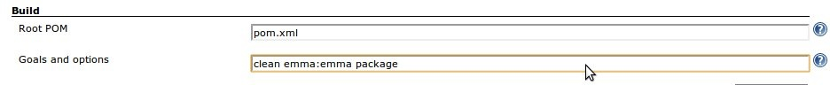
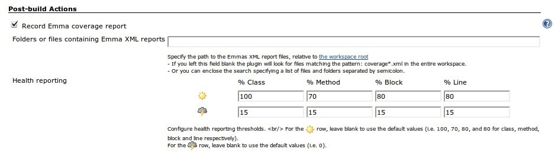
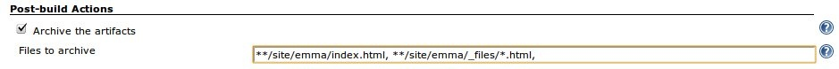

[.conf-macro .output-inline]#This plugin allows you to capture code
coverage report from http://emma.sf.net/[Emma]. Jenkins will generate
the trend report of coverage.#

[.aui-icon .aui-icon-small .aui-iconfont-info .confluence-information-macro-icon]#
#

This functionality is replaced by the
https://wiki.jenkins-ci.org/display/JENKINS/JaCoCo+Plugin[JaCoCo
Plugin] now!

[[EmmaPlugin-UsagewithMaven2]]
== Usage with Maven2

{empty}1. With maven 2.2.x you don't need to add anything to your POM
file.

{empty}2. Add the "emma:emma" goal to your build to generate Emma
reports.

[[EmmaPlugin-JenkinsConfiguration]]
=== Jenkins Configuration

1.- Add "emma:emma" goal to your maven Build
[.confluence-embedded-file-wrapper]## +
2.- Enable recording Emma coverage report, and configure it. +
[.confluence-embedded-file-wrapper]## +
3.- Optional: if you want to store html coverage files generated by
Emma, configure a post-build action to do that.
[.confluence-embedded-file-wrapper]##

[[EmmaPlugin-UsagewithANT]]
== Usage with ANT

1.- Create the taskdef and other necessary information for ANT:

[source,syntaxhighlighter-pre]
----
 <property name="coverage.dir" value="${basedir}/coverage" />
 <property name="emma.dir" value="/usr/bin/emma" />
 <property name="src.dir" value="${basedir}/src/"/>
 <property name="class.dir" value="${basedir}/class/"/>
 <property name="instrumented.dir" value="${basedir}/inst/"/>
 <path id="emma.lib">
     <fileset dir="${emma.dir}">
         <include name="*.jar"/>
     </fileset>
 </path>
   
 <taskdef resource="emma_ant.properties" classpathref="emma.lib" />
----

_coverage.dir_ is the location emma will generate the report data to,
and _emma.dir_ should be the location of the emma binaries on your
system. _src.dir_ is the location of your source files, _class.dir_ is
the location of your binary files to be instrumented, and
_instrumented.dir_ is the location to store the instrumented binaries.

2.- Tell emma where to find the code to instrument, and the new location
to place that code. Note that you must instrument the code before
running tests on it.

[source,syntaxhighlighter-pre]
----
 <emma enabled="true">
     <instr instrpath="${class.dir}" destdir="${instrumented.dir}" metadatafile="${coverage.dir}/metadata.emma" merge="true">
         <filter excludes="au.com.jenisys.view.*"/>
     </instr>
 </emma>
----

Use _instrpathref_ instead of _instrpath_ in conjunction with a
previously-defined _path_ for more complex setups. Use the _filter_
nested element to include or exclude certain code from being
instrumented. For more information on the _instr_ element, see
http://emma.sourceforge.net/reference/ch02s03.html

3.- After the instrumented code has been run, tell emma how to prepare
the reports:

[source,syntaxhighlighter-pre]
----
 <emma enabled="true" >
     <report sourcepath="${src.dir}" >
         <fileset dir="${coverage.dir}" >
             <include name="*.emma" />
         </fileset>

         <xml outfile="${coverage.dir}/coverage.xml" depth="method"/>
     </report>
 </emma>
----

This will generate an xml report, to the method depth of detail. For
more information on the report element, see
http://emma.sourceforge.net/reference/ch02s04.html

[[EmmaPlugin-ChangeLog]]
== Change Log

[[EmmaPlugin-Version1.28(May21,2012)]]
=== Version 1.28 (May 21, 2012)

* Do not sort "Total" row.
* Sort line numerically.
* Don't include jobs which doesn't have a coverage in dashboard.

[[EmmaPlugin-Version1.27(May5,2012)]]
=== Version 1.27 (May 5, 2012)

* Enable development in Eclipse under M2E plugin
(https://github.com/jenkinsci/emma-plugin/pull/2[pull request #2]).
* Failed to load
hudson.plugins.emma.portlet.grid.EmmaBuilderGrid$EmmaGridDescriptor
(https://issues.jenkins-ci.org/browse/JENKINS-12447[JENKINS-12447]).
* Failed to load
hudson.plugins.emma.portlet.chart.EmmaBuilderTrendChart$DescriptorImpl
(https://issues.jenkins-ci.org/browse/JENKINS-8839[JENKINS-8839]).
* Emma plugin causes maven release job to fail
(https://issues.jenkins-ci.org/browse/JENKINS-10236[JENKINS-10236]).

[[EmmaPlugin-Version1.26(Oct18,2011)]]
=== Version 1.26 (Oct 18, 2011)

* Fixed broken image link on config screen.
* expand job parameters for report search path
(https://issues.jenkins-ci.org/browse/JENKINS-11351[JENKINS-11351]).
* bumped dashboard plugin.
* added test class.

[[EmmaPlugin-Version1.25(May11,2011)]]
=== *Version 1.25 (May 11, 2011)*

* Fixed a NPE that could be thrown when parsing fails due to malformed
coverage.xml files.

[[EmmaPlugin-Version1.24(Feb8,2011)]]
=== *Version 1.24 (Feb 8, 2011)*

* Dashboard portlets. Emma portlets for the Dashboard view plugin, a
grid and a trend chart.

[[EmmaPlugin-Version1.23(unreleased)]]
=== Version 1.23 (unreleased)

[[EmmaPlugin-Version1.21(Sep11,2010)]]
=== Version 1.21 (Sep 11, 2010)

* Fixed deprecated API.
* Added Japanese localization.
* Restored the floatingBox.jelly which was deleted in previous
version.(https://issues.jenkins-ci.org/browse/JENKINS-7383[JENKINS-7383])
* Help file is missing, so deleted the
link.(https://issues.jenkins-ci.org/browse/JENKINS-7381[JENKINS-7381])
* Added enlarge link.
* Removed refresh from coverage
pages.(https://issues.jenkins-ci.org/browse/JENKINS-7428[JENKINS-7428])

[[EmmaPlugin-Version1.20(Mar18,2010)]]
=== Version 1.20 (Mar 18, 2010)

* Improve Styling

[[EmmaPlugin-Version1.16(Mar09,2010)]]
=== Version 1.16 (Mar 09, 2010)

* Fixed sort in tables

[[EmmaPlugin-Version1.12(Feb21,2010)]]
=== Version 1.12 (Feb 21, 2010)

* Support for multimodule projects
* Able to automatically look for `+coverage.xml+` files in the workspace
* Internationalization
* Spanish translation

[[EmmaPlugin-Version1.10(Jun9,2009)]]
=== Version 1.10 (Jun 9, 2009)

* Remote API improvement
(http://www.nabble.com/Adding-Remote-API-support-to-findbugs-and-emma-plugins-td23819499.html[patch])

[[EmmaPlugin-Version1.9(Apr6,2009)]]
=== Version 1.9 (Apr 6, 2009)

* Emma plugin now works with the Maven2 project type
(https://issues.jenkins-ci.org/browse/JENKINS-3424[JENKINS-3424])
