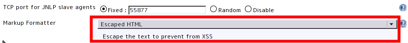
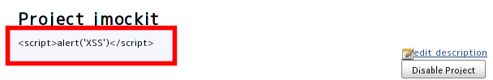

This plugin escapes the description of project, user, view, and build to
prevent from XSS.

*No longer needed as of 1.553.* The equivalent formatter is now in
Jenkins core.

[[EscapedMarkupPlugin-ConfigureGlobalSecuritypage]]
== Configure Global Security page

[x] Enable Security

[.confluence-embedded-file-wrapper .image-center-wrapper]##

[[EscapedMarkupPlugin-Projectpage]]
== Project page

[.confluence-embedded-file-wrapper .image-center-wrapper]##

[[EscapedMarkupPlugin-VersionHistory]]
== Version History

[[EscapedMarkupPlugin-Version0.1(22April,2011)]]
=== Version 0.1 (22 April, 2011)

* First release
