[.conf-macro .output-inline]##

[cols="",options="header",]
|===
|Plugin Information
|View Extra Columns https://plugins.jenkins.io/extra-columns[on the
plugin site] for more information.
|===

[.aui-icon .aui-icon-small .aui-iconfont-info .confluence-information-macro-icon]##

Older versions of this plugin may not be safe to use. Please review the
following warnings before using an older version:

* https://jenkins.io/security/advisory/2016-04-11/[Stored XSS
vulnerability]

This is a general listview-column plugin that currently contains the
following 16 columns: Build Description, Build Duration, Build
Parameters, Configure Project button, Disable/Enable Project button, Job
Type, Last Build Node, Last/Current Build Console output, Last Project
Configuration Modification, Periodic build trigger, Project Description,
SCM Type, Slave or label restriction, Test Result, User name, Workspace
link.

[[ExtraColumnsPlugin-Description]]
== Description

This plugin is supposed to group multiple extra columns in one
convenient plug-in. Maybe other simple column plug-ins can be merged
into this one in the future.

[[ExtraColumnsPlugin-Columns]]
== Columns

[cols=",,,,",options="header",]
|===
|Column name |Description |Preview |Configurable? |Config Preview
|Build Description |Shows the build description of the last build. a|
[.confluence-embedded-file-wrapper]#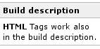#

|Yes a|
[.confluence-embedded-file-wrapper]#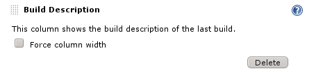#

|Build Duration |Shows either since when a job is running or the average
build duration. a|
[.confluence-embedded-file-wrapper]#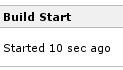#
or
[.confluence-embedded-file-wrapper]#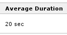#

|Yes a|
[.confluence-embedded-file-wrapper]#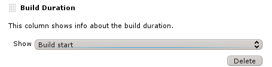#

|Build Parameters |Shows either a single or all build parameters of the
last/current build. a|
[.confluence-embedded-file-wrapper]#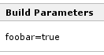#

|Yes a|
[.confluence-embedded-file-wrapper]#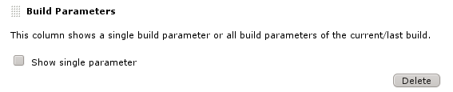#

|Configure Project button |Let's you jump straight to the project
configuration with one click. a|
[.confluence-embedded-file-wrapper]##

|No | +

|Disable/Enable Project button/icon |Allows you to easily disable and
re-enable a project. a|
[.confluence-embedded-file-wrapper]#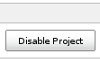#
or
[.confluence-embedded-file-wrapper]#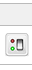#

|Yes a|
[.confluence-embedded-file-wrapper]#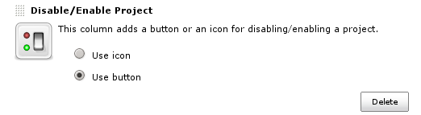#

|Job Type |Shows the type of job. +
Currently supported types: Free-style, Maven, Multi-config, External,
Multi-job, Ivy. a|
[.confluence-embedded-file-wrapper]#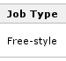#

|Yes a|
[.confluence-embedded-file-wrapper]#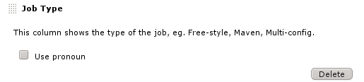#

|Last Build |This column shows the last build (start or end). | + |Yes
| +

|Last Build Node |Shows the name of the node on which the last build was
executed (migrated from
https://wiki.jenkins-ci.org/display/JENKINS/Build+Node+Column+Plugin[Build
Node Column Plugin]). | + |No | +

|Last/Current Build Console Output |Provides a link to the console
output of the last/current build. a|
[.confluence-embedded-file-wrapper]#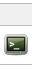#

|No | +

|Last Project Configuration Modification |Shows the last modification of
the project. | + |No | +

|Periodic build trigger |Shows the periodic trigger in cron format | +
|No | +

|Project Description |Shows the project description. a|
[.confluence-embedded-file-wrapper]#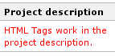#

|Yes a|
[.confluence-embedded-file-wrapper]#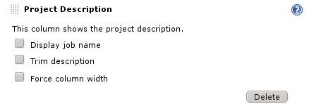#

|SCM Type a|
Shows the type of source code management (eg. CVS, SVN, Git) that is
used in the project.

*Please note:* for Workflow Jobs, only the used SCM type of the last
build is shown. So the job has to run at least once.

a|
[.confluence-embedded-file-wrapper]#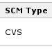#

|No | +

|Slave or label restriction |Shows the slave name or the the label
restriction of a project. | + |No | +

|Test Result |Shows the number of successful/failed tests of a project
at a glance. a|
[.confluence-embedded-file-wrapper]#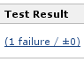#

|Yes a|
[.confluence-embedded-file-wrapper]#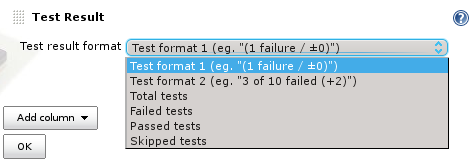#

|User name |Shows the name of the user that started the last build. | +
|No | +

|Workspace |Shows a link to the workspace | + |No | +
|===

Information

[.aui-icon .aui-icon-small .aui-iconfont-info .confluence-information-macro-icon]#
#

If you have suggestions for new columns, please open a feature request
in JIRA using "extra-columns" as component.

[[ExtraColumnsPlugin-Howtoaddcolumns]]
== How to add columns

* Create a new view by clicking on the "+" tab, select list view as type
and name it. At the bottom of the configuration page of the new view you
can add more columns and change their order.
* If you want to add columns to the *All* view, follow the guide on the
https://wiki.jenkins-ci.org/display/JENKINS/Editing+or+Replacing+the+All+View[Editing
or Replacing the All View] wiki page.

[[ExtraColumnsPlugin-Howtoconfigurecolumns]]
== How to configure columns

Columns can be configured on the "Edit view" page.

[[ExtraColumnsPlugin-Screenshot]]
== Screenshot

[.confluence-embedded-file-wrapper]#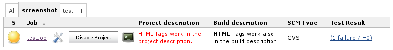#

[[ExtraColumnsPlugin-KnownIssues]]
== Known Issues

* Before Jenkins version 1.511, the "Build Parameters" column also shows
the type of the parameter (e.g. "(BooleanParameterValue) foobar='true'")
and does not support password parameters

[[ExtraColumnsPlugin-BuildStatus]]
== Build Status

https://jenkins.ci.cloudbees.com/job/plugins/job/extra-columns-plugin/[[.confluence-embedded-file-wrapper]#image:https://jenkins.ci.cloudbees.com/buildStatus/icon?job=plugins/extra-columns-plugin[image]#]

[[ExtraColumnsPlugin-Changelog]]
== Changelog

 +

[[ExtraColumnsPlugin-Version1.21(September28,2019)]]
=== Version 1.21 (September 28, 2019)

* Fixed "Multiple Build Duration Columns resets values when returning to
edit view"
(https://issues.jenkins-ci.org/browse/JENKINS-57141[JENKINS-57141],
https://github.com/jenkinsci/extra-columns-plugin/pull/18[Pull request
#18], thanks to Stuart )
* Use Regex to filter build parameters in Build Parameter Column
(https://issues.jenkins-ci.org/browse/JENKINS-51171[JENKINS-51171],
https://issues.jenkins-ci.org/browse/JENKINS-43605[JENKINS-43605])
* Added new column "Last Build"
(https://issues.jenkins-ci.org/browse/JENKINS-54567[JENKINS-54567],
https://issues.jenkins-ci.org/browse/JENKINS-29655[JENKINS-29655],
https://issues.jenkins-ci.org/browse/JENKINS-20953[JENKINS-20953])
* Fixed link to workspace for pipeline jobs in Workspace column
* Do not show workspace link for folders, Matrix or Workflow jobs in
Workspace column

[[ExtraColumnsPlugin-Version1.20(August8,2018)]]
=== Version 1.20 (August 8, 2018)

* Fixed ClassCastException
(https://github.com/jenkinsci/extra-columns-plugin/pull/17[Pull request
#17], thanks to Jochen)
* "SCM Type" column now also supports Workflow jobs
* Bumped minimum Jenkins version to 1.607 (due to failing InjectedTests)

[[ExtraColumnsPlugin-Version1.19(July18,2018)]]
=== Version 1.19 (July 18, 2018)

* Added new column "Periodic build trigger"
(https://github.com/jenkinsci/extra-columns-plugin/pull/15[Pull request
#15], thanks to Sanketh)
* Added compact version of "Build Duration" column
(https://github.com/jenkinsci/extra-columns-plugin/pull/16[Pull request
#16], thanks to
[.p-name .vcard-fullname .d-block .overflow-hidden]#Sorin#)
* Fixed issue with Periodic Build Trigger Column not being shown for
pipeline jobs
(https://issues.jenkins-ci.org/browse/JENKINS-52403[JENKINS-52403,]
thanks to Sam)

[[ExtraColumnsPlugin-Version1.18(March8,2017)]]
=== Version 1.18 (March 8, 2017)

* Bumped minimum Jenkins version to 1.580 (due to Maven enforcer plugin
errors)
* Got rid of a ClassCastException related to WorkflowJob/Pipeline and
LastBuildNodeColumn
(https://issues.jenkins-ci.org/browse/JENKINS-40477[JENKINS-40477])
* Added support for Multibranch Pipeline in JobTypeColumn
* Added support for WorkflowJob/Pipeline in JobTypeColumn
(https://github.com/jenkinsci/extra-columns-plugin/pull/14[Pull request
#14], thanks to Mark)

[[ExtraColumnsPlugin-Version1.17(April11,2016)]]
=== Version 1.17 (April 11, 2016)

* Added dependency to
https://wiki.jenkins-ci.org/display/JENKINS/JUnit+Plugin[JUnit plugin]
* Fixed security issue SECURITY-136 / CVE-2016-3101 (see
https://wiki.jenkins-ci.org/display/SECURITY/Jenkins+Security+Advisory+2016-04-11[Jenkins
Security Advisory 2016-04-11])

[[ExtraColumnsPlugin-Version1.16(December11,2015)]]
=== Version 1.16 (December 11, 2015)

* Added new column "User name"
(https://issues.jenkins-ci.org/browse/JENKINS-31959[JENKINS-31959])
* Added potential fix for
(https://issues.jenkins-ci.org/browse/JENKINS-21870[JENKINS-21870])
* Added new column "Last build node" (based on
https://wiki.jenkins-ci.org/display/JENKINS/Build+Node+Column+Plugin[Build
Node Column Plugin], which has now been deprecated)

[[ExtraColumnsPlugin-Version1.15(February25,2015)]]
=== Version 1.15 (February 25, 2015)

* Fixed problem with incorrect link in column "Test Result" since
Jenkins v1.568
(https://issues.jenkins-ci.org/browse/JENKINS-23583[JENKINS-23583],
https://github.com/jenkinsci/extra-columns-plugin/pull/11[Pull request
#11], thanks to stephenthornhill)
* "Slave or label restriction of a job": added links to slaves, added
white space between label and description
* Added new column "Workspace link"
(https://github.com/jenkinsci/extra-columns-plugin/pull/9[Pull request
#9], thanks to Ulli)

[[ExtraColumnsPlugin-Version1.14(March21,2014)]]
=== Version 1.14 (March 21, 2014)

* "Build Parameters" column configuration was not saved
(https://issues.jenkins-ci.org/browse/JENKINS-21929[JENKINS-21929])
* "Build Description" and "Project Description" column configuration was
not saved
(https://issues.jenkins-ci.org/browse/JENKINS-21295[JENKINS-21295])
* Making on/off "lights" in enabled/disabled switch images more obvious
(https://issues.jenkins-ci.org/browse/JENKINS-21296[JENKINS-21296],
https://github.com/jenkinsci/extra-columns-plugin/pull/8[Pull request
#8], thanks to dankirkd)
* Added new column "Slave or label restriction of a job"
(https://issues.jenkins-ci.org/browse/JENKINS-21037[JENKINS-21037],
https://github.com/jenkinsci/extra-columns-plugin/pull/6[Pull request
#6], thanks to krulls)
* Added new column "Last modification of job configuration"
(https://issues.jenkins-ci.org/browse/JENKINS-21035[JENKINS-21035],
https://github.com/jenkinsci/extra-columns-plugin/pull/7[Pull request
#7], thanks to krulls)

[[ExtraColumnsPlugin-Version1.13(December17,2013)]]
=== Version 1.13 (December 17, 2013)

* Added new column "Build Parameters", which can be configured to show
either a single or all build parameters of the last/current build.
(https://issues.jenkins-ci.org/browse/JENKINS-20910[JENKINS-20910])

[[ExtraColumnsPlugin-Version1.12(November13,2013)]]
=== Version 1.12 (November 13, 2013)

* Added new column "Build Duration", which can be configured to show
"Build Start" or "Average Build Duration".
(https://issues.jenkins-ci.org/browse/JENKINS-19534[JENKINS-19534],
https://issues.jenkins-ci.org/browse/JENKINS-20361[JENKINS-20361])
* Added support for Cloudbees folders and templates in Job Type Column
(https://issues.jenkins-ci.org/browse/JENKINS-20278[JENKINS-20278])
* Added option for explicit limitation of column widths in Build/Project
description columns
(https://issues.jenkins-ci.org/browse/JENKINS-20144[JENKINS-20144])
* "Build Description" column should reflect previous build while another
is in process
(https://issues.jenkins-ci.org/browse/JENKINS-19021[JENKINS-19021])

[[ExtraColumnsPlugin-Version1.11(July31,2013)]]
=== Version 1.11 (July 31, 2013)

* Added missing TestResultColumn() constructor
(https://issues.jenkins-ci.org/browse/JENKINS-18930[JENKINS-18930])

[[ExtraColumnsPlugin-Version1.10(July15,2013)]]
=== Version 1.10 (July 15, 2013)

* Added new column "Job Type" by request
(https://issues.jenkins-ci.org/browse/JENKINS-18640[JENKINS-18640])

[[ExtraColumnsPlugin-Version1.9(June15,2013)]]
=== Version 1.9 (June 15, 2013)

* Support folders in "Project Description" column (thanks to jglick)
(https://github.com/jenkinsci/extra-columns-plugin/pull/2[Pull request
#2])
* Check _supportsMakeDisabled_ method before creating enable/disable
button, bumped required Jenkins version to 1.475, use absolute URL for
enable/disable action (thanks to ndeloof)
(https://github.com/jenkinsci/extra-columns-plugin/pull/1[Pull request
#1])
* Converted job name in "Project Description" column to a link ("Display
job name" option must be set in configuration)
(https://issues.jenkins-ci.org/browse/JENKINS-18013[JENKINS-18013])

[[ExtraColumnsPlugin-Version1.8(Januar24,2013)]]
=== Version 1.8 (Januar 24, 2013)

* Fixed problem with "Disable/Enable Project" column
(https://issues.jenkins-ci.org/browse/JENKINS-16445[JENKINS-16445])
* Added workarounds for missing icons in different sizes

[[ExtraColumnsPlugin-Version1.7(Januar20,2013)]]
=== Version 1.7 (Januar 20, 2013)

* Added an icon as alternative to the button to enable/disable projects.
The button is the still the default, but it can be configured to use an
icon instead. (inspired by
https://issues.jenkins-ci.org/browse/JENKINS-16381[JENKINS-16381])
* Added preview icons on the "Edit View" page.
* Added new column "Last/Current Build Console Output"
(https://issues.jenkins-ci.org/browse/JENKINS-16386[JENKINS-16386])

[[ExtraColumnsPlugin-Version1.6(October17,2012)]]
=== Version 1.6 (October 17, 2012)

* "Test Result" column can now be configured
(https://issues.jenkins-ci.org/browse/JENKINS-15155[JENKINS-15155],
https://issues.jenkins-ci.org/browse/JENKINS-13702[JENKINS-13702])

[[ExtraColumnsPlugin-Version1.5(June27,2012)]]
=== Version 1.5 (June 27, 2012)

* Fixed problem with embedded HTML in "Build Description" and "Project
Description" columns
(https://issues.jenkins-ci.org/browse/JENKINS-14209[JENKINS-14209])

[[ExtraColumnsPlugin-Version1.4(June22,2012)]]
=== Version 1.4 (June 22, 2012)

* Added "SCM Type" column
(https://issues.jenkins-ci.org/browse/JENKINS-14166[JENKINS-14166])
* Fixed link to aggregated test results (thanks to Jim Bim)
(https://issues.jenkins-ci.org/browse/JENKINS-13679[JENKINS-13679])

[[ExtraColumnsPlugin-Version1.3(April6,2012)]]
=== Version 1.3 (April 6, 2012)

* Added "Build Description" column
* Added Japanese translation (thanks to tyuki39)

[[ExtraColumnsPlugin-Version1.2(November17,2011)]]
=== Version 1.2 (November 17, 2011)

* "Test Result" column is now sorted numerically
(https://issues.jenkins-ci.org/browse/JENKINS-11765[JENKINS-11765])
* Added French translation (thanks to Axel Haustant)

[[ExtraColumnsPlugin-Version1.1(September16,2011)]]
=== Version 1.1 (September 16, 2011)

* Added "Description Column" from
https://wiki.jenkins-ci.org/display/JENKINS/Description+Column+Plugin[description-column-plugin]
by courtesy of Axel Haustant
* Starting with Jenkins version 1.430 the small icon for the configure
link is used when switching to small symbols
* Bumped required Jenkins version to 1.417 to be able to use backward
compatibility code
* "Disable/Enable Project" button now uses AJAX.
* Added descriptions on the "Edit View" configuration page.
* Columns are not added to the views by default anymore.

[[ExtraColumnsPlugin-Version1.0(May01,2011)]]
=== Version 1.0 (May 01, 2011)

* Initial release.
