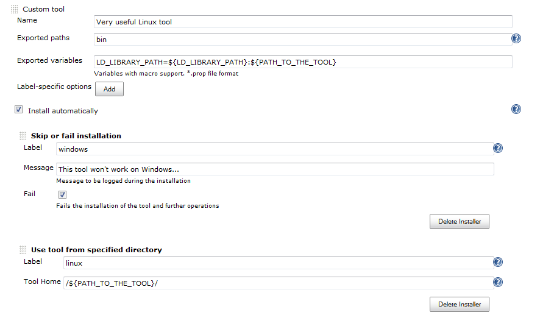
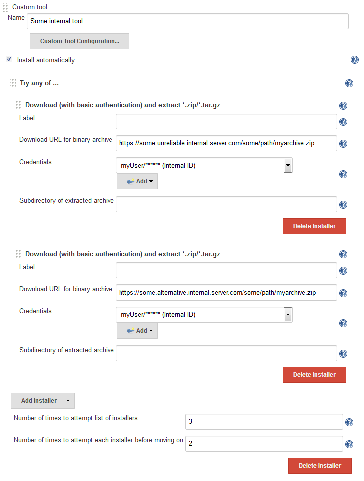

[.conf-macro .output-inline]##

[cols="",options="header",]
|===
|Plugin Information
|View Extra Tool Installers
https://plugins.jenkins.io/extra-tool-installers[on the plugin site] for
more information.
|===

[.aui-icon .aui-icon-small .aui-iconfont-warning .confluence-information-macro-icon]##

*This plugin is up for adoption.* Want to help improve this plugin?
https://wiki.jenkins.io/display/JENKINS/Adopt+a+Plugin[Click here to
learn more]!

Provides additional tool installation methods.

[[ExtraToolInstallersPlugin-ExtraToolInstallers]]
== Extra Tool Installers

http://www.jenkinsci.org/[Jenkins] plugin. Provides additional tool
installers.

[[ExtraToolInstallersPlugin-Features]]
=== Features

Plugin provides following installers:

* Batch command installer for Windows.
** This is functionally similar to the core code BatchCommandInstaller,
but this one performs variable substitution on the batch script before
it is executed.
** Useful when you want your installation script to take node-specific
variables into account.
* Install from a specified folder +
** Setup without any actions (ex, "installation" from a shared
directory)
** Useful when a tool is pre-installed on nodes matching a particular
label expression
* Skip or fail installation +
** Prints warnings during the installation and/or fails the installation
** Useful when a tool is not available on nodes matching a particular
label expression
* Download (with basic authentication) and extract a zip/tar.gz
** This is functionally similar to the core code "Extract .zip/.tar.gz"
installer, but this supports HTTP Basic Authentication for the download.
** Useful when you need to download from servers that do not permit
anonymous downloads.
* Try any of ...
** Used to try (and possibly re-try) one or more nested installers until
one succeeds.
** Useful when using e.g. Extract .zip/tar.gz installers that are
downloading from URLs which cannot be relied upon.

Example of installers usage in the
https://wiki.jenkins-ci.org/display/JENKINS/Custom+Tools+Plugin[Custom
Tools Plugin]: +
[.confluence-embedded-file-wrapper .confluence-embedded-manual-size]##

Example of using the "Try any of..." and "basic-auth" installers to try
downloading a custom tool from either of two (unreliable) internal
servers, retrying if necessary:

[.confluence-embedded-file-wrapper .confluence-embedded-manual-size]##

[[ExtraToolInstallersPlugin-License]]
=== License

http://www.opensource.org/licenses/mit-license.php[MIT License]

[[ExtraToolInstallersPlugin-JIRAIssues]]
=== JIRA Issues

[[refresh-module--349524173]]
[[refresh--349524173]][[jira-issues--349524173]]
T

Key

Summary

Assignee

Reporter

P

Status

Resolution

Created

Updated

Due

[.refresh-action-group]# #

[[refresh-issues-loading--349524173]]
[.aui-icon .aui-icon-wait]#Loading...#

[#refresh-issues-button--349524173]##
[#refresh-issues-link--349524173]#Refresh#
[#error-message--349524173 .error-message .hidden]# #

[[ExtraToolInstallersPlugin-VersionHistory]]
== Version History

[[ExtraToolInstallersPlugin-Version0.5(Feb08,2019)]]
=== Version 0.5 (Feb 08, 2019)

* image:docs/images/add.svg[(plus)]
Added the "Download (with basic authentication) and extract
.zip/.tar.gz" installer
* image:docs/images/add.svg[(plus)]
Added the "Try any of ..." installer

[[ExtraToolInstallersPlugin-Version0.4(Dec12,2017)]]
=== Version 0.4 (Dec 12, 2017)

* image:docs/images/information.svg[(info)]
Update the core requirement to 1.651.3
* image:docs/images/error.svg[(error)]
Cleanup the documentation and minor issues reported by FindBugs

[[ExtraToolInstallersPlugin-Version0.3(01/19/2014)]]
=== Version 0.3 (01/19/2014)

* image:docs/images/error.svg[(error)]
Added a home directory to the stub installer to avoid validation
failures => warnings support
(https://issues.jenkins-ci.org/browse/JENKINS-19527[JENKINS-19527])
* image:docs/images/add.svg[(plus)]
Parameters substitution error check is optional (false by default)
* image:docs/images/information.svg[(info)]
Renamed BatchCommandInstaller to avoid display name conflicts
(https://issues.jenkins-ci.org/browse/JENKINS-21202[JENKINS-21202])

[[ExtraToolInstallersPlugin-Version0.2(08/16/2013)]]
=== Version 0.2 (08/16/2013)

* image:docs/images/add.svg[(plus)]
Stub installer: Print warning message or fail the build
* image:docs/images/add.svg[(plus)]
Support of variables substitution in the "Tool Home" and stub
installer's "Message"

[[ExtraToolInstallersPlugin-Version0.1(07/20/2013)]]
=== Version 0.1 (07/20/2013)

* image:docs/images/add.svg[(plus)]
Batch Command Installer
* image:docs/images/add.svg[(plus)]
Shared Directory Installer ("install from the specified folder")
