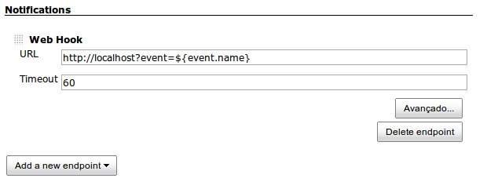
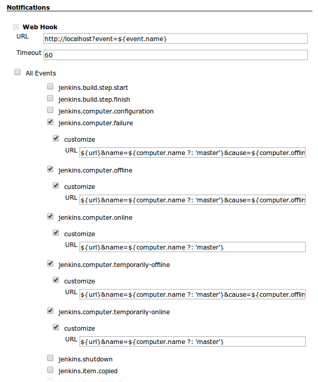

[.conf-macro .output-inline]# #

[.aui-icon .aui-icon-small .aui-iconfont-error .confluence-information-macro-icon]##

The current version of this plugin may not be safe to use. Please review
the following warnings before use:

* https://jenkins.io/security/advisory/2017-04-10/[Arbitrary code
execution vulnerability in rare circumstances]

This plugin can notify some endpoints about events that occur in Jenkins

[[ExtremeNotificationPlugin-Endpoints]]
== Endpoints

[[ExtremeNotificationPlugin-WebHook]]
=== WebHook

[.confluence-embedded-file-wrapper]##

Advanced event configuration:

[.confluence-embedded-file-wrapper]##

[[ExtremeNotificationPlugin-Logging]]
=== Logging

TODO

[[ExtremeNotificationPlugin-Enpoints]]
== Enpoints

[[ExtremeNotificationPlugin-jenkins.build.step.start]]
=== jenkins.build.step.start

http://javadoc.jenkins.io/hudson/model/AbstractBuild.html[AbstractBuild]
build, http://javadoc.jenkins.io/hudson/tasks/BuildStep.html[BuildStep]
bs,
http://javadoc.jenkins.io/hudson/model/BuildListener.html[BuildListener]
listener

[[ExtremeNotificationPlugin-jenkins.build.step.finish]]
=== jenkins.build.step.finish

http://javadoc.jenkins.io/hudson/model/AbstractBuild.html[AbstractBuild]
build, http://javadoc.jenkins.io/hudson/tasks/BuildStep.html[BuildStep]
bs,
http://javadoc.jenkins.io/hudson/model/BuildListener.html[BuildListener]
listener, boolean canContinue

[[ExtremeNotificationPlugin-jenkins.computer.configuration]]
=== jenkins.computer.configuration

[[ExtremeNotificationPlugin-jenkins.computer.failure]]
=== jenkins.computer.failure

http://javadoc.jenkins.io/hudson/model/Computer.html[Computer] computer,
http://javadoc.jenkins.io/hudson/model/TaskListener.html[TaskListener]
listener

[[ExtremeNotificationPlugin-jenkins.computer.offline]]
=== jenkins.computer.offline

http://javadoc.jenkins.io/hudson/model/Computer.html[Computer] computer

[[ExtremeNotificationPlugin-jenkins.computer.online]]
=== jenkins.computer.online

http://javadoc.jenkins.io/hudson/model/Computer.html[Computer] computer,
http://javadoc.jenkins.io/hudson/model/TaskListener.html[TaskListener]
listener

[[ExtremeNotificationPlugin-jenkins.computer.temporarily-offline]]
=== jenkins.computer.temporarily-offline

http://javadoc.jenkins.io/hudson/model/Computer.html[Computer] computer,
http://javadoc.jenkins.io/hudson/slaves/OfflineCause.html[OfflineCause]
cause

[[ExtremeNotificationPlugin-jenkins.computer.temporarily-online]]
=== jenkins.computer.temporarily-online

http://javadoc.jenkins.io/hudson/model/Computer.html[Computer] computer

[[ExtremeNotificationPlugin-jenkins.item.copied]]
=== jenkins.item.copied

http://javadoc.jenkins.io/hudson/model/Item.html[Item] item

[[ExtremeNotificationPlugin-jenkins.item.created]]
=== jenkins.item.created

http://javadoc.jenkins.io/hudson/model/Item.html[Item] item

[[ExtremeNotificationPlugin-jenkins.item.deleted]]
=== jenkins.item.deleted

http://javadoc.jenkins.io/hudson/model/Item.html[Item] item

[[ExtremeNotificationPlugin-jenkins.loaded]]
=== jenkins.loaded

[[ExtremeNotificationPlugin-jenkins.item.renamed]]
=== jenkins.item.renamed

http://javadoc.jenkins.io/hudson/model/Item.html[Item] item, String
oldName, String newName

[[ExtremeNotificationPlugin-jenkins.item.updated]]
=== jenkins.item.updated

http://javadoc.jenkins.io/hudson/model/Item.html[Item] item

[[ExtremeNotificationPlugin-jenkins.job.started]]
=== jenkins.job.started

http://javadoc.jenkins.io/hudson/model/Run.html[Run] run,
http://javadoc.jenkins.io/hudson/model/TaskListener.html[TaskListener]
listener

[[ExtremeNotificationPlugin-jenkins.job.completed]]
=== jenkins.job.completed

http://javadoc.jenkins.io/hudson/model/Run.html[Run] run,
http://javadoc.jenkins.io/hudson/model/TaskListener.html[TaskListener]
listener

[[ExtremeNotificationPlugin-jenkins.job.finalized]]
=== jenkins.job.finalized

http://javadoc.jenkins.io/hudson/model/Run.html[Run] run

[[ExtremeNotificationPlugin-jenkins.job.deleted]]
=== jenkins.job.deleted

http://javadoc.jenkins.io/hudson/model/Run.html[Run] run

[[ExtremeNotificationPlugin-jenkins.matrix-config.started]]
=== jenkins.matrix-config.started

http://javadoc.jenkins.io/hudson/model/Run.html[Run] run,
http://javadoc.jenkins.io/hudson/model/TaskListener.html[TaskListener]
listener

[[ExtremeNotificationPlugin-jenkins.matrix-config.completed]]
=== jenkins.matrix-config.completed

http://javadoc.jenkins.io/hudson/model/Run.html[Run] run,
http://javadoc.jenkins.io/hudson/model/TaskListener.html[TaskListener]
listener

[[ExtremeNotificationPlugin-jenkins.matrix-config.finalized]]
=== jenkins.matrix-config.finalized

http://javadoc.jenkins.io/hudson/model/Run.html[Run] run

[[ExtremeNotificationPlugin-jenkins.matrix-config.deleted]]
=== jenkins.matrix-config.deleted

http://javadoc.jenkins.io/hudson/model/Run.html[Run] run

[[ExtremeNotificationPlugin-jenkins.saveable.change]]
=== jenkins.saveable.change

http://javadoc.jenkins.io/hudson/model/Saveable.html[Saveable] saveable,
http://javadoc.jenkins.io/hudson/XmlFile.html[XmlFile] file

[[ExtremeNotificationPlugin-jenkins.scm.changelog.parsed]]
=== jenkins.scm.changelog.parsed

http://javadoc.jenkins.io/hudson/model/AbstractBuild.html[AbstractBuild]
build,
http://javadoc.jenkins.io/hudson/model/BuildListener.html[BuildListener]
listener,
http://javadoc.jenkins.io/hudson/scm/ChangeLogSet.html[ChangeLogSet]
changelog

[[ExtremeNotificationPlugin-jenkins.scm.poll.before]]
=== jenkins.scm.poll.before

http://javadoc.jenkins.io/hudson/model/AbstractProject.html[AbstractProject]
project,
http://javadoc.jenkins.io/hudson/model/TaskListener.html[TaskListener]
listener

[[ExtremeNotificationPlugin-jenkins.scm.poll.success]]
=== jenkins.scm.poll.success

http://javadoc.jenkins.io/hudson/model/AbstractProject.html[AbstractProject]
project,
http://javadoc.jenkins.io/hudson/model/TaskListener.html[TaskListener]
listener,
http://javadoc.jenkins.io/hudson/model/PollingResult.html[PollingResult]
result

[[ExtremeNotificationPlugin-jenkins.scm.poll.failed]]
=== jenkins.scm.poll.failed

http://javadoc.jenkins.io/hudson/model/AbstractProject.html[AbstractProject]
project,
http://javadoc.jenkins.io/hudson/model/TaskListener.html[TaskListener]
listener, Throwable exception

[[ExtremeNotificationPlugin-jenkins.started]]
=== jenkins.started

[[ExtremeNotificationPlugin-jenkins.plugins.listed]]
=== jenkins.plugins.listed

[[ExtremeNotificationPlugin-jenkins.plugins.prepared]]
=== jenkins.plugins.prepared

[[ExtremeNotificationPlugin-jenkins.plugins.prepared.1]]
=== jenkins.plugins.prepared

[[ExtremeNotificationPlugin-jenkins.plugins.started]]
=== jenkins.plugins.started

[[ExtremeNotificationPlugin-jenkins.plugins.augmented]]
=== jenkins.plugins.augmented

[[ExtremeNotificationPlugin-jenkins.jobs.loaded]]
=== jenkins.jobs.loaded

[[ExtremeNotificationPlugin-jenkins.completed]]
=== jenkins.completed

[[ExtremeNotificationPlugin-jenkins.shutdown]]
=== jenkins.shutdown

NOOP
