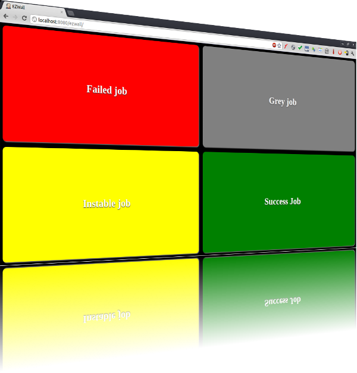

[[EzWallPlugin-EzWallPlugin]]
== EzWall Plugin

 +

Add a button to display a fullscreen buildwall on each view.

[[EzWallPlugin-Configuration]]
=== Configuration

Just activate the plugin and lick on the EzWall button on any view.

Poll interval is configurable through Jenkins configuration page in the
EzWall section and modifiable in the settings view when the wall is
displayed.

[[EzWallPlugin-Screenshots]]
=== Screenshots

[.confluence-embedded-file-wrapper]##

 +

'''''

 +

[[EzWallPlugin-Changelog]]
=== Changelog

[[EzWallPlugin-0.3]]
==== 0.3

* Added option to change the flashing of builds to be more subtle
* Fixed missing contentType header
* Fixed issue where jobs would stick with part of the building flash
effect applied

*0.2*

* Gravatar support (optionnal)
* Job number display (optionnal)
* User name display (optionnal)
* Better style (orange instable job, better blinking...)

[[EzWallPlugin-0.1(18Feb,2012)]]
==== 0.1 (18 Feb, 2012)

* First version
* Display on all views
* Configurable polling
