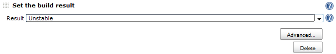
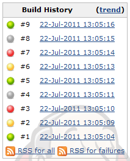

https://wiki.jenkins-ci.org/display/JENKINS/Fail+The+Build+Plugin#FailTheBuildPlugin-features[Features] +
https://wiki.jenkins-ci.org/display/JENKINS/Fail+The+Build+Plugin#FailTheBuildPlugin-compatibility[Compatibility] +
https://wiki.jenkins-ci.org/display/JENKINS/Fail+The+Build+Plugin#FailTheBuildPlugin-install[Install] +
https://wiki.jenkins-ci.org/display/JENKINS/Fail+The+Build+Plugin#FailTheBuildPlugin-configuration[Configure] +
https://wiki.jenkins-ci.org/display/JENKINS/Fail+The+Build+Plugin#FailTheBuildPlugin-changelog[Change
log]

[#FailTheBuildPlugin-features .confluence-anchor-link .conf-macro .output-inline]#
#

[[FailTheBuildPlugin-Features]]
== Features

* Set or change the status of a build +
This plugin is provided to help test the behaviour of your Jenkins
configuration. +
Use this plugin to test notifiers, publishers, promotions, build
pipelines ...

[.aui-icon .aui-icon-small .aui-iconfont-info .confluence-information-macro-icon]#
#

You can only make the build result worse than it is at the point the
build step runs!

[#FailTheBuildPlugin-compatibility .confluence-anchor-link .conf-macro .output-inline]#
#

[[FailTheBuildPlugin-Compatibility]]
== Compatibility

This plugin is compatible with any version of *Jenkins* (1.396+)

[#FailTheBuildPlugin-install .confluence-anchor-link .conf-macro .output-inline]#
#

[[FailTheBuildPlugin-Install]]
== Install

Install from the Plugin Manager (Manage Jenkins > Manage Plugins) under
"Build Tools".

To install manually, download the latest plugin from
http://mirrors.jenkins-ci.org/plugins/fail-the-build-plugin/ and use the
Upload Plugin option in the Advanced tab of the Plugin Manager.

[#FailTheBuildPlugin-configuration .confluence-anchor-link .conf-macro .output-inline]#
#

[[FailTheBuildPlugin-Configure]]
== Configure

Add the build step, by clicking "Add build step" and selecting "Set the
build result"

[.confluence-embedded-file-wrapper]##

[[FailTheBuildPlugin-Result]]
=== Result

Select the status that you want. Options are Success, Unstable, Failed,
Aborted, and Cycle.

Selecting Cycle will cause the result to cycle based on the build
number. Image of Build history with Cycle selected below.

[.confluence-embedded-file-wrapper]##

[[FailTheBuildPlugin-Advancedoptions]]
=== Advanced options

Click the Advanced button to enable the results to be set for specific
build numbers.

[.confluence-embedded-file-wrapper]#image:docs/images/failTheBuild-advanced.png[image]#

[[FailTheBuildPlugin-Success,Unstable,Failed,Aborted]]
==== Success, Unstable, Failed, Aborted

For each result, a list of build numbers for which it should be set
instead of the value in the Result drop down.

[#FailTheBuildPlugin-changelog .confluence-anchor-link .conf-macro .output-inline]#
#

[[FailTheBuildPlugin-Changelog]]
== Change log

[[FailTheBuildPlugin-1.0(18/07/2011)]]
=== 1.0 (18/07/2011)

* Initial release

Questions, Comments, Bugs and Feature Requests

[.aui-icon .aui-icon-small .aui-iconfont-info .confluence-information-macro-icon]#
#

Please post questions or comments about this plugin to the
http://jenkins-ci.org/content/mailing-lists[Jenkins User mailing
list]. +
To report a bug or request an enhancement to this plugin please
http://issues.jenkins-ci.org/browse/JENKINS/component/15895[create a
ticket in JIRA].
