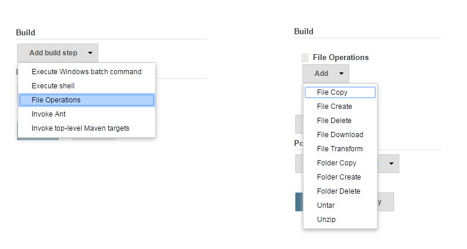

[[FileOperationsPlugin-About]]
== About

This plugin's main goal is to provide File Operations as Build Step.

Following Operations implemented:

{empty}1) File Copy Operation

{empty}2) File Delete Operation

{empty}3) File Create Operation

{empty}4) File Download Operation

{empty}5) File Transform Operation

{empty}6) File UnTar Operation

{empty}7) File UnZip Operation

{empty}8) Folder Create Operation

{empty}9) Folder Copy Operation

{empty}10) Folder Delete Operation

{empty}11) File Join

{empty}12) File Properties To Json

{empty}13) File Zip Operation

{empty}14) File Rename Operation

{empty}15) Folder Rename Operation

This will be helpful for doing cross platform file operations. No need
to search for Nix or Win commands to do file operations.

[[FileOperationsPlugin-Screenshot]]
== Screenshot

[.confluence-embedded-file-wrapper]##

[[FileOperationsPlugin-Release1.7(4September2017)]]
== Release 1.7 (4 September 2017)

* Added File Rename Operation
* Added Folder Rename Operation

[[FileOperationsPlugin-Release1.6(4May2017)]]
== Release 1.6 (4 May 2017)

* Fixed download failed due to empty credentials even though if it open
for public

[[FileOperationsPlugin-Release1.5(7April2017)]]
== Release 1.5 (7 April 2017)

* Added File Zip Operation

[[FileOperationsPlugin-Release1.4(5March2017)]]
== Release 1.4 (5 March 2017)

* Added Symbols for Jenkins pipeline

[[FileOperationsPlugin-Release1.3(3October2016)]]
== Release 1.3 (3 October 2016)

* Added Job DSL support

[[FileOperationsPlugin-Release1.2(26June2016)]]
== Release 1.2 (26 June 2016)

* Added 11 & 12 operations

[[FileOperationsPlugin-Release1.1(28May2016)]]
== Release 1.1 (28 May 2016)

* Added support for pipeline

[[FileOperationsPlugin-Release1.0(22April2016)]]
== Release 1.0 (22 April 2016)

* First public release with 1 to 10 operations
