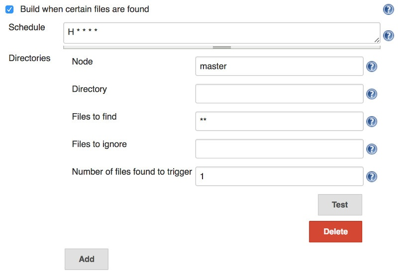

Build trigger that polls one or more directories and starts a build if
certain files are found within those directories.

Compatible with Java 7 and above.

[[FilesFoundTrigger-Instructions]]
== Instructions

Enable the trigger within the "Build Environment" section of the build's
configuration page.

[[FilesFoundTrigger-Screenshot]]
== Screenshot

[.confluence-embedded-file-wrapper]##

[[FilesFoundTrigger-Features]]
== Features

* Detect files on the master or on a Jenkins slave.
* Specify the files with
http://ant.apache.org/manual/dirtasks.html[Ant-style includes and
excludes patterns].
* Multiple directories can be specified.
* Can specify the minimum number of found files to trigger the build.
* Able to test the trigger before saving the settings.
* Environment variables and global variables can be entered as $var or
$\{var}.
* During the build, the settings can be accessed as environment
variables.
** `+filesfound_setting_node+`
** `+filesfound_setting_directory+`
** `+filesfound_setting_files+`
** `+filesfound_setting_ignoredfiles+`
** `+filesfound_setting_triggernumber+`

[[FilesFoundTrigger-SimilarPlugins]]
== Similar Plugins

* https://wiki.jenkins-ci.org/display/JENKINS/FSTrigger+Plugin[FSTrigger
Plugin]
* https://wiki.jenkins-ci.org/display/JENKINS/File+System+SCM[File
System SCM]

[[FilesFoundTrigger-ReleaseHistory]]
== Release History

New releases may take a few hours to appear in the update center.

[[FilesFoundTrigger-1.5(Mar14,2017)]]
=== 1.5 (Mar 14, 2017)

* Can now specify the minimum number of found files to trigger the
build.
(https://github.com/jenkinsci/files-found-trigger-plugin/pull/2[pull
request #2]) +
Contributed by lyenliang
* Improved diagnostic logging.
* Now requires at least Jenkins 1.580.1 and Java 7.

[[FilesFoundTrigger-1.4(Aug15,2015)]]
=== 1.4 (Aug 15, 2015)

* Can now look for files on Jenkins slaves.

[[FilesFoundTrigger-1.3.1(Feb25,2015)]]
=== 1.3.1 (Feb 25, 2015)

* When the directory is not found, display a hint about file
permissions.
* Now requires at least Jenkins 1.520.

[[FilesFoundTrigger-1.3(Aug17,2011)]]
=== 1.3 (Aug 17, 2011)

* The trigger settings are available to the build scripts as environment
variables.
* When testing the configuration, the number of files found is
displayed.
* Environment variables, provided by the global properties or the
operating system, can be entered into the configuration page as $var or
$\{var}.
* Now requires at least Jenkins 1.399.

[[FilesFoundTrigger-1.2(Mar06,2011)]]
=== 1.2 (Mar 06, 2011)

* Multiple directories can be specified.
* Now requires at least Jenkins/Hudson 1.377.

[[FilesFoundTrigger-1.1.4(Feb07,2011)]]
=== 1.1.4 (Feb 07, 2011)

* Built from github repository with new Jenkins infrastructure. No
behavioural changes.

[[FilesFoundTrigger-1.1.3(Jul18,2010)]]
=== 1.1.3 (Jul 18, 2010)

* Removed dependency on Java 6, specifically the
http://java.sun.com/javase/6/docs/api/java/lang/String.html#isEmpty()[String.isEmpty()]
method.

[[FilesFoundTrigger-1.1.2(Jun20,2010)]]
=== 1.1.2 (Jun 20, 2010)

* Now requires at least Jenkins/Hudson 1.301, rather than 1.349.

[[FilesFoundTrigger-1.1.1(Jun4,2010)]]
=== 1.1.1 (Jun 4, 2010)

* Fixed the broken Ant documentation links within the help messages.

[[FilesFoundTrigger-1.1(Apr25,2010)]]
=== 1.1 (Apr 25, 2010)

* Added a button to test the entered configuration before saving.
* The `+Files to find+` field now defaults to `+**+`.
* By default, no files are ignored. Previous releases ignored all files
in the http://ant.apache.org/manual/dirtasks.html#defaultexcludes[Ant
default excludes].

[[FilesFoundTrigger-1.0.1(Apr23,2010)]]
=== 1.0.1 (Apr 23, 2010)

* An exception no longer appears in the console when the entered
directory does not exist.

[[FilesFoundTrigger-1.0(Mar16,2010)]]
=== 1.0 (Mar 16, 2010)

* Initial release.
