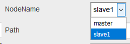
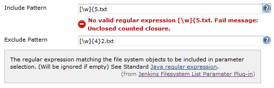
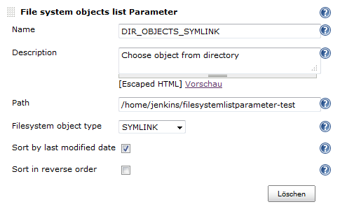

This plugin lists file, directory or symlink names of a directory
selectable for parameter.

[[FilesystemListParameterPlug-in-ChangeLog]]
== Change Log

[[FilesystemListParameterPlug-in-Version0.0.5(March23,2019)]]
=== Version 0.0.5 (March 23, 2019)

* Add Slave support. +
[.confluence-embedded-file-wrapper .confluence-embedded-manual-size]##

[[FilesystemListParameterPlug-in-Version0.0.4(February23,2018)]]
=== Version 0.0.4 (February 23, 2018)

* Compatibility changes [.jira-issue .conf-macro .output-block]#
https://issues.jenkins-ci.org/browse/JENKINS-49649[[.aui-icon .aui-icon-wait .issue-placeholder]##
##JENKINS-49649] - [.summary]#Getting issue details...#
[.aui-lozenge .aui-lozenge-subtle .aui-lozenge-default .issue-placeholder]#STATUS#
#

[[FilesystemListParameterPlug-in-Version0.0.3(September5,2014)]]
=== Version 0.0.3 (September 5, 2014)

* Small bugfix
https://issues.jenkins-ci.org/browse/JENKINS-24586[JENKINS-24586]

[[FilesystemListParameterPlug-in-Version0.0.2(June1,2014)]]
=== Version 0.0.2 (June 1, 2014)

* Add regular expression exclude and include filter for filesystem
objects +
[.confluence-embedded-file-wrapper]##
** *Include* and *exclude pattern* - regular expression to filter
filesystem objects
*** Regular expression will be checked with
"java.util.regex.Pattern.compile(regex)"

[[FilesystemListParameterPlug-in-Version0.0.1(March31,2014)]]
=== Version 0.0.1 (March 31, 2014)

* Initial release

The filesystem-list-parameter-plugin lists file system object names of a
directory. One of the object names can be selected as build parameter.
In addition the objects can be filtered: ALL, DIRECTORY, FILE, SYMLINK.
The order of the list can be reversed.

Here is a screenshot of the configuration page.

[.confluence-embedded-file-wrapper]##

* *Name* and *Description* should be clear
* *Path* to the directory to select filesystem objects
* *Filesystem object type* - filter for type of the file system objects
that can be selected.
* *Sort by last modified date* - If true, the list of the parameter
values will be sorted by last modified file attribute. Default order is
alphabetic sort by parameter value.
* *Sort in reverse order* - If true, the list of the parameter values
will be sorted in reverse order.
