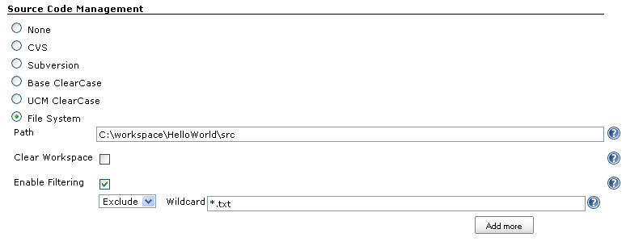

Use File System as SCM.[.conf-macro .output-inline]##

[cols="",options="header",]
|===
|Plugin Information
|View File System SCM https://plugins.jenkins.io/filesystem_scm[on the
plugin site] for more information.
|===

[.aui-icon .aui-icon-small .aui-iconfont-error .confluence-information-macro-icon]##

The current version of this plugin may not be safe to use. Please review
the following warnings before use:

* https://jenkins.io/security/advisory/2019-08-07/#SECURITY-569[Arbitrary
file read vulnerability]

[.aui-icon .aui-icon-small .aui-iconfont-warning .confluence-information-macro-icon]##

*This plugin is up for adoption.* Want to help improve this plugin?
https://wiki.jenkins-ci.org/display/JENKINS/Adopt+a+Plugin[Click here to
learn more]!

Simulate File System as SCM by checking file system last modified date,
checkout(), pollChanges(), ChangeLog and distributed build are all
supported.

[.confluence-embedded-file-wrapper]##

Folder difference is found by

. for each file in source, check if the corresponding file in workspace
exists
.. if not, it is a new file
.. if yes, further checks if the file in source is newer than file in
workspace, or if source file is modified since last build, this is a
modified file
. for each file in workspace, if the corresponding file in source does
not exist AND
.. it is in our self maintained "allow delete list", we will delete this
file from workspace. Every times we copy a file from src to dst, we add
the filename to the "allow delete list", in other words, we will only
delete files that are copied by us

Filtering is supported when checking for modified files.

If *_Clear Workspace_* is checked, the system will delete all existing
files/sub-folders in workspace before checking-out. Poll changes will
not be affected by this setting.

In Changelog, *_User_*, i.e. who changed the file, is not supported.

[[FileSystemSCM-Changelog]]
== Changelog

[[FileSystemSCM-Version2.1(Jan31,2018)]]
=== Version 2.1 (Jan 31, 2018)

* https://issues.jenkins-ci.org/browse/JENKINS-49053[image:docs/images/error.svg[(error)] JENKINS-49053]
- Prevent NullPointerException when writing empty changelog files to the
disk

[[FileSystemSCM-Version2.0(Dec08,2017)]]
=== Version 2.0 (Dec 08, 2017)

* image:docs/images/add.svg[(plus)] https://issues.jenkins-ci.org/browse/JENKINS-40743[JENKINS-40743]
- Make the plugin compatible with Jenkins Pipeline and other Job types
* image:docs/images/error.svg[(error)] https://issues.jenkins-ci.org/browse/JENKINS-43993[JENKINS-43993]
- Update the SCM implementation to be compatible with Stapler
Databinding API
* image:docs/images/error.svg[(error)] Cleanup
issues reported by FindBugs and other static analysis checks
* image:docs/images/information.svg[(info)] Update
Jenkins core requirement to 1.642.3

[[FileSystemSCM-Archive]]
=== Archive

Version 1.20 (Dec 5th, 2011)

* Support ANT style wildcard in file filtering
* Add an extra config parameter to let users to choose whether hidden
files/dirs should be copied or not 

Version 1.10 (Apr 2, 2011)

* No really user visible changes:
* fixed isEmptySet() method on ChangeLog
* updated to current version of Jenkins API

Version 1.9 (Sep 21, 2010)

* Works on Hudson core 1.337 as well

Version 1.8 (Mar 29, 2010)

* Bug fixed: enable clearWorkspace on the 1st jobrun will throw
Exception

Version 1.7 (Mar 11, 2010)

* Avoid Hudson startup error when upgrading to Hudson 1.349 or newer
(https://issues.jenkins-ci.org/browse/JENKINS-5893[JENKINS-5893])

Version 1.6 (Feb 12, 2010)

* Bug fixed: chmod before copying readonly files on Unix
* Bug fixed: Master/Slave bug
* Bug fixed: help page URL correctly handled even Winstone started with
prefix

Version 1.5

* Preserve file permission (rwxrwxrwx) when copying files (on Unix
platform only)
* will only delete a file from workspace if it is copied by this plugin
* ChangelogSet changed to follow the latest API

[[FileSystemSCM-ReportBugs]]
== Report Bugs 

Please report bugs to samngms [at] yahoo [dot] com
