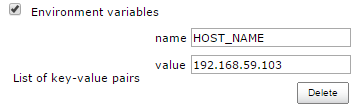
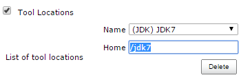
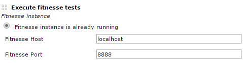
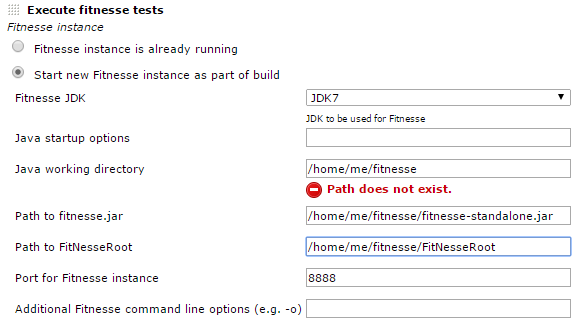
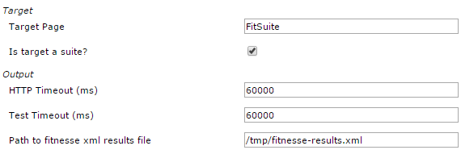
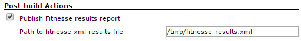
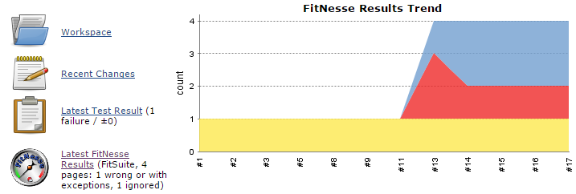
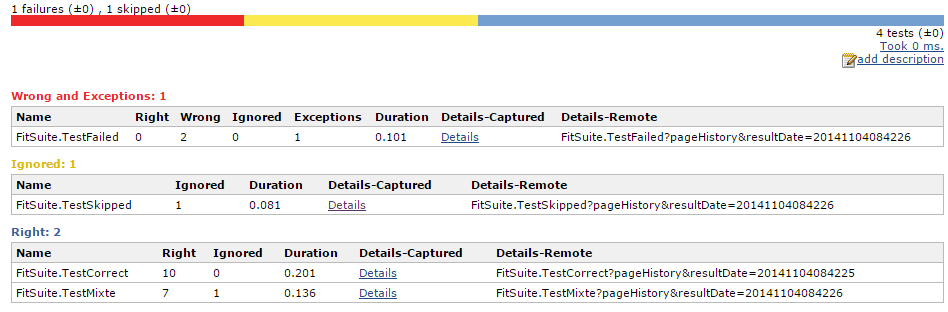
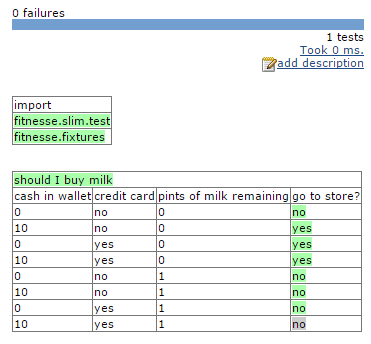

[.conf-macro .output-inline]#This plugin can be used to both execute and
report on http://fitnesse.org/[FitNesse] tests so that they can be
integrated into a Jenkins build.# +
Contributions are welcome, both bug fixes and new features. Just raise a
pull request via GitHub.

https://ci.jenkins.io/job/Plugins/job/fitnesse-plugin/[CI Server]

[[FitNessePlugin-Configuration]]
== Configuration

[[FitNessePlugin-Global]]
=== *Global*

* You could define a JDK installation (not mandatory). All JDKs will be
available in the job configuration.

[[FitNessePlugin-Slavenode]]
=== *Slave node*

* If your job runs on a slave and launch FitNesse, you should add the
HOST_NAME environment variable in slave configuration and set its value
to the slave’s hostname or IP. You can name it as FITNESSE_HOST_NAME
(whatever you like). This environment variable will be used when you set
up fitnesse instance below (replace localhost by $FITNESSE_HOST_NAME).

[.confluence-embedded-file-wrapper]##

* You could also override JDK location used, by set a _Tool location_:

[.confluence-embedded-file-wrapper]##

or by overridden JAVA_HOME environment variable.

[[FitNessePlugin-Usage]]
== Usage

[[FitNessePlugin-Projectsettingsinbuildstep]]
=== *Project settings in build step*

* *For existing FitNesse instance*: host and port where FitNesse is
running

[.confluence-embedded-file-wrapper]##

* *For new FitNesse instance*:
** *JDK*: selected JDK, JVM args and Java working directory
** *Paths*: fitnesse.jar and FitNesseRoot path
** *Fitnesse*: port use and command line args

[.confluence-embedded-file-wrapper]##

* *In all cases:*
** Target page
** HTTP and test timeout
** Results file name

[.confluence-embedded-file-wrapper]##

[[FitNessePlugin-Projectsettingsinpost-buildstep]]
=== *Project settings in post-build step*

* Results file name: the name of the result file ; if there is several
files, you can use wildcards.

[.confluence-embedded-file-wrapper]##

[[FitNessePlugin-Result]]
== Result

* On project page : a new chart with result trend and a little summary

[.confluence-embedded-file-wrapper]##

* All tests result in a page:

[.confluence-embedded-file-wrapper]##

* And finally, captured details of a test:

[.confluence-embedded-file-wrapper]##

[[FitNessePlugin-Todo]]
== Todo

* image:docs/images/star_yellow.svg[(star)]
Run fitnesse tests using "-c" option when starting new fitnesse instance
* image:docs/images/star_yellow.svg[(star)]
Add more control over fitnesse start-up params
* image:docs/images/star_yellow.svg[(star)]
Using glob to collect (potentially) multiple results.xml files
* image:docs/images/star_yellow.svg[(star)]
Nest Sub-suites and tests-within-suites within the uber-parent
FitnesseResults instance
* image:docs/images/star_yellow.svg[(star)]
Allow direct URL access to sub-suites and tests-within-suites so that
every level can have its history graph
* image:docs/images/star_yellow.svg[(star)]
Run multiple test suites from one project configuration

[[FitNessePlugin-ChangeLog]]
== Change Log

* *1.30* (2019-09-19)
** **image:docs/images/thumbs_up.svg[(thumbs
up)] **Fixed:
https://issues.jenkins-ci.org/browse/JENKINS-58923[JENKINS-58923] Cannot
browse result of tests when publishing several fitnesse result files on
Windows
** **image:docs/images/thumbs_up.svg[(thumbs
up)] **Fixed:
https://issues.jenkins-ci.org/browse/JENKINS-58430[JENKINS-58430] Publishing
two fitnesse xml files with same test name confuses the results
** Removed some log warnings
* *1.29* (2019-08-11)
** **image:docs/images/add.svg[(plus)]** Added: Changes
to read and write results in distributed Jenkins
(https://github.com/jenkinsci/fitnesse-plugin/pull/37[PR-37]) (Fixes: 
Fitnesse should run on the slave of the build, not on the head node
 https://issues.jenkins-ci.org/browse/JENKINS-13696[JENKINS-13696])
* *1.28 *(2019-01-12)
** **image:docs/images/add.svg[(plus)]** Added: Produces
junit report results from the fitnesse results
(https://github.com/jenkinsci/fitnesse-plugin/pull/36[PR-36])
* *1.27 *(2018-12-20)
** *image:docs/images/thumbs_up.svg[(thumbs
up)]* Fixed: FitNesse history is not rendering on builds generated by
latest plugin versions
* *1.25* (2018-12-05) +
** *image:docs/images/thumbs_up.svg[(thumbs
up)]* Fixed: FitNesse history not rendering in some cases
* *1.24* (2018-11-08)
** **image:docs/images/add.svg[(plus)] **Added:
Support for remote FitNesse over HTTPS 
(https://github.com/jenkinsci/fitnesse-plugin/pull/27[PR-27])
** image:docs/images/add.svg[(plus)] Added:
Add environment variables support for fitnesse hostname and port
(https://github.com/jenkinsci/fitnesse-plugin/pull/28[PR-28])
** image:docs/images/add.svg[(plus)] Added:
Feature/pipeline compatibility
(https://github.com/jenkinsci/fitnesse-plugin/pull/30[PR-30])
** image:docs/images/add.svg[(plus)] Improvement:
Try to gracefully terminate the running test in case of an exception
(https://github.com/jenkinsci/fitnesse-plugin/pull/31[PR-31])
** image:docs/images/add.svg[(plus)] Added:
Ability to access to a protected remote Fitnesse
(https://github.com/jenkinsci/fitnesse-plugin/pull/32[PR-32])
** image:docs/images/thumbs_up.svg[(thumbs
up)] Fixed: Fixes for
https://jenkins.io/blog/2018/01/13/jep-200/[JEP-200] (https://github.com/jenkinsci/fitnesse-plugin/pull/35[PR-35])
* *1.16* (2015-06-26)
** image:docs/images/thumbs_up.svg[(thumbs
up)] Fixed FitNesse 1.13 does not render properly FitNesse history
(https://issues.jenkins-ci.org/browse/JENKINS-29019[JENKINS-29019])
* *1.15* (2015-06-22)
** image:docs/images/add.svg[(plus)]
Improvement: Add ability to define fitnesse port as enironment variable
(https://issues.jenkins-ci.org/browse/JENKINS-27955[JENKINS-27955])
** image:docs/images/thumbs_up.svg[(thumbs
up)] Fixed: FitNesse History doesn't render properly
(https://issues.jenkins-ci.org/browse/JENKINS-29019[JENKINS-29019])
** image:docs/images/thumbs_up.svg[(thumbs
up)] Clean code: remove useless library, remove warnings and deprecated
methods
* *1.14* (2015-06-21)
** image:docs/images/thumbs_up.svg[(thumbs
up)] Fixed: In result detail page, can't expand collapsed scenario
(https://issues.jenkins-ci.org/browse/JENKINS-27938[JENKINS-27938])
** image:docs/images/thumbs_up.svg[(thumbs
up)] Fixed: manage JDK 1.8 (increase core plugin version)
** image:docs/images/thumbs_up.svg[(thumbs
up)] Fixed: manage severals FitNesse test results in the same job
(https://issues.jenkins-ci.org/browse/JENKINS-27936[JENKINS-27936] -
https://github.com/jenkinsci/fitnesse-plugin/pull/25[pull request])
* *1.13* (2015-06-02)
** image:docs/images/thumbs_up.svg[(thumbs
up)] Fixed: manage FitNesse old versions (without summary and page
duration fields in XML result)
(https://issues.jenkins-ci.org/browse/JENKINS-28316[JENKINS-28316])
** image:docs/images/add.svg[(plus)]
Improve FitNesse History page: reverse column order & add sort on column
header
** image:docs/images/thumbs_up.svg[(thumbs
up)] Fixed: use FitNesse plugin with contionnal steps(multiple) plugin
(https://issues.jenkins-ci.org/browse/JENKINS-21636[JENKINS-21636])
* *1.12* (2015-03-31)
** image:docs/images/add.svg[(plus)]
Improve captured detail renderer (use FitNesse CSS & JS)
** image:docs/images/add.svg[(plus)]
Added: FitNesse tests history page
(https://github.com/jenkinsci/fitnesse-plugin/pull/23[pull request])
** image:docs/images/thumbs_up.svg[(thumbs
up)] Fixed: execution of test page
(https://github.com/jenkinsci/fitnesse-plugin/pull/22[pull request])
* *1.11* (2014-11-10)
** image:docs/images/thumbs_up.svg[(thumbs
up)] Improve result table and captured detail renderer
(https://github.com/jenkinsci/fitnesse-plugin/pull/19[pull request])
* *1.10* (2014-10-27)
** image:docs/images/thumbs_up.svg[(thumbs
up)] Fixed: avoid OOM on hudge result files
(https://github.com/jenkinsci/fitnesse-plugin/pull/16[pull request])
** image:docs/images/thumbs_up.svg[(thumbs
up)] Fixed: support Jenkins slave with a different OS than master's one
(https://github.com/jenkinsci/fitnesse-plugin/pull/18[pull request])
** image:docs/images/thumbs_up.svg[(thumbs
up)] Fixed: avoid NPE when no JDK is defined in global configuration
(https://github.com/jenkinsci/fitnesse-plugin/pull/18[pull request])
** image:docs/images/add.svg[(plus)]
Added: retrieve and display duration for all tests
(https://github.com/jenkinsci/fitnesse-plugin/pull/17[pull request])
** image:docs/images/thumbs_up.svg[(thumbs
up)] Fixed: test port availability to check if FitNesse is started
instead of scraping stdout
(https://github.com/jenkinsci/fitnesse-plugin/pull/13[pull request])
* *1.9* (2014-03-26)
** image:docs/images/thumbs_up.svg[(thumbs
up)] Fixed: launch FitNesse if no JDK is configured in Jenkins
(https://github.com/jenkinsci/fitnesse-plugin/pull/11[pull request])
** image:docs/images/thumbs_up.svg[(thumbs
up)] Improve performance on huge result file
(https://github.com/jenkinsci/fitnesse-plugin/pull/10[pull request])
* *1.8* (2013-10-21)
** image:docs/images/add.svg[(plus)]
Added support for Jenkins slaves
(https://github.com/swestcott/fitnesse-plugin/pull/8[pull request])
** image:docs/images/add.svg[(plus)]
Expose FitNesse tests results throught Jenkins API
(https://github.com/jenkinsci/fitnesse-plugin/pull/2[pull request])
** image:docs/images/add.svg[(plus)]
Selectable JDK for FitNesse
(https://github.com/jenkinsci/fitnesse-plugin/pull/3[pull request])
** image:docs/images/thumbs_up.svg[(thumbs
up)] Configuration bugfix
(https://github.com/jenkinsci/fitnesse-plugin/pull/4[pull request])
* *1.7*
** image:docs/images/thumbs_up.svg[(thumbs
up)] Fixed: avoid NPE when build aborts prematurely and produces no
results (https://github.com/swestcott/fitnesse-plugin/pull/6[pull
request])
** image:docs/images/thumbs_up.svg[(thumbs
up)] Use the HTTP timeout inside the connection
(https://github.com/jenkinsci/fitnesse-plugin/pull/1[pull request])
** image:docs/images/thumbs_up.svg[(thumbs
up)] Don't show broken image when no test results are available
(https://github.com/swestcott/fitnesse-plugin/pull/7[pull request])
* *1.6*
** image:docs/images/add.svg[(plus)]
Added support for multiple FitNesse reports and drilling down into HTML
output (https://github.com/swestcott/fitnesse-plugin/pull/4[pull
request])
* *1.5*
** image:docs/images/thumbs_up.svg[(thumbs
up)] Report exceptions as failures
** image:docs/images/thumbs_up.svg[(thumbs
up)] Upgrade minimum Jenkins version from 1.353 to 1.401 to benefit from
bug fixes in hudson.Proc
** image:docs/images/add.svg[(plus)]
Added support for FitNesse options -d, -r & -p.
* *1.4*
** image:docs/images/add.svg[(plus)]
Added ability to specify path to fitnesse.jar and path to FitNesseRoot
relative to the workspace
* *1.3.1*
** image:docs/images/thumbs_up.svg[(thumbs
up)] Fixed bug where counts with X right and Y ignores were being
treated as ignored not right
* *1.3*
** image:docs/images/add.svg[(plus)]
Added ability to specify HTTP timeout (default: 60,000 ms)
** image:docs/images/add.svg[(plus)]
Added ability to specify java working directory (default: location of
fitnesse.jar)
** image:docs/images/add.svg[(plus)]
Added page or suite name to build page summary link
* *1.2*
** image:docs/images/add.svg[(plus)]
Added prettier tabular format for results
** image:docs/images/add.svg[(plus)]
Results file without path will be written to / read from workspace
** image:docs/images/add.svg[(plus)]
Log incremental console output as FitNesse results are coming in over
HTTP
** image:docs/images/thumbs_up.svg[(thumbs
up)] Fixed: Unable to unpack fitnesse.jar
** image:docs/images/thumbs_up.svg[(thumbs
up)] Fixed: Build hangs when http get stalls
** image:docs/images/thumbs_up.svg[(thumbs
up)] Fixed: Unexpected EOF while reading http bytes
`+catch IOException+`
* *1.1*
** image:docs/images/thumbs_up.svg[(thumbs
up)] Fixed: unable to parse xml with BOM: error
"`+content is not allowed in prolog+`"
* *1.0*
** image:docs/images/add.svg[(plus)]
Brand new
image:docs/images/smile.svg[(smile)]
