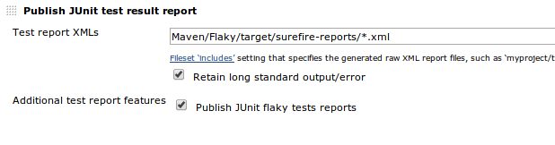
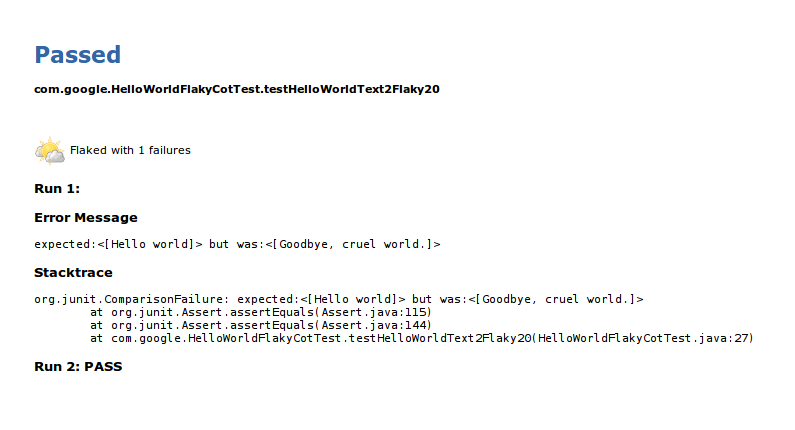
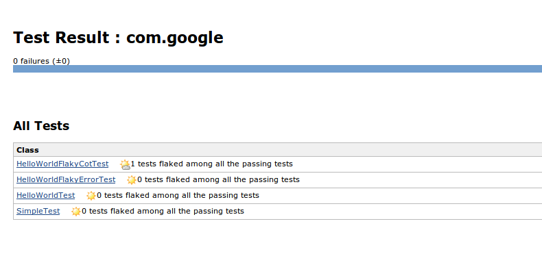
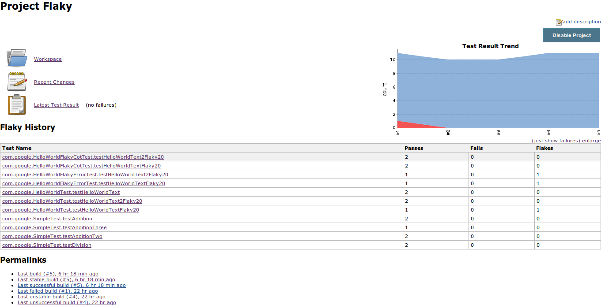
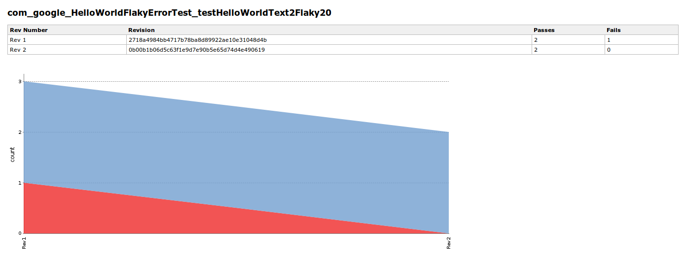
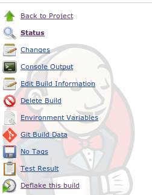
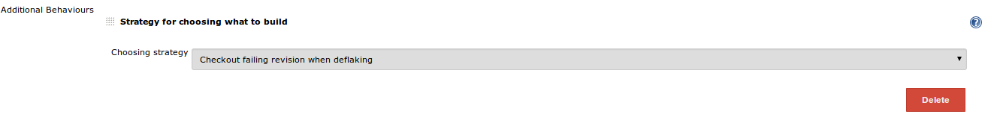
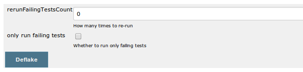
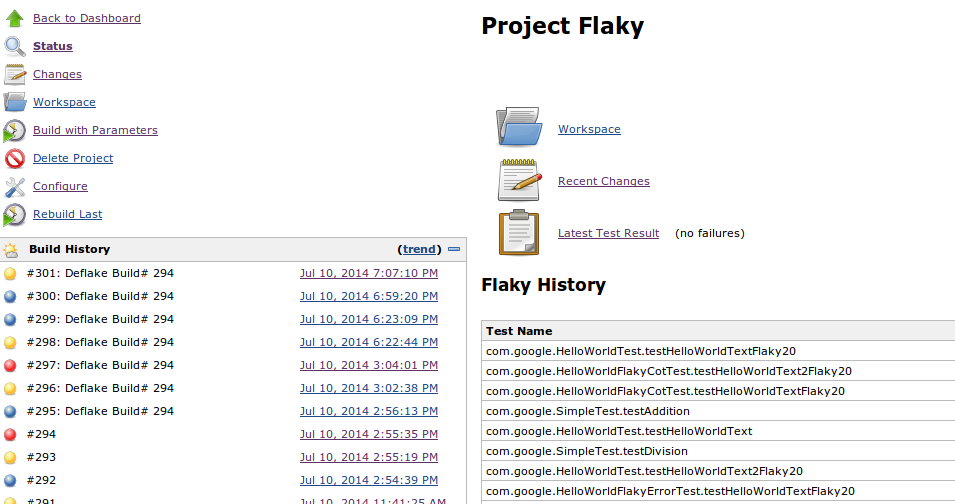

 This plugin is used to provide various support for handling flaky
tests. It currently supports for Git and Maven.  It includes support for
the latest version of the Maven surefire plug-in which produces
additional data about test flakiness using the new
"rerunFailingTestsCount" option. It also supports re-running  only
failed tests for a failed build at the exact failed Git revision.
Finally it aggregates statistics of tests (passes, fails and flakes)
over Git revisions.

[[FlakyTestHandlerPlugin-IntroductionandPrerequisite]]
== Introduction and Prerequisite

A flaky test is a test which could fail or pass for the same
configuration. Flaky tests could be harmful for developers because their
failures do not always indicate bugs in the code.

This plugin is designed to handle flaky tests, including re-running
failed tests, aggregate and report flaky tests statistics and so on.

*Note: Currently most features of this plugin are designed for Git,
Maven and freestyle build projects.*

[[FlakyTestHandlerPlugin-Publishre-runinformationforflakytests]]
=== Publish re-run information for flaky tests

We recently made some contributions to Maven Surefire to add the new
option "rerunFailingTestsCount". It lets users to choose to re-run
failed tests up to N times, and if it passes within any of those N
times, the re-run will stop and the test will be marked as a "Flake".
The build will be marked as successful if there is no failed tests but
only "flaky" tests.

The new option may be release with Maven Surefire 2.18 in the near
future:
https://github.com/apache/maven-surefire/commit/fefaae7f0534a59f52c046a64c96987e8561dd48

So the first part of our plugin is to integrate with this new feature
from Maven Surefire. Once the "rerunFailingTestsCount" is used either by
command line or in pom.xml, the plugin will parse the report and display
flaky tests, output information of all the re-runs(stacktrace, output,
etc) on test result page.

[[FlakyTestHandlerPlugin-Configuration:]]
==== Configuration:

After the plugin is installed and JUnit test report is published, check
on “Publish JUnit flaky test reports” under “Additional test report
features.

[.confluence-embedded-file-wrapper]##

[[FlakyTestHandlerPlugin-Usage:]]
==== Usage:

Display all the re-runs in the test result page:

[.confluence-embedded-file-wrapper]## +
Display flaky tests information in the test result table as a badge:

[.confluence-embedded-file-wrapper]##

[[FlakyTestHandlerPlugin-AggregatingTestsStatisticsoverRevisions]]
=== Aggregating Tests Statistics over Revisions

[[FlakyTestHandlerPlugin-Configuration:.1]]
==== Configuration:

Add “Publish JUnit flaky stats” as a post build step

*Note*: This feature requires JUnit test result report being published,
and this step has to be placed *after* “Publish JUnit test result
report”.

[[FlakyTestHandlerPlugin-Usage:.1]]
==== Usage:

For each Git revision and each test, we count how many times it passed,
how many times it failed. So if a test passed and failed for the both
revision, we count it as a flake; if it always failed, then it's a fail,
otherwise it's a pass.

If Git is not used as scm, then we use build number as revision number.

[[FlakyTestHandlerPlugin-]]
==== [.confluence-embedded-file-wrapper]##

[.confluence-embedded-file-wrapper]##

[[FlakyTestHandlerPlugin-"Deflake"ActionforBuildswithFailedTests]]
=== "Deflake" Action for Builds with Failed Tests

[[FlakyTestHandlerPlugin-Usage:.2]]
==== Usage:

For each failing build we provide a "Deflake" action. It is different
from rebuilding the project, as it will: +
1) Checkout the exact revision of that failing build (GIT) +
2) Only run all those failed tests. +
So this will give developers a good idea about how many tests are flaky
for this build.

[[FlakyTestHandlerPlugin-.1]]
==== [.confluence-embedded-file-wrapper]##

[[FlakyTestHandlerPlugin-Configuration:.2]]
==== Configuration:

When configuring project's scm with Git plugin, use Add button to add
"Strategy for choosing what to build", and then select "Checkout failing
revision when deflaking".

This will tell the plugin to checkout the exact failing revision when
deflaking a failed build.
[.confluence-embedded-file-wrapper]## +
After clicking "Deflake", there is another configuration window.

[.confluence-embedded-file-wrapper]## +
"rerunFailingTestsCount" is the new Surefire option, it can be set and
passed to the deflake build. However if this parameter is already set in
the project pom.xml, then it cannot be overwritten.

"only run failing tests": when checked, the plugin will generate
-Dtest=... to pass to Maven, so only previous failed tests will be
re-run.

Deflake build will show up as "Deflake Build # ...".

[.confluence-embedded-file-wrapper]##
