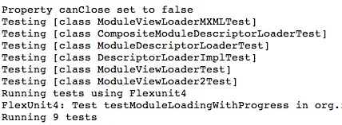
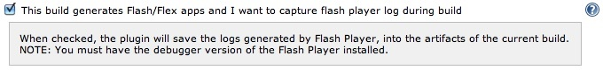
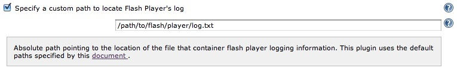

Captures Adobe Flash Player logs during a Hudson build in order to save
them as build artifacts. Useful to debug unit tests or integration
tests.

[[FlashLogPlugin-Description]]
== Description

This plugin hooks up to the location where Flash Player is storing the
logs and records only what has been logged during a Jenkins build.

[.confluence-embedded-file-wrapper]##

Clicking on flashlog.txt will give you the logs:

[.confluence-embedded-file-wrapper]##

Note

[.aui-icon .aui-icon-small .aui-iconfont-warning .confluence-information-macro-icon]#
#

Make sure you install the
http://www.adobe.com/support/flashplayer/downloads.html[debugger version
of the Flash Player], otherwise Flash Player won't log anything.

[[FlashLogPlugin-Pluginconfigurationoptions]]
== Plugin configuration options

[[FlashLogPlugin-Atjoblevel]]
=== At job level

[.confluence-embedded-file-wrapper]##

[[FlashLogPlugin-Atnodelevel]]
=== At node level

In very rare cases in which the plugin might not identify the exact
location where Flash is recording the logs, you can define a custom path
to the flashlog.txt file. +
[.confluence-embedded-file-wrapper]##

And you can also opt not to save the logs for some nodes, even if the
project is configured to save the logs.

[.confluence-embedded-file-wrapper]##
