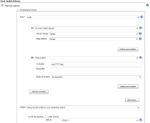
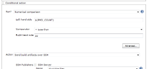
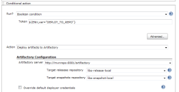
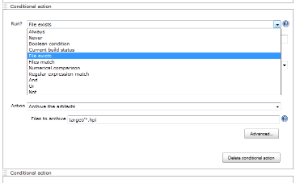
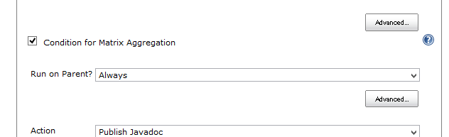
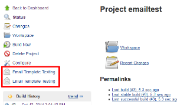

[#FlexiblePublishPlugin-features .confluence-anchor-link .conf-macro .output-inline]#
#

[[FlexiblePublishPlugin-Features]]
== Features

* Use a publisher more than once within a build
* Select the execution order of the publishers
* Use
https://wiki.jenkins-ci.org/display/JENKINS/Run+Condition+Plugin[Run
Conditions] to decide whether to publish
* Use Builders as actions by installing the
https://wiki.jenkins-ci.org/display/JENKINS/Any+Build+Step+Plugin[Any
Build Step Plugin] (which will also install the
https://wiki.jenkins-ci.org/display/JENKINS/Conditional+BuildStep+Plugin[Conditional
BuildStep Plugin])

Always use Always

[.aui-icon .aui-icon-small .aui-iconfont-approve .confluence-information-macro-icon]#
#

If you always add your Post-build Actions to Flexible publish, then not
only will you be able to change the execution order afterwards, but you
will have the ability to temporarily disable a publisher without losing
the publishers' configuration. +
You can just switch between the Always and the Never run conditions.

[width="100%",cols="25%,25%,25%,25%",]
|===
|
|
|
|

a| a| a| a|
|===

[#FlexiblePublishPlugin-install .confluence-anchor-link .conf-macro .output-inline]#
#

[[FlexiblePublishPlugin-Install]]
== Install

This plugin can be installed from the Update Center (Manage Jenkins >
Manage Plugins) under "Other Post-Build Actions".

To install manually, download the latest plugin from
http://mirrors.jenkins-ci.org/plugins/flexible-publish/ and use the
Upload Plugin option in the Advanced tab of the Plugin Manager. +
If you do install manually, you will need to also install the
https://wiki.jenkins-ci.org/display/JENKINS/Run+Condition+Plugin[Run
Condition Plugin] from
http://mirrors.jenkins-ci.org/plugins/run-condition/ and the
https://wiki.jenkins-ci.org/display/JENKINS/Token+Macro+Plugin[Token
Macro Plugin] from http://mirrors.jenkins-ci.org/plugins/token-macro/.

[#FlexiblePublishPlugin-move .confluence-anchor-link .conf-macro .output-inline]#
#

[[FlexiblePublishPlugin-Importexistingpublishers]]
== Import existing publishers

In Manage Jenkins/ Script console, copy the following to see which
publishers can be moved (for a job named 'My Job')

[source,syntaxhighlighter-pre]
----
import static org.jenkins_ci.plugins.flexible_publish.JobUpdater.*

def job = hudson.model.Hudson.instance.getItem('My Job')
list job
----

Or, if you like doing it the hard way ...

[source,syntaxhighlighter-pre]
----
org.jenkins_ci.plugins.flexible_publish.JobUpdater.list(hudson.model.Hudson.instance.getItem('My Job'))
----

You should see a list something like this

[source,syntaxhighlighter-pre]
----
Result: Enabled publishers that can be moved:
    [Publish Checkstyle analysis results]
    [Publish FindBugs analysis results]
    [Publish PMD analysis results]
    [Publish duplicate code analysis results]
    [Scan for compiler warnings]
    [Scan workspace for open tasks]
    [Publish combined analysis results]
    [Archive the artifacts]
    [Publish JUnit test result report]
    [Publish Javadoc]
    [Record fingerprints of files to track usage]
    [Git Publisher]
    [Send build artifacts over FTP]
    [Send build artifacts over SSH]
    [Send build artifacts to a windows share]

Enabled publishers that cannot be moved:
    [Aggregate downstream test results]
    [Build other projects]
    [Record Emma coverage report]
    [Report Violations]
    [E-mail Notification]
----

You can move a publisher into Flexible publish

[source,syntaxhighlighter-pre]
----
import static org.jenkins_ci.plugins.flexible_publish.JobUpdater.*

def job = hudson.model.Hudson.instance.getItem('My Job')
movePublisher job, 'Publish JUnit test result report'
----

*After moving one or more publishers, go to the configure page, check
everything looks ok, then save the configuration.*

If you like to live on the edge, and would like to move all of the
publishers in one go, then ...

[source,syntaxhighlighter-pre]
----
import static org.jenkins_ci.plugins.flexible_publish.JobUpdater.*

def job = hudson.model.Hudson.instance.getItem('My Job')
moveAllPublishers job
----

[[FlexiblePublishPlugin-Usedwithmulti-configurationprojects]]
== Used with multi-configuration projects

When you use Flexible Publish Plugin with multi-configuration projects
(aka. matrix projects), you should know followings:

Generally, publishers run in two phase for multi-configuration projects.

. Run for each combination of axes. It works just like in Free Style
Projects.
. Run for whole the multi-configuration project. This is what is called
aggregation.

For example, "Publish JUnit test result report" works:

. see test results in each combination of axes
. sum up the results of all of the combinations.

You can specify conditions both for each combination and the
aggregation. +
If you want to separate condition for them, check "Condition for Matrix
Aggregation" (This appears only in multi-configuration projects). +
[.confluence-embedded-file-wrapper]##

This is especially useful for the case you want control the execution of
the publisher depends on combination of axes. +
Be careful to specify the condition, for inconsistent execution causes
the build fails.

[#FlexiblePublishPlugin-changelog .confluence-anchor-link .conf-macro .output-inline]#
#

[#FlexiblePublishPlugin-caveats .confluence-anchor-link .conf-macro .output-inline]#
#

[[FlexiblePublishPlugin-Howflexiblepublishworkswhenapublisherfails]]
== How flexible publish works when a publisher fails

* Available since flexible-publish-0.15.
* You can specify "Execution Strategy" with which flexible publish
decides how to work when a publisher fails.
+
[cols=",",options="header",]
|===
|Execution Strategy |Behavior on a failure of a publisher
|Fail at end |Continues to run following publishers. The default
behavior in flexible-publish 0.15 and later.

|Fail fast |Doesn't run following publishers. The default behavior for
flexible-publish configured in 0.13 and 0.14.1.
|===
* This works as followings:
** Example configuration
+
....
Flexible Publish
    Condition 1
        Publisher 1
        Publisher 2
    Condition 2
        Publisher 3
....
** When Publisher 1 fails, following publishers are handled as:
+
[cols=",,",options="header",]
|===
|Execution Strategy for Condition 1 |Publisher 2 |Publisher 3
|Fail at end |Performed |Performed
|Fail fast |Not performed |Performed
|===
*** Following conditions are always performed even prior publishers
failed.
*** Following publishers in a same condition is performed when the
execution strategy is "Fail at end".

[[FlexiblePublishPlugin-Limitations]]
== Limitations

[[FlexiblePublishPlugin-SomepublishersmaynotworkwithFlexiblePublish.]]
=== Some publishers may not work with Flexible Publish.

* Some publishers *may* not be prepared to run more than once during a
build
* Some publishers need to find themselves configured in the projects,
but fail to do that when included in Flexible Publish.

[[FlexiblePublishPlugin-Knownpluginsthatdoesn'tworkwithFlexiblePublish]]
==== Known plugins that doesn't work with Flexible Publish

[cols=",,",options="header",]
|===
|Plugin |Details |Issue
|https://wiki.jenkins-ci.org/display/JENKINS/Coverity+Plugin[Coverity
Plugin] |Causes NPE on execution
|https://issues.jenkins-ci.org/browse/JENKINS-20632[JENKINS-20632]

|https://wiki.jenkins-ci.org/display/JENKINS/Post+build+task[Post build
task] |Tasks will be duplicated if a project contains multiple Post
build task
|https://issues.jenkins-ci.org/browse/JENKINS-23952[JENKINS-23952]

|https://wiki.jenkins-ci.org/display/JENKINS/Join+Plugin[Join Plugin]
|Ignores dependencies wrapped with Flexible publish
|https://issues.jenkins-ci.org/browse/JENKINS-28709[JENKINS-28709]

|https://wiki.jenkins-ci.org/display/JENKINS/Build+Pipeline+Plugin[Build
Pipeline Plugin] |"Manually Execute Downstream Project" always triggers
downstream projects automatically
|https://issues.jenkins-ci.org/browse/JENKINS-30272[JENKINS-30272]

|https://wiki.jenkins-ci.org/display/JENKINS/Clone+Workspace+SCM+Plugin[Clone
Workspace SCM Plugin] |Doesn't show up the configured project in the
list of options for selection on a consuming project
|https://issues.jenkins-ci.org/browse/JENKINS-30567[JENKINS-30567]

|https://wiki.jenkins-ci.org/display/JENKINS/Slack+Plugin[Slack Plugin]
|Silently does nothing
|https://github.com/jenkinsci/slack-plugin/issues/41[GitHub #41]
|===

[[FlexiblePublishPlugin-Sidelinksareduplicated]]
=== Side links are duplicated

* Some publishers display side links in project status pages and build
status pages.
* Configuring multiple publishers of a same kind results duplicated side
links like this (this is a case with
https://wiki.jenkins-ci.org/display/JENKINS/Email-ext+plugin[Email-ext
plugin]): +
[.confluence-embedded-file-wrapper .image-center-wrapper]##
* There's no proper and general way to fix this, and this isn't planned
to be fixed as it's harmless.

[[FlexiblePublishPlugin-KnownpluginsthatduplicatessitelinksinprojectpageswithFlexiblePublish]]
==== Known plugins that duplicates site links in project pages with Flexible Publish

* https://wiki.jenkins-ci.org/display/JENKINS/Email-ext+plugin[Email-ext
plugin]
* https://wiki.jenkins-ci.org/display/JENKINS/DocLinks+Plugin[DocLinks
Plugin]
* https://wiki.jenkins-ci.org/display/JENKINS/testng-plugin[testng-plugin]

[[FlexiblePublishPlugin-KnownpluginsthatduplicatessitelinksinbuildpageswithFlexiblePublish]]
==== Known plugins that duplicates site links in build pages with Flexible Publish

* https://wiki.jenkins-ci.org/display/JENKINS/Warnings+Plugin[Warnings
Plugin]
* https://wiki.jenkins-ci.org/display/JENKINS/Static+Code+Analysis+Plug-ins[Static
Code Analysis Plug-ins]
* https://wiki.jenkins-ci.org/display/JENKINS/testng-plugin[testng-plugin]

[[FlexiblePublishPlugin-Whynamed"FlexiblePublish"?]]
== Why named "Flexible Publish" ?

* It's often accused that "Flexible Publish plugin should have been
named Conditional Publisher plugin"
* You couldn't reorder publishers with old Jenkins (Jenkins < 1.463).
Also see
https://groups.google.com/forum/?fromgroups#\!topic/jenkinsci-dev/UQLvxQclyb4
* A feature to reorder publishers was as important as a feature to
launch publishers conditionally. So named "Flexible Publish".

[[FlexiblePublishPlugin-Issues]]
== Issues

To report a bug or request an enhancement to this plugin please create a
ticket in JIRA (you need to login or to sign up for an account). Also
have a look on
https://wiki.jenkins-ci.org/display/JENKINS/How+to+report+an+issue[How
to report an issue]

* https://issues.jenkins-ci.org/secure/CreateIssueDetails!init.jspa?pid=10172&issuetype=1&components=16130&priority=4&assignee=ikedam[Bug
report]
* https://issues.jenkins-ci.org/secure/CreateIssueDetails!init.jspa?pid=10172&issuetype=4&components=16130&priority=4[Request
or propose an improvement of existing feature]
* https://issues.jenkins-ci.org/secure/CreateIssueDetails!init.jspa?pid=10172&issuetype=2&components=16130&priority=4[Request
or propose a new feature]

[[refresh-module--1008811456]]
[[refresh--1008811456]][[jira-issues--1008811456]]
Key

T

P

Summary

[.refresh-action-group]# #

[[refresh-issues-loading--1008811456]]
[.aui-icon .aui-icon-wait]#Loading...#

[#refresh-issues-button--1008811456]##
[#refresh-issues-link--1008811456]#Refresh#
[#error-message--1008811456 .error-message .hidden]# #

[[FlexiblePublishPlugin-Changelog]]
== Change log

[[FlexiblePublishPlugin-0.15.2(Jun06,2015)]]
=== 0.15.2 (Jun 06, 2015)

* FIXED: Conditions are evaluated for matrix parent builds even if
contained publishers doesn't support aggregations
(https://issues.jenkins-ci.org/browse/JENKINS-28585[JENKINS-28585])
** Regression in 0.15.

[[FlexiblePublishPlugin-0.15.1(Mar29,2015)]]
=== 0.15.1 (Mar 29, 2015)

* No functionality changes from flexible-publish-0.15.
* Displays incompatibility warnings in the update center for
flexible-publish 0.14.1 and earlier.
** This means the change of the condition evaluation in
flexible-publish-0.15.
** Warnings displayed:
https://wiki.jenkins-ci.org/display/JENKINS/Marking+a+new+plugin+version+as+incompatible+with+older+versions#Markinganewpluginversionasincompatiblewitholderversions-ModificationtoDisplayofUpdateablePluginList[Marking
a new plugin version as incompatible with older versions#Modification to
Display of Updateable Plugin List]

[[FlexiblePublishPlugin-0.15(Mar28,2015)]]
=== 0.15 (Mar 28, 2015)

* Introduced "Execution strategy" which controls the behavior when a
publisher fails.
(https://issues.jenkins-ci.org/browse/JENKINS-26936[JENKINS-26936],
https://issues.jenkins-ci.org/browse/JENKINS-27278[JENKINS-27278])
** See
https://wiki.jenkins-ci.org/display/JENKINS/Flexible+Publish+Plugin#FlexiblePublishPlugin-Howflexiblepublishworkswhenapublisherfails[#How
flexible publish works when a publisher fails] for details.
* The condition is evaluated only once when multiple actions in a
condition
(https://issues.jenkins-ci.org/browse/JENKINS-27171[JENKINS-27171]).
** Example Configutraion
+
....
Flexible Publish
    Condition 1
        Publisher 1
        Publisher 2
....
** It was evaluated like this in flexible-publish 0.14.1
+
....
if(Condition 1)
{
    Publisher 1
}
if(Condition 1)
{
    Publisher 2
}
....
** flexible-publish 0.15 now evaluates as following
+
....
if(Condition 1)
{
    Publisher 1
    Publisher 2
}
....
** If you really need conditions evaluated for each actions, please
update the configuration like this:
+
....
Flexible Publish
    Condition 1
        Publisher 1
    Condition 1
        Publisher 2
....

[[FlexiblePublishPlugin-0.14.1(Jan17,2015)]]
=== 0.14.1 (Jan 17, 2015)

*This is a bug fix for 0.13.* +
This should be released as 0.13.1, but I mistook. Sorry.

* FIXED: NPE if no publisher in conditional step
(https://issues.jenkins-ci.org/browse/JENKINS-26452[JENKINS-26452])

[[FlexiblePublishPlugin-0.13(Nov09,2014)]]
=== 0.13 (Nov 09, 2014)

* Supports multiple actions for a condition.
(https://issues.jenkins-ci.org/browse/JENKINS-22187[JENKINS-22187])
* Also work for Depende*n*cyDeclarer introduced in Jenkins 1.501.
(https://issues.jenkins-ci.org/browse/JENKINS-25017[JENKINS-25017])
* improved explanation for the aggregation condition.
(https://issues.jenkins-ci.org/browse/JENKINS-21345[JENKINS-21345])
* Fixed a wrong error message when failed to instantiate a publisher.
(https://issues.jenkins-ci.org/browse/JENKINS-21497[JENKINS-21497])
* Add support for upcoming $class annotation change
(https://issues.jenkins-ci.org/browse/JENKINS-25403[JENKINS-25403])

[[FlexiblePublishPlugin-0.12(14/09/2013)]]
=== 0.12 (14/09/2013)

* Now support publishers with customized Descriptor#newInstance
(https://issues.jenkins-ci.org/browse/JENKINS-19494[JENKINS-19494],
https://issues.jenkins-ci.org/browse/JENKINS-14454[JENKINS-14454],
https://issues.jenkins-ci.org/browse/JENKINS-14597[JENKINS-14597],
https://issues.jenkins-ci.org/browse/JENKINS-19257[JENKINS-19257])

[[FlexiblePublishPlugin-0.11(07/09/2013)]]
=== 0.11 (07/09/2013)

* Support for triggers
(https://issues.jenkins-ci.org/browse/JENKINS-19146[JENKINS-19146])
* Support for multi-configuration projects
(https://issues.jenkins-ci.org/browse/JENKINS-14494[JENKINS-14494])

[[FlexiblePublishPlugin-0.10(03/07/2012)]]
=== 0.10 (03/07/2012)

* Fixed
https://issues.jenkins-ci.org/browse/JENKINS-13795[JENKINS-13795] NPE
when configuring Flexible publish in a new job

[[FlexiblePublishPlugin-0.9(14/02/2012)]]
=== 0.9 (14/02/2012)

* Stop interfering with the
https://wiki.jenkins-ci.org/display/JENKINS/Warnings+Plugin[Warnings
Plugin]'s radio buttons
(https://issues.jenkins-ci.org/browse/JENKINS-12692[JENKINS-12692])

[[FlexiblePublishPlugin-0.8(17/01/2012)]]
=== 0.8 (17/01/2012)

* Exclude "Trigger parametrized build on other projects"
https://issues.jenkins-ci.org/browse/JENKINS-12418[JENKINS-12418]

[[FlexiblePublishPlugin-0.7(14/11/2011)]]
=== 0.7 (14/11/2011)

* Mark the build as a failure if an action would have stopped the build

[[FlexiblePublishPlugin-0.6(12/11/2011)]]
=== 0.6 (12/11/2011)

* Add some utility methods to allow publishers to be moved into Flexible
publish from the script console
* Don't allow "Build other projects" in the Flexible publish - it does
not work here
* Do not allow the actions to prevent other publishers from running
(unless they throw an exception)

[[FlexiblePublishPlugin-0.5(11/11/2011)]]
=== 0.5 (11/11/2011)

* Changed the EP interface

[[FlexiblePublishPlugin-0.4(11/11/2011)]]
=== 0.4 (11/11/2011)

* Add extension to enable the list of publishers to be modified

[[FlexiblePublishPlugin-0.3(10/11/2011)]]
=== 0.3 (10/11/2011)

* Updated a help file

[[FlexiblePublishPlugin-0.2(09/11/2011)]]
=== 0.2 (09/11/2011)

* Enable the user to choose what will happen if the evaluation of a
condition fails

[[FlexiblePublishPlugin-0.1(07/11/2011)]]
=== 0.1 (07/11/2011)

* Initial release
