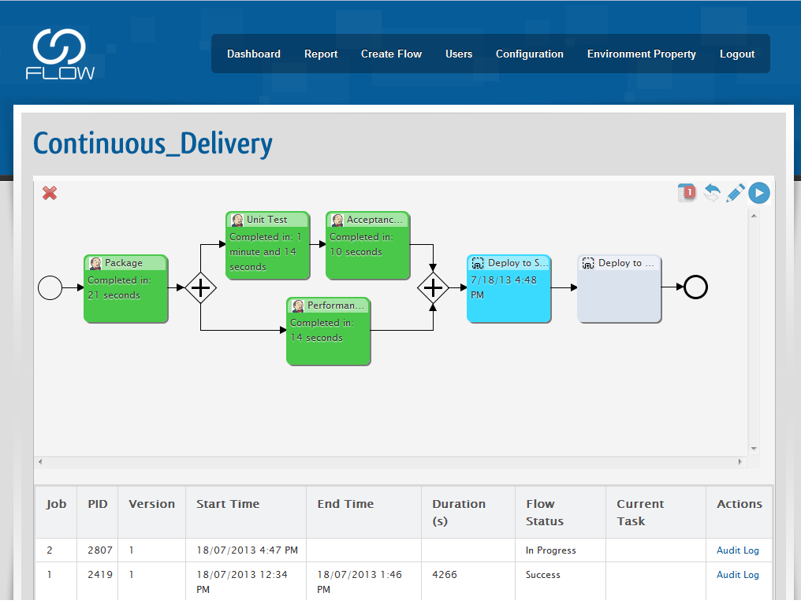
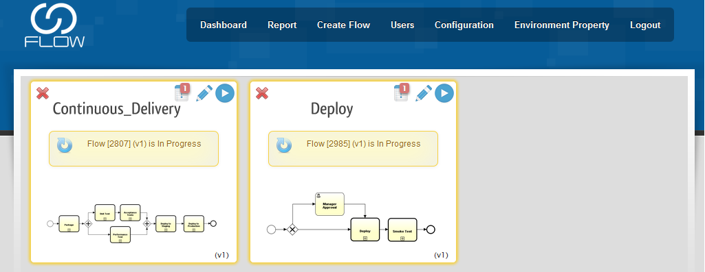
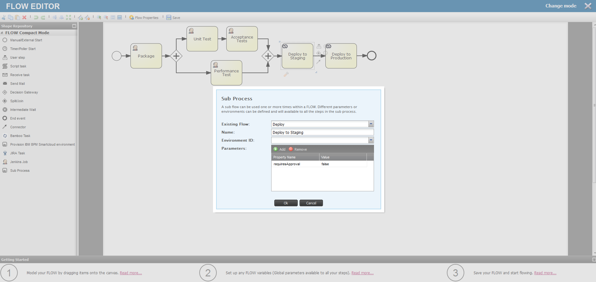
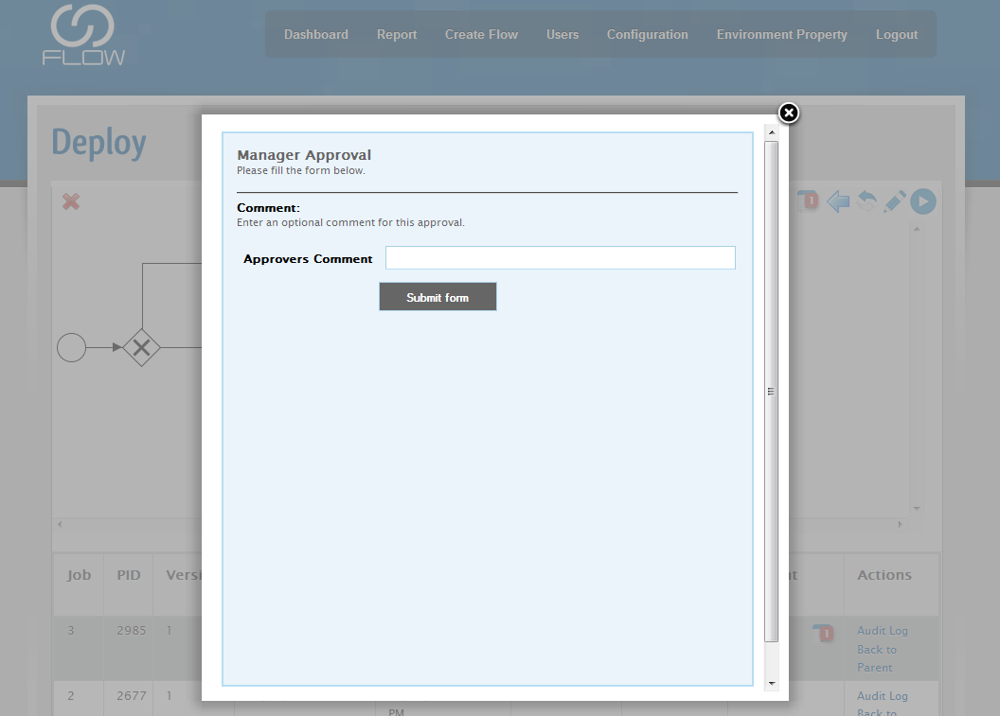
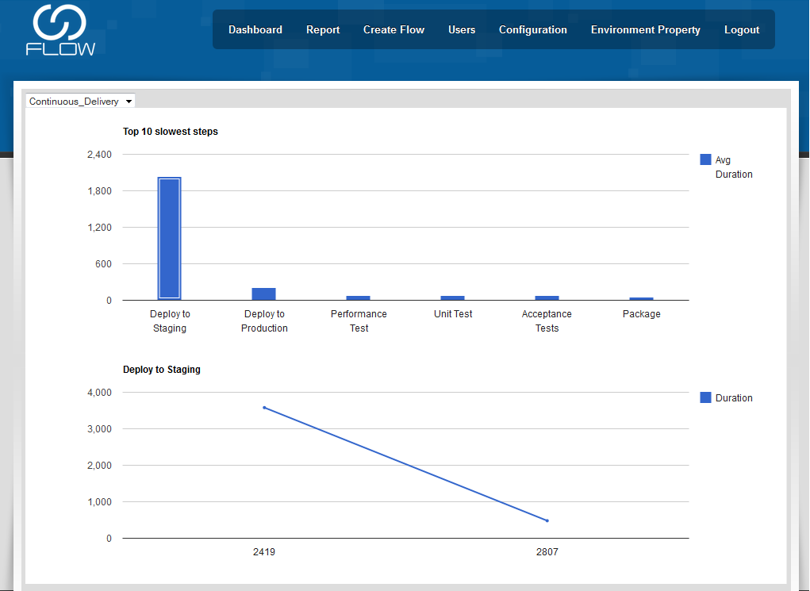

[[FLOWPlugin-http://startflowing.net]]
== http://startflowing.net/[http://startflowing.net]

[[FLOWPlugin-Summary]]
== Summary

[.conf-macro .output-inline]# #

Get true visibility of your processes - letting you see bottlenecks,
instability and what change to make next.
http://startflowing.net/[http://startflowing.net].

Drag and drop your existing Jenkins jobs to form processes

[[FLOWPlugin-ReleaseNotes]]
== Release Notes

[cols=",,",options="header",]
|===
|Version |Date |Notes
|1.3 |Oct-2013
|http://startflowing.net/index.php/blog/entry/flow-release-03
|===

[[FLOWPlugin-Screenshots]]
== Screenshots

[.confluence-embedded-file-wrapper .confluence-embedded-manual-size]## +
[.confluence-embedded-file-wrapper .confluence-embedded-manual-size]## +
[.confluence-embedded-file-wrapper .confluence-embedded-manual-size]## +
[.confluence-embedded-file-wrapper .confluence-embedded-manual-size]## +
[.confluence-embedded-file-wrapper .confluence-embedded-manual-size]##
