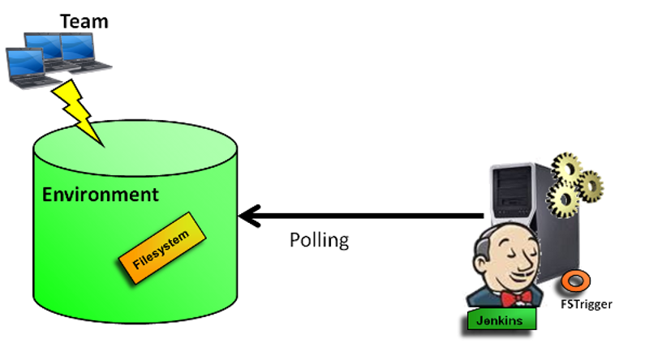
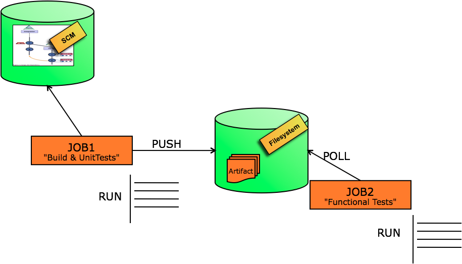
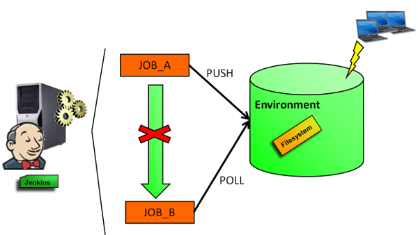

[.conf-macro .output-inline]##

[cols="",options="header",]
|===
|Plugin Information
|View Filesystem Trigger https://plugins.jenkins.io/fstrigger[on the
plugin site] for more information.
|===

[.aui-icon .aui-icon-small .aui-iconfont-warning .confluence-information-macro-icon]##

*This plugin is up for adoption.* Want to help improve this plugin?
https://wiki.jenkins-ci.org/display/JENKINS/Adopt+a+Plugin[Click here to
learn more]!

FSTrigger provides polling mechanisms to monitor a file system and
trigger a build if a file or a set of files have changed.

[[FSTriggerPlugin-Features]]
== Features

The plug-in makes it possible to monitor changes of a file or a set of
files in a folder.

[.confluence-embedded-file-wrapper]##

Note: The plug-in uses only persistence in memory. There is no impact on
the Jenkins infrastructure (no new files created). +
This plugin provides a polling typology among the
https://wiki.jenkins-ci.org/display/JENKINS/XTrigger+Plugin[XTrigger
Plugin].

[[FSTriggerPlugin-1)Pollingasetoffilesinafolder]]
=== 1) Polling a set of files in a folder

For the first use case, we trigger a build if the list of files has
changed between 2 pollings: +
A build is triggered in the following situations:

* there are more or fewer files
* the last modified date of at least one file has changed
* the content of at least one file has changed

[[FSTriggerPlugin-2)Pollingafileinafolder]]
=== 2) Polling a file in a folder

For the second use case, we monitor a file from a path. +
The file path can be provided either explicitly or with a GLOB.

A build is triggered in the following situations:

* The file exists and it didn't exist in the previous polling
* The file no longer exists whereas it existed in the previous polling
* The last modification date of the file has changed compared to the
previous polling
* The content of the file has changed

For the latest choice, the content file detection can be:

* the full content in a file (whatever the file type)
* the modification of values from XPath expressions in an XML file
* the modification of the structure or the content in a JAR or in ZIP
file
* the modification of the structure or the content in a TAR file.
* the modification of a property (or all properties) in a properties
file
* the modification of an attribute (or all attributes) in the
MANIFEST.NF of a JAR file
* the modification of an attribute (or all attributes) in a source
MANIFEST.NF
* the presence of a pattern in a text file (such as a log file)

[[FSTriggerPlugin-Someusecases]]
== Some use cases

*1. Scheduling a build if a specified file is found in a folder and was
not present in the previous build*

*2. Scheduling a build if the last modification date of a file has
changed compared to the last modification file date captured in the
previous polling*

*3. Avoiding explicit jobs dependencies (with upstream/downstream
mechanisms)*

* A first job 'jobA' polls a SCM tool and schedules a build if there is
at least one change. +
The build instantiates a build process, produces artifacts (binaries,
text output, ...) and deploys these artifacts in a target filesystem.
* A second job 'jobB' checks the existance of the new artifacts in the
target filesystem. If there is a change, 'jobB' is scheduled. +
'jobB' may provide packaging steps, testing steps or other steps of a
pipeline.

[.confluence-embedded-file-wrapper .image-center-wrapper]##

Both jobs are independents and listen external events.

[.confluence-embedded-file-wrapper .image-center-wrapper]##

[[FSTriggerPlugin-Othersimilarplugins]]
== Other similar plugins

* If you want just to know if a set of files exists and display the
number of files found, you can use
https://wiki.jenkins-ci.org/display/JENKINS/Files+Found+Trigger[Files
Found Trigger] plugin.

[[FSTriggerPlugin-KnownLimitations]]
== Known Limitations

The current code is written in Java and it is not very optimized. For
example, we can't get similar performance as with Python. Therefore, we
recommend to not use FSTrigger plugin when you want to poll a directory
with a large set of files.

The current code does not work with Pipeline projects. 
[.jira-issue .conf-macro .output-block]#
https://issues.jenkins-ci.org/browse/JENKINS-48239[[.aui-icon .aui-icon-wait .issue-placeholder]##
##JENKINS-48239] - [.summary]#Getting issue details...#
[.aui-lozenge .aui-lozenge-subtle .aui-lozenge-default .issue-placeholder]#STATUS#
#

[[FSTriggerPlugin-Changelog]]
== Changelog

[[FSTriggerPlugin-Release0.39]]
=== Release 0.39

* Fix XPath computation +
* Fix Check Path field with latest Jenkins version in configuration +
* Upgrade to latest Jenkins LTS (1.554.1)

[[FSTriggerPlugin-Release0.38]]
=== Release 0.38

* Fix https://issues.jenkins-ci.org/browse/JENKINS-17591[JENKINS-17591]
- FSTrigger fails to poll when build node labels change

[[FSTriggerPlugin-Release0.37]]
=== Release 0.37

* Fix https://issues.jenkins-ci.org/browse/JENKINS-18658[JENKINS-18658]
- NPE in FSTrigger upon configuration save

[[FSTriggerPlugin-Release0.36]]
=== Release 0.36

* Fix https://issues.jenkins-ci.org/browse/JENKINS-17641[JENKINS-17641]
- Unknown field 'logEnabled' in org.jenkinsci.lib.xtrigger.XTriggerCause

[[FSTriggerPlugin-Release0.35]]
=== Release 0.35

* Fix https://issues.jenkins-ci.org/browse/JENKINS-16809[JENKINS-16809]
- Plugins FSTrigger/Envinject, NPE while loading jobs +
** Update to xtrigger-lib 0.20 +
** Update to envinject-lib 1.17

[[FSTriggerPlugin-Release0.34]]
=== Release 0.34

* Fix NullPointerException on polling action +
* Upgrade to envinject-lib 1.11 +
* Upgrade to xtrigger-lib 0.18

[[FSTriggerPlugin-Release0.33]]
=== Release 0.33

* Fix potential NullPointer exception at startup (envinject-lib 1.8/
xtrigger-lib 1.5)

[[FSTriggerPlugin-Release0.32]]
=== Release 0.32

* Upgrade to xtrigger-lib 0.14 (more logs)

[[FSTriggerPlugin-Release0.31]]
=== Release 0.31

* Fix https://issues.jenkins-ci.org/browse/JENKINS-12176[JENKINS-12176]
- Unable to delete a job that has a fstrigger +
* Upgrade to xtrigger-lib 0.13

[[FSTriggerPlugin-Release0.30]]
=== Release 0.30

* Fix reponed
https://issues.jenkins-ci.org/browse/JENKINS-12924[JENKINS-12924] -
FSTrigger triggers builds on jenkins restart

[[FSTriggerPlugin-Release0.29]]
=== Release 0.29

* Fix https://issues.jenkins-ci.org/browse/JENKINS-12924[JENKINS-12924]
- FSTrigger triggers builds on jenkins restart

[[FSTriggerPlugin-Release0.28]]
=== Release 0.28

* Update to xtrigger-lib 0.8 (fix
https://issues.jenkins-ci.org/browse/JENKINS-12888[JENKINS-12888])

[[FSTriggerPlugin-Release0.27]]
=== Release 0.27

* Fix https://issues.jenkins-ci.org/browse/JENKINS-12865[JENKINS-12865]
- https://wiki.jenkins-ci.org/display/JENKINS/FSTrigger+Plugin#[ERROR] -
SEVERE - Polling error Current Project is null from FSTrigger

[[FSTriggerPlugin-Release0.26]]
=== Release 0.26

* Update to xtrigger-lib 0.7

[[FSTriggerPlugin-Release0.25]]
=== Release 0.25

* Add the choice of check content, last modification date or a change in
the size of files for folder content type +
* Update to xtrigger-lib 0.6

[[FSTriggerPlugin-Release0.24]]
=== Release 0.24

* For 'Folder type', add check with new directories

[[FSTriggerPlugin-Release0.23]]
=== Release 0.23

* Fix https://issues.jenkins-ci.org/browse/JENKINS-12208[JENKINS-12208]
- More information in log file

[[FSTriggerPlugin-Release0.22]]
=== Release 0.22

* Fix https://issues.jenkins-ci.org/browse/JENKINS-12168[JENKINS-12168]
- Monitor files - Does not monitor a unix soft link

[[FSTriggerPlugin-Release0.21]]
=== Release 0.21

* Add check 'A job is not triggered when Jenkins is quieting down and is
not buildable'

[[FSTriggerPlugin-Release0.20]]
=== Release 0.20

* Fix reoponed
https://issues.jenkins-ci.org/browse/JENKINS-12073[JENKINS-12073] -
fstrigger plugin download didn't pull in dependency envinject

[[FSTriggerPlugin-Release0.19]]
=== Release 0.19

* Fix https://issues.jenkins-ci.org/browse/JENKINS-12073[JENKINS-12073]
- fstrigger plugin download didn't pull in dependency envinject +
* For 'monitor folder' type, the last modification date is checked
before a content check

[[FSTriggerPlugin-Release0.18]]
=== Release 0.18

* Environment variables are taken into account

[[FSTriggerPlugin-Release0.17]]
=== Release 0.17

* Fix https://issues.jenkins-ci.org/browse/JENKINS-11569[JENKINS-11569]
- Enhanced help for includes

[[FSTriggerPlugin-Release0.16]]
=== Release 0.16

* Fix https://issues.jenkins-ci.org/browse/JENKINS-11567[JENKINS-11567]
- unhandled FileNotFountException

[[FSTriggerPlugin-Release0.15]]
=== Release 0.15

* Add check for configuration page +
* Built for 1.409 (compatible LTS)

[[FSTriggerPlugin-Release0.14]]
=== Release 0.14

* Fix bug on save when no content nature is selected for FileNameTrigger

[[FSTriggerPlugin-Release0.13]]
=== Release 0.13

* Fix empty includes value for 'Folder trigger type'

[[FSTriggerPlugin-Release0.12]]
=== Release 0.12

* Fix path resolution for Windows - Merge pull request from vinaynaik

[[FSTriggerPlugin-Release0.11]]
=== Release 0.11

* Add the ability to monitor more than one file.

[[FSTriggerPlugin-Release0.10.1]]
=== Release 0.10.1

* Add an help message for the update center.

[[FSTriggerPlugin-Release0.10]]
=== Release 0.10

* Remove named regular expression (unusual) +
* Refactoring

[[FSTriggerPlugin-Release0.9(technicalrelease)]]
=== Release 0.9 (technical release)

* Internationalizing some messages

[[FSTriggerPlugin-Release0.8]]
=== Release 0.8

* Fix a bug for XML Content type +
* Added help messages for end users.

[[FSTriggerPlugin-Release0.7]]
=== Release 0.7

* Add Tar monitoring capabilities +
* Fix a regression on the last modification date check

[[FSTriggerPlugin-Release0.6]]
=== Release 0.6

* Fix check on last modification date

[[FSTriggerPlugin-Release0.5]]
=== Release 0.5

* Polling is done on slaves if configured

[[FSTriggerPlugin-Release0.4]]
=== Release 0.4

* Remove the usage of regular expression for the file name to poll

[[FSTriggerPlugin-Release0.3]]
=== Release 0.3

* Internal Refactoring +
* Add 'Poll the content of an XML File' regarding XPath expressions.

[[FSTriggerPlugin-Release0.2]]
=== Release 0.2

* Add a page for displaying polling log

[[FSTriggerPlugin-Release0.1]]
=== Release 0.1

* Initial release
