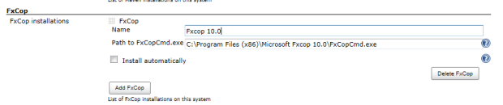
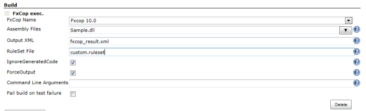

http://msdn.microsoft.com/en-us/library/bb429474%28v=vs.80%29.aspx[FxCopCmd.exe]
execute plugin.

[[FxCopRunnerPlugin-Description]]
== Description

http://msdn.microsoft.com/en-us/library/bb429474%28v=vs.80%29.aspx[FxCopCmd.exe]
execute plugin. +
Output xml can be used to
https://wiki.jenkins-ci.org/display/JENKINS/Violations[Violations
Plugin].

[[FxCopRunnerPlugin-Configuration]]
== Configuration

[[FxCopRunnerPlugin-Systemconfiguration]]
=== System configuration

[.confluence-embedded-file-wrapper]##

. Open the system configuration page "Manage Jenkins->Configure system"
. Enter the path to the FxCop command line client, that should be used
by Jenkins.

* Example: *C:\Program Files (x86)\Microsoft Fxcop 10.0\FxCopCmd.exe*

[[FxCopRunnerPlugin-Jobconfiguration]]
=== Job configuration

[.confluence-embedded-file-wrapper]##

[width="100%",cols="50%,50%",options="header",]
|===
|name |description
|FxCop Name |Select FxCop.

|Assembly Files |Assembly file(s) to analyze. +
You can specify multiple analyze assemblies by separating them with
new-line or space.

|Output XML |FxCop project or XML report output file.

|RuleSet File |Rule set to be used for the analysis.

|IgnoreGeneratedCode |Suppress analysis results against generated code.

|ForceOutput |Write output XML and project files even in the case where
no violations occurred.

|Command Line Arguments |This is a whitespace separated list of command
line arguments you can specify.

|Fail build on test failure |Fail build on test failure
|===

[[FxCopRunnerPlugin-CommonProblems]]
== Common Problems

FxCopCmd.exe can produce several warnings, and when it does, the build
will be marked as unstable. Look in your console output for the fxcop
output.

[width="100%",cols="50%,50%",options="header",]
|===
|Console output contains + |Resolution
a|
....
There were non-critical errors loading FxCop project:

* Could not import all messages.
* End of project load errors.
....

a|
This can happen if you are using an FxCop project file with some of the
default settings. +

* Open your project in FxCop
* Choose Project -> Project Options
* Under Save Messages and next to Project uncheck the Active checkbox
* click OK +
 +
See also:
http://social.msdn.microsoft.com/Forums/en-US/60bc9dbf-5557-46d4-8905-d850286b8787/could-not-import-all-messages-error-supression["Could
not import all messages." error supression]

a|
....
NOTE: One or more referenced assemblies could not be found.
Use the '/directory' or '/reference' switch to specify additional assembly
reference search paths.
....

a|
FxCop can't find the assemblies you reference. Two possible solutions: +

* add the /gac flag to FxCop
* change the FxCopCmd.exe.config file to use a more forgiving assembly
matching strategy
** Open FxCopCmd.exe.config and change AssemblyReferenceResolveMode from
StrongName to StrongNameIgnoringVersion
** the location of FxCopCmd.exe.config depends on your installation, and
may require administrator permission to edit +
 +
See also: http://stackoverflow.com/a/12847018[changing
FxCopCmd.exe.config]

|===

[[FxCopRunnerPlugin-Changelog]]
== Changelog

[[FxCopRunnerPlugin-Version1.1(02/28/2013)]]
=== Version 1.1 (02/28/2013)

* add forceOutput field.

[[FxCopRunnerPlugin-Version1.0(02/26/2013)]]
=== Version 1.0 (02/26/2013)

* Initial release
