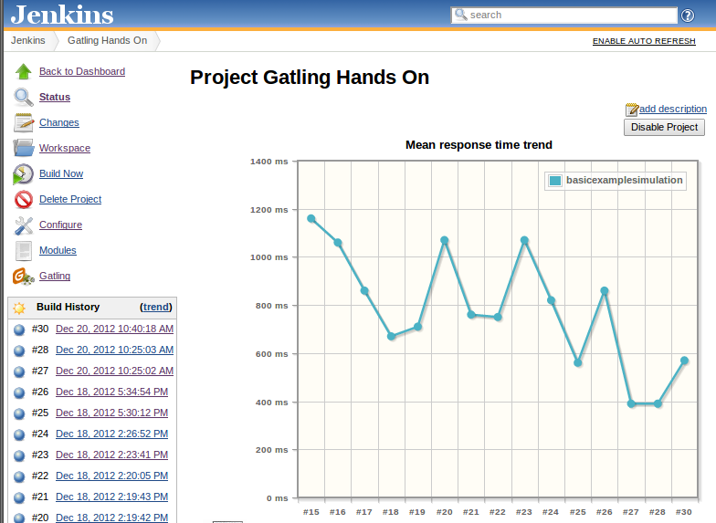

[.conf-macro .output-inline]#This plugin integrates
http://gatling.io/[Gatling], an Open Source stress tool, with Jenkins.#

[[GatlingPlugin-Features]]
== Features

This plugin allows you to : 

* Keep track of a Gatling simulation, providing performance trends
across builds
* Publish detailed reports for each build

[[GatlingPlugin-Changelog]]
== Changelog

image:docs/images/warning.svg[(warning)]
 *If you're coming from 1.0.0, make sure "Enable simulation tracking"
checkbox is checked in your build configuration and if not, check it. *

*This is an issue with configuration changes between 1.0.0 and 1.0.1 and
doesn't affect fresh 1.0.1 installations.*

* 1.2.5
** Fix Trends Links
* 1.2.4
** Fix links to run with multiple simulations (contributed by pscosta)
* 1.2.3
** Fix Gatling Publisher sometimes trying to serialize non-whitelisted
classes to the disk(contributed by oleg-nenashev)
* 1.2.2
** Fix 50th percentile trend being displayed instead of the 95th
percentile trend
** Fix trends click, see JENKINS-42622
** Render reports without Content-Security-Policy (contributed by David
Griffiths)
* 1.2.1
** Fix Gatling Reports Iframe height
** Fix issues with reports display

* 1.2.0
** Add compatibility with Jenkins Pipeline
* 1.1.1:
** Fix compatibility with Jenkins 1.597+ (contributed by Piotr
Wielgolaski)

* 1.1.0 :
** Support for Gatling 2.1
* 1.0.3 : 
** Support multiple reports per build (contributed by Chris Price)

* 1.0.2 :
** Allow to run multiples simulations in one build, as long as there is
only one report created per build
** Removed the need to clean projects on every build
* 1.0.1 : 
** Ouput directory prefix doesn't need to be specified anymore
** Better logging in case of trouble finding a report
* 1.0.0 : 
** Initial release

[[GatlingPlugin-Configuration]]
== Configuration

. Install Gatling Plugin (via Manage Jenkins -> Manage Plugins)
. Configure your project to execute Gatling simulations, for example
using the Maven plugin (see
https://github.com/gatling/gatling-maven-plugin-demo[Maven plugin demo])
. Configure your job :
.. For a maven job: add "Track a Gatling load simulation" as a new
post-build action. Beware that neither your Jenkin's path nor your job's
name should contain any space.
.. For a pipeline job: add a line to your pipeline script:
_gatlingArchive()_

*Optional configuration*: You can publish Gatling results with the
Jenkins JUnit plugin. Your Gatling simulation needs to have some
assertions, as each Junit testcase is a different Gatling assertion.

. Configure the Jenkins plugin with the following Test report XMLs:
_target/gatling/assertions-*.xml_
. Execute Gatling with the following option:
_-Dgatling.useOldJenkinsJUnitSupport=true_, for example: _mvn
gatling:execute -Dgatling.useOldJenkinsJUnitSupport=true_

Gatling Plugin will look for files under your Job Root Directory
(defaults to _`+$JENKINS_HOME/yourjobname)+`_, so you may need to copy
the results file if you're doing a containerized job.

[[GatlingPlugin-Gatlingpluginusage]]
== Gatling plugin usage

As soon as you've properly configured your job and launched a build,
you'll see two changes on your project dashboard :

* A new entry will be available in the left summary : Gatling.
* A graph, displaying the mean response time trend of your last 15
builds, will appear.

 

[.confluence-embedded-file-wrapper .image-center-wrapper]##

 

The Gatling entry in the left summary has two purposes, depending on
which page you are.

If you are on the project dashboard, clicking on Gatling will get you to
a more detailed performance trend, displaying for your last 30 builds :

* Mean response time trend
* 95th percentiles response time trend
* Percentage of KO requests

This page will also provides links to detailed reports for all your
builds, at the bottom of the page.

If you are on the summary of a specific build, clicking on Gatling will
get you to a list of all available reports for this build.
